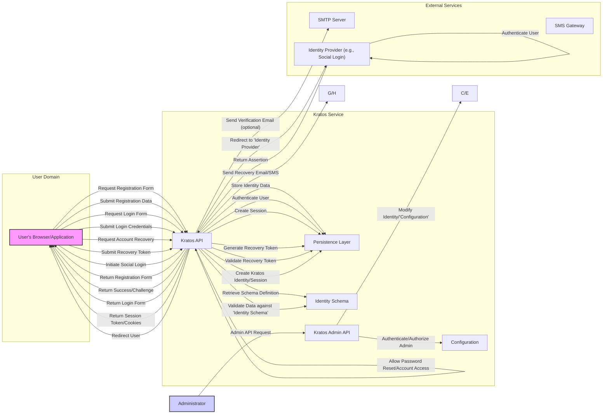

# Project Design Document: Ory Kratos for Threat Modeling

**Version:** 1.1
**Date:** October 26, 2023
**Author:** AI Software Architect

## 1. Introduction

This document provides an enhanced architectural overview of the Ory Kratos project, specifically tailored for use in subsequent threat modeling activities. It aims to provide a more granular understanding of the key components, data flows, and interactions within the system, with a strong focus on identifying potential security vulnerabilities and attack vectors. This document is intended to be comprehensive, clear, and directly applicable to security analysis, avoiding unnecessary technical jargon while providing sufficient detail.

## 2. Project Overview

Ory Kratos is a headless, API-first Identity and Access Management (IAM) solution designed for modern, distributed applications. Its core strength lies in providing essential identity functionalities like self-service registration, login, account recovery, password management, and multi-factor authentication without imposing specific UI constraints. This separation of concerns empowers developers to create tailored user experiences while relying on Kratos's robust and secure backend for identity management.

## 3. System Architecture

Kratos adopts a microservices architecture, where independent components communicate through well-defined APIs. This modularity enhances scalability and maintainability but also introduces specific security considerations related to inter-service communication and API security.

### 3.1. Key Components

*   **"Kratos API":** The primary interface for end-user interactions related to identity management. It exposes a comprehensive set of RESTful APIs for actions like registration, login, logout, password changes, and account recovery. This component is the main entry point for user-initiated identity operations and requires robust security measures.
*   **"Kratos Admin API":** A separate, privileged API designed for administrative tasks. It allows authorized users (administrators) to manage identities, configure the system (schemas, settings), and perform other administrative functions. Access to this API must be strictly controlled due to its powerful capabilities.
*   **"Kratos UI (Optional)":** While Kratos is fundamentally a backend service, the Ory team provides example UI implementations and SDKs to illustrate integration patterns. These are not core Kratos components but are crucial for understanding how users interact with Kratos in practical deployments and represent a significant part of the attack surface in those deployments.
*   **"Persistence Layer":** Responsible for storing all persistent data related to identities, sessions, and configuration. Kratos supports various database backends, including "PostgreSQL", "MySQL", and "CockroachDB". The security of this layer is paramount, as it holds sensitive user data.
*   **"Identity Schema":** Defines the structure and validation rules for identity data stored within Kratos. This schema is configurable and allows customization of user attributes. Improperly configured schemas can lead to data integrity issues or expose sensitive information.
*   **"Configuration":** Kratos's behavior is governed by a configuration file (typically YAML or JSON), which includes settings for database connections, SMTP servers, security policies (e.g., password complexity), and API keys. Secure management and storage of this configuration are critical.
*   **"Metrics and Logging":** Kratos exposes metrics (often via Prometheus) and generates logs for monitoring and debugging. These are essential for detecting and responding to security incidents. Proper configuration and secure access to these logs are important.

### 3.2. Data Flow

The following diagram illustrates the typical data flow for common user interactions with Kratos, highlighting the involved components:

### 3.3. Key Interactions and Security Considerations

*   **User Registration:**
    *   The user's browser/application requests the registration form from the "Kratos API". *Potential threats: Request forgery, information disclosure if the form endpoint is not properly secured.*
    *   Kratos retrieves the "Identity Schema" to determine the required fields and validation rules. *Potential threats: Schema injection if the schema retrieval process is vulnerable.*
    *   The user submits registration data, which is validated against the schema. *Potential threats: Input validation vulnerabilities leading to data corruption or injection attacks.*
    *   Upon successful validation, Kratos stores the identity data in the "Persistence Layer". *Potential threats: Data breaches if the database is compromised, insufficient encryption of sensitive data at rest.*
    *   Optionally, Kratos sends a verification email via an "SMTP Server". *Potential threats: Email spoofing if SPF/DKIM/DMARC are not configured, interception of verification links.*
*   **User Login:**
    *   The user's browser/application requests the login form from the "Kratos API". *Potential threats: Similar to registration form request.*
    *   The user submits their credentials to the "Kratos API". *Potential threats: Credential stuffing, brute-force attacks if rate limiting is not implemented, man-in-the-middle attacks if TLS is not enforced.*
    *   Kratos authenticates the user against the stored identity data in the "Persistence Layer". *Potential threats: Weak password hashing algorithms, vulnerabilities in the authentication logic.*
    *   Upon successful authentication, Kratos creates a session and stores it in the "Persistence Layer". *Potential threats: Session fixation, session hijacking if session tokens are not securely managed.*
    *   Kratos returns a session token (e.g., via cookies or headers). *Potential threats: Cross-site scripting (XSS) attacks that could steal session tokens.*
*   **Account Recovery:**
    *   The user initiates the account recovery process via the "Kratos API". *Potential threats: Account enumeration if the recovery process reveals whether an account exists.*
    *   Kratos generates a unique recovery token and stores it in the "Persistence Layer". *Potential threats: Predictable recovery tokens, insecure storage of recovery tokens.*
    *   Kratos sends a recovery link or code via "SMTP Server" or "SMS Gateway". *Potential threats: Interception of recovery codes, social engineering attacks targeting the recovery process.*
    *   The user uses the token to verify their identity and reset their password or regain access. *Potential threats: Brute-forcing recovery tokens, replay attacks if tokens are not invalidated after use.*
*   **Admin Operations:**
    *   Administrators interact with the "Kratos Admin API" to manage the system. *Potential threats: Unauthorized access to the Admin API, privilege escalation if authorization is not correctly implemented.*
    *   Authentication and authorization for the Admin API are crucial and often involve API keys or other secure mechanisms defined in the "Configuration". *Potential threats: Compromised API keys, weak authentication methods.*
    *   Administrative actions can modify identity data in the "Persistence Layer" or the "Configuration". *Potential threats: Malicious or accidental modification of sensitive data, leading to service disruption or security breaches.*
*   **Integration with External Identity Providers:**
    *   Kratos redirects the user to the external "Identity Provider" for authentication. *Potential threats: Open redirects, man-in-the-middle attacks during the redirection process.*
    *   The external provider authenticates the user. *Security relies on the security of the external provider.*
    *   The "Identity Provider" returns an assertion to the "Kratos API". *Potential threats: Tampering with the assertion, insecure handling of the assertion.*
    *   Kratos creates a local identity or session based on the assertion. *Potential threats: Account takeover if the assertion is not properly validated.*

## 4. Data Storage

Kratos stores various categories of sensitive information within its "Persistence Layer". Understanding the nature and sensitivity of this data is critical for threat modeling.

*   **Highly Sensitive Data:**
    *   **"Identity Credentials":** Password hashes (using strong, salted hashing algorithms like Argon2 or bcrypt), MFA secrets (e.g., TOTP seeds, backup codes).
    *   **"Personal Identifiable Information (PII)":** User attributes defined in the "Identity Schema", such as email addresses, phone numbers, names, and potentially other personal details.
*   **Sensitive Data:**
    *   **"Session Data":** Active user sessions, including session tokens, user IDs, login timestamps, and potentially IP addresses.
    *   **"Recovery Tokens":** Temporary tokens used for account recovery processes, linked to specific user accounts.
    *   **"Verification Tokens":** Temporary tokens used for email or phone number verification, also linked to user accounts.
*   **Configuration Data:**
    *   **"Database Credentials":** Credentials used to access the "Persistence Layer".
    *   **"SMTP Server Credentials":** Credentials for the "SMTP Server" used for sending emails.
    *   **"SMS Gateway Credentials":** Credentials for the "SMS Gateway".
    *   **"API Keys":** Keys used for authenticating requests to the "Kratos Admin API" or for integrating with external services.

## 5. External Dependencies

Kratos relies on several external services, each introducing potential security risks that need to be considered.

*   **"Database (PostgreSQL, MySQL, CockroachDB)":** A compromised database can lead to a complete breach of user data. Security considerations include database hardening, access control, encryption at rest, and regular backups.
*   **"SMTP Server":** If the "SMTP Server" is compromised, attackers could send phishing emails or intercept sensitive information sent via email. Secure configuration, strong authentication, and potentially encryption (TLS) are important.
*   **"SMS Gateway":** A compromised "SMS Gateway" could allow attackers to intercept MFA codes or send malicious SMS messages. Secure API key management and understanding the gateway's security practices are crucial.
*   **"Identity Providers (e.g., Google, Facebook)":** The security of social login relies on the security of these external providers. Potential risks include account takeovers if the user's social media account is compromised. Understanding the OAuth 2.0 flow and proper validation of assertions is essential.
*   **"Key Management System (Optional)":** If data-at-rest encryption is enabled, a secure "Key Management System" is critical. Compromise of encryption keys would render the encryption ineffective.

## 6. Security Considerations (Detailed)

This section provides a more detailed breakdown of security considerations for threat modeling.

*   **Authentication and Authorization:**
    *   **Threats:** Brute-force attacks, credential stuffing, weak password policies, insecure storage of credentials, unauthorized access to the "Admin API", privilege escalation.
    *   **Mitigations:** Strong password policies, multi-factor authentication, rate limiting, robust authentication mechanisms for the "Admin API" (e.g., API keys, mutual TLS), principle of least privilege.
*   **Session Management:**
    *   **Threats:** Session fixation, session hijacking, replay attacks, insecure storage of session tokens.
    *   **Mitigations:** Securely generated and stored session tokens (e.g., HTTP-only, Secure cookies), short session timeouts, regular session rotation, protection against cross-site scripting (XSS).
*   **Password Management:**
    *   **Threats:** Weak password hashing algorithms, insufficient salting, exposure of password hashes in case of a data breach.
    *   **Mitigations:** Use of strong, salted hashing algorithms (Argon2, bcrypt), secure storage of password hashes, enforcement of password complexity rules.
*   **Data Protection:**
    *   **Threats:** Data breaches, unauthorized access to sensitive data, data leakage.
    *   **Mitigations:** Encryption of sensitive data at rest and in transit (TLS), access control mechanisms, data minimization, regular security audits.
*   **Input Validation:**
    *   **Threats:** Injection attacks (SQL injection, XSS, command injection), data corruption.
    *   **Mitigations:** Strict input validation on all user-provided data, output encoding, parameterized queries, use of security headers.
*   **API Security:**
    *   **Threats:** Unauthorized access, API abuse, denial-of-service attacks.
    *   **Mitigations:** Authentication and authorization for all API endpoints, rate limiting, input validation, output encoding, use of secure communication protocols (HTTPS).
*   **Communication Security:**
    *   **Threats:** Man-in-the-middle attacks, eavesdropping.
    *   **Mitigations:** Enforcement of TLS for all communication between components and external services.
*   **Dependency Management:**
    *   **Threats:** Vulnerabilities in third-party libraries and dependencies.
    *   **Mitigations:** Regular dependency scanning and updates, use of software composition analysis tools.
*   **Configuration Security:**
    *   **Threats:** Exposure of sensitive configuration data (e.g., database credentials, API keys).
    *   **Mitigations:** Secure storage of configuration files, use of environment variables or secrets management solutions, restricted access to configuration files.
*   **Logging and Monitoring:**
    *   **Threats:** Failure to detect security incidents, lack of audit trails.
    *   **Mitigations:** Comprehensive logging of security-relevant events, secure storage and access control for logs, real-time monitoring and alerting.
*   **Account Recovery Security:**
    *   **Threats:** Account takeover through compromised recovery mechanisms.
    *   **Mitigations:** Secure generation and handling of recovery tokens, rate limiting on recovery attempts, multi-factor authentication for recovery processes.
*   **Multi-Factor Authentication (MFA):**
    *   **Threats:** Bypass of MFA, social engineering attacks targeting MFA factors.
    *   **Mitigations:** Support for multiple MFA methods, secure storage of MFA secrets, user education on MFA security.
*   **Identity Schema Security:**
    *   **Threats:** Information disclosure through improperly configured schemas, data integrity issues.
    *   **Mitigations:** Careful design and review of the identity schema, enforcement of data validation rules.

## 7. Deployment Considerations

The deployment environment significantly impacts Kratos's security posture.

*   **Deployment Environment (Cloud, On-Premises, Hybrid):** Each environment presents unique security challenges. Cloud deployments require careful configuration of cloud security services, while on-premises deployments require managing infrastructure security.
*   **Network Security:** Proper network segmentation, firewalls, and intrusion detection/prevention systems are crucial to protect Kratos components from unauthorized access.
*   **Containerization (Docker, Kubernetes):** Secure container image management, vulnerability scanning of container images, and proper configuration of container orchestration platforms are essential.
*   **Reverse Proxy/Load Balancer:** A well-configured reverse proxy can provide security benefits like TLS termination, header manipulation for security, and protection against certain types of attacks.

## 8. Future Considerations

Anticipating future changes and their potential security implications is important for ongoing threat modeling.

*   **Introduction of New Authentication Methods (e.g., WebAuthn):** Requires careful consideration of the security implications of new authentication protocols and their implementation.
*   **Expansion of API Functionality:** New API endpoints and features may introduce new attack vectors that need to be analyzed.
*   **Changes to Data Storage Mechanisms:** Migrations to new database technologies or changes in data storage patterns may introduce new security risks.
*   **Integration with New External Services:** Adding support for new identity providers or other services requires evaluating the security posture of those services and the integration points.
*   **Adoption of New Security Standards and Best Practices:** Continuously evaluating and adopting new security standards and best practices is crucial for maintaining a strong security posture.

This enhanced document provides a more detailed and security-focused architectural overview of Ory Kratos, intended to serve as a comprehensive resource for threat modeling activities. It highlights potential vulnerabilities and attack vectors within the system and its interactions, enabling security professionals to develop effective mitigation strategies.