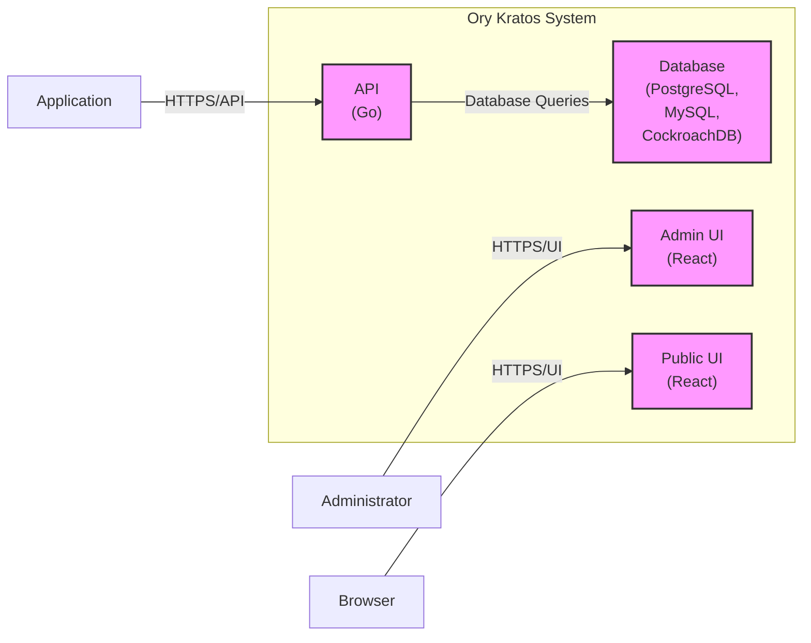
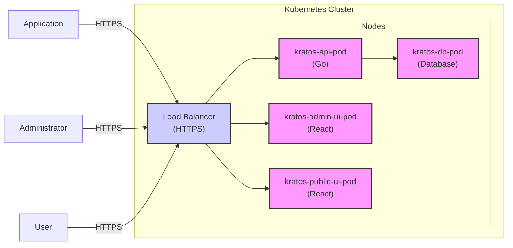

# BUSINESS POSTURE

Ory Kratos is an open-source identity and access management (IAM) solution designed to handle authentication and authorization for modern applications and APIs. The primary business priority for adopting Ory Kratos is to offload the complexity of identity management from application developers, allowing them to focus on core business logic. This leads to faster development cycles and reduced operational overhead related to user management. Another key business goal is to enhance the security posture of applications by leveraging a dedicated and well-vetted IAM solution instead of building custom authentication and authorization mechanisms. For businesses operating online services, a robust IAM system like Ory Kratos is crucial for user acquisition, retention, and overall trust.

Most important business risks that need to be addressed:

- Risk of service disruption due to misconfiguration or security vulnerabilities in Ory Kratos, impacting user access and business operations.
- Risk of data breaches exposing sensitive user information managed by Ory Kratos, leading to reputational damage, legal liabilities, and loss of customer trust.
- Risk of unauthorized access to applications and resources if Ory Kratos is not properly secured, potentially leading to data theft, service manipulation, or financial losses.
- Risk of vendor lock-in if Ory Kratos becomes too tightly integrated with business processes, making future migrations or changes difficult and costly.
- Risk of compliance violations if Ory Kratos does not meet regulatory requirements related to data privacy and security (e.g., GDPR, HIPAA).

# SECURITY POSTURE

Existing security controls:

- security control: Open-source project with community review and contributions, increasing code transparency and potential for vulnerability discovery. Described in: GitHub repository and community forums.
- security control: Follows security best practices in software development, including secure coding guidelines and vulnerability management. Described in: Ory documentation and security advisories.
- security control: Provides features for secure authentication mechanisms like password hashing, multi-factor authentication (MFA), and integration with external identity providers (e.g., OAuth 2.0, OpenID Connect). Described in: Ory Kratos documentation.
- security control: Offers authorization capabilities based on policies and roles, enabling fine-grained access control. Described in: Ory Kratos documentation.
- security control: Supports HTTPS for secure communication between components and clients. Described in: Deployment recommendations in Ory Kratos documentation.
- security control: Uses database for persistent storage of identity data, allowing for standard database security practices. Described in: Architecture overview in Ory Kratos documentation.

Accepted risks:

- accepted risk: Potential vulnerabilities inherent in any software project, requiring ongoing monitoring, patching, and security updates.
- accepted risk: Complexity of configuration and deployment, potentially leading to misconfigurations that introduce security weaknesses.
- accepted risk: Reliance on external dependencies (e.g., databases, message queues) which may have their own vulnerabilities.

Recommended security controls:

- security control: Implement regular security audits and penetration testing of Ory Kratos deployments to identify and remediate vulnerabilities.
- security control: Enforce least privilege principles for all Ory Kratos components and integrations.
- security control: Implement robust monitoring and logging of Ory Kratos activities for security incident detection and response.
- security control: Establish a clear process for security incident response related to Ory Kratos.
- security control: Utilize infrastructure-as-code (IaC) for consistent and auditable deployments of Ory Kratos.
- security control: Implement vulnerability scanning in the CI/CD pipeline for Ory Kratos deployments.
- security control: Regularly update Ory Kratos and its dependencies to the latest versions to patch known vulnerabilities.

Security requirements:

- Authentication:
    - security requirement: Support for strong password policies, including complexity requirements and password rotation.
    - security requirement: Multi-factor authentication (MFA) support to enhance account security.
    - security requirement: Integration with various identity providers (e.g., social logins, enterprise directories) via standard protocols like OAuth 2.0 and OpenID Connect.
    - security requirement: Secure session management to prevent session hijacking and unauthorized access.
- Authorization:
    - security requirement: Role-based access control (RBAC) or attribute-based access control (ABAC) to manage user permissions.
    - security requirement: Policy enforcement to control access to resources based on defined rules.
    - security requirement: Support for fine-grained authorization to control access at a granular level.
- Input validation:
    - security requirement: Strict input validation on all user inputs to prevent injection attacks (e.g., SQL injection, cross-site scripting).
    - security requirement: Input sanitization and encoding to mitigate risks from malicious input.
    - security requirement: Rate limiting to prevent brute-force attacks and denial-of-service attempts.
- Cryptography:
    - security requirement: Use of strong cryptographic algorithms for password hashing and data encryption.
    - security requirement: Secure storage of cryptographic keys and secrets.
    - security requirement: Encryption of sensitive data at rest and in transit.
    - security requirement: Proper handling of TLS/SSL certificates for secure communication.

# DESIGN

## C4 CONTEXT

```mermaid
flowchart LR
    subgraph "Organization"
        A["User"]
        B["Application"]
    end
    C["Ory Kratos"]
    D["Identity Provider"]
    E["Email Service"]

    A -->> B: Uses
    B -->> C: Authenticates and Authorizes via
    C -->> D: Delegates Authentication to (Optional)
    C -->> E: Sends Emails (Verification, Recovery)

    style C fill:#f9f,stroke:#333,stroke-width:2px
```

Context Diagram Description:

- Context Diagram Elements:
    - Element:
        - Name: User
        - Type: Person
        - Description: End-users who interact with the Application. They need to authenticate and be authorized to access resources and functionalities.
        - Responsibilities: Authenticating to access the Application, managing their identity.
        - Security controls: Strong passwords, MFA, awareness of phishing attacks.
    - Element:
        - Name: Application
        - Type: Software System
        - Description: The application that needs to manage user identities and access control. It relies on Ory Kratos for authentication and authorization.
        - Responsibilities: Providing services to users, enforcing access control policies provided by Ory Kratos.
        - Security controls: Secure coding practices, input validation, integration with Ory Kratos for authentication and authorization.
    - Element:
        - Name: Ory Kratos
        - Type: Software System
        - Description: The identity and access management system responsible for user authentication, authorization, account management, and identity lifecycle.
        - Responsibilities: Authenticating users, authorizing access to applications, managing user accounts, handling password resets, and identity verification.
        - Security controls: Robust authentication mechanisms, fine-grained authorization policies, secure data storage, audit logging, input validation, secure communication protocols.
    - Element:
        - Name: Identity Provider
        - Type: External System
        - Description: Optional external identity providers (e.g., Google, Facebook, Active Directory) that Ory Kratos can integrate with for federated authentication.
        - Responsibilities: Authenticating users on behalf of Ory Kratos, providing user identity information.
        - Security controls: Security controls are managed by the external Identity Provider. Ory Kratos relies on secure protocols like OAuth 2.0 and OpenID Connect for integration.
    - Element:
        - Name: Email Service
        - Type: External System
        - Description: An email service used by Ory Kratos to send emails for user verification, password recovery, and other identity-related notifications.
        - Responsibilities: Sending emails as requested by Ory Kratos.
        - Security controls: Security controls are managed by the external Email Service. Secure communication channels should be used when Ory Kratos interacts with the Email Service.

## C4 CONTAINER



Container Diagram Description:

- Container Diagram Elements:
    - Element:
        - Name: API
        - Type: Application
        - Description: The backend API of Ory Kratos, written in Go. It exposes REST APIs for identity management functionalities. It handles requests from applications and the Admin UI.
        - Responsibilities: API endpoint for authentication, authorization, user management, policy enforcement, and communication with the database.
        - Security controls: Input validation, authorization checks, rate limiting, secure API endpoints (HTTPS), access logging, vulnerability scanning, secure coding practices.
    - Element:
        - Name: Database
        - Type: Database
        - Description: Persistent storage for Ory Kratos, supporting PostgreSQL, MySQL, and CockroachDB. Stores user identities, credentials, policies, and other configuration data.
        - Responsibilities: Persistent storage of identity data, ensuring data integrity and availability.
        - Security controls: Database access control, encryption at rest, regular backups, database hardening, vulnerability scanning, audit logging of database access.
    - Element:
        - Name: Admin UI
        - Type: Web Application
        - Description: A React-based administrative user interface for managing Ory Kratos configurations, policies, users, and other administrative tasks.
        - Responsibilities: Providing a user-friendly interface for administrators to manage Ory Kratos.
        - Security controls: Authentication and authorization for administrative access, input validation, secure session management, protection against cross-site scripting (XSS) and cross-site request forgery (CSRF), audit logging of administrative actions.
    - Element:
        - Name: Public UI
        - Type: Web Application
        - Description: A React-based public user interface for user self-service functionalities like registration, login, password reset, and account settings.
        - Responsibilities: Providing user-facing interfaces for identity management tasks.
        - Security controls: Input validation, secure session management, protection against cross-site scripting (XSS) and cross-site request forgery (CSRF), rate limiting, secure handling of user credentials, CAPTCHA to prevent bot attacks.

## DEPLOYMENT

Deployment Solution: Cloud Deployment (Kubernetes)



Deployment Diagram Description:

- Deployment Diagram Elements:
    - Element:
        - Name: Kubernetes Cluster
        - Type: Infrastructure
        - Description: A Kubernetes cluster providing the runtime environment for Ory Kratos components. It manages container orchestration, scaling, and high availability.
        - Responsibilities: Providing a platform for deploying and managing Ory Kratos containers, ensuring scalability and resilience.
        - Security controls: Network policies to isolate namespaces and pods, RBAC for cluster access control, security updates for Kubernetes components, container runtime security, secrets management.
    - Element:
        - Name: Nodes
        - Type: Infrastructure
        - Description: Worker nodes within the Kubernetes cluster where Ory Kratos pods are deployed.
        - Responsibilities: Executing containers, providing compute resources.
        - Security controls: Operating system hardening, security updates, intrusion detection systems, host-based firewalls.
    - Element:
        - Name: kratos-api-pod
        - Type: Container
        - Description: Kubernetes pod running the Ory Kratos API container (Go application).
        - Responsibilities: Handling API requests, business logic, and database interactions.
        - Security controls: Container image scanning, least privilege user for container process, resource limits, network policies to restrict network access.
    - Element:
        - Name: kratos-db-pod
        - Type: Container
        - Description: Kubernetes pod running the database container (e.g., PostgreSQL).
        - Responsibilities: Persistent data storage for Ory Kratos.
        - Security controls: Database container hardening, secure database configuration, volume encryption for data at rest, network policies to restrict database access.
    - Element:
        - Name: kratos-admin-ui-pod
        - Type: Container
        - Description: Kubernetes pod running the Ory Kratos Admin UI container (React application).
        - Responsibilities: Providing administrative interface.
        - Security controls: Container image scanning, least privilege user for container process, resource limits, network policies to restrict network access, secure UI configuration.
    - Element:
        - Name: kratos-public-ui-pod
        - Type: Container
        - Description: Kubernetes pod running the Ory Kratos Public UI container (React application).
        - Responsibilities: Providing public user interface.
        - Security controls: Container image scanning, least privilege user for container process, resource limits, network policies to restrict network access, secure UI configuration.
    - Element:
        - Name: Load Balancer
        - Type: Infrastructure
        - Description: A load balancer distributing incoming HTTPS traffic to the Ory Kratos API and UI pods. It provides a single entry point and handles SSL termination.
        - Responsibilities: Load balancing, SSL termination, routing traffic to backend pods.
        - Security controls: HTTPS configuration, DDoS protection, access control lists, regular security audits.

## BUILD

```mermaid
flowchart LR
    A["Developer"] --> B["Code Repository\n(GitHub)"]: Code Commit
    B --> C["CI/CD Pipeline\n(GitHub Actions)"]: Trigger Build
    C --> D["Build Stage"]: Build Application, Run Tests, SAST
    D --> E["Container Registry\n(Docker Hub,\nGHCR)"]: Push Container Image
    E --> F["Deployment\nEnvironment\n(Kubernetes)"]: Deploy Image

    style C fill:#f9f,stroke:#333,stroke-width:2px
    style D fill:#f9f,stroke:#333,stroke-width:2px
    style E fill:#f9f,stroke:#333,stroke-width:2px
```

Build Process Description:

- Build Process Elements:
    - Element:
        - Name: Developer
        - Type: Person
        - Description: Software developers who write and commit code changes to the Ory Kratos project.
        - Responsibilities: Writing code, performing local testing, committing code changes.
        - Security controls: Secure development environment, code review process, security training.
    - Element:
        - Name: Code Repository
        - Type: Software System
        - Description: GitHub repository hosting the Ory Kratos source code.
        - Responsibilities: Version control, code storage, collaboration platform.
        - Security controls: Access control (authentication and authorization), branch protection, audit logging, vulnerability scanning of dependencies.
    - Element:
        - Name: CI/CD Pipeline
        - Type: Software System
        - Description: GitHub Actions workflow automating the build, test, and deployment process for Ory Kratos.
        - Responsibilities: Automated build, testing, security checks, and deployment of Ory Kratos.
        - Security controls: Secure pipeline configuration, secrets management, access control to pipeline configuration, audit logging, vulnerability scanning of pipeline components.
    - Element:
        - Name: Build Stage
        - Type: Software System
        - Description: Stage within the CI/CD pipeline responsible for compiling code, running unit and integration tests, performing static application security testing (SAST), and building container images.
        - Responsibilities: Building and testing the application, performing security checks.
        - Security controls: SAST tools integration, dependency scanning, build environment hardening, secure build scripts, artifact signing.
    - Element:
        - Name: Container Registry
        - Type: Software System
        - Description: Docker Hub or GitHub Container Registry (GHCR) used to store and distribute container images of Ory Kratos components.
        - Responsibilities: Storing and distributing container images.
        - Security controls: Access control to container registry, image scanning for vulnerabilities, content trust (image signing and verification).
    - Element:
        - Name: Deployment Environment
        - Type: Infrastructure
        - Description: Target environment (e.g., Kubernetes cluster) where Ory Kratos container images are deployed and run.
        - Responsibilities: Running Ory Kratos application in production.
        - Security controls: Infrastructure security controls as described in the Deployment section, secure deployment process, monitoring and logging.

# RISK ASSESSMENT

Critical business processes we are trying to protect:

- User authentication and authorization: Ensuring only authorized users can access applications and resources.
- User account management: Securely managing user identities, credentials, and profiles.
- Identity verification and recovery: Providing secure mechanisms for user verification and account recovery.
- Policy enforcement: Enforcing access control policies to protect sensitive data and functionalities.

Data we are trying to protect and their sensitivity:

- User credentials (passwords, MFA secrets): Highly sensitive, requiring strong encryption and secure storage.
- Personally Identifiable Information (PII) (e.g., names, email addresses, phone numbers): Sensitive, requiring protection against unauthorized access and disclosure, compliance with data privacy regulations.
- Session tokens and access tokens: Sensitive, requiring secure generation, storage, and transmission to prevent session hijacking and unauthorized access.
- Authorization policies and rules: Sensitive, as misconfiguration can lead to unauthorized access or denial of service.
- Audit logs: Moderately sensitive, containing information about user activities and system events, important for security monitoring and incident investigation.

# QUESTIONS & ASSUMPTIONS

Questions:

- What are the specific compliance requirements (e.g., GDPR, HIPAA, SOC 2) that Ory Kratos needs to adhere to?
- What is the expected scale and performance requirements for Ory Kratos deployment?
- What are the specific applications that will be integrated with Ory Kratos?
- What are the existing identity providers that need to be integrated with Ory Kratos?
- What is the organization's risk appetite regarding identity and access management?
- What is the budget and timeline for implementing and securing Ory Kratos?

Assumptions:

- BUSINESS POSTURE:
    - The primary business goal is to securely and efficiently manage user identities for applications.
    - Security and compliance are high priorities for the organization.
    - The organization is willing to invest in security controls to protect Ory Kratos and user data.
- SECURITY POSTURE:
    - The organization currently has basic security controls in place but needs to enhance them for identity management.
    - The organization is aware of the importance of secure software development lifecycle and secure deployment practices.
    - The organization is willing to implement recommended security controls to mitigate identified risks.
- DESIGN:
    - Ory Kratos will be deployed in a cloud environment using Kubernetes for scalability and resilience.
    - PostgreSQL will be used as the primary database for Ory Kratos.
    - GitHub Actions will be used for CI/CD pipeline.
    - The organization has in-house expertise or will acquire expertise to manage Kubernetes and Ory Kratos.