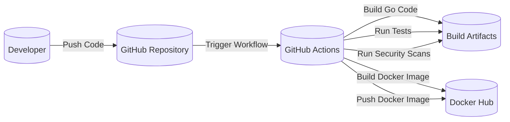

Okay, let's create a design document for the Ory Kratos project, keeping in mind its purpose and potential security implications.

# BUSINESS POSTURE

Ory Kratos is an open-source identity and user management system.  It's designed to be API-first and cloud-native, focusing on flexibility and extensibility.  This suggests a business posture that prioritizes:

*   Rapid Development and Deployment:  The API-first nature and cloud-native design indicate a need for quick iteration and deployment cycles.
*   Scalability and Reliability:  As an identity provider, Kratos must be able to handle a large number of users and requests, and be highly available.
*   Customization and Integration:  The project's emphasis on extensibility suggests a need to integrate with various other systems and adapt to different business requirements.
*   Security:  As a core component of identity management, security is paramount.  This includes protecting user data, preventing unauthorized access, and complying with relevant regulations.
*   Open Source Community: Leveraging and contributing to the open-source community is a key aspect of the project's development and maintenance.

Business Priorities:

*   Provide a secure and reliable identity management solution.
*   Enable developers to easily integrate identity management into their applications.
*   Offer a flexible and customizable platform that can adapt to various use cases.
*   Maintain a strong open-source community and encourage contributions.
*   Ensure compliance with relevant security and privacy regulations.

Business Goals:

*   Become a leading open-source identity and user management system.
*   Attract a large and active user base.
*   Establish a reputation for security, reliability, and ease of use.
*   Foster a thriving open-source community.

Most Important Business Risks:

*   Data Breaches:  Unauthorized access to user data could have severe consequences, including reputational damage, legal liabilities, and loss of user trust.
*   Service Outages:  Downtime of the identity service could disrupt user access to applications and services, leading to business disruption and financial losses.
*   Integration Issues:  Difficulties in integrating Kratos with other systems could limit its adoption and usefulness.
*   Lack of Adoption:  If the project fails to gain traction, it may not be sustainable in the long term.
*   Compliance Violations:  Failure to comply with regulations like GDPR, CCPA, etc., could result in significant fines and penalties.

# SECURITY POSTURE

Existing Security Controls:

*   security control: Secure Development Practices: The project's GitHub repository shows evidence of secure coding practices, including code reviews, static analysis (GoSec), and dependency management. Described in CONTRIBUTING.md and SECURITY.md.
*   security control: API-First Design: This inherently limits the attack surface compared to traditional monolithic architectures.
*   security control: Use of Go: Go is a memory-safe language, reducing the risk of common vulnerabilities like buffer overflows.
*   security control: Containerization (Docker): This provides isolation and helps manage dependencies, reducing the risk of environment-specific vulnerabilities. Described in Dockerfile.
*   security control: Support for Multi-Factor Authentication (MFA): Kratos supports various MFA methods, enhancing account security. Described in documentation.
*   security control: Password Hashing: Kratos uses strong password hashing algorithms (bcrypt) to protect user credentials. Described in documentation.
*   security control: Session Management: Kratos provides secure session management capabilities, including token-based authentication and session invalidation. Described in documentation.
*   security control: OAuth 2.0 and OpenID Connect Support: Kratos can act as an OAuth 2.0 and OpenID Connect provider, enabling secure delegation of authorization. Described in documentation.
*   security control: Input validation: Kratos uses JSON Schema for input validation. Described in documentation.

Accepted Risks:

*   accepted risk: Complexity of Configuration:  The flexibility of Kratos can lead to complex configurations, which, if done incorrectly, could introduce security vulnerabilities.
*   accepted risk: Reliance on External Dependencies:  Like any software, Kratos relies on external libraries and services.  Vulnerabilities in these dependencies could impact Kratos's security.
*   accepted risk: Open Source Nature: While beneficial, the open-source nature means that vulnerabilities are publicly disclosed, potentially giving attackers a window of opportunity before patches are applied.

Recommended Security Controls:

*   Regular Penetration Testing: Conduct regular penetration tests to identify and address potential vulnerabilities.
*   Web Application Firewall (WAF): Deploy a WAF to protect against common web attacks.
*   Intrusion Detection and Prevention System (IDPS): Implement an IDPS to monitor network traffic and detect malicious activity.
*   Security Information and Event Management (SIEM): Use a SIEM system to collect and analyze security logs, providing a centralized view of security events.
*   Runtime Application Self-Protection (RASP): Consider RASP to provide an additional layer of protection at runtime.

Security Requirements:

*   Authentication:
    *   Support for strong password policies (length, complexity, history).
    *   Enforcement of MFA for all users, or at least for privileged accounts.
    *   Secure storage of user credentials using strong hashing algorithms (e.g., bcrypt, Argon2).
    *   Protection against brute-force and credential stuffing attacks.
    *   Secure session management with appropriate timeouts and token invalidation.

*   Authorization:
    *   Role-Based Access Control (RBAC) to manage user permissions.
    *   Fine-grained access control to resources and APIs.
    *   Regular review and auditing of user permissions.

*   Input Validation:
    *   Strict validation of all user inputs using a whitelist approach.
    *   Protection against common web vulnerabilities like Cross-Site Scripting (XSS), SQL Injection, and Cross-Site Request Forgery (CSRF).
    *   Use of JSON Schema for API input validation.

*   Cryptography:
    *   Use of strong, industry-standard cryptographic algorithms for all sensitive operations (e.g., password hashing, data encryption).
    *   Secure key management practices.
    *   Protection of data in transit using TLS/SSL.
    *   Consideration of data-at-rest encryption for sensitive data.

# DESIGN

## C4 CONTEXT

```mermaid
graph LR
    subgraph Ory Kratos System
        kratos[("Ory Kratos")]
    end
    user[("User")]
    admin[("Administrator")]
    webapp[("Web Application")]
    mobileapp[("Mobile Application")]
    thirdparty[("Third-Party Service")]
    email[("Email Service")]
    sms[("SMS Service")]
    database[(("Database"))]

    user -- Login/Register --> kratos
    admin -- Manage Users/Config --> kratos
    webapp -- Authenticate User --> kratos
    mobileapp -- Authenticate User --> kratos
    kratos -- Delegate Auth --> thirdparty
    kratos -- Send Notifications --> email
    kratos -- Send Notifications --> sms
    kratos -- Store Data --> database
```

C4 Context Element List:

*   Element: User
    *   Name: User
    *   Type: Person
    *   Description: A person who interacts with applications that use Ory Kratos for identity management.
    *   Responsibilities: Authenticate, manage their profile, potentially use MFA.
    *   Security Controls: Strong passwords, MFA, session management.

*   Element: Administrator
    *   Name: Administrator
    *   Type: Person
    *   Description: A person who manages the Ory Kratos instance and its configuration.
    *   Responsibilities: Configure Kratos, manage users, monitor system health.
    *   Security Controls: Strong passwords, MFA, RBAC, audit logging.

*   Element: Web Application
    *   Name: Web Application
    *   Type: System
    *   Description: A web application that integrates with Ory Kratos for user authentication and management.
    *   Responsibilities: Delegate authentication to Kratos, manage user sessions, access user data.
    *   Security Controls: Secure communication with Kratos (TLS), proper handling of authentication tokens, input validation.

*   Element: Mobile Application
    *   Name: Mobile Application
    *   Type: System
    *   Description: A mobile application that integrates with Ory Kratos for user authentication and management.
    *   Responsibilities: Delegate authentication to Kratos, manage user sessions, access user data.
    *   Security Controls: Secure communication with Kratos (TLS), secure storage of authentication tokens, input validation.

*   Element: Third-Party Service
    *   Name: Third-Party Service
    *   Type: System
    *   Description: An external service that Kratos might integrate with, such as an OAuth 2.0 provider or a social login provider.
    *   Responsibilities: Provide authentication or authorization services.
    *   Security Controls: Secure communication with Kratos (TLS), adherence to OAuth 2.0/OpenID Connect standards.

*   Element: Email Service
    *   Name: Email Service
    *   Type: System
    *   Description: A service used by Kratos to send emails, such as registration confirmations, password reset links, and MFA codes.
    *   Responsibilities: Deliver emails reliably and securely.
    *   Security Controls: Secure communication with Kratos (TLS), protection against email spoofing and phishing.

*   Element: SMS Service
    *   Name: SMS Service
    *   Type: System
    *   Description: A service used by Kratos to send SMS messages, such as MFA codes.
    *   Responsibilities: Deliver SMS messages reliably and securely.
    *   Security Controls: Secure communication with Kratos, protection against SMS spoofing.

*   Element: Database
    *   Name: Database
    *   Type: System
    *   Description: The database used by Kratos to store user data, session information, and configuration.
    *   Responsibilities: Store data securely and reliably.
    *   Security Controls: Data encryption at rest, access control, regular backups, auditing.

*   Element: Ory Kratos
    *   Name: Ory Kratos
    *   Type: System
    *   Description: The core identity and user management system.
    *   Responsibilities: Handle user registration, login, MFA, session management, profile management, and integration with other services.
    *   Security Controls: All previously mentioned security controls.

## C4 CONTAINER

```mermaid
graph LR
    subgraph Ory Kratos System
        api[("API")]
        identity[("Identity Engine")]
        session[("Session Management")]
        mfa[("MFA Engine")]
        selfservice[("Self-Service UI")]
        database[(("Database"))]
    end
    user[("User")]
    webapp[("Web Application")]
    mobileapp[("Mobile Application")]

    user -- Login/Register --> selfservice
    webapp -- Authenticate --> api
    mobileapp -- Authenticate --> api
    api -- Manage Identities --> identity
    api -- Manage Sessions --> session
    api -- Manage MFA --> mfa
    identity -- Store/Retrieve --> database
    session -- Store/Retrieve --> database
    mfa -- Store/Retrieve --> database
    selfservice -- Use --> api

```

C4 Container Element List:

*   Element: API
    *   Name: API
    *   Type: Container
    *   Description: The main entry point for interacting with Ory Kratos. Provides RESTful endpoints for all identity management functions.
    *   Responsibilities: Handle requests from clients, validate input, interact with other internal components.
    *   Security Controls: Input validation, authentication, authorization, rate limiting, TLS encryption.

*   Element: Identity Engine
    *   Name: Identity Engine
    *   Type: Container
    *   Description: Responsible for managing user identities, including registration, profile management, and credential management.
    *   Responsibilities: Create, read, update, and delete user accounts, manage user attributes, enforce password policies.
    *   Security Controls: Password hashing, data validation, access control.

*   Element: Session Management
    *   Name: Session Management
    *   Type: Container
    *   Description: Handles user sessions, including creating, validating, and invalidating sessions.
    *   Responsibilities: Issue session tokens, manage session state, enforce session timeouts.
    *   Security Controls: Secure token generation, secure storage of session data, protection against session hijacking.

*   Element: MFA Engine
    *   Name: MFA Engine
    *   Type: Container
    *   Description: Manages multi-factor authentication, including enrollment, verification, and recovery.
    *   Responsibilities: Support various MFA methods (TOTP, SMS, etc.), enforce MFA policies.
    *   Security Controls: Secure storage of MFA secrets, protection against replay attacks.

*   Element: Self-Service UI
    *   Name: Self-Service UI
    *   Type: Container
    *   Description: Provides a user interface for common self-service tasks, such as registration, login, and profile management.  This is optional and can be replaced by custom UIs.
    *   Responsibilities: Render user interfaces, interact with the API.
    *   Security Controls: Input validation, protection against XSS and CSRF, secure communication with the API.

*   Element: Database
    *   Name: Database
    *   Type: Container
    *   Description: The database used to store user data, session information, and configuration.
    *   Responsibilities: Store data securely and reliably.
    *   Security Controls: Data encryption at rest, access control, regular backups, auditing.

*   Element: User
    *   Name: User
    *   Type: Person
    *   Description: A person who interacts with applications that use Ory Kratos for identity management.
    *   Responsibilities: Authenticate, manage their profile, potentially use MFA.
    *   Security Controls: Strong passwords, MFA, session management.

*   Element: Web Application
    *   Name: Web Application
    *   Type: System
    *   Description: A web application that integrates with Ory Kratos for user authentication and management.
    *   Responsibilities: Delegate authentication to Kratos, manage user sessions, access user data.
    *   Security Controls: Secure communication with Kratos (TLS), proper handling of authentication tokens, input validation.

*   Element: Mobile Application
    *   Name: Mobile Application
    *   Type: System
    *   Description: A mobile application that integrates with Ory Kratos for user authentication and management.
    *   Responsibilities: Delegate authentication to Kratos, manage user sessions, access user data.
    *   Security Controls: Secure communication with Kratos (TLS), secure storage of authentication tokens, input validation.

## DEPLOYMENT

Possible Deployment Solutions:

1.  Kubernetes: Deploying Kratos as a set of pods within a Kubernetes cluster. This is the recommended approach for production deployments.
2.  Docker Compose: Deploying Kratos and its dependencies (database) using Docker Compose. Suitable for development and testing.
3.  Bare Metal/VM: Deploying Kratos directly on a virtual machine or bare-metal server. Less common, but possible for specific use cases.

Chosen Solution: Kubernetes

```mermaid
graph LR
    subgraph Kubernetes Cluster
        subgraph Namespace: ory-kratos
            pod1[("Kratos Pod 1")]
            pod2[("Kratos Pod 2")]
            pod3[("Kratos Pod 3")]
            db[(("Database Pod"))]
            ingress[("Ingress Controller")]
        end
        internet[("Internet")]
    end

    internet -- HTTPS --> ingress
    ingress -- Route Traffic --> pod1
    ingress -- Route Traffic --> pod2
    ingress -- Route Traffic --> pod3
    pod1 -- Connect --> db
    pod2 -- Connect --> db
    pod3 -- Connect --> db
```

Deployment Element List:

*   Element: Kubernetes Cluster
    *   Name: Kubernetes Cluster
    *   Type: Infrastructure
    *   Description: The Kubernetes cluster where Ory Kratos is deployed.
    *   Responsibilities: Orchestrate containers, manage resources, provide networking.
    *   Security Controls: Network policies, RBAC, pod security policies, regular security updates.

*   Element: Namespace: ory-kratos
    *   Name: Namespace: ory-kratos
    *   Type: Infrastructure
    *   Description: A Kubernetes namespace dedicated to Ory Kratos, providing isolation from other applications.
    *   Responsibilities: Isolate resources, manage access control.
    *   Security Controls: RBAC, network policies.

*   Element: Kratos Pod 1, 2, 3
    *   Name: Kratos Pod 1, 2, 3
    *   Type: Container Instance
    *   Description: Instances of the Ory Kratos container, running within Kubernetes pods. Multiple pods provide high availability and scalability.
    *   Responsibilities: Handle user authentication and management requests.
    *   Security Controls: All previously mentioned security controls for Kratos containers.

*   Element: Database Pod
    *   Name: Database Pod
    *   Type: Container Instance
    *   Description: The database instance (e.g., PostgreSQL) used by Kratos, running within a Kubernetes pod.
    *   Responsibilities: Store user data, session information, and configuration.
    *   Security Controls: Data encryption at rest, access control, regular backups, auditing.

*   Element: Ingress Controller
    *   Name: Ingress Controller
    *   Type: Infrastructure
    *   Description: A Kubernetes Ingress controller that manages external access to the Kratos service.
    *   Responsibilities: Route traffic to the appropriate Kratos pods, handle TLS termination.
    *   Security Controls: TLS encryption, WAF integration (optional).

* Element: Internet
    * Name: Internet
    * Type: External
    * Description: Public network.
    * Responsibilities: N/A
    * Security Controls: N/A

## BUILD

The Ory Kratos build process leverages Go's build system and GitHub Actions for automation and security checks.



Build Process Description:

1.  Developer pushes code changes to the GitHub repository.
2.  GitHub Actions workflow is triggered.
3.  The workflow checks out the code.
4.  Go modules are downloaded and managed.
5.  Static analysis tools (e.g., GoSec, linters) are run to identify potential security vulnerabilities and code quality issues.
6.  Unit tests and integration tests are executed.
7.  If all checks and tests pass, the Go code is compiled into binaries.
8.  A Docker image is built, including the compiled binaries and necessary dependencies.
9.  The Docker image is pushed to a container registry (e.g., Docker Hub).

Security Controls in Build Process:

*   Dependency Management: Go modules are used to manage dependencies and ensure that known vulnerable versions are not used. Tools like `dependabot` can be used to automatically update dependencies.
*   Static Analysis: Static analysis tools (GoSec, linters) are used to identify potential security vulnerabilities and code quality issues before runtime.
*   Automated Testing: Unit tests and integration tests are run automatically to ensure that code changes do not introduce regressions or security flaws.
*   Containerization: Docker is used to package the application and its dependencies, ensuring consistency across different environments and reducing the risk of environment-specific vulnerabilities.
*   Signed Commits: Developers should sign their commits to ensure the integrity of the codebase.
*   Supply Chain Security: Consider using tools like `cosign` to sign and verify container images, ensuring that they have not been tampered with.

# RISK ASSESSMENT

Critical Business Processes:

*   User Authentication: Ensuring that only authorized users can access applications and services.
*   User Registration: Allowing new users to securely create accounts.
*   Session Management: Maintaining secure user sessions and preventing session hijacking.
*   Profile Management: Allowing users to manage their profile information securely.
*   MFA: Providing an additional layer of security for user accounts.
*   Integration with other services.

Data Sensitivity:

*   Personally Identifiable Information (PII): Usernames, email addresses, phone numbers, addresses, etc. (High Sensitivity)
*   Authentication Credentials: Passwords (hashed), MFA secrets, session tokens. (High Sensitivity)
*   User Profile Data: Any additional data stored about users, which may vary depending on the application. (Variable Sensitivity, potentially High)
*   Configuration Data: Settings and configurations related to the Kratos instance. (Medium Sensitivity)
*   Audit Logs: Logs of user activity and system events. (Medium Sensitivity)

# QUESTIONS & ASSUMPTIONS

Questions:

*   What specific compliance requirements (e.g., GDPR, CCPA, HIPAA) must Kratos adhere to?
*   What are the expected user base size and request volume? This will impact scalability requirements.
*   What are the specific integration requirements with other systems?
*   What is the preferred database system?
*   What level of logging and monitoring is required?
*   Are there any specific security certifications or audits required?

Assumptions:

*   BUSINESS POSTURE: The primary goal is to provide a secure and reliable identity management solution, prioritizing security over other factors.
*   SECURITY POSTURE: Secure coding practices are followed, and regular security reviews are conducted.
*   DESIGN: The system will be deployed in a highly available and scalable manner, likely using Kubernetes. The database will be properly secured and backed up.
*   DESIGN: The system will be integrated with other services using secure protocols (e.g., OAuth 2.0, OpenID Connect).
*   DESIGN: The system will be monitored for security events and performance issues.