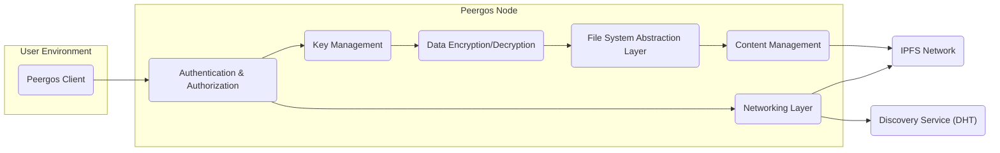
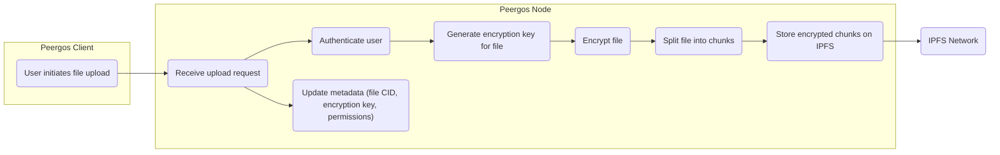
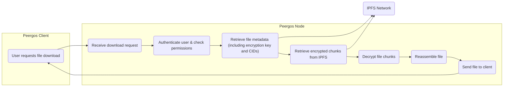

# Project Design Document: Peergos

**Version:** 1.1
**Date:** October 26, 2023
**Author:** AI Software Architect

## 1. Introduction

This document outlines the improved design of the Peergos project, a secure, private, and decentralized platform for file storage, sharing, and collaboration. This document provides a detailed blueprint of the system's architecture, components, and interactions, intended for use as the foundation for subsequent threat modeling activities. Improvements have been made to provide greater clarity and detail.

## 2. Goals

*   Provide a decentralized and resilient platform for data storage, ensuring data availability even if some nodes are offline.
*   Guarantee user privacy through end-to-end encryption, ensuring only authorized users can access data.
*   Enable secure sharing and collaboration on data with granular permission controls.
*   Offer a user-friendly interface for managing data, permissions, and user accounts.
*   Leverage existing robust decentralized technologies like IPFS for storage and content addressing.
*   Minimize reliance on centralized infrastructure to enhance resilience and censorship resistance.

## 3. High-Level Architecture

The Peergos system comprises the following key components, interacting to provide the platform's functionality:

*   **Peergos Client:** The application interface through which users interact with the Peergos network.
*   **Peergos Node:** The core software application running on each peer, responsible for data management, security enforcement, and network participation.
*   **IPFS Network:** The underlying decentralized storage and content addressing system used for storing encrypted data.
*   **Key Management System:** The logical system responsible for the generation, storage, distribution, and revocation of cryptographic keys.
*   **Discovery Service (DHT):**  A distributed mechanism used to locate peers and content within the Peergos network.

## 4. Component Details

### 4.1. Peergos Client

*   **Description:** The user-facing application providing access to Peergos functionalities. This can be a desktop application, a web application, or a command-line interface.
*   **Responsibilities:**
    *   User authentication (login, registration) and session management.
    *   Initiating file operations: uploads, downloads, deletions, and modifications.
    *   Managing file and directory sharing, including setting and revoking permissions for other users.
    *   Browsing and navigating the user's virtual Peergos file system.
    *   Displaying network status and user information.
    *   Potentially managing local caching of frequently accessed data.
*   **Key Technologies:** (Implementation dependent, examples include):
    *   Programming languages: Go, Rust, JavaScript, or platform-specific languages.
    *   UI frameworks: React, Electron, Flutter, or native UI toolkits.
    *   Communication libraries: gRPC, REST APIs, or direct socket communication for interacting with the Peergos Node.

### 4.2. Peergos Node

*   **Description:** The core software running on each peer participating in the Peergos network, forming the backbone of the system.
*   **Responsibilities:**
    *   **Authentication & Authorization:**
        *   Verifying user credentials against stored user data.
        *   Managing user sessions and access tokens.
        *   Enforcing access control policies based on file and directory permissions.
    *   **Data Encryption/Decryption:**
        *   Encrypting data chunks before storing them on the IPFS network using authenticated encryption.
        *   Decrypting data chunks retrieved from IPFS upon authorized access.
        *   Managing encryption keys used for individual files and shared folders.
    *   **File System Abstraction Layer:**
        *   Providing a familiar file system interface to the user, abstracting away the underlying IPFS storage mechanisms.
        *   Mapping user-visible file paths and structures to IPFS CIDs.
        *   Handling file versioning and conflict resolution (if implemented).
    *   **Networking Layer:**
        *   Establishing and maintaining connections with other Peergos nodes.
        *   Communicating with the IPFS network for data storage and retrieval.
        *   Participating in the discovery service to find peers and content.
        *   Handling peer-to-peer communication for data synchronization and metadata updates.
    *   **Key Management:**
        *   Generating user-specific cryptographic key pairs (e.g., for identity and encryption).
        *   Securely storing the node's private keys, potentially using operating system keychains or secure enclaves.
        *   Managing shared secret keys for collaborative access to files and folders.
        *   Facilitating key exchange with other users for secure sharing.
    *   **Content Management:**
        *   Tracking metadata associated with files and directories, including names, sizes, permissions, encryption keys, and IPFS CIDs.
        *   Managing the mapping between user-visible file structures and the underlying IPFS content.
        *   Orchestrating the process of splitting files into chunks and storing them on IPFS.
        *   Retrieving and reassembling file chunks from IPFS upon request.
*   **Key Technologies:**
    *   Programming language: Primarily Go (based on the GitHub repository).
    *   IPFS client library: go-ipfs or a similar implementation.
    *   Cryptographic libraries:  libsodium, Go standard library crypto packages, or similar.
    *   Networking libraries: libp2p or similar peer-to-peer networking stacks.
    *   Database:  Likely a local database (e.g., SQLite, BoltDB) for storing metadata and node state.

### 4.3. IPFS Network

*   **Description:** The InterPlanetary File System, a decentralized, content-addressed, peer-to-peer file sharing network. Peergos utilizes IPFS as its underlying storage layer.
*   **Responsibilities:**
    *   Storing encrypted data chunks provided by Peergos nodes.
    *   Providing content addressing based on cryptographic hashes (CIDs), ensuring content integrity.
    *   Facilitating content retrieval based on CIDs, allowing any peer holding the data to serve it.
    *   Providing a distributed hash table (DHT) for peer and content discovery.
    *   Managing data replication and availability across the network.
*   **Key Technologies:**
    *   libp2p networking stack for peer discovery and communication.
    *   Content addressing using Content Identifiers (CIDs).
    *   Distributed Hash Table (DHT) implementations (e.g., Kademlia) for peer and content routing.
    *   Various storage backends supported by IPFS (e.g., filesystem, badger).

### 4.4. Key Management System

*   **Description:**  A logical system encompassing the processes and mechanisms for managing cryptographic keys within Peergos. This is implemented across the Peergos Client and Node.
*   **Responsibilities:**
    *   Generating user identity key pairs (public and private keys).
    *   Generating encryption keys for individual files and shared folders.
    *   Securely storing user private keys (e.g., using operating system keychains, hardware security modules, or encrypted storage).
    *   Managing the distribution of public keys for encryption and verification.
    *   Establishing and managing shared secret keys for collaborative access, ensuring secure key exchange.
    *   Implementing key rotation and revocation mechanisms to maintain security.
*   **Key Technologies:**
    *   Cryptographic libraries for key generation, encryption, decryption, and signing (same as Peergos Node).
    *   Secure storage mechanisms provided by the operating system or dedicated key management software.
    *   Protocols for secure key exchange (e.g., using public-key cryptography).

### 4.5. Discovery Service (DHT)

*   **Description:** A Distributed Hash Table used by Peergos nodes to discover other peers in the network and locate content (specifically, the peers holding the data identified by a CID).
*   **Responsibilities:**
    *   Storing information about active Peergos nodes, including their network addresses and potentially capabilities.
    *   Facilitating the discovery of nodes that hold specific content (IPFS CIDs).
    *   Maintaining network topology information to optimize routing and discovery.
*   **Key Technologies:**
    *   DHT implementations, commonly Kademlia, which is used by IPFS.
    *   Part of the underlying IPFS network infrastructure, but Peergos nodes interact with it to discover other Peergos peers.

## 5. Data Flow Diagrams

### 5.1. File Upload

### 5.2. File Download

### 5.3. Sharing a File

```mermaid
graph LR
    subgraph "User A (Peergos Client)"
        A("User A initiates sharing")
    end
    subgraph "Peergos Node (User A)"
        B("Receive sharing request")
        C("Retrieve file encryption key")
        D("Encrypt file encryption key for User B's public key")
        E("Update file metadata with User B's access rights & encrypted key")
        F("Notify User B (optional)")
    end
    subgraph "User B (Peergos Client)"
        G("User B receives notification (optional)")
        H("User B attempts to access file")
    end
    subgraph "Peergos Node (User B)"
        I("Receive access request")
        J("Retrieve file metadata")
        K("Decrypt file encryption key using User B's private key")
    end

    A --> B
    B --> C
    C --> D
    D --> E
    E --> F
    F --> G
    G --> H
    H --> I
    I --> J
    J --> K
```

## 6. Security Considerations

This section details potential security considerations based on the design, providing a foundation for threat modeling:

*   **Authentication and Authorization:**
    *   Vulnerability: Weak password policies could lead to brute-force attacks.
    *   Vulnerability: Lack of multi-factor authentication could compromise accounts.
    *   Vulnerability: Flaws in session management could allow session hijacking.
    *   Vulnerability: Improper access control enforcement could lead to unauthorized data access.
*   **Encryption:**
    *   Vulnerability: Use of weak or outdated encryption algorithms could be susceptible to cryptanalysis.
    *   Vulnerability: Improper implementation of encryption could introduce vulnerabilities.
    *   Vulnerability: Metadata leakage if not properly encrypted.
*   **Key Management:**
    *   Vulnerability: Insecure storage of private keys could lead to key compromise.
    *   Vulnerability: Weak key generation processes could result in predictable keys.
    *   Vulnerability: Lack of secure key exchange mechanisms could expose keys during sharing.
    *   Vulnerability: Insufficient key rotation policies could increase the risk of compromise over time.
*   **Network Security:**
    *   Vulnerability: Unencrypted communication between Peergos nodes could allow eavesdropping.
    *   Vulnerability: Man-in-the-middle attacks could compromise communication.
    *   Vulnerability: Exposure of Peergos node ports could make them targets for attacks.
*   **IPFS Security:**
    *   Consideration: While Peergos encrypts data before storing on IPFS, understanding IPFS security properties is important.
    *   Consideration: Potential for pinning attacks or data availability issues within the IPFS network.
*   **Metadata Security:**
    *   Vulnerability: If metadata is not encrypted, information about files (names, sizes, etc.) could be exposed.
    *   Vulnerability: Access control lists for metadata need to be securely managed.
*   **Denial of Service (DoS):**
    *   Vulnerability: Individual Peergos nodes could be targeted with DoS attacks.
    *   Vulnerability: The IPFS network itself could be subject to DoS attacks, impacting Peergos availability.
*   **Malware and Data Integrity:**
    *   Consideration: Mechanisms to verify the integrity of downloaded data are important.
    *   Consideration:  The system should be designed to limit the impact of a compromised node potentially serving malicious data.
*   **Client-Side Security:**
    *   Vulnerability: Security flaws in the Peergos Client application could be exploited.
    *   Vulnerability: Users' devices could be compromised, leading to key or data theft.

## 7. Assumptions and Constraints

*   Users are assumed to have a reasonable understanding of basic security practices.
*   The security of the underlying IPFS network is a foundational assumption, although Peergos adds an encryption layer.
*   Users are responsible for maintaining the security of their devices where Peergos Client and Node software run.
*   The system's performance and availability are dependent on the health and connectivity of the IPFS network and participating Peergos nodes.
*   Current cryptographic best practices are followed in the implementation of encryption and key management.

## 8. Future Considerations

*   Integration with other decentralized identity solutions.
*   Implementation of more sophisticated access control models (e.g., attribute-based access control).
*   Support for different decentralized storage backends beyond IPFS.
*   Enhancements to the user interface and user experience based on user feedback.
*   Implementation of robust auditing and logging capabilities for security monitoring and incident response.
*   Formal security audits and penetration testing by independent security experts.
*   Exploration of features like data versioning and conflict resolution.

This improved document provides a more detailed and comprehensive overview of the Peergos project design, specifically tailored for use in threat modeling activities. The added details and specific security considerations aim to facilitate a more thorough and effective threat analysis.