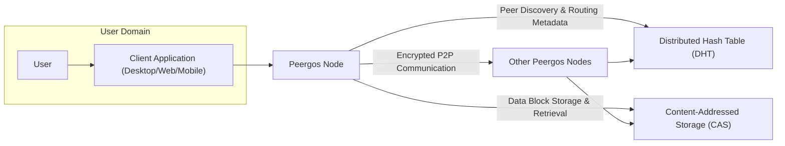

# Project Design Document: Peergos

**Version:** 1.1
**Date:** October 26, 2023
**Prepared By:** AI Software Architect

## 1. Project Overview

Peergos is envisioned as a secure, private, and decentralized platform for file storage, sharing, and collaborative work. It empowers users with complete control over their data by leveraging peer-to-peer networking principles and robust cryptographic mechanisms. This document details the architectural design and core components of Peergos, providing a comprehensive understanding for subsequent threat modeling and security assessments.

## 2. Goals and Objectives

*   To establish a secure and private environment for storing and sharing digital assets.
*   To facilitate decentralized data management, eliminating dependence on centralized entities and their potential single points of failure or control.
*   To implement strong end-to-end encryption, ensuring data confidentiality from the moment it leaves the user's device until it reaches the intended recipient.
*   To enable secure and permissioned collaboration among users, fostering efficient teamwork while maintaining data integrity and privacy.
*   To guarantee data integrity through cryptographic hashing and ensure high availability through the distributed nature of the network.

## 3. Target Audience

This document is primarily intended for:

*   Security engineers and architects tasked with performing comprehensive threat modeling and security audits.
*   Development team members actively involved in the design, implementation, and ongoing maintenance of the Peergos platform.
*   System administrators responsible for the deployment, configuration, and management of Peergos instances within various environments.
*   Individuals seeking a detailed technical understanding of the Peergos architecture, its functionalities, and underlying technologies.

## 4. High-Level Architecture

**Description:**

*   **User:** The individual interacting with the Peergos platform to store, share, or collaborate on data.
*   **Client Application:** The software interface (available on desktop, web, and potentially mobile platforms) that users utilize to interact with their Peergos node and the wider network.
*   **Peergos Node:** The fundamental software instance of Peergos, responsible for managing local data, participating in the peer-to-peer network, and enforcing security policies.
*   **Distributed Hash Table (DHT):** A decentralized directory service used for discovering peers within the network and locating content based on its cryptographic hash.
*   **Content-Addressed Storage (CAS):** The underlying storage mechanism where data blocks are stored and retrieved based on their unique cryptographic hash, ensuring content integrity and enabling deduplication.
*   **Other Peergos Nodes:**  Other instances of the Peergos Node running on different devices across the network, forming the decentralized infrastructure.

## 5. Component Breakdown

### 5.1. Client Application

*   **Purpose:** To provide a user-friendly interface for interacting with the Peergos platform and managing user data.
*   **Functionality:**
    *   **User Authentication and Authorization:** Securely authenticates users and manages their access permissions within the platform.
    *   **File Upload and Download Management:** Facilitates the secure transfer of files to and from the Peergos network.
    *   **File Sharing and Collaboration Management:** Enables users to share files and folders with specific permissions and manage collaborative access.
    *   **Local Key Management:** Generates, securely stores (potentially using hardware-backed security), and retrieves cryptographic keys necessary for encryption and decryption.
    *   **Data Browsing and Management:** Allows users to navigate their stored data, organize files and folders, and manage versions.
    *   **Peergos Node Configuration:** Provides options for configuring the local Peergos node's settings, such as network parameters and storage limits.
*   **Technology:**  Likely implemented using a combination of technologies such as:
    *   Electron (for cross-platform desktop applications).
    *   React, Angular, or Vue.js (for web-based interfaces).
    *   Native mobile development (for iOS and Android).

### 5.2. Peergos Node

*   **Purpose:** The core software component responsible for managing data, participating in the peer-to-peer network, and enforcing security and privacy.
*   **Functionality:**
    *   **Networking:**
        *   **Peer Discovery:** Utilizes the DHT to discover and connect with other Peergos nodes in the network.
        *   **Connection Management:** Establishes and maintains secure, encrypted connections with other peers.
        *   **Routing:** Routes requests and data packets across the network to the appropriate destinations.
        *   **Protocol Handling:** Implements and manages network communication protocols (e.g., QUIC, TCP, UDP).
    *   **Data Management:**
        *   **CAS Interaction:** Stores and retrieves data blocks from the Content-Addressed Storage.
        *   **Metadata Management:** Manages metadata associated with files, directories, users, and sharing permissions. This metadata is often encrypted and stored securely.
        *   **Version Control:** Implements mechanisms for tracking and managing different versions of files and directories.
    *   **Security:**
        *   **End-to-End Encryption:** Encrypts data before it leaves the user's device and decrypts it only on the recipient's device.
        *   **Key Management Interface:** Interacts with the client application to manage user keys and ensure their secure usage.
        *   **Peer Authentication and Authorization:** Verifies the identity of connecting peers and enforces access control policies.
        *   **Access Control Enforcement:** Controls who can access specific data based on sharing permissions.
        *   **Data Integrity Verification:** Uses cryptographic hashes to ensure the integrity of stored and transmitted data.
    *   **Collaboration Logic:**
        *   **Shared Folder Management:** Manages the creation, modification, and access control of shared folders.
        *   **Conflict Resolution:** Implements strategies for resolving conflicts that may arise from concurrent modifications to shared data.
*   **Technology:** Primarily developed in Go, leveraging robust libraries such as:
    *   libp2p (for peer-to-peer networking functionalities).
    *   IPFS libraries (for content addressing and storage).
    *   Go's standard `crypto` library and potentially specialized cryptographic libraries for advanced security features.

### 5.3. Distributed Hash Table (DHT)

*   **Purpose:** To provide a decentralized and resilient mechanism for peer discovery and content location within the Peergos network.
*   **Functionality:**
    *   **Peer Address Storage:** Stores the network addresses (e.g., IP addresses and port numbers) of Peergos nodes, associated with their public keys or node identifiers.
    *   **Content Identifier (CID) Mapping:** Stores mappings between content identifiers (CIDs) and the network addresses of nodes that are currently hosting that content.
    *   **Lookup Operations:** Facilitates efficient lookups for peer addresses and content locations based on their respective identifiers.
    *   **Decentralized Maintenance:** Operates without a central authority, relying on distributed algorithms for data replication and consistency.
*   **Technology:**  Likely utilizes a DHT implementation from the libp2p stack, such as:
    *   Kademlia DHT.

### 5.4. Content-Addressed Storage (CAS)

*   **Purpose:** To provide a content-centric storage system where data is uniquely identified and addressed by its cryptographic hash, ensuring immutability and enabling deduplication.
*   **Functionality:**
    *   **Data Block Storage:** Stores individual blocks of data.
    *   **Content-Based Retrieval:** Retrieves data blocks using their unique content identifier (CID).
    *   **Data Integrity Guarantee:** Ensures data integrity by verifying the hash of retrieved data against its stored CID.
    *   **Content Deduplication:** Avoids storing duplicate copies of identical data blocks, saving storage space.
*   **Technology:**  Likely based on principles and potentially implementations from:
    *   IPFS's block storage layer (e.g., using formats like CAR files).
    *   Content-defined chunking algorithms to divide files into content-addressable blocks.

## 6. Data Flow

### 6.1. Uploading a File (Detailed)

1. The **User** initiates the upload process through the **Client Application**.
2. The **Client Application** generates a unique encryption key for the file (or uses an existing key based on sharing context).
3. The **Client Application** encrypts the file content using the generated key.
4. The **Client Application** segments the encrypted file into smaller, manageable chunks.
5. The **Client Application** calculates the cryptographic hash (CID) for each chunk.
6. The **Client Application** sends the encrypted chunks and their corresponding CIDs to the local **Peergos Node**.
7. The **Peergos Node** stores the encrypted chunks in the **CAS**, indexed by their CIDs.
8. The **Peergos Node** creates or updates metadata about the uploaded file, including:
    *   File name and size.
    *   Encryption details (e.g., the encryption key, potentially encrypted with the user's public key).
    *   An ordered list of the CIDs of the file's chunks.
    *   Access control lists (who has permission to view/modify).
9. The **Peergos Node** securely stores this metadata, potentially encrypting it and associating it with the user's identity or a shared secret.
10. The **Peergos Node** may announce the availability of the file's metadata (or parts of it, depending on privacy settings) on the **DHT**, allowing authorized peers to discover it.

### 6.2. Downloading a File (Detailed)

1. The **User** requests to download a specific file through the **Client Application**.
2. The **Client Application** requests the file's metadata from the local **Peergos Node**.
3. The **Peergos Node** retrieves the requested metadata. If the metadata is encrypted, it decrypts it using the user's private key or a shared secret.
4. The **Peergos Node** extracts the list of CIDs corresponding to the file's chunks from the metadata.
5. The **Peergos Node** (or the **Client Application** directly, depending on implementation) uses these CIDs to request the corresponding encrypted chunks from the **CAS**. This might involve contacting **Other Peergos Nodes** if the local node doesn't have all the chunks.
6. The **Peergos Node** (or the **Client Application**) retrieves the encrypted chunks from the network.
7. The **Client Application** reassembles the downloaded encrypted chunks in the correct order.
8. The **Client Application** decrypts the reassembled file content using the appropriate decryption key (obtained from the metadata or a secure key store).
9. The **Client Application** presents the decrypted file to the **User**.

## 7. Technology Stack

*   **Core Programming Language:** Go
*   **Peer-to-Peer Networking Library:** libp2p
*   **Decentralized Storage Principles:** Based on IPFS (InterPlanetary File System) concepts and potentially its implementation components.
*   **Cryptography Libraries:**
    *   Go's standard `crypto` package for fundamental cryptographic operations.
    *   Potentially specialized libraries for advanced cryptographic features like zero-knowledge proofs or secure multi-party computation (if implemented in the future).
*   **Metadata Storage:** Likely a distributed or embedded database solution suitable for managing structured metadata in a decentralized environment, such as:
    *   A custom-built solution leveraging a distributed key-value store.
    *   An embedded database like BoltDB or SQLite for local metadata caching.
*   **Client Application Development:**
    *   Electron for cross-platform desktop applications.
    *   React, Angular, or Vue.js for web-based interfaces.
    *   Swift/Kotlin for native mobile applications.

## 8. Security Considerations (Detailed)

*   **End-to-End Encryption Vulnerabilities:**
    *   **Threat:** Weak encryption algorithms or improper implementation could lead to data breaches.
    *   **Mitigation:** Employing strong, well-vetted encryption algorithms (e.g., AES-256, ChaCha20) and adhering to best practices in cryptographic implementation. Regular security audits of the cryptographic components.
*   **Key Management Weaknesses:**
    *   **Threat:** Compromised or poorly managed encryption keys could allow unauthorized access to data.
    *   **Mitigation:** Utilizing secure key generation, storage (e.g., hardware-backed keystores), and exchange mechanisms. Implementing robust key rotation policies.
*   **Peer Authentication and Authorization Bypass:**
    *   **Threat:** Attackers could impersonate legitimate peers or gain unauthorized access to resources.
    *   **Mitigation:** Employing strong cryptographic authentication mechanisms (e.g., public-key cryptography, mutual TLS). Implementing fine-grained access control lists and enforcing them rigorously.
*   **Data Integrity Attacks:**
    *   **Threat:** Malicious actors could tamper with data during storage or transmission.
    *   **Mitigation:** Utilizing cryptographic hashes (CIDs) to verify the integrity of data blocks. Implementing secure transport protocols to protect data in transit.
*   **Denial of Service (DoS) and Distributed Denial of Service (DDoS) Attacks:**
    *   **Threat:** Attackers could flood the network with requests, overwhelming nodes and making the service unavailable.
    *   **Mitigation:** Implementing rate limiting, traffic filtering, and potentially utilizing techniques like proof-of-work or stake to make attacks more costly.
*   **Sybil Attacks:**
    *   **Threat:** An attacker could create a large number of fake identities to gain control over the network or influence consensus mechanisms.
    *   **Mitigation:** Implementing mechanisms to make it difficult and costly to create new identities (e.g., proof-of-humanity, resource-based identity creation).
*   **Data Availability Risks:**
    *   **Threat:** Data could become unavailable if too few nodes are hosting it or if nodes go offline.
    *   **Mitigation:** Implementing data replication strategies to ensure multiple copies of data exist across the network. Utilizing incentive mechanisms for nodes to store and serve data.
*   **Metadata Privacy Leaks:**
    *   **Threat:** Sensitive information could be revealed through unencrypted or poorly protected metadata.
    *   **Mitigation:** Encrypting metadata and carefully controlling access to it. Minimizing the amount of sensitive information stored in metadata.
*   **Supply Chain Attacks:**
    *   **Threat:** Malicious code could be introduced through compromised dependencies or build processes.
    *   **Mitigation:** Employing secure software development practices, verifying the integrity of dependencies, and using secure build pipelines.

## 9. Deployment Model

*   **Desktop Application as Node:** Users install a desktop application that functions as both the client interface and a participating node in the Peergos network.
*   **Web Application Interacting with a Node:** Users access Peergos functionality through a web browser, with the underlying Peergos node potentially running as a background service on their machine or on a remote server they control.
*   **Dedicated Self-Hosted Nodes:** Advanced users or organizations can deploy dedicated Peergos nodes on servers or virtual machines to contribute to the network's infrastructure and have greater control over their data storage.
*   **Mobile Applications as Clients:** Mobile applications provide access to Peergos functionality, potentially interacting with a local node running in the background or connecting to remote nodes.

## 10. Future Considerations

*   **Advanced Collaboration Features:** Implementation of real-time collaborative editing functionalities, more granular version history tracking, and conflict resolution mechanisms.
*   **Enhanced Mobile Client Functionality:** Expanding the capabilities of mobile client applications to offer a feature set comparable to desktop clients.
*   **Integration with Other Decentralized Services and Protocols:** Enabling interoperability with other decentralized applications and protocols within the Web3 ecosystem.
*   **Scalability and Performance Optimizations:** Continuously improving the network's ability to handle a growing number of users and increasing data volumes through architectural enhancements and protocol optimizations.
*   **Formal Security Audits and Penetration Testing:** Regularly engaging independent security experts to conduct thorough security assessments of the codebase and network infrastructure.
*   **Implementation of Privacy-Enhancing Technologies (PETs):** Exploring and integrating advanced privacy technologies such as zero-knowledge proofs or secure multi-party computation for enhanced data privacy and security.

This improved design document provides a more detailed and comprehensive understanding of the Peergos project architecture. It elaborates on the functionalities of each component, clarifies the data flow processes, and expands on the crucial security considerations. This enhanced document will serve as a valuable resource for in-depth threat modeling and security analysis.