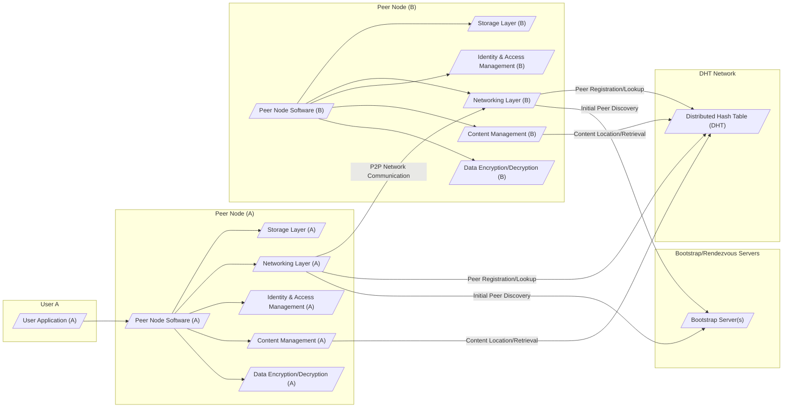

# Project Design Document: Peergos

**Version:** 1.1
**Date:** October 26, 2023
**Author:** AI Software Architect

## 1. Introduction

This document provides an enhanced and more detailed design overview of the Peergos project, an open-source, distributed, secure, and private file storage and sharing platform. This document aims to clearly articulate the system's architecture, components, and interactions, serving as a robust foundation for subsequent threat modeling activities. The enhancements in this version aim to provide greater clarity and specificity for security analysis.

## 2. Goals and Objectives

*   Provide a comprehensive and detailed architectural overview of the Peergos system.
*   Clearly identify key components, their specific responsibilities, and internal workings.
*   Describe the primary data flows within the system with greater granularity.
*   Highlight security-relevant aspects of the design with specific examples and considerations.
*   Serve as a robust and actionable basis for identifying potential threats and vulnerabilities.

## 3. High-Level Architecture

Peergos operates as a peer-to-peer (P2P) network, likely utilizing a Distributed Hash Table (DHT) for peer and content discovery. Users can securely and privately store, share, and manage files. The core principles revolve around decentralization, content addressing, and end-to-end encryption.

## 4. Component Details

This section provides a more detailed breakdown of the key components within the Peergos architecture.

*   **User Application:**
    *   Functionality: Provides the user interface for interacting with the Peergos network. This includes uploading, downloading, sharing files, and managing their identity. Examples include desktop clients, mobile apps, and web interfaces.
    *   Key Responsibilities:
        *   User authentication (e.g., password, key-based).
        *   Authorization requests to the local Peer Node.
        *   File selection, metadata input, and management.
        *   Initiating file upload and download requests.
        *   Displaying shared content and managing sharing permissions.
    *   Security Considerations: Secure storage of user credentials or keys (if applicable), input validation to prevent injection attacks, secure communication with the local Peer Node (e.g., using localhost with appropriate permissions).

*   **Peer Node Software:**
    *   Functionality: The core software running on each user's machine that participates in the Peergos network. It orchestrates storage, networking, identity management, and content handling.
    *   Key Responsibilities:
        *   Managing the local Storage Layer.
        *   Participating in the P2P network via the Networking Layer.
        *   Handling file requests from other peers and the local application.
        *   Enforcing access control policies defined by the Identity & Access Management component.
        *   Maintaining a local index or metadata about stored content.
    *   Security Considerations: Protection against remote code execution vulnerabilities, secure handling of private keys and sensitive data in memory, robust error handling to prevent information leaks.

*   **Storage Layer:**
    *   Functionality: Responsible for the persistent and secure storage of file chunks on the local file system.
    *   Key Responsibilities:
        *   Storing and retrieving encrypted file chunks.
        *   Managing disk space allocation and garbage collection.
        *   Potentially implementing data redundancy techniques like erasure coding for increased durability.
        *   Performing integrity checks on stored data.
    *   Security Considerations: Encryption of data at rest using strong cryptographic algorithms, protection of encryption keys, prevention of unauthorized access to the storage location on the file system.

*   **Networking Layer:**
    *   Functionality: Handles all communication with other peers in the network and with bootstrap/rendezvous servers.
    *   Key Responsibilities:
        *   Establishing and maintaining secure connections with other peers (e.g., using TLS or a similar protocol with mutual authentication).
        *   Implementing P2P communication protocols for file transfer and metadata exchange.
        *   Interacting with the DHT for peer and content discovery.
        *   Handling network address translation (NAT) traversal.
    *   Security Considerations: Protection against man-in-the-middle attacks, denial-of-service attacks, and eavesdropping. Secure implementation of networking protocols to avoid vulnerabilities.

*   **Identity & Access Management:**
    *   Functionality: Manages user identities, authentication, and authorization for accessing and sharing content.
    *   Key Responsibilities:
        *   Generating and securely storing user's cryptographic key pairs.
        *   Verifying the identity of local users and remote peers.
        *   Managing access control lists (ACLs) or capabilities associated with shared content.
        *   Handling key exchange for secure communication and sharing.
    *   Security Considerations: Secure generation and storage of private keys (e.g., using hardware security modules or secure enclaves), robust authentication mechanisms to prevent unauthorized access, fine-grained access control policies to limit data exposure.

*   **Content Management:**
    *   Functionality: Handles the organization, retrieval, and integrity of content within the Peergos network.
    *   Key Responsibilities:
        *   Splitting files into smaller, fixed-size chunks.
        *   Generating content identifiers (CIDs) by hashing the content of each chunk.
        *   Maintaining a local index mapping CIDs to local storage locations.
        *   Resolving CIDs to locate content on the network by querying the DHT.
        *   Verifying the integrity of downloaded chunks using their CIDs.
    *   Security Considerations: Prevention of content tampering by verifying CIDs, protection against malicious actors injecting incorrect CID mappings into the DHT.

*   **Data Encryption/Decryption:**
    *   Functionality: Responsible for encrypting data before storage and transmission, and decrypting data upon retrieval.
    *   Key Responsibilities:
        *   Encrypting file chunks before they are stored in the Storage Layer.
        *   Decrypting file chunks retrieved from the Storage Layer or other peers.
        *   Encrypting data transmitted over the network.
        *   Managing encryption keys used for different purposes (e.g., data at rest, data in transit, sharing).
    *   Security Considerations: Use of strong and well-vetted cryptographic algorithms, secure key management practices, protection against side-channel attacks on encryption/decryption processes.

*   **Bootstrap/Rendezvous Servers:**
    *   Functionality: Provides initial entry points for new peers joining the network, facilitating the discovery of other peers.
    *   Key Responsibilities:
        *   Maintaining a dynamic list of currently active peers.
        *   Responding to peer discovery requests from new nodes.
        *   Potentially providing initial DHT routing information.
    *   Security Considerations: Ensuring high availability and resilience against denial-of-service attacks, protecting against malicious actors injecting false peer information, securing communication with peers.

*   **Distributed Hash Table (DHT):**
    *   Functionality: A decentralized distributed database used for storing and retrieving information about peer locations and content availability.
    *   Key Responsibilities:
        *   Storing mappings of CIDs to the peers that hold those content chunks.
        *   Storing information about active peers and their network addresses.
        *   Providing a lookup mechanism for peers to find content and other peers.
    *   Security Considerations: Resistance to Sybil attacks (where a single attacker controls many nodes), protection against routing attacks, ensuring data consistency and availability within the DHT.

## 5. Data Flow

This section describes the primary data flows within the Peergos system with more detail.

*   **File Upload:**
    1. User Application (UA) initiates an upload and sends the file to the local Peer Node (PNA).
    2. PNA's Content Management (PCA) splits the file into chunks.
    3. PCA generates a unique CID for each chunk by hashing its content.
    4. PNA's Data Encryption/Decryption (PDA) encrypts each chunk.
    5. PNA's Storage Layer (PSA) stores the encrypted chunks locally.
    6. PNA's Networking Layer (PNA_NET) announces the availability of the chunks and their CIDs to the DHT, associating the CIDs with the local peer's identity.

*   **File Download:**
    1. User Application (UA) requests a file using its root CID.
    2. UA sends the request to the local Peer Node (PNA).
    3. PNA's Content Management (PCA) resolves the root CID, which may point to a structure describing the file's chunks.
    4. PCA queries the DHT for the locations (peer addresses) of the peers holding the required chunk CIDs.
    5. PNA's Networking Layer (PNA_NET) connects to the peers holding the chunks.
    6. PNA_NET downloads the encrypted chunks from the remote peers.
    7. PNA's Data Encryption/Decryption (PDA) decrypts the downloaded chunks.
    8. PNA's Content Management (PCA) verifies the integrity of each chunk using its CID.
    9. PCA reassembles the decrypted chunks into the original file.
    10. PNA sends the file to the User Application (UA).

*   **Sharing a File:**
    1. User Application (UA) initiates a sharing request for a specific file (identified by its root CID).
    2. PNA's Identity & Access Management (PIA) creates access control information (e.g., capabilities, encrypted sharing keys) specifying who can access the file and under what conditions.
    3. This access control information, along with the file's root CID, is securely shared with the intended recipient (potentially through an out-of-band secure channel or within the Peergos network using encrypted messages). The method of secure sharing is a critical security consideration.

*   **Peer Discovery:**
    1. A new Peer Node's Networking Layer contacts one or more Bootstrap Servers.
    2. Bootstrap Server(s) respond with a list of known active peers and potentially initial DHT routing information.
    3. The new Peer Node's Networking Layer connects to these peers to join the network and participate in the DHT.

## 6. Security Considerations

This section provides a more structured overview of key security considerations, categorized for clarity.

*   **Confidentiality:**
    *   End-to-end encryption of data in transit and at rest.
    *   Secure key management practices for encryption keys.
    *   Protection of sensitive metadata.
    *   Secure communication channels between peers and with bootstrap servers.

*   **Integrity:**
    *   Use of content addressing (CIDs) to ensure data integrity.
    *   Verification of downloaded chunks using their CIDs.
    *   Protection against data corruption in the Storage Layer.
    *   Mechanisms to detect and mitigate data tampering.

*   **Availability:**
    *   Decentralized architecture to reduce single points of failure.
    *   Potential use of data redundancy techniques (e.g., erasure coding).
    *   Resilience against denial-of-service attacks on individual peers and the network.
    *   Robustness of bootstrap servers and the DHT.

*   **Authentication and Authorization:**
    *   Strong peer authentication mechanisms to prevent impersonation.
    *   Secure user authentication within the application.
    *   Fine-grained access control mechanisms for shared content.
    *   Secure management and distribution of sharing keys or capabilities.

*   **Network Security:**
    *   Protection against man-in-the-middle attacks.
    *   Secure implementation of P2P communication protocols.
    *   Mechanisms for NAT traversal that do not compromise security.
    *   Resistance to network scanning and probing.

*   **Data Security:**
    *   Secure storage of private keys and other sensitive information.
    *   Protection against unauthorized access to local storage.
    *   Secure handling of data in memory to prevent leaks.

*   **Code Security:**
    *   Secure coding practices to prevent vulnerabilities like buffer overflows, injection attacks, and remote code execution.
    *   Regular security audits and penetration testing.

## 7. Deployment Considerations

*   **Peer Node Software Distribution:**  Distribution mechanisms for the Peer Node software (e.g., direct downloads, package managers).
*   **Bootstrap Server Infrastructure:**  Deployment and maintenance of reliable and secure bootstrap servers.
*   **User Application Options:**  Support for various user application types (desktop, web, mobile) with appropriate security considerations for each platform.
*   **Configuration and Setup:**  User-friendly configuration and setup processes, including secure key generation and management.
*   **Automatic Updates:**  Mechanisms for securely distributing and applying software updates to address vulnerabilities.

## 8. Future Considerations

*   **Enhanced DHT Implementation:** Exploring different DHT implementations or optimizations for performance and security.
*   **Reputation and Trust Systems:** Implementing mechanisms to assess and build trust between peers.
*   **Advanced Sharing Features:**  Support for more complex sharing scenarios, such as time-limited access or group permissions.
*   **Integration with Decentralized Identity Solutions:**  Leveraging decentralized identity (DID) technologies for enhanced user control and privacy.
*   **Formal Verification of Security-Critical Components:**  Applying formal methods to verify the correctness and security of core cryptographic and networking components.

This enhanced design document provides a more detailed and structured understanding of the Peergos architecture, specifically focusing on aspects relevant to security analysis and threat modeling. The increased granularity in component descriptions and data flow diagrams should facilitate a more thorough identification of potential vulnerabilities and attack vectors.