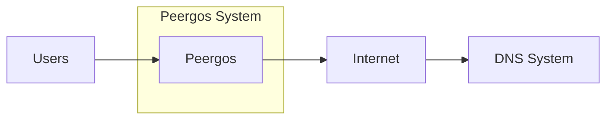
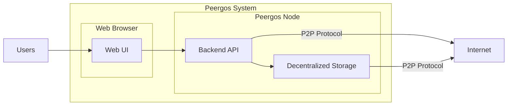
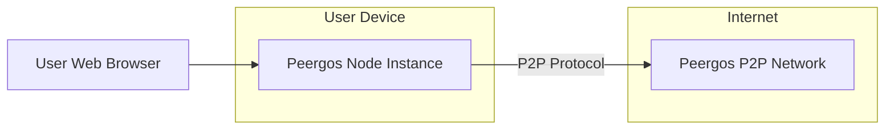
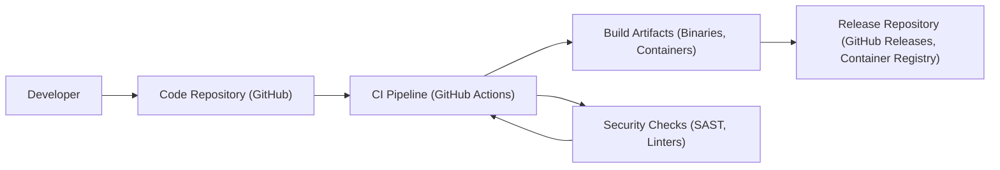

# BUSINESS POSTURE

- Business Priorities and Goals:
  - Provide a secure and private platform for data storage and social networking.
  - Offer users control over their data and privacy in contrast to centralized platforms.
  - Enable decentralized and resilient data storage and sharing.
  - Foster a community around privacy-focused and decentralized technologies.
- Business Risks:
  - Data breaches or security vulnerabilities leading to loss of user trust and data.
  - Privacy violations or misuse of user data, despite privacy-focused design.
  - Platform instability or performance issues due to the decentralized nature.
  - Difficulty in achieving widespread user adoption compared to established centralized platforms.
  - Regulatory compliance challenges related to data privacy and decentralization.
  - Risk of malicious actors exploiting the decentralized network for illegal activities.

# SECURITY POSTURE

- Existing Security Controls:
  - security control End-to-end encryption: Described in project documentation and code, implemented client-side before data is stored or transmitted.
  - security control Decentralized architecture: Inherent to the design, reduces single point of failure and control.
  - security control Access control mechanisms: Implemented within the platform to manage data sharing and permissions, details in code and documentation.
- Accepted Risks:
  - accepted risk Potential vulnerabilities in the codebase due to ongoing development and complexity.
  - accepted risk Reliance on community contributions for security audits and vulnerability discovery.
  - accepted risk Risks associated with decentralized networks, such as Sybil attacks or network partitioning.
- Recommended Security Controls:
  - security control Implement regular security audits and penetration testing by external security experts.
  - security control Integrate automated vulnerability scanning tools into the development pipeline.
  - security control Establish a formal incident response plan to handle security incidents effectively.
  - security control Implement robust logging and monitoring for security-relevant events.
  - security control Conduct security training for developers to promote secure coding practices.
- Security Requirements:
  - Authentication:
    - Requirement: Secure user authentication mechanism to verify user identity and control access to their data and platform features.
    - Details: Should support strong password policies and consider multi-factor authentication options.
  - Authorization:
    - Requirement: Fine-grained authorization controls to manage access to data and functionalities based on user roles and permissions.
    - Details: Implement access control lists (ACLs) or similar mechanisms to define who can access and modify specific data.
  - Input Validation:
    - Requirement: Comprehensive input validation on all user inputs to prevent injection attacks (e.g., XSS, SQL injection, command injection).
    - Details: Validate data on both client-side and server-side, using appropriate encoding and sanitization techniques.
  - Cryptography:
    - Requirement: Strong cryptographic algorithms and protocols for data encryption, secure communication, and key management.
    - Details: Utilize established and well-vetted cryptographic libraries. Ensure proper key generation, storage, and rotation practices.

# DESIGN

## C4 CONTEXT

- Context Diagram Elements:
  - - Name: Users
    - Type: Person
    - Description: Individuals or organizations who use Peergos to store data, share files, and interact socially.
    - Responsibilities: Interact with the Peergos system through web interface or command-line tools, manage their data and privacy settings.
    - Security controls: User-managed passwords, potentially multi-factor authentication in the future, client-side encryption.
  - - Name: Peergos
    - Type: Software System
    - Description: A decentralized, peer-to-peer hypermedia storage and social network platform.
    - Responsibilities: Provide secure and private data storage, facilitate data sharing and social interactions, manage user accounts and permissions, maintain the decentralized network.
    - Security controls: End-to-end encryption, access control mechanisms, decentralized architecture, input validation, secure communication protocols.
  - - Name: Internet
    - Type: Boundary
    - Description: The public internet network that connects users and Peergos nodes.
    - Responsibilities: Provide communication infrastructure for users to access Peergos and for Peergos nodes to communicate with each other.
    - Security controls: TLS/HTTPS for web UI access, network security protocols for P2P communication (details depend on implementation).
  - - Name: DNS System
    - Type: External System
    - Description: Domain Name System used to resolve Peergos domain names to IP addresses.
    - Responsibilities: Translate domain names into IP addresses, enabling users to access Peergos web interface and nodes to discover each other.
    - Security controls: DNSSEC to ensure DNS record integrity (if implemented by domain registrar).

## C4 CONTAINER

- Container Diagram Elements:
  - - Name: Web UI
    - Type: Web Application
    - Description: Client-side web application built with technologies like React or similar, providing user interface to interact with Peergos.
    - Responsibilities: User interaction, data presentation, client-side input validation, communication with Backend API.
    - Security controls: Client-side input validation, secure coding practices, protection against XSS and CSRF, HTTPS for communication.
  - - Name: Backend API
    - Type: Application
    - Description: Server-side application, likely written in Go (based on repository), handling business logic, API endpoints, and interaction with decentralized storage.
    - Responsibilities: User authentication and authorization, API request processing, data management, interaction with decentralized storage, enforcing security policies.
    - Security controls: Server-side input validation, secure API design, authorization checks, rate limiting, secure communication with storage, logging and monitoring.
  - - Name: Decentralized Storage
    - Type: Data Store
    - Description: Peer-to-peer storage network where user data is stored in a distributed and encrypted manner across multiple nodes.
    - Responsibilities: Securely store and retrieve data, manage data replication and redundancy, enforce access control policies, participate in the P2P network.
    - Security controls: End-to-end encryption, data integrity checks, access control mechanisms, secure P2P communication protocols, resistance to data loss and censorship.

## DEPLOYMENT

- Deployment Diagram Elements:
  - - Name: User Device
    - Type: Infrastructure
    - Description: User's personal computer, laptop, or server where a Peergos node instance is running.
    - Responsibilities: Host and run a Peergos node, contribute to the decentralized storage network, provide resources (storage, bandwidth, compute).
    - Security controls: Operating system security, firewall, user-managed security configurations, physical security of the device.
  - - Name: Peergos Node Instance
    - Type: Software Instance
    - Description: A running instance of the Peergos node software on a user's device.
    - Responsibilities: Execute Peergos node software, manage local data storage, communicate with other nodes in the P2P network, serve user requests.
    - Security controls: Software security controls of Peergos node application, secure configuration, process isolation.
  - - Name: Internet
    - Type: Network
    - Description: The public internet connecting user devices and Peergos nodes.
    - Responsibilities: Provide network connectivity for communication between user browsers and Peergos nodes, and between Peergos nodes in the P2P network.
    - Security controls: Network security protocols (TCP/IP), potential use of VPNs or other network security measures by users.
  - - Name: Peergos P2P Network
    - Type: Environment
    - Description: The decentralized network formed by all running Peergos nodes.
    - Responsibilities: Collectively store and manage data, maintain network connectivity and resilience, facilitate data sharing and social interactions.
    - Security controls: P2P protocol security, network-level security mechanisms (depending on protocol), distributed denial-of-service (DDoS) mitigation strategies.

## BUILD

- Build Process Elements:
  - - Name: Developer
    - Type: Person
    - Description: Software developers who write and maintain the Peergos codebase.
    - Responsibilities: Write code, commit changes to the code repository, participate in code reviews, fix bugs and security vulnerabilities.
    - Security controls: Secure development practices, code review process, access control to code repository, developer training.
  - - Name: Code Repository (GitHub)
    - Type: System
    - Description: Git repository hosted on GitHub, used for version control and collaboration on the Peergos codebase.
    - Responsibilities: Store source code, track changes, manage branches and releases, facilitate collaboration among developers.
    - Security controls: Access control to repository, branch protection rules, audit logs, vulnerability scanning of dependencies (GitHub Dependabot).
  - - Name: CI Pipeline (GitHub Actions)
    - Type: Automation System
    - Description: Continuous Integration pipeline implemented using GitHub Actions, automating the build, test, and security check processes.
    - Responsibilities: Automate build process, run unit and integration tests, perform security checks (SAST, linters), generate build artifacts.
    - Security controls: Secure CI/CD configuration, access control to CI/CD workflows, secrets management, security scanning tools integration, build process isolation.
  - - Name: Security Checks (SAST, Linters)
    - Type: Security Tool
    - Description: Static Application Security Testing (SAST) tools and code linters integrated into the CI pipeline to automatically detect potential security vulnerabilities and code quality issues.
    - Responsibilities: Analyze source code for security flaws and coding style violations, provide feedback to developers, prevent vulnerable code from being deployed.
    - Security controls: Configuration of SAST tools and linters, regular updates to tool definitions, integration with CI pipeline for automated execution.
  - - Name: Build Artifacts (Binaries, Containers)
    - Type: Software Artifact
    - Description: Compiled binaries and container images produced by the CI pipeline, ready for distribution and deployment.
    - Responsibilities: Package the application for distribution, provide runnable artifacts for users and deployment environments.
    - Security controls: Signing of build artifacts, integrity checks, provenance tracking, vulnerability scanning of container images.
  - - Name: Release Repository (GitHub Releases, Container Registry)
    - Type: Artifact Repository
    - Description: Repository for storing and distributing released build artifacts, such as GitHub Releases for binaries and container registry for container images.
    - Responsibilities: Store and distribute build artifacts, manage releases, provide access to users for downloading and deploying Peergos.
    - Security controls: Access control to release repository, integrity checks of artifacts, secure distribution channels (HTTPS), version control of releases.

# RISK ASSESSMENT

- Critical Business Processes:
  - User data storage and retrieval: Ensuring data availability, integrity, and confidentiality is paramount.
  - User authentication and authorization: Securely verifying user identities and controlling access to data and features.
  - Data sharing and social interactions: Maintaining privacy and security during data sharing and communication between users.
  - Platform availability and resilience: Ensuring the platform remains operational and accessible to users.
- Data Sensitivity:
  - User data stored in Peergos is highly sensitive. It includes personal files, private communications, and potentially other personal information.
  - Data sensitivity level is high, requiring strong confidentiality, integrity, and availability protections. Unauthorized access, modification, or loss of this data could have significant negative consequences for users.

# QUESTIONS & ASSUMPTIONS

- BUSINESS POSTURE:
  - Question: What is the target user base for Peergos? Is it primarily individuals, organizations, or specific sectors?
  - Assumption: Target user base includes privacy-conscious individuals and organizations seeking decentralized and secure data storage and social networking solutions.
  - Question: What is the monetization strategy for Peergos?
  - Assumption: Monetization strategy is still under development or relies on community support and potentially premium features or services in the future.
  - Question: What are the specific regulatory compliance requirements for Peergos, especially regarding data privacy (e.g., GDPR, CCPA)?
  - Assumption: Peergos aims to be compliant with relevant data privacy regulations by design, but specific compliance measures need to be further defined and implemented.
- SECURITY POSTURE:
  - Question: Have formal security audits been conducted on Peergos codebase and infrastructure?
  - Assumption: Formal security audits are planned or will be conducted in the future, but may not have been performed extensively yet due to the project stage.
  - Question: Is there a documented incident response plan in place for security incidents?
  - Assumption: An incident response plan is under development or needs to be formalized to ensure effective handling of security incidents.
  - Question: What specific cryptography libraries and algorithms are used for encryption and secure communication?
  - Assumption: Well-established and reputable cryptography libraries are used, but specific details need to be documented and reviewed for best practices.
- DESIGN:
  - Question: What specific database technology is used for metadata and user account management?
  - Assumption: A lightweight or embedded database solution is used for node-local metadata storage, but details need to be confirmed.
  - Question: What are the details of the P2P networking protocol used for node communication and data transfer?
  - Assumption: A secure and efficient P2P protocol is used, but specific protocol details and security mechanisms need to be documented.
  - Question: What are the scalability and performance considerations for the decentralized storage network and the overall platform?
  - Assumption: Scalability and performance are important design considerations, and ongoing development focuses on optimizing these aspects of the platform.