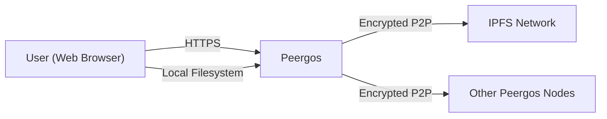
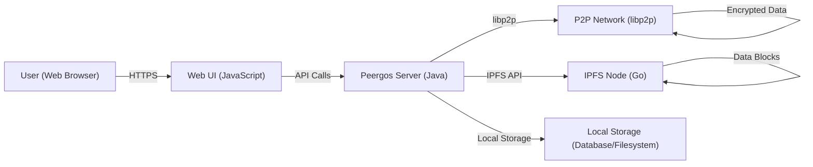
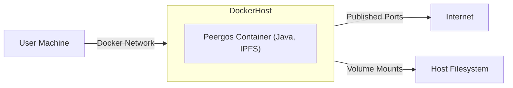
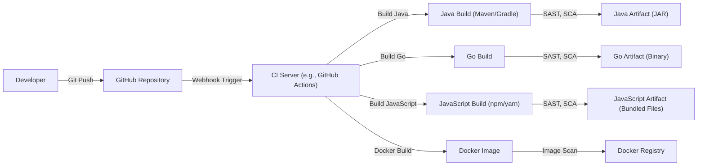

Okay, let's create a detailed design document for the Peergos project, focusing on aspects relevant for threat modeling.

# BUSINESS POSTURE

Peergos aims to provide a secure and private space online, giving users full control over their data. It's a peer-to-peer encrypted filesystem and platform, emphasizing privacy, security, and user sovereignty.  It appears to be targeting individuals and potentially small organizations concerned with data privacy and resisting censorship.  The project is open-source, suggesting a community-driven development model.  Given its nature, it likely has a higher-than-average risk appetite in some areas (e.g., reliance on novel cryptographic techniques) but a very low risk appetite in others (e.g., data breaches, unauthorized access).

Business Priorities:

*   Provide a secure and private online storage solution.
*   Ensure user data confidentiality and integrity.
*   Enable censorship resistance and data availability.
*   Maintain a decentralized and peer-to-peer architecture.
*   Foster a strong open-source community.

Business Goals:

*   Attract users seeking privacy-focused alternatives to mainstream cloud storage.
*   Establish a reputation for robust security and reliability.
*   Grow the developer community and encourage contributions.
*   Potentially explore sustainable funding models without compromising core principles.

Most Important Business Risks:

*   Data breaches or loss of user data due to security vulnerabilities.
*   Compromise of user accounts and unauthorized access to data.
*   Legal or regulatory challenges related to data privacy and content hosting.
*   Scalability issues that hinder performance and user experience.
*   Reputational damage due to security incidents or perceived lack of privacy.
*   Failure to attract and retain users and developers.
*   Malicious attacks, including DDoS, aimed at disrupting the network.

# SECURITY POSTURE

Existing Security Controls (based on the GitHub repository):

*   security control: End-to-end encryption: Data is encrypted client-side before being uploaded to the network. (Implemented in core Peergos code and libraries).
*   security control: Cryptographic access control: Access to data is managed through cryptographic keys. (Implemented in core Peergos code and libraries).
*   security control: Peer-to-peer architecture: Decentralization reduces the risk of single points of failure and censorship. (Fundamental to the Peergos design).
*   security control: Use of established cryptographic libraries: Peergos leverages well-vetted libraries like libp2p and IPFS. (Dependencies listed in project files).
*   security control: Open-source code: Transparency allows for community auditing and vulnerability identification. (The entire project is on GitHub).
*   security control: Sandboxing: Browser-based sandboxing limits the potential impact of vulnerabilities in the web interface. (Implicit in browser-based execution).
*   security control: Regular security audits: The project mentions ongoing security reviews. (Referenced in documentation and community discussions).
*   security control: Data integrity checks: Hashing and Merkle trees are used to ensure data integrity. (Implemented in core Peergos code and libraries).

Accepted Risks:

*   accepted risk: Reliance on user-managed keys: Users are responsible for the security of their private keys. Loss of keys means loss of access to data.
*   accepted risk: Potential for vulnerabilities in underlying libraries: While established libraries are used, they are not immune to vulnerabilities.
*   accepted risk: Performance limitations of a decentralized network: P2P networks can be slower than centralized solutions.
*   accepted risk: Dependence on community participation: The network's health relies on a sufficient number of active peers.
*   accepted risk: Evolving threat landscape: New attack vectors and vulnerabilities may emerge over time.

Recommended Security Controls:

*   Formal threat modeling: Conduct regular, structured threat modeling exercises.
*   Static Application Security Testing (SAST): Integrate SAST tools into the build process.
*   Dynamic Application Security Testing (DAST): Perform regular DAST scans on running instances.
*   Software Composition Analysis (SCA): Use SCA tools to identify and manage vulnerabilities in third-party dependencies.
*   Bug bounty program: Incentivize external security researchers to find and report vulnerabilities.
*   Two-factor authentication (2FA): Implement 2FA for user accounts, even if they are primarily key-based.
*   Intrusion Detection System (IDS): Deploy an IDS to monitor network traffic for malicious activity.

Security Requirements:

*   Authentication:
    *   Users must be authenticated using strong cryptographic keys.
    *   Support for hardware security keys (e.g., YubiKey) should be considered.
    *   Session management must be secure, preventing session hijacking and fixation.

*   Authorization:
    *   Access control must be enforced at the object level, ensuring users can only access data they are authorized to view or modify.
    *   The principle of least privilege should be applied, granting users only the minimum necessary permissions.
    *   Sharing mechanisms must be cryptographically secure and granular.

*   Input Validation:
    *   All user-supplied input must be validated to prevent injection attacks (e.g., XSS, command injection).
    *   File uploads must be carefully scrutinized to prevent the upload of malicious files.
    *   Data sanitization should be applied where appropriate.

*   Cryptography:
    *   Only strong, well-vetted cryptographic algorithms and libraries should be used.
    *   Key management must be secure, protecting private keys from unauthorized access.
    *   Cryptographic operations must be performed correctly, avoiding common pitfalls (e.g., weak random number generation).
    *   Regularly review and update cryptographic practices to address emerging threats and best practices.

# DESIGN

## C4 CONTEXT

Element Descriptions:

*   Element:
    *   Name: User (Web Browser)
    *   Type: Person
    *   Description: A person interacting with Peergos through a web browser.
    *   Responsibilities: Initiates file uploads/downloads, manages their account, interacts with the Peergos interface.
    *   Security controls: Browser sandboxing, HTTPS for secure communication.

*   Element:
    *   Name: Peergos
    *   Type: Software System
    *   Description: The Peergos application, providing a secure and private file storage and sharing platform.
    *   Responsibilities: Manages user authentication, encryption/decryption, data storage and retrieval, peer-to-peer communication.
    *   Security controls: End-to-end encryption, cryptographic access control, data integrity checks.

*   Element:
    *   Name: IPFS Network
    *   Type: External System
    *   Description: The InterPlanetary File System (IPFS) network, used for decentralized data storage.
    *   Responsibilities: Provides a distributed hash table (DHT) for locating content, facilitates peer-to-peer data transfer.
    *   Security controls: Relies on IPFS's built-in security mechanisms (content addressing, data integrity).

*   Element:
    *   Name: Other Peergos Nodes
    *   Type: Software System
    *   Description: Other instances of the Peergos application running on different machines.
    *   Responsibilities: Participate in the peer-to-peer network, store and serve data, contribute to network resilience.
    *   Security controls: Same as the main Peergos instance.

*  Element:
    *   Name: Local Filesystem
    *   Type: External System
    *   Description: User local file storage.
    *   Responsibilities: Provides files for upload to Peergos.
    *   Security controls: Operating system access control.

## C4 CONTAINER

Element Descriptions:

*   Element:
    *   Name: User (Web Browser)
    *   Type: Person
    *   Description: A person interacting with Peergos through a web browser.
    *   Responsibilities: Initiates file uploads/downloads, manages their account, interacts with the Peergos interface.
    *   Security controls: Browser sandboxing, HTTPS for secure communication.

*   Element:
    *   Name: Web UI (JavaScript)
    *   Type: Container: Web Application
    *   Description: The user interface running in the user's web browser.
    *   Responsibilities: Handles user interaction, displays data, communicates with the Peergos server.
    *   Security controls: Browser sandboxing, input validation, secure communication with the server.

*   Element:
    *   Name: Peergos Server (Java)
    *   Type: Container: Application
    *   Description: The core Peergos server application, handling most of the logic.
    *   Responsibilities: User authentication, encryption/decryption, data management, peer-to-peer communication, API handling.
    *   Security controls: End-to-end encryption, cryptographic access control, data integrity checks, secure coding practices.

*   Element:
    *   Name: P2P Network (libp2p)
    *   Type: Container: Network
    *   Description: The peer-to-peer network built using libp2p.
    *   Responsibilities: Facilitates communication between Peergos nodes, manages connections, handles data transfer.
    *   Security controls: Encrypted communication channels, peer identity verification.

*   Element:
    *   Name: IPFS Node (Go)
    *   Type: Container: Application
    *   Description: An instance of the IPFS daemon, used for underlying data storage and retrieval.
    *   Responsibilities: Stores and retrieves data blocks, participates in the IPFS network.
    *   Security controls: Relies on IPFS's built-in security mechanisms.

*   Element:
    *   Name: Local Storage (Database/Filesystem)
    *   Type: Container: Data Store
    *   Description: Local storage used by the Peergos server for metadata and potentially small files.
    *   Responsibilities: Stores user account information, file metadata, and potentially some data blocks.
    *   Security controls: Access control, encryption at rest (if applicable).

## DEPLOYMENT

Possible Deployment Solutions:

1.  Self-Hosted (Docker): Users can run Peergos on their own servers using Docker.
2.  Self-Hosted (Manual): Users can manually install and configure Peergos on their servers.
3.  Cloud-Hosted (Community Instances): Community members may offer publicly accessible Peergos instances.
4.  Embedded Devices: Peergos could be deployed on embedded devices for local, private storage.

Chosen Solution (for detailed description): Self-Hosted (Docker)

Element Descriptions:

*   Element:
    *   Name: User Machine
    *   Type: Device
    *   Description: The user's computer or server where Docker is running.
    *   Responsibilities: Provides the computing resources for running the Peergos container.
    *   Security controls: Operating system security, firewall.

*   Element:
    *   Name: Docker Host
    *   Type: Server
    *   Description: The machine running the Docker daemon.
    *   Responsibilities: Manages Docker containers, networks, and volumes.
    *   Security controls: Docker security best practices, host operating system security.

*   Element:
    *   Name: Internet
    *   Type: Network
    *   Description: The public internet.
    *   Responsibilities: Connects the Peergos instance to other peers and users.
    *   Security controls: Network firewalls, intrusion detection systems.

*   Element:
    *   Name: Host Filesystem
    *   Type: Data Store
    *   Description: The filesystem of the host machine.
    *   Responsibilities: Provides persistent storage for Peergos data.
    *   Security controls: Operating system access control, disk encryption (if applicable).

*   Element:
    *   Name: Peergos Container (Java, IPFS)
    *   Type: Container
    *   Description: The Docker container running the Peergos server and IPFS node.
    *   Responsibilities: Runs the Peergos application and manages data storage.
    *   Security controls: Container isolation, minimal privileges, regular updates.

*   Element:
     *   Name: Docker Network
     *   Type: Network
     *   Description: Internal Docker network.
     *   Responsibilities: Connects containers.
     *   Security controls: Network isolation.

*   Element:
     *   Name: Published Ports
     *   Type: Network
     *   Description: Ports exposed to external network.
     *   Responsibilities: Allows external access to services inside container.
     *   Security controls: Firewall.

## BUILD

The Peergos build process appears to involve multiple components and languages (Java, Go, JavaScript).  While the repository doesn't explicitly detail a CI/CD pipeline, it's highly recommended to implement one.  The following describes a recommended build process, incorporating security best practices.

Build Process Description:

1.  Developer commits code to the GitHub repository.
2.  A webhook triggers the CI server (e.g., GitHub Actions, Jenkins).
3.  The CI server checks out the code and starts separate build processes for Java, Go, and JavaScript components.
4.  Each build process includes:
    *   Compilation/bundling of the code.
    *   Static Application Security Testing (SAST) to identify vulnerabilities in the source code.
    *   Software Composition Analysis (SCA) to identify vulnerabilities in third-party dependencies.
    *   Linting to enforce code style and identify potential errors.
5.  If all checks pass, build artifacts (JAR, binary, bundled files) are created.
6.  A Docker image is built, incorporating the build artifacts.
7.  The Docker image is scanned for vulnerabilities.
8.  The Docker image is pushed to a Docker registry.

Security Controls in Build Process:

*   Automated builds: Ensure consistent and reproducible builds.
*   SAST: Identify vulnerabilities in the source code.
*   SCA: Identify vulnerabilities in third-party dependencies.
*   Linting: Enforce code style and identify potential errors.
*   Docker image scanning: Identify vulnerabilities in the container image.
*   Signed commits: Verify the integrity and authenticity of code changes.
*   Least privilege: Build processes should run with minimal necessary permissions.

# RISK ASSESSMENT

Critical Business Processes:

*   User data storage and retrieval: Ensuring users can securely store and access their data.
*   User authentication and authorization: Protecting user accounts and preventing unauthorized access.
*   Peer-to-peer communication: Maintaining a secure and reliable network for data transfer.
*   Data integrity and availability: Preventing data loss or corruption and ensuring data is accessible to users.

Data Sensitivity:

*   User files: Highly sensitive, as they can contain any type of personal or confidential information.
*   User account metadata: Moderately sensitive, as it can include usernames, email addresses (if used), and public keys.
*   File metadata: Moderately sensitive, as it can reveal information about the files being stored (e.g., filenames, sizes, timestamps).
*   Network metadata: Less sensitive, but can potentially be used to infer information about user activity.

# QUESTIONS & ASSUMPTIONS

Questions:

*   What specific cryptographic algorithms are used for encryption and key management?
*   What is the process for handling security vulnerabilities reported by the community or discovered internally?
*   Are there any plans for formal security certifications (e.g., SOC 2, ISO 27001)?
*   What are the specific mechanisms for data recovery in case of node failures or data loss?
*   How are users educated about security best practices, such as key management and phishing prevention?
*   What is the long-term sustainability plan for the project, including funding and development resources?
*   Are there any plans to support multi-factor authentication?
*   How is GDPR compliance handled?
*   How is DMCA compliance handled?

Assumptions:

*   BUSINESS POSTURE: The project prioritizes user privacy and security above all else.
*   BUSINESS POSTURE: The project aims to be a viable alternative to centralized cloud storage providers.
*   SECURITY POSTURE: Users are technically savvy and understand the risks associated with managing their own keys.
*   SECURITY POSTURE: The development team follows secure coding practices and regularly reviews the codebase for vulnerabilities.
*   DESIGN: The IPFS network is reliable and provides sufficient performance for data storage and retrieval.
*   DESIGN: The Peergos server is designed to be scalable and resilient to node failures.
*   DESIGN: The Docker deployment model is the primary method for users to run Peergos.
*   DESIGN: Build process is automated.