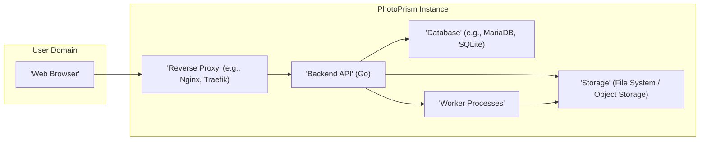
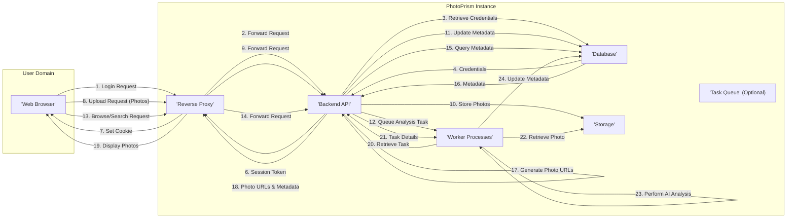

# Project Design Document: PhotoPrism

**Version:** 1.1
**Date:** October 26, 2023
**Author:** AI Software Architect

## 1. Introduction

This document provides a detailed design overview of the PhotoPrism project, an AI-powered photo management application as found on GitHub ([https://github.com/photoprism/photoprism](https://github.com/photoprism/photoprism)). This document aims to clearly articulate the system's architecture, components, data flow, and key technologies. It will serve as the foundation for subsequent threat modeling activities.

### 1.1. Purpose

The primary purpose of this document is to provide a comprehensive technical description of PhotoPrism's architecture and functionality. This will enable security professionals and developers to understand the system's inner workings and identify potential security vulnerabilities.

### 1.2. Scope

This document covers the core components and functionalities of PhotoPrism, including:

*   User interface and user interaction.
*   Backend API and core logic, including specific functional areas.
*   Database interactions and data storage, detailing data types.
*   Media processing and indexing pipelines.
*   Authentication and authorization mechanisms, including different user roles.
*   Key external dependencies and integrations.

### 1.3. Target Audience

This document is intended for:

*   Security engineers and architects performing threat modeling and security assessments.
*   Developers contributing to the PhotoPrism project, both frontend and backend.
*   Operations teams responsible for deploying, maintaining, and monitoring PhotoPrism instances.

## 2. System Overview

PhotoPrism is a self-hosted photo management application that leverages AI for features like face recognition, object detection, and automatic tagging. It allows users to organize, browse, search, and share their photos and videos.

### 2.1. High-Level Architecture

The system follows a multi-tier web application architecture, consisting of a frontend user interface, a backend API, a database for persistent storage, and worker processes for asynchronous tasks. A reverse proxy handles external access and security.

### 2.2. Key Components

*   **Web Browser:** The user interface through which users interact with PhotoPrism, providing features for browsing, searching, uploading, and managing media.
*   **Reverse Proxy:** Handles all incoming requests to the PhotoPrism instance, responsible for SSL/TLS termination, routing, and potentially security features like rate limiting and request filtering.
*   **Backend API:** The core application logic, implemented in Go, responsible for:
    *   User authentication and authorization.
    *   Handling API requests for media management, album creation, and user settings.
    *   Interacting with the database for data persistence.
    *   Managing and queuing tasks for worker processes.
    *   Implementing business logic for features like sharing and search.
*   **Database:** Stores persistent application data, including:
    *   User accounts and authentication credentials (hashed passwords).
    *   Photo and video metadata (EXIF data, location, date, tags, detected faces and objects).
    *   Album information and relationships between media.
    *   Application configuration settings.
*   **Storage:** The persistent storage location for the actual photo and video files. This can be the local file system, a network-attached storage (NAS), or cloud-based object storage (e.g., AWS S3, Google Cloud Storage).
*   **Worker Processes:** Execute background and asynchronous tasks, including:
    *   Importing new media files from configured sources.
    *   Generating thumbnails and previews in various sizes and formats.
    *   Performing AI-powered analysis on media (face recognition, object detection, geotagging, content classification).
    *   Indexing media metadata for efficient search functionality.

## 3. Component Details

### 3.1. Web Browser

*   **Functionality:** Provides the user interface for all user interactions with PhotoPrism. This includes:
    *   Displaying photo and video galleries.
    *   Searching and filtering media.
    *   Uploading new media files.
    *   Creating and managing albums.
    *   Configuring user settings.
*   **Technology:** Built using standard web technologies: HTML, CSS, and JavaScript. Likely utilizes a modern JavaScript framework like React or Vue.js for a dynamic user experience.
*   **Security Considerations:**
    *   Susceptible to client-side vulnerabilities such as Cross-Site Scripting (XSS) if the application doesn't properly sanitize data displayed to the user.
    *   Relies on the backend API for secure authentication and authorization; vulnerabilities in the API can be exploited through the frontend.
    *   Sensitive data should not be stored persistently in the browser's local storage without proper encryption.

### 3.2. Reverse Proxy

*   **Functionality:** Acts as the entry point for all external requests to the PhotoPrism instance. Key responsibilities include:
    *   SSL/TLS termination, ensuring encrypted communication.
    *   Routing incoming requests to the appropriate backend service.
    *   Potentially load balancing traffic across multiple backend API instances for scalability.
    *   Implementing security policies such as rate limiting, request filtering, and basic authentication.
*   **Technology:** Common choices include Nginx, Apache HTTP Server, and Traefik. Configuration is crucial for security.
*   **Security Considerations:**
    *   Misconfiguration can lead to vulnerabilities, such as bypassing security controls or exposing internal services.
    *   Improper SSL/TLS configuration can lead to man-in-the-middle attacks.
    *   Vulnerabilities in the reverse proxy software itself need to be addressed through regular updates.

### 3.3. Backend API

*   **Functionality:** Implements the core business logic and API endpoints for PhotoPrism. Key functionalities include:
    *   **User Management:** Handling user registration, login, password management, and profile settings.
    *   **Authentication and Authorization:** Verifying user credentials and enforcing access control policies based on user roles and permissions.
    *   **Media Management:** Providing endpoints for uploading, retrieving, updating, and deleting photos and videos.
    *   **Album Management:** Allowing users to create, manage, and share albums.
    *   **Search and Filtering:** Implementing search functionality based on metadata, tags, and AI-detected attributes.
    *   **AI Task Management:** Queuing and managing tasks for worker processes to perform AI analysis.
    *   **Configuration Management:** Providing endpoints for managing application settings.
*   **Technology:** Primarily written in Go. Likely utilizes frameworks for routing (e.g., Gin, Echo), data serialization (e.g., JSON), and database interaction (e.g., GORM, sqlx).
*   **Security Considerations:**
    *   Vulnerable to common web application vulnerabilities:
        *   **Authentication and Authorization Flaws:** Weak password policies, insecure session management, privilege escalation.
        *   **Injection Attacks:** SQL injection, command injection if input is not properly sanitized.
        *   **Insecure Direct Object References (IDOR):** Allowing access to resources without proper authorization checks.
        *   **Cross-Site Request Forgery (CSRF):** Exploiting trust in authenticated users.
        *   **Exposure of Sensitive Data:** Not properly handling or masking sensitive information in logs or responses.
        *   **Mass Assignment Vulnerabilities:** Allowing users to modify unintended data fields.

### 3.4. Database

*   **Functionality:** Provides persistent storage for application data. Stores:
    *   User credentials (hashed passwords, salts).
    *   User profiles and settings.
    *   Detailed metadata for each photo and video (file paths, EXIF data, timestamps, GPS coordinates, detected faces, objects, tags).
    *   Relationships between media and albums.
    *   Application configuration parameters.
*   **Technology:** Supports various relational database systems, including MariaDB and SQLite. The choice of database impacts scalability and features.
*   **Security Considerations:**
    *   **SQL Injection:** If the backend API doesn't properly sanitize user input before constructing database queries.
    *   **Unauthorized Access:** If database credentials are compromised or access controls are not properly configured.
    *   **Data Breaches:** If the database is not properly secured (encryption at rest and in transit).
    *   **Backup and Recovery:** Lack of proper backup and recovery mechanisms can lead to data loss.

### 3.5. Storage

*   **Functionality:** Stores the actual binary data of the uploaded photos and videos.
*   **Technology:** Can be implemented using:
    *   **Local File System:** Simple to set up but may have limitations in scalability and redundancy.
    *   **Network-Attached Storage (NAS):** Provides more scalability and redundancy compared to local storage.
    *   **Object Storage (e.g., AWS S3, Google Cloud Storage):** Highly scalable and durable cloud-based storage solutions.
*   **Security Considerations:**
    *   **Unauthorized Access:** If file system or object storage permissions are not correctly configured, leading to potential data breaches.
    *   **Data Loss:** Due to hardware failures or lack of proper backups.
    *   **Path Traversal Vulnerabilities:** If the backend API doesn't properly sanitize file paths, attackers might be able to access files outside the intended storage directory.
    *   **Data Integrity:** Ensuring the integrity of stored media through checksums or other mechanisms.

### 3.6. Worker Processes

*   **Functionality:** Execute computationally intensive and time-consuming tasks asynchronously, offloading the backend API and improving responsiveness. Key tasks include:
    *   **Media Import:** Processing newly uploaded files, extracting metadata, and generating initial previews.
    *   **Thumbnail Generation:** Creating various sizes of thumbnails for efficient browsing.
    *   **AI Analysis:** Utilizing machine learning models for face recognition, object detection, and other content analysis.
    *   **Metadata Indexing:** Creating and updating search indexes for efficient querying.
*   **Technology:** Likely implemented as separate processes or threads managed by a task queue system (e.g., Redis, RabbitMQ) or directly by the backend API. May utilize various open-source libraries for image processing (e.g., OpenCV, ImageMagick) and AI tasks (e.g., TensorFlow, PyTorch).
*   **Security Considerations:**
    *   **Resource Exhaustion:** If not properly managed, worker processes can consume excessive resources, leading to denial of service.
    *   **Vulnerabilities in Third-Party Libraries:** Security flaws in the image processing or AI libraries used by the workers can be exploited.
    *   **Exposure of Sensitive Data During Processing:** Temporary storage of sensitive data during processing needs to be handled securely.
    *   **Task Queue Security:** If a task queue is used, it needs to be secured to prevent unauthorized access or manipulation of tasks.

## 4. Data Flow

The following outlines the typical data flow for key user interactions and background processes:

1. **User Authentication:**
    *   The user submits login credentials (username/password) through the "'Web Browser'".
    *   The "'Reverse Proxy'" forwards the request to the "'Backend API'".
    *   The "'Backend API'" retrieves the user's stored credentials from the "'Database'".
    *   The "'Backend API'" verifies the provided password against the stored hash.
    *   Upon successful authentication, the "'Backend API'" creates a session and returns a session identifier (e.g., a cookie) to the "'Web Browser'" via the "'Reverse Proxy'".

2. **Photo Upload:**
    *   The user selects photos to upload through the "'Web Browser'".
    *   The "'Web Browser'" sends the photo files to the "'Backend API'" via the "'Reverse Proxy'".
    *   The "'Backend API'" receives the files, performs initial validation, and stores them in the "'Storage'".
    *   The "'Backend API'" creates metadata entries for the uploaded photos in the "'Database'".
    *   The "'Backend API'" queues tasks for the "'Worker Processes'" to generate thumbnails and perform AI analysis.

3. **Browsing Photos:**
    *   The user navigates to a photo gallery or performs a search through the "'Web Browser'".
    *   The "'Reverse Proxy'" forwards the request to the "'Backend API'".
    *   The "'Backend API'" queries the "'Database'" for the requested photo metadata.
    *   The "'Backend API'" retrieves the metadata and generates URLs for accessing the photo files from the "'Storage'".
    *   The "'Backend API'" returns the metadata and photo URLs to the "'Web Browser'" via the "'Reverse Proxy'".
    *   The "'Web Browser'" retrieves and displays the photos.

4. **AI Analysis (Background):**
    *   "'Worker Processes'" retrieve queued tasks from the "'Backend API'" or a task queue.
    *   "'Worker Processes'" retrieve the corresponding photo files from the "'Storage'".
    *   "'Worker Processes'" perform AI analysis (e.g., face recognition, object detection) using relevant libraries.
    *   "'Worker Processes'" update the photo metadata in the "'Database'" with the analysis results.

## 5. Security Considerations

This section expands on the initial security considerations, providing more specific examples and potential mitigation strategies.

*   **Authentication and Authorization:**
    *   **Threats:** Brute-force attacks on login, compromised credentials, privilege escalation.
    *   **Mitigations:** Strong password policies, multi-factor authentication (MFA), rate limiting on login attempts, secure session management (HTTP-only, Secure cookies), role-based access control (RBAC).
*   **Input Validation:**
    *   **Threats:** SQL injection, command injection, cross-site scripting (XSS).
    *   **Mitigations:** Sanitize and validate all user-provided input on the backend, use parameterized queries for database interactions, encode output data before rendering in the browser, implement Content Security Policy (CSP).
*   **Output Encoding:**
    *   **Threats:** Cross-site scripting (XSS).
    *   **Mitigations:** Use appropriate encoding techniques (e.g., HTML escaping) when rendering user-generated content or data retrieved from the database in the frontend.
*   **Secure Communication:**
    *   **Threats:** Man-in-the-middle attacks, eavesdropping.
    *   **Mitigations:** Enforce HTTPS for all communication using TLS, ensure proper SSL/TLS configuration on the reverse proxy.
*   **Data Protection:**
    *   **Threats:** Data breaches, unauthorized access to sensitive information.
    *   **Mitigations:** Encrypt sensitive data at rest in the database (e.g., using database encryption features), consider encryption for stored media, use secure key management practices.
*   **Access Control:**
    *   **Threats:** Unauthorized access to the database, storage, or other internal components.
    *   **Mitigations:** Implement the principle of least privilege, restrict access to the database and storage to only authorized components, configure proper file system permissions.
*   **Dependency Management:**
    *   **Threats:** Exploitation of known vulnerabilities in third-party libraries.
    *   **Mitigations:** Regularly update dependencies to the latest versions, use dependency scanning tools to identify vulnerabilities.
*   **Rate Limiting:**
    *   **Threats:** Brute-force attacks, denial-of-service (DoS) attacks.
    *   **Mitigations:** Implement rate limiting on API endpoints, especially authentication endpoints.
*   **Content Security Policy (CSP):**
    *   **Threats:** Cross-site scripting (XSS).
    *   **Mitigations:** Implement a strict CSP to control the resources that the browser is allowed to load.
*   **Regular Security Audits:**
    *   **Threats:** Undiscovered vulnerabilities.
    *   **Mitigations:** Conduct regular security audits and penetration testing to identify and address potential vulnerabilities.

## 6. Deployment Architecture (Typical)

PhotoPrism is commonly deployed using containerization technologies like Docker, often orchestrated with Docker Compose or Kubernetes. A typical deployment might involve:

*   **Reverse Proxy Container:**  Handles external access, SSL termination, and routing (e.g., Nginx).
*   **Backend API Container:** Runs the Go backend application. Multiple instances can be deployed for scalability.
*   **Database Container:**  Runs the chosen database system (e.g., MariaDB). Persistent storage is crucial for this container.
*   **Worker Processes Container(s):**  Run the background worker processes. These can be scaled independently based on workload.
*   **Storage Volume:** A persistent volume mounted to the backend and worker containers for storing the actual photo and video files. This could be a local volume, a network share, or a connection to object storage.
*   **Task Queue Container (Optional):** If a dedicated task queue is used (e.g., Redis, RabbitMQ), a separate container would host this service.

## 7. Technologies Used

*   **Backend Programming Language:** Go
*   **Frontend Technologies:** HTML, CSS, JavaScript, likely a framework like React or Vue.js
*   **Database Systems:** MariaDB, SQLite
*   **Reverse Proxy Servers:** Nginx, Apache HTTP Server, Traefik
*   **Containerization Platform:** Docker
*   **Container Orchestration (Optional):** Docker Compose, Kubernetes
*   **Task Queue (Optional):** Redis, RabbitMQ
*   **Image Processing Libraries (Likely):** OpenCV, ImageMagick
*   **AI/ML Libraries (Likely):** TensorFlow, PyTorch, or Go-based ML libraries

## 8. Diagrams

The diagrams provided throughout this document illustrate the high-level architecture and data flow.

This improved document provides a more detailed and comprehensive overview of the PhotoPrism project's design, offering a stronger foundation for subsequent threat modeling activities.