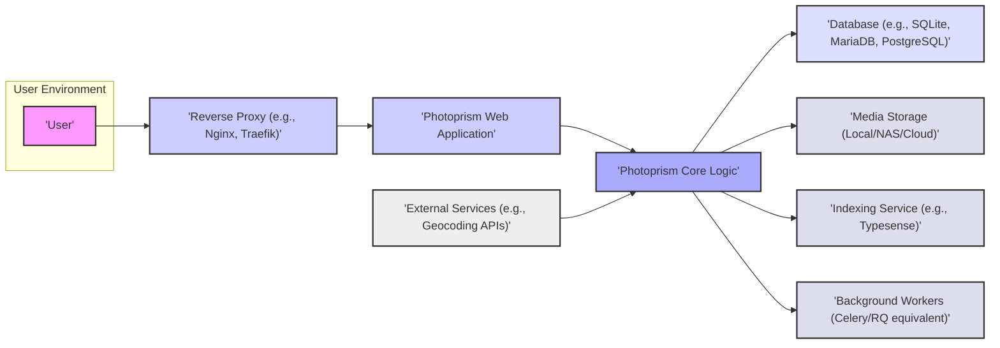
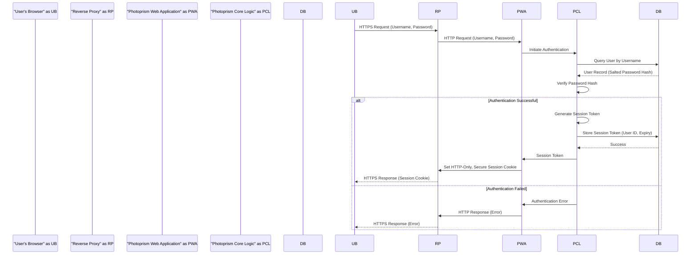
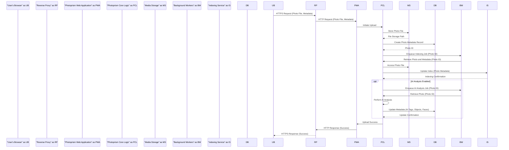
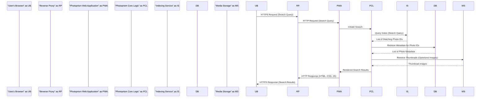

# Project Design Document: Photoprism

**Version:** 1.1
**Date:** October 26, 2023
**Author:** AI Architecture Expert

## 1. Introduction

This document provides an enhanced design overview of the Photoprism project, an AI-powered photo management solution as described in the GitHub repository: [https://github.com/photoprism/photoprism](https://github.com/photoprism/photoprism). This document aims to provide a more detailed outline of the system's architecture, components, data flow, and key technologies, serving as a stronger foundation for future threat modeling activities.

## 2. Goals and Objectives

The primary goals of Photoprism are to:

*   Provide an intuitive and efficient web interface for browsing, organizing, and managing personal photo and video collections.
*   Leverage AI and machine learning for automatic content recognition, tagging, classification, and organization of media.
*   Offer a secure and privacy-focused environment for storing and accessing user media.
*   Enable powerful and flexible searching and filtering of media based on various metadata, including AI-generated tags.
*   Support multi-user environments with robust access control and permission management.
*   Offer extensibility through APIs or plugins for future integrations.

## 3. High-Level Architecture

The following diagram illustrates the high-level architecture of Photoprism:

## 4. Component Details

This section provides a more detailed description of each component identified in the high-level architecture, including potential security considerations.

*   **User:** Represents an authenticated individual interacting with the Photoprism application through a web browser or potentially a mobile application in the future.
    *   **Security Consideration:** User authentication and authorization are critical to ensure only authorized users can access and manage their media.

*   **Reverse Proxy:** A crucial component deployed in front of the Photoprism web application.
    *   **Responsibilities:**
        *   TLS termination (handling HTTPS encryption and decryption).
        *   Load balancing across multiple Photoprism instances for scalability and resilience.
        *   Request routing and filtering based on defined rules.
        *   Basic security measures like request size limits and rate limiting.
    *   **Security Consideration:**  Proper configuration is essential to prevent vulnerabilities like header injection or bypassing security rules.

*   **Photoprism Web Application:** The primary interface for user interaction.
    *   **Responsibilities:**
        *   Handling user authentication and session management.
        *   Receiving and processing user requests from the browser.
        *   Rendering the user interface using HTML, CSS, and JavaScript.
        *   Communicating with the core logic layer via API calls.
    *   **Security Consideration:** Vulnerable to common web application attacks like XSS, CSRF, and session hijacking. Secure coding practices and framework-level security features are crucial.

*   **Photoprism Core Logic:** The central processing unit of the application.
    *   **Responsibilities:**
        *   Managing user accounts, roles, and permissions.
        *   Handling photo and video uploads, downloads, and modifications.
        *   Orchestrating the indexing and AI-powered analysis of media.
        *   Implementing search and filtering functionalities based on metadata.
        *   Interacting with the database, media storage, and indexing service.
        *   Exposing APIs for the web application and potential future integrations.
    *   **Security Consideration:**  Susceptible to business logic flaws, insecure API design, and potential code injection vulnerabilities if input is not properly validated.

*   **Database:** Stores structured metadata about the media and user information.
    *   **Responsibilities:**
        *   Persisting user credentials, media metadata (filenames, dates, locations, tags, AI-generated labels), albums, and configuration settings.
        *   Providing efficient data retrieval for various application functionalities.
        *   Maintaining data integrity and consistency.
    *   **Security Consideration:** Requires secure credential management, access controls to prevent unauthorized access, and potentially encryption at rest for sensitive data. Vulnerable to SQL injection if queries are not properly parameterized.

*   **Media Storage:** The persistent storage location for the actual photo and video files.
    *   **Responsibilities:**
        *   Storing the raw media files uploaded by users.
        *   Providing access to the files for serving to users and processing by background workers.
        *   Maintaining file integrity and availability.
    *   **Security Consideration:**  Requires strict access controls at the operating system level to prevent unauthorized access or modification. Consider encryption at rest for sensitive media.

*   **Indexing Service:**  An optional but highly beneficial component for enabling fast and efficient search.
    *   **Responsibilities:**
        *   Creating and maintaining an index of the media metadata.
        *   Providing a search API for querying the index based on various criteria.
        *   Enabling features like faceted search and suggestions.
    *   **Security Consideration:**  Requires secure communication with the core logic and protection against unauthorized access to the index data.

*   **Background Workers:** Processes that execute asynchronous tasks, offloading work from the main application thread.
    *   **Responsibilities:**
        *   Performing initial indexing of newly uploaded media.
        *   Executing AI-powered analysis tasks (e.g., object recognition, face detection).
        *   Generating thumbnails and previews of media files.
        *   Handling scheduled maintenance tasks and data processing.
    *   **Security Consideration:**  Need appropriate authorization to access resources (database, media storage). Vulnerable to privilege escalation if not properly configured.

*   **External Services:** Optional integrations with external APIs to enhance functionality.
    *   **Examples:**
        *   Geocoding APIs for resolving location data from GPS coordinates.
        *   Reverse image search engines.
    *   **Security Consideration:** Secure API key management and secure communication protocols are essential. Data privacy implications of sharing data with external services need to be considered.

## 5. Data Flow

This section describes the typical flow of data within the Photoprism system for key operations, with more detail.

### 5.1. User Login

### 5.2. Photo Upload and Indexing

### 5.3. Searching Photos

## 6. Security Considerations (Enhanced)

This section elaborates on the security considerations for the Photoprism project.

*   **Authentication and Authorization:**
    *   Employ strong password hashing algorithms (e.g., Argon2).
    *   Implement multi-factor authentication (MFA) for enhanced security.
    *   Use role-based access control (RBAC) to manage user permissions.
    *   Protect against brute-force attacks with rate limiting and account lockout policies.
    *   Securely manage API keys and tokens for external integrations.

*   **Input Validation and Output Encoding:**
    *   Thoroughly validate all user inputs on both the client-side and server-side to prevent injection attacks (SQL injection, XSS, command injection).
    *   Encode output data appropriately based on the context (HTML escaping, URL encoding, etc.) to prevent XSS.

*   **Secure Storage:**
    *   Encrypt sensitive data at rest, including database contents and potentially media files.
    *   Use appropriate file system permissions to restrict access to media storage.
    *   Securely manage database credentials and avoid hardcoding them in the application.

*   **Transport Security:**
    *   Enforce HTTPS for all communication using TLS (at least version 1.2 or higher).
    *   Use HTTP Strict Transport Security (HSTS) to instruct browsers to always use HTTPS.
    *   Secure communication between internal components if deployed across multiple servers.

*   **Dependency Management:**
    *   Regularly update all dependencies (libraries, frameworks) to patch known security vulnerabilities.
    *   Use dependency scanning tools to identify and address vulnerabilities proactively.

*   **Session Management:**
    *   Use secure and HTTP-only cookies for session management.
    *   Implement session timeouts and consider idle timeouts.
    *   Rotate session IDs periodically to mitigate session fixation attacks.

*   **Error Handling and Logging:**
    *   Avoid exposing sensitive information in error messages.
    *   Implement comprehensive logging of security-related events for auditing and incident response.

*   **Content Security Policy (CSP):**
    *   Implement a strict CSP to mitigate the risk of cross-site scripting attacks by controlling the resources the browser is allowed to load.

*   **Cross-Origin Resource Sharing (CORS):**
    *   Configure CORS carefully to allow only authorized origins to access the application's resources.

*   **Regular Security Audits and Penetration Testing:**
    *   Conduct periodic security assessments and penetration testing to identify and address potential vulnerabilities.

## 7. Technology Stack

This section lists the key technologies likely used in the Photoprism project with more specific examples.

*   **Programming Language (Backend):** Go (leveraging its concurrency features and performance)
*   **Web Framework (Backend):**  Likely a Go-based framework such as Gin, Echo, or Fiber.
*   **Frontend Framework:**  Likely a modern JavaScript framework like React, Vue.js, or Svelte for building the user interface.
*   **Database:**
    *   SQLite (for simpler, single-user setups)
    *   MariaDB or MySQL
    *   PostgreSQL (offering robustness and advanced features)
*   **Indexing Service (Optional):** Typesense (a fast, typo-tolerant search engine), Meilisearch, or Elasticsearch.
*   **Reverse Proxy (Optional):** Nginx, Apache HTTP Server, Traefik.
*   **Background Task Queue (Optional):**  Likely something like Celery (if using Python for some background tasks) or a similar Go-based solution or even a simple work queue implementation.
*   **Containerization (Optional):** Docker, Podman for packaging and deploying the application.
*   **Operating System:** Linux (primary target), macOS, Windows (for development and potentially some deployments).

## 8. Deployment Model

Photoprism offers flexibility in deployment options:

*   **Standalone (Bare Metal):** All components (web application, database, indexing service) deployed directly on a single server or virtual machine. This is suitable for smaller deployments or personal use. Requires manual configuration and management of all components.
*   **Containerized (Docker/Podman):** Components are packaged as Docker containers, simplifying deployment and management. Orchestration tools like Docker Compose or Kubernetes can be used for managing multi-container deployments. This model offers better portability and scalability.
*   **Cloud Deployment:** Leveraging cloud platforms like AWS, Azure, or GCP.
    *   **Infrastructure as a Service (IaaS):** Deploying virtual machines and manually configuring the application and its dependencies.
    *   **Platform as a Service (PaaS):** Utilizing managed services for databases (e.g., AWS RDS, Azure Database), container orchestration (e.g., AWS ECS, Azure Kubernetes Service), and storage (e.g., AWS S3, Azure Blob Storage). This reduces operational overhead.
*   **NAS (Network Attached Storage) Deployment:** Some NAS devices offer the capability to run Docker containers, allowing for deployment within a home network environment.

## 9. Non-Functional Requirements

These are important considerations for the overall quality and usability of Photoprism.

*   **Performance:** The system should be responsive and provide quick loading times for browsing and searching media. Efficient indexing and optimized database queries are crucial.
*   **Scalability:** The architecture should be able to handle increasing amounts of media and user traffic. This may involve scaling the web application, database, and indexing service independently.
*   **Reliability:** The system should be reliable and available, minimizing downtime. Redundancy and proper error handling are important.
*   **Maintainability:** The codebase should be well-structured and documented to facilitate maintenance and updates.
*   **Usability:** The user interface should be intuitive and easy to use for managing and browsing media.

## 10. Operational Considerations

These aspects are important for the day-to-day running of Photoprism.

*   **Monitoring:** Implement monitoring tools to track system performance, resource utilization, and error rates.
*   **Logging:** Maintain comprehensive logs for debugging, auditing, and security analysis.
*   **Backup and Recovery:** Implement a robust backup and recovery strategy for the database and media files to prevent data loss.
*   **Updates and Maintenance:**  Establish a process for applying security patches and updating the application and its dependencies.

## 11. Future Considerations

*   **Mobile Applications:** Development of native mobile applications for iOS and Android to provide a more integrated mobile experience.
*   **Enhanced AI Features:** Integrating more advanced AI models for tasks like scene understanding, event recognition, and improved object detection.
*   **Federation and Sharing:**  Implementing features to securely share albums or individual photos with other users or platforms.
*   **Plugin Architecture:** Developing a plugin system to allow for extending the functionality of Photoprism.

This enhanced design document provides a more comprehensive and detailed understanding of the Photoprism project, offering a stronger foundation for subsequent threat modeling and security analysis.