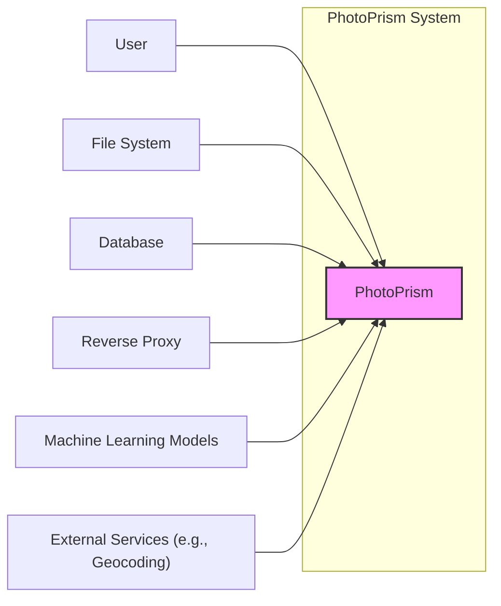
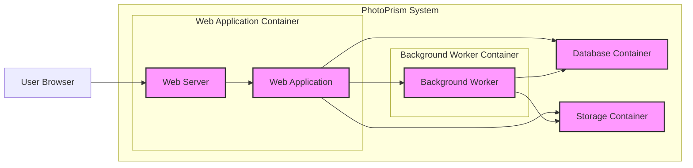
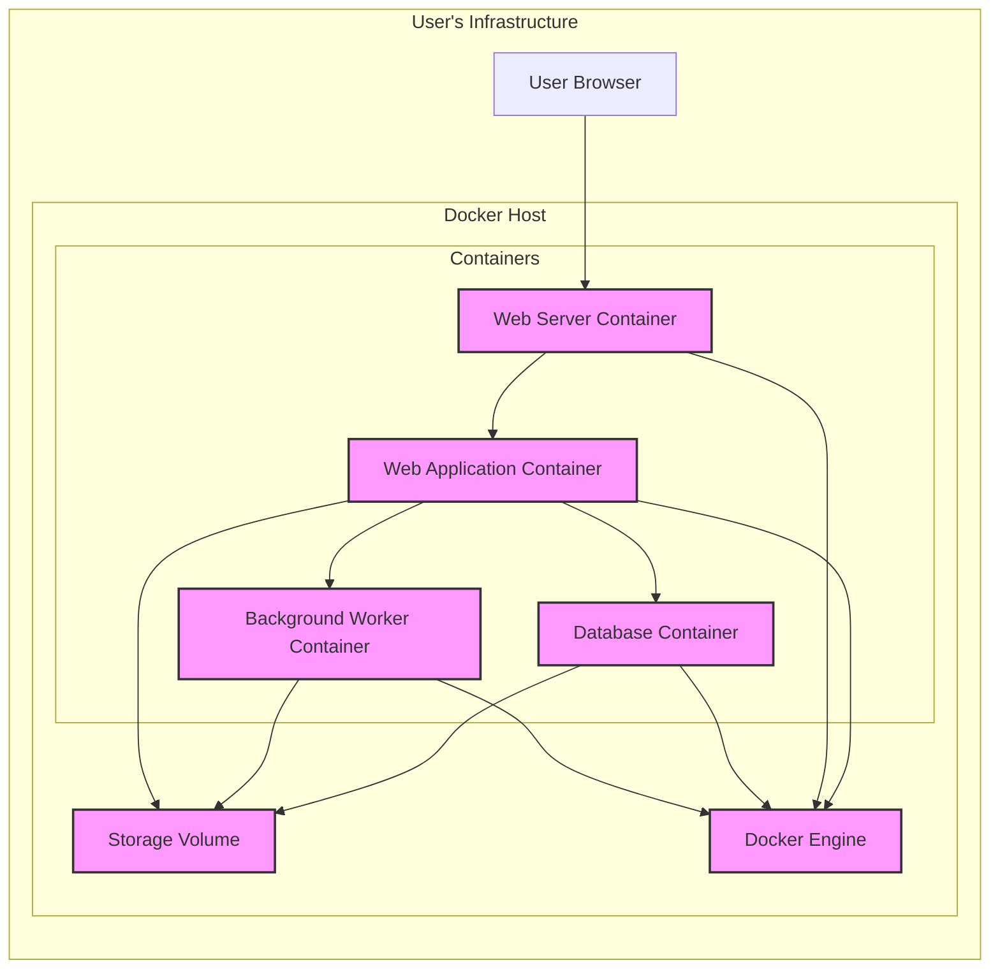
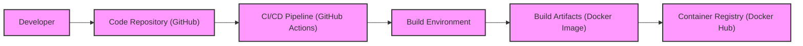

# BUSINESS POSTURE

- Business Priorities and Goals:
  - Goal: Provide users with a self-hosted, AI-powered photo management solution.
  - Priority: User privacy and data ownership, offering an alternative to cloud-based photo services.
  - Priority: Ease of use and setup for non-technical users.
  - Priority: Feature richness, including AI-powered tagging, face recognition, and organization.
  - Priority: Performance and scalability for large photo libraries.

- Business Risks:
  - Risk: Data loss due to software bugs, hardware failures, or user error.
  - Risk: Unauthorized access to user photos and personal data.
  - Risk: Reputational damage due to security vulnerabilities or privacy breaches.
  - Risk: Complexity of self-hosting leading to user frustration and abandonment.
  - Risk: Dependence on open-source community for maintenance and security updates.

# SECURITY POSTURE

- Existing Security Controls:
  - security control: HTTPS encryption for web traffic (implementation detail depends on user setup, assumed best practice).
  - security control: Password-based authentication for user accounts (implementation in the application code).
  - security control: Session management to maintain user login state (implementation in the application code).
  - security control: Input validation on user-provided data (implementation in the application code, needs further investigation).
  - security control: Docker image distribution (if using Docker deployment, on Docker Hub or similar).
  - security control: Regular software updates from upstream dependencies (responsibility of maintainers and users).
  - accepted risk: Reliance on user's infrastructure security (OS, network, hardware).
  - accepted risk: Vulnerabilities in third-party libraries and dependencies.
  - accepted risk: Security misconfigurations by users during self-hosting.

- Recommended Security Controls:
  - security control: Implement robust input validation and sanitization to prevent injection attacks.
  - security control: Regularly perform security audits and penetration testing.
  - security control: Implement Content Security Policy (CSP) to mitigate XSS attacks.
  - security control: Implement rate limiting to protect against brute-force attacks.
  - security control: Consider implementing two-factor authentication (2FA) for enhanced account security.
  - security control: Provide clear security guidelines and best practices for self-hosting users.
  - security control: Automate dependency scanning and vulnerability checks in the build process.

- Security Requirements:
  - Authentication:
    - requirement: Secure password-based authentication for user access.
    - requirement: Option for administrators to manage user accounts.
    - requirement: Consider integration with external authentication providers (e.g., OAuth 2.0, LDAP) for future enhancement.
  - Authorization:
    - requirement: Role-based access control (RBAC) to manage user permissions (e.g., admin, user, read-only).
    - requirement: Ensure users can only access their own photos and data, unless explicitly shared.
    - requirement: Implement proper authorization checks before performing any data modification or access.
  - Input Validation:
    - requirement: Validate all user inputs on both client-side and server-side.
    - requirement: Sanitize user inputs to prevent injection attacks (SQL injection, XSS, command injection).
    - requirement: Use parameterized queries or ORM to prevent SQL injection.
    - requirement: Implement proper file upload validation to prevent malicious file uploads.
  - Cryptography:
    - requirement: Use HTTPS for all communication to protect data in transit.
    - requirement: Securely store user passwords using strong hashing algorithms (e.g., bcrypt, Argon2).
    - requirement: Consider encryption for sensitive data at rest (e.g., database encryption, photo storage encryption) as an optional feature.
    - requirement: Ensure proper handling of cryptographic keys and secrets.

# DESIGN

- C4 CONTEXT

- C4 CONTEXT Elements:
  - Element:
    - Name: User
    - Type: Person
    - Description: Individuals who use PhotoPrism to manage and organize their photos.
    - Responsibilities: Uploading photos, browsing photos, organizing albums, searching for photos, configuring settings.
    - Security controls: Strong passwords, account security best practices, browser security controls.
  - Element:
    - Name: PhotoPrism
    - Type: Software System
    - Description: The self-hosted photo management application that provides features for organizing, tagging, and browsing photos using AI.
    - Responsibilities: Managing user accounts, processing and indexing photos, providing a web interface, interacting with storage and database, applying AI models.
    - Security controls: Authentication, authorization, input validation, secure session management, HTTPS, secure configuration.
  - Element:
    - Name: File System
    - Type: External System
    - Description: Local or network file system where user's photos are stored. PhotoPrism accesses this file system to read and process photos.
    - Responsibilities: Storing photo files, providing access to photo files for PhotoPrism.
    - Security controls: File system permissions, access control lists (ACLs), encryption at rest (optional, depending on user setup).
  - Element:
    - Name: Database
    - Type: External System
    - Description: Database system (e.g., MySQL, MariaDB, PostgreSQL) used by PhotoPrism to store metadata, user information, and configuration.
    - Responsibilities: Storing structured data for PhotoPrism, providing data persistence.
    - Security controls: Database access controls, database authentication, encryption at rest (optional, depending on database setup), regular backups.
  - Element:
    - Name: Reverse Proxy
    - Type: External System
    - Description: Optional reverse proxy (e.g., Nginx, Apache) that can be placed in front of PhotoPrism to handle HTTPS termination, load balancing, and other web server functionalities.
    - Responsibilities: Handling incoming web requests, forwarding requests to PhotoPrism, managing SSL/TLS certificates, providing additional security features (e.g., rate limiting, WAF).
    - Security controls: HTTPS configuration, access controls, web application firewall (WAF) rules, rate limiting, security hardening.
  - Element:
    - Name: Machine Learning Models
    - Type: External System
    - Description: Pre-trained machine learning models used by PhotoPrism for image recognition, tagging, and other AI features. These models might be bundled with PhotoPrism or downloaded separately.
    - Responsibilities: Providing AI capabilities for photo analysis.
    - Security controls: Model integrity checks (to ensure models are not tampered with), secure model loading and execution.
  - Element:
    - Name: External Services (e.g., Geocoding)
    - Type: External System
    - Description: Optional external services that PhotoPrism might interact with, such as geocoding services to retrieve location information for photos.
    - Responsibilities: Providing supplementary data and functionalities to PhotoPrism.
    - Security controls: Secure API communication (HTTPS), API key management, input validation of data received from external services.

- C4 CONTAINER

- C4 CONTAINER Elements:
  - Element:
    - Name: Web Server
    - Type: Container
    - Description: Handles incoming HTTP requests, serves static files, and proxies requests to the Web Application. Examples: Nginx, Apache, or Go's built-in HTTP server.
    - Responsibilities: Web request handling, TLS termination, static file serving, reverse proxying.
    - Security controls: HTTPS configuration, web server hardening, rate limiting, request filtering, security updates.
  - Element:
    - Name: Web Application
    - Type: Container
    - Description: The core application logic written in Go, responsible for handling user requests, business logic, API endpoints, and interacting with other containers.
    - Responsibilities: User authentication and authorization, input validation, business logic execution, data processing, API endpoint implementation, interaction with database and storage.
    - Security controls: Authentication, authorization, input validation, secure coding practices, session management, vulnerability scanning, secure configuration.
  - Element:
    - Name: Background Worker
    - Type: Container
    - Description: Processes background tasks asynchronously, such as photo indexing, AI processing, and thumbnail generation. This could be implemented using job queues or similar mechanisms.
    - Responsibilities: Asynchronous task processing, photo indexing, AI processing, thumbnail generation, queue management.
    - Security controls: Secure task processing, input validation for tasks, access control to task queues, monitoring and logging.
  - Element:
    - Name: Database Container
    - Type: Container
    - Description: Database system (e.g., MySQL, MariaDB, PostgreSQL) running in a container, used for persistent data storage.
    - Responsibilities: Persistent data storage, data retrieval, data integrity.
    - Security controls: Database access controls, database authentication, network isolation, regular backups, security updates, encryption at rest (optional).
  - Element:
    - Name: Storage Container
    - Type: Container
    - Description: Represents the storage volume or container where user photos are stored. This could be a local volume, network storage, or cloud storage.
    - Responsibilities: Photo file storage, file retrieval, data persistence.
    - Security controls: File system permissions, access control lists (ACLs), encryption at rest (optional, depending on storage solution), regular backups.

- DEPLOYMENT

- Deployment Options:
  - Docker Compose: Simple deployment for personal use or small teams, using Docker Compose to orchestrate containers on a single host.
  - Kubernetes: Scalable and resilient deployment for larger installations, using Kubernetes to manage and orchestrate containers across multiple nodes.
  - Bare Metal/VM: Deployment directly on a virtual machine or physical server, without containerization, offering more control over the environment but requiring more manual configuration.

- Selected Deployment: Docker Compose

- DEPLOYMENT Elements:
  - Element:
    - Name: User Browser
    - Type: Client Device
    - Description: User's web browser used to access the PhotoPrism web interface.
    - Responsibilities: Rendering the user interface, sending requests to the Web Server Container.
    - Security controls: Browser security features, user awareness of phishing and malware.
  - Element:
    - Name: Docker Host
    - Type: Infrastructure
    - Description: Server or machine running the Docker Engine, hosting all PhotoPrism containers.
    - Responsibilities: Running and managing Docker containers, providing resources (CPU, memory, network, storage) for containers.
    - Security controls: Operating system security hardening, Docker security best practices, firewall configuration, access controls to Docker Engine.
  - Element:
    - Name: Docker Engine
    - Type: Software
    - Description: The Docker runtime environment responsible for running and managing containers.
    - Responsibilities: Container lifecycle management, resource isolation, networking for containers.
    - Security controls: Docker security features, regular updates, vulnerability scanning of Docker Engine.
  - Element:
    - Name: Web Server Container
    - Type: Container
    - Description: Docker container running the Web Server (e.g., Nginx).
    - Responsibilities: Web request handling, TLS termination, reverse proxying to Web Application Container.
    - Security controls: Container security hardening, minimal container image, security updates, network policies.
  - Element:
    - Name: Web Application Container
    - Type: Container
    - Description: Docker container running the core Web Application.
    - Responsibilities: Application logic, user authentication, API endpoints, interaction with other containers.
    - Security controls: Container security hardening, minimal container image, security updates, application-level security controls.
  - Element:
    - Name: Background Worker Container
    - Type: Container
    - Description: Docker container running the Background Worker process.
    - Responsibilities: Asynchronous task processing, photo indexing, AI processing.
    - Security controls: Container security hardening, minimal container image, security updates, secure task processing.
  - Element:
    - Name: Database Container
    - Type: Container
    - Description: Docker container running the Database system.
    - Responsibilities: Persistent data storage for PhotoPrism.
    - Security controls: Container security hardening, minimal container image, security updates, database access controls, network policies.
  - Element:
    - Name: Storage Volume
    - Type: Storage
    - Description: Docker volume mounted to the Docker Host, used for persistent storage of photos.
    - Responsibilities: Persistent photo storage.
    - Security controls: File system permissions on the Docker Host, volume encryption (optional, depending on Docker setup and host OS).

- BUILD

- BUILD Elements:
  - Element:
    - Name: Developer
    - Type: Person
    - Description: Software developers contributing to the PhotoPrism project.
    - Responsibilities: Writing code, committing code changes, creating pull requests.
    - Security controls: Secure development practices, code review, access control to code repository, developer workstation security.
  - Element:
    - Name: Code Repository (GitHub)
    - Type: Service
    - Description: GitHub repository hosting the PhotoPrism source code.
    - Responsibilities: Version control, code storage, collaboration platform.
    - Security controls: Access controls, branch protection, audit logs, vulnerability scanning (GitHub Dependabot).
  - Element:
    - Name: CI/CD Pipeline (GitHub Actions)
    - Type: Service
    - Description: GitHub Actions workflows used for automated building, testing, and publishing of PhotoPrism.
    - Responsibilities: Automated build process, running tests, building Docker images, publishing artifacts.
    - Security controls: Secure pipeline configuration, secret management, access controls to workflows, code scanning (SAST/DAST), dependency scanning.
  - Element:
    - Name: Build Environment
    - Type: Infrastructure
    - Description: Environment where the build process is executed, typically a containerized or virtualized environment managed by GitHub Actions.
    - Responsibilities: Providing resources for building and testing, executing build steps.
    - Security controls: Secure build environment, isolated environment, hardened images, access controls.
  - Element:
    - Name: Build Artifacts (Docker Image)
    - Type: Artifact
    - Description: Docker image containing the compiled PhotoPrism application and its dependencies.
    - Responsibilities: Packaging the application for distribution and deployment.
    - Security controls: Image signing, vulnerability scanning of base images and dependencies, minimal image size, secure image build process.
  - Element:
    - Name: Container Registry (Docker Hub)
    - Type: Service
    - Description: Docker Hub or other container registry where Docker images are published and distributed.
    - Responsibilities: Storing and distributing Docker images.
    - Security controls: Access controls, image scanning, vulnerability scanning, image signing, audit logs.

# RISK ASSESSMENT

- Critical Business Processes:
  - Process: User photo upload and storage.
  - Process: Photo indexing and metadata extraction.
  - Process: User authentication and session management.
  - Process: Photo browsing and retrieval.
  - Process: Application configuration and settings management.

- Data Sensitivity:
  - Data: User photos.
    - Sensitivity: High. Personal and private content, potential privacy and reputational risks if exposed.
  - Data: Photo metadata (tags, locations, dates, etc.).
    - Sensitivity: Medium. Can reveal personal information and habits.
  - Data: User account credentials (passwords).
    - Sensitivity: High. Critical for authentication and access control.
  - Data: Application configuration and settings.
    - Sensitivity: Medium. Can impact application functionality and security if misconfigured or exposed.
  - Data: Session tokens.
    - Sensitivity: Medium. Temporary credentials for authenticated access.

# QUESTIONS & ASSUMPTIONS

- BUSINESS POSTURE:
  - Question: What is the target audience for PhotoPrism? (Assumed: Privacy-conscious individuals and families)
  - Question: Is there a business model associated with PhotoPrism, or is it purely open-source? (Assumed: Primarily open-source, potentially with optional paid support or features in the future)
  - Assumption: User privacy and data security are paramount business priorities.

- SECURITY POSTURE:
  - Question: Are there any existing security audits or penetration testing reports available? (Assumed: Not publicly available, but recommended for the project)
  - Question: What is the process for handling security vulnerabilities reported by the community? (Assumed: Standard open-source vulnerability disclosure and patching process)
  - Assumption: Secure software development lifecycle practices are followed, but can be further enhanced.

- DESIGN:
  - Question: What database system is officially supported and recommended? (Assumed: MySQL/MariaDB, PostgreSQL, SQLite are likely supported)
  - Question: What are the AI/ML model dependencies and how are they managed? (Assumed: Models are either bundled or downloaded from trusted sources)
  - Assumption: Docker Compose is a common and recommended deployment method for many users.
  - Assumption: GitHub Actions is used for CI/CD and build automation for the project.