# BUSINESS POSTURE

This project, PhotoPrism, aims to provide users with a self-hosted, AI-powered photo management solution. The primary business priority is to offer individuals and potentially small organizations control over their personal photo libraries, ensuring privacy and ownership while providing advanced features like automatic organization, tagging, and sharing capabilities.

Business goals include:
- Providing a user-friendly and feature-rich photo management platform.
- Ensuring user privacy and data ownership through self-hosting.
- Offering an alternative to cloud-based photo management services.
- Building a sustainable open-source project with an active community.

Key business risks associated with these goals include:
- Data loss due to software bugs, hardware failures, or user errors.
- Privacy breaches if the self-hosted solution is not properly secured.
- Reputational damage if the software is unreliable or difficult to use.
- Competition from established cloud-based and self-hosted photo management solutions.
- Difficulty in monetizing the open-source project to ensure long-term sustainability.

# SECURITY POSTURE

Existing security controls:
- security control: HTTPS encryption for web interface access. Implemented by web server configuration.
- security control: User authentication to access the application. Implemented in application code.
- security control: Authorization to control access to photos and features based on user roles. Implemented in application code.
- security control: Regular software updates to address security vulnerabilities. Described in project documentation and release notes.
- security control: Docker containerization for deployment isolation. Implemented by Docker and container runtime.

Accepted risks:
- accepted risk: Reliance on user's infrastructure security for self-hosting. Users are responsible for securing their servers and networks.
- accepted risk: Potential vulnerabilities in third-party libraries and dependencies. Addressed through regular updates and dependency scanning.
- accepted risk: Risk of user misconfiguration leading to security issues. Mitigated by providing clear documentation and default secure configurations.

Recommended security controls:
- security control: Implement Content Security Policy (CSP) to mitigate Cross-Site Scripting (XSS) attacks.
- security control: Regularly perform static and dynamic application security testing (SAST/DAST) during development.
- security control: Implement robust input validation and sanitization to prevent injection attacks.
- security control: Securely manage and store application secrets and API keys.
- security control: Implement rate limiting and защиты from brute-force attacks on authentication endpoints.
- security control: Conduct regular security audits and penetration testing.

Security requirements:
- Authentication:
    - requirement: Secure user authentication mechanism to verify user identity.
    - requirement: Support for strong password policies and potentially multi-factor authentication.
    - requirement: Secure session management to prevent session hijacking.
- Authorization:
    - requirement: Role-based access control (RBAC) to manage user permissions and access to features and data.
    - requirement: Principle of least privilege should be applied to user roles and application components.
- Input Validation:
    - requirement: Comprehensive input validation on all user-provided data to prevent injection attacks (SQL injection, XSS, command injection, etc.).
    - requirement: Input validation should be performed both on the client-side and server-side.
- Cryptography:
    - requirement: Use strong encryption algorithms for sensitive data at rest and in transit.
    - requirement: Securely store and manage cryptographic keys.
    - requirement: Properly implement HTTPS for all communication between client and server.
    - requirement: Consider encryption for stored photos and metadata if required by user sensitivity needs.

# DESIGN

## C4 CONTEXT

```mermaid
flowchart LR
    subgraph "PhotoPrism System"
        P("PhotoPrism Application")
    end
    U("User") --> P
    FS("File System") --> P
    DB("Database") --> P
    AI("AI Services (Optional)") --> P
    SM("Social Media Platforms (Optional)") <-- P

    style P fill:#f9f,stroke:#333,stroke-width:2px
```

Context Diagram Elements:

- Element:
    - Name: User
    - Type: Person
    - Description: Individuals who use PhotoPrism to manage, organize, and view their photos.
    - Responsibilities: Uploading photos, browsing albums, searching for photos, configuring settings, sharing photos.
    - Security controls: User authentication, strong passwords, potentially multi-factor authentication.

- Element:
    - Name: PhotoPrism Application
    - Type: Software System
    - Description: The self-hosted photo management application that is the focus of this design document.
    - Responsibilities: Photo indexing, organization, AI-powered tagging, user management, web interface, API access, storage and retrieval of photos and metadata.
    - Security controls: Authentication, authorization, input validation, secure session management, data encryption in transit (HTTPS), secure storage of credentials, regular security updates.

- Element:
    - Name: File System
    - Type: External System
    - Description: Local or network file system where the original photos are stored. PhotoPrism accesses and indexes photos from this location.
    - Responsibilities: Storing photo files, providing access to photo files for PhotoPrism.
    - Security controls: File system permissions, access control lists (ACLs), disk encryption, backups.

- Element:
    - Name: Database
    - Type: External System
    - Description: Database system used by PhotoPrism to store metadata, user information, configuration, and other application data.
    - Responsibilities: Storing and retrieving application data, ensuring data integrity and availability.
    - Security controls: Database authentication, authorization, encryption at rest, network security (firewall), regular backups.

- Element:
    - Name: AI Services (Optional)
    - Type: External System
    - Description: Optional external AI services used for advanced features like facial recognition, object detection, and scene classification. Could be cloud-based or self-hosted.
    - Responsibilities: Providing AI processing capabilities to PhotoPrism.
    - Security controls: API key management, secure communication channels (HTTPS), data privacy considerations when using external services.

- Element:
    - Name: Social Media Platforms (Optional)
    - Type: External System
    - Description: Social media platforms where users might optionally share photos managed by PhotoPrism.
    - Responsibilities: Receiving photos shared from PhotoPrism, managing user accounts and permissions.
    - Security controls: OAuth 2.0 or similar secure authorization protocols for sharing, API rate limiting, data privacy policies of social media platforms.

## C4 CONTAINER

```mermaid
flowchart LR
    subgraph "PhotoPrism System"
        WEB("Web Server")
        APP("Application Server")
        IDX("Indexer")
        CACHE("Cache")
        STORAGE("Storage Interface")
    end
    DB("Database") <-- APP
    FS("File System") <-- STORAGE
    AI("AI Services (Optional)") <-- APP
    WEB -- HTTPS --> U("User Browser")
    U -- HTTPS --> WEB
    WEB --> APP
    APP --> IDX
    APP --> CACHE
    APP --> STORAGE
    IDX --> STORAGE

    style WEB fill:#f9f,stroke:#333,stroke-width:2px
    style APP fill:#f9f,stroke:#333,stroke-width:2px
    style IDX fill:#f9f,stroke:#333,stroke-width:2px
    style CACHE fill:#f9f,stroke:#333,stroke-width:2px
    style STORAGE fill:#f9f,stroke:#333,stroke-width:2px
```

Container Diagram Elements:

- Element:
    - Name: Web Server
    - Type: Container
    - Description: Handles HTTP requests from user browsers, serves static content, and reverse proxies requests to the Application Server. Examples: Nginx, Apache.
    - Responsibilities: Handling user requests, serving web UI, TLS termination, load balancing, basic security features like rate limiting and header security.
    - Security controls: HTTPS configuration, TLS certificates, Content Security Policy (CSP), HTTP Strict Transport Security (HSTS), rate limiting, web application firewall (WAF - optional).

- Element:
    - Name: Application Server
    - Type: Container
    - Description: Core application logic, handles business logic, user authentication, authorization, API endpoints, and interacts with other containers and external systems. Written in Go (based on repository).
    - Responsibilities: User authentication and authorization, API logic, data processing, interaction with database, indexer, cache, and storage interface, business logic implementation.
    - Security controls: Input validation, authorization checks, secure coding practices, dependency management, secure handling of secrets, logging and monitoring, protection against injection attacks.

- Element:
    - Name: Indexer
    - Type: Container
    - Description: Responsible for indexing photos, extracting metadata, and performing AI-related tasks. Operates in the background to process new and updated photos.
    - Responsibilities: Photo indexing, metadata extraction, thumbnail generation, AI processing (tagging, face recognition), maintaining search index.
    - Security controls: Secure access to storage interface, resource management to prevent denial of service, secure processing of image data to prevent vulnerabilities.

- Element:
    - Name: Cache
    - Type: Container
    - Description: In-memory or persistent cache to improve performance by storing frequently accessed data, such as thumbnails, metadata, and API responses. Examples: Redis, Memcached.
    - Responsibilities: Caching data to reduce database load and improve response times.
    - Security controls: Secure access to cache server, data encryption at rest and in transit (if sensitive data is cached), access control to cache data.

- Element:
    - Name: Storage Interface
    - Type: Container
    - Description: Abstraction layer for interacting with the underlying file system where photos are stored. Provides a consistent interface for accessing and managing photo files.
    - Responsibilities: Reading and writing photo files, managing file storage, potentially handling different storage backends.
    - Security controls: Access control to file system, input validation for file paths and operations, secure file handling to prevent path traversal and other file-related vulnerabilities.

## DEPLOYMENT

Deployment Solution: Docker Compose on a single server.

```mermaid
flowchart LR
    subgraph "User Server"
        subgraph "Docker Host"
            WEB["Web Server Container"]
            APP["Application Server Container"]
            IDX["Indexer Container"]
            CACHE["Cache Container"]
            STORAGE["Storage Interface Container"]
            DB["Database Container"]
        end
        OS["Operating System"] -- File System Access --> Docker Host
        NET["Network"] -- HTTP/HTTPS --> WEB
    end
    U("User") -- HTTP/HTTPS --> NET

    style WEB fill:#f9f,stroke:#333,stroke-width:2px
    style APP fill:#f9f,stroke:#333,stroke-width:2px
    style IDX fill:#f9f,stroke:#333,stroke-width:2px
    style CACHE fill:#f9f,stroke:#333,stroke-width:2px
    style STORAGE fill:#f9f,stroke:#333,stroke-width:2px
    style DB fill:#f9f,stroke:#333,stroke-width:2px
```

Deployment Diagram Elements:

- Element:
    - Name: User Server
    - Type: Infrastructure Node
    - Description: Physical or virtual server owned and managed by the user, where PhotoPrism is deployed.
    - Responsibilities: Hosting the PhotoPrism application, providing compute resources, network connectivity, and storage.
    - Security controls: Operating system security hardening, firewall configuration, physical security of the server, regular security updates, intrusion detection system (IDS - optional).

- Element:
    - Name: Docker Host
    - Type: Container Platform
    - Description: Docker runtime environment running on the User Server, responsible for managing and running Docker containers.
    - Responsibilities: Container orchestration, resource management for containers, container isolation.
    - Security controls: Docker security best practices, container image scanning, resource limits for containers, kernel security features (namespaces, cgroups).

- Element:
    - Name: Web Server Container
    - Type: Container Instance
    - Description: Instance of the Web Server container running within the Docker Host.
    - Responsibilities: Serving web UI, handling user requests, TLS termination.
    - Security controls: Same as Web Server Container in Container Diagram + Docker specific security controls (image provenance, container runtime security).

- Element:
    - Name: Application Server Container
    - Type: Container Instance
    - Description: Instance of the Application Server container running within the Docker Host.
    - Responsibilities: Core application logic, API endpoints, business logic.
    - Security controls: Same as Application Server Container in Container Diagram + Docker specific security controls.

- Element:
    - Name: Indexer Container
    - Type: Container Instance
    - Description: Instance of the Indexer container running within the Docker Host.
    - Responsibilities: Photo indexing, metadata extraction, AI processing.
    - Security controls: Same as Indexer Container in Container Diagram + Docker specific security controls.

- Element:
    - Name: Cache Container
    - Type: Container Instance
    - Description: Instance of the Cache container running within the Docker Host.
    - Responsibilities: Data caching for performance improvement.
    - Security controls: Same as Cache Container in Container Diagram + Docker specific security controls.

- Element:
    - Name: Storage Interface Container
    - Type: Container Instance
    - Description: Instance of the Storage Interface container running within the Docker Host.
    - Responsibilities: File system interaction.
    - Security controls: Same as Storage Interface Container in Container Diagram + Docker specific security controls.

- Element:
    - Name: Database Container
    - Type: Container Instance
    - Description: Instance of the Database container running within the Docker Host. Could be PostgreSQL, MySQL, or other supported database.
    - Responsibilities: Data persistence, database management.
    - Security controls: Database security hardening, database authentication, network security (container network isolation), data encryption at rest (optional, depending on database configuration).

- Element:
    - Name: Operating System
    - Type: Infrastructure Component
    - Description: Operating system running on the User Server. Examples: Linux distributions.
    - Responsibilities: Providing base system functionalities, managing hardware resources, running Docker.
    - Security controls: OS security hardening, regular security updates, kernel security features, access control.

- Element:
    - Name: Network
    - Type: Infrastructure Component
    - Description: Network infrastructure connecting the User Server to the internet and user devices.
    - Responsibilities: Network connectivity, routing, firewalling.
    - Security controls: Firewall rules, network segmentation, intrusion prevention system (IPS - optional), network monitoring.

## BUILD

```mermaid
flowchart LR
    DEV["Developer"] --> VCS["Version Control System (GitHub)"]
    VCS --> CI["CI/CD System (GitHub Actions)"]
    CI --> BUILD["Build Process (Go, Node.js)"]
    BUILD --> TEST["Security Scanners (SAST, Linters)"]
    TEST --> ARTIFACT["Build Artifacts (Docker Images)"]
    ARTIFACT --> REGISTRY["Container Registry (Docker Hub)"]

    style DEV fill:#ccf,stroke:#333,stroke-width:2px
    style VCS fill:#ccf,stroke:#333,stroke-width:2px
    style CI fill:#ccf,stroke:#333,stroke-width:2px
    style BUILD fill:#ccf,stroke:#333,stroke-width:2px
    style TEST fill:#ccf,stroke:#333,stroke-width:2px
    style ARTIFACT fill:#ccf,stroke:#333,stroke-width:2px
    style REGISTRY fill:#ccf,stroke:#333,stroke-width:2px
```



Build Process Description:

1. Developer: Developers write code, commit changes, and push them to the Version Control System.
2. Version Control System (GitHub): GitHub repository hosting the source code of PhotoPrism.
    - Security controls: Access control to repository, branch protection, code review process.
3. CI/CD System (GitHub Actions): GitHub Actions used for automated build, test, and deployment pipelines.
    - Security controls: Secure CI/CD pipeline configuration, secrets management for CI/CD, access control to CI/CD workflows.
4. Build Process (Go, Node.js): Compilation of Go backend, building frontend assets (Node.js, React), and packaging application components.
    - Security controls: Dependency management (Go modules, npm), build environment security, reproducible builds (desirable).
5. Security Scanners (SAST, Linters): Static Application Security Testing (SAST) tools and linters are run to identify potential security vulnerabilities and code quality issues.
    - Security controls: SAST tools integration in CI/CD pipeline, configuration of SAST tools to detect relevant vulnerabilities, vulnerability reporting and remediation process.
6. Build Artifacts (Docker Images): Docker images are created containing the application components and dependencies.
    - Security controls: Docker image hardening, minimal base images, vulnerability scanning of Docker images.
7. Container Registry (Docker Hub): Docker images are pushed to a container registry (e.g., Docker Hub) for distribution.
    - Security controls: Private or public registry access control, image signing and verification, vulnerability scanning of images in the registry.

# RISK ASSESSMENT

Critical business processes:
- Access to and availability of user photos.
- Integrity and confidentiality of user photos and metadata.
- User authentication and authorization to access the application and photos.
- Secure operation of the application and underlying infrastructure.

Data sensitivity:
- User photos: High sensitivity. Personal photos are private and often contain sensitive information. Loss or unauthorized access can have significant privacy implications.
- Photo metadata (location, tags, etc.): Medium to High sensitivity. Metadata can also reveal sensitive information about user activities and locations.
- User account credentials (passwords, API keys): High sensitivity. Compromise can lead to unauthorized access to all user data.
- Application configuration data: Medium sensitivity. May contain information about infrastructure and application setup.
- Application logs: Low to Medium sensitivity. May contain some user activity information, but generally lower sensitivity than photos or metadata.

# QUESTIONS & ASSUMPTIONS

Questions:
- What are the specific data residency requirements for users? Do they need to store data in specific geographic locations?
- What are the expected user volumes and scalability requirements?
- Are there any specific compliance requirements (e.g., GDPR, HIPAA) that the project needs to adhere to?
- What is the process for handling security vulnerabilities reported by users or security researchers?
- Is there a dedicated security team or individual responsible for security aspects of the project?

Assumptions:
- BUSINESS POSTURE: The primary goal is to provide a secure and private self-hosted photo management solution for individuals and small organizations. User privacy and data ownership are key priorities.
- SECURITY POSTURE: The project aims to implement basic security controls like HTTPS, authentication, and authorization. There is an awareness of security but no formal security program or dedicated security team. Users are expected to have some technical skills to self-host the application securely.
- DESIGN: The application is designed as a modular system using containers. Deployment is primarily targeted towards single-server Docker Compose setups. The build process uses standard CI/CD practices with some basic security checks.