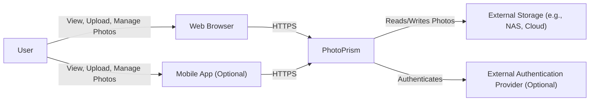
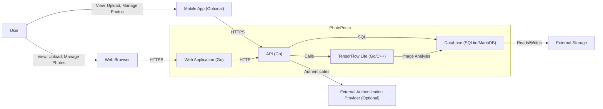
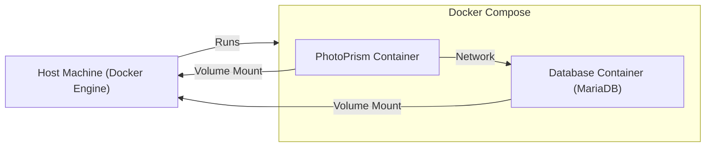
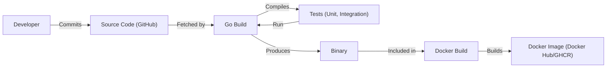

Okay, let's create a design document for the PhotoPrism project, focusing on aspects relevant to threat modeling.

# BUSINESS POSTURE

PhotoPrism is an AI-Powered Photos App for the Decentralized Web.  It's designed to allow users to organize, browse, and share their photo collections.  Given its open-source nature and focus on self-hosting, the business posture can be characterized as follows:

Priorities and Goals:

*   Provide a user-friendly, private, and secure alternative to commercial cloud-based photo management solutions.
*   Empower users to control their own data and maintain their privacy.
*   Offer a robust and extensible platform that can be adapted to various user needs and environments.
*   Foster a community-driven development model.
*   Ensure the long-term sustainability of the project.

Most Important Business Risks:

*   Data breaches leading to unauthorized access to users' private photos.
*   Data loss due to software bugs, hardware failures, or user error.
*   Reputational damage resulting from security vulnerabilities or privacy violations.
*   Inability to scale the platform to meet growing user demand.
*   Lack of adoption due to complexity or poor user experience.
*   Compromise of the build and distribution pipeline, leading to the distribution of malicious software.

# SECURITY POSTURE

Existing Security Controls:

*   security control: Authentication: User authentication via username/password and optional multi-factor authentication (referenced in documentation and code).
*   security control: Authorization: Role-based access control (RBAC) to manage user permissions (referenced in documentation).
*   security control: Input Validation: Validation of user inputs to prevent common web vulnerabilities (inferred from code and best practices, needs more specific documentation).
*   security control: HTTPS: Support for HTTPS to encrypt communication between the client and server (documented).
*   security control: Docker: Containerization using Docker to isolate the application and its dependencies (Dockerfile).
*   security control: Go security features: Use of the Go programming language, which offers some built-in security features like memory safety (inherent to the language).
*   security control: Regular Updates: Frequent releases and updates to address bugs and security vulnerabilities (observed in the repository).

Accepted Risks:

*   accepted risk: Reliance on third-party libraries: The project depends on various third-party libraries, which may introduce vulnerabilities.
*   accepted risk: Self-hosting complexity: Self-hosting requires technical expertise and introduces the risk of misconfiguration.
*   accepted risk: Limited resources for security audits: As an open-source project, resources for comprehensive security audits may be limited.

Recommended Security Controls:

*   Implement Content Security Policy (CSP) to mitigate XSS attacks.
*   Implement Subresource Integrity (SRI) to ensure that fetched resources haven't been tampered with.
*   Implement HTTP Strict Transport Security (HSTS) to enforce HTTPS connections.
*   Conduct regular penetration testing and security audits.
*   Establish a vulnerability disclosure program.
*   Implement robust logging and monitoring to detect and respond to security incidents.
*   Provide detailed security documentation and guidelines for users.
*   Implement Software Bill of Materials (SBOM) for better supply chain security.

Security Requirements:

*   Authentication:
    *   Strong password policies (length, complexity).
    *   Secure storage of passwords (hashing and salting).
    *   Protection against brute-force attacks (account lockout).
    *   Support for multi-factor authentication (TOTP).
*   Authorization:
    *   Fine-grained access control to photos and albums.
    *   Ability to share photos with specific users or groups.
    *   Administrative roles with elevated privileges.
*   Input Validation:
    *   Validation of all user inputs (filenames, metadata, search queries).
    *   Protection against cross-site scripting (XSS) attacks.
    *   Protection against SQL injection attacks.
    *   Protection against command injection attacks.
*   Cryptography:
    *   Use of strong encryption algorithms (AES, TLS).
    *   Secure key management practices.
    *   Protection of data at rest (optional, depending on user configuration).

# DESIGN

## C4 CONTEXT

Element Descriptions:

*   Element:
    *   Name: User
    *   Type: Person
    *   Description: A person who uses PhotoPrism to manage their photos.
    *   Responsibilities: Uploading, organizing, viewing, and sharing photos.
    *   Security controls: Strong passwords, MFA (if enabled).
*   Element:
    *   Name: PhotoPrism
    *   Type: Software System
    *   Description: The core PhotoPrism application.
    *   Responsibilities: Managing photos, user authentication, access control, image processing.
    *   Security controls: Authentication, authorization, input validation, HTTPS, Docker containerization.
*   Element:
    *   Name: External Storage
    *   Type: External System
    *   Description: Storage location for photo files (e.g., NAS, cloud storage).
    *   Responsibilities: Storing photo files.
    *   Security controls: Dependent on the specific storage provider; encryption at rest is recommended.
*   Element:
    *   Name: Mobile App (Optional)
    *   Type: Software System
    *   Description: A mobile application for interacting with PhotoPrism.
    *   Responsibilities: Providing a mobile interface for managing photos.
    *   Security controls: HTTPS, secure storage of credentials.
*   Element:
    *   Name: Web Browser
    *   Type: Software System
    *   Description: User uses web browser to access PhotoPrism web interface.
    *   Responsibilities: Displaying PhotoPrism web interface.
    *   Security controls: HTTPS, browser security settings.
*   Element:
    *   Name: External Authentication Provider (Optional)
    *   Type: External System
    *   Description: An external identity provider (e.g., OAuth provider).
    *   Responsibilities: Authenticating users.
    *   Security controls: Dependent on the specific provider; OAuth 2.0 or OpenID Connect are recommended.

## C4 CONTAINER

Element Descriptions:

*   Element:
    *   Name: Web Application (Go)
    *   Type: Web Application
    *   Description: The front-end web application, serving the user interface.
    *   Responsibilities: Handling user interactions, displaying photos, communicating with the API.
    *   Security controls: HTTPS, input validation, output encoding, session management.
*   Element:
    *   Name: API (Go)
    *   Type: API
    *   Description: The backend API, providing access to PhotoPrism's functionality.
    *   Responsibilities: Handling API requests, user authentication, authorization, data access.
    *   Security controls: Authentication, authorization, input validation, rate limiting.
*   Element:
    *   Name: TensorFlow Lite (Go/C++)
    *   Type: Library
    *   Description: Used for image analysis and recognition.
    *   Responsibilities: Performing image analysis tasks (e.g., object detection, facial recognition).
    *   Security controls: Input validation (image data), regular updates to address vulnerabilities.
*   Element:
    *   Name: Database (SQLite/MariaDB)
    *   Type: Database
    *   Description: Stores metadata about photos, users, and albums.
    *   Responsibilities: Storing and retrieving data.
    *   Security controls: Access control, SQL injection prevention, data encryption (if configured).
*   Element:
    *   Name: User
    *   Type: Person
    *   Description: A person who uses PhotoPrism to manage their photos.
    *   Responsibilities: Uploading, organizing, viewing, and sharing photos.
    *   Security controls: Strong passwords, MFA (if enabled).
*   Element:
    *   Name: External Storage
    *   Type: External System
    *   Description: Storage location for photo files (e.g., NAS, cloud storage).
    *   Responsibilities: Storing photo files.
    *   Security controls: Dependent on the specific storage provider; encryption at rest is recommended.
*   Element:
    *   Name: Mobile App (Optional)
    *   Type: Software System
    *   Description: A mobile application for interacting with PhotoPrism.
    *   Responsibilities: Providing a mobile interface for managing photos.
    *   Security controls: HTTPS, secure storage of credentials.
*   Element:
    *   Name: Web Browser
    *   Type: Software System
    *   Description: User uses web browser to access PhotoPrism web interface.
    *   Responsibilities: Displaying PhotoPrism web interface.
    *   Security controls: HTTPS, browser security settings.
*   Element:
    *   Name: External Authentication Provider (Optional)
    *   Type: External System
    *   Description: An external identity provider (e.g., OAuth provider).
    *   Responsibilities: Authenticating users.
    *   Security controls: Dependent on the specific provider; OAuth 2.0 or OpenID Connect are recommended.

## DEPLOYMENT

Possible Deployment Solutions:

1.  Docker Compose: Simplest and most recommended for most users.
2.  Kubernetes: For larger, more complex deployments requiring high availability and scalability.
3.  Manual Installation:  Least recommended, requires manual configuration of all dependencies.

Chosen Solution: Docker Compose

Element Descriptions:

*   Element:
    *   Name: Host Machine (Docker Engine)
    *   Type: Server
    *   Description: The physical or virtual server hosting the Docker Engine.
    *   Responsibilities: Running the Docker Engine and containers.
    *   Security controls: Operating system security, firewall, intrusion detection system.
*   Element:
    *   Name: Docker Compose
    *   Type: Tool
    *   Description: Orchestrates the PhotoPrism and database containers.
    *   Responsibilities: Starting, stopping, and managing the containers.
    *   Security controls: Docker Compose configuration security.
*   Element:
    *   Name: PhotoPrism Container
    *   Type: Container
    *   Description: The container running the PhotoPrism application.
    *   Responsibilities: Running the PhotoPrism web application and API.
    *   Security controls: Container security best practices (e.g., running as non-root user, limiting capabilities).
*   Element:
    *   Name: Database Container (MariaDB)
    *   Type: Container
    *   Description: The container running the MariaDB database.
    *   Responsibilities: Running the database server.
    *   Security controls: Database security best practices (e.g., strong passwords, access control).

## BUILD

The PhotoPrism build process leverages Go modules and Docker.

Build Process Description:

1.  Developers commit code to the GitHub repository.
2.  The `go build` command is used to compile the Go code, fetching dependencies using Go modules.
3.  Unit and integration tests are run as part of the build process.
4.  A Dockerfile is used to build a Docker image containing the compiled binary and other necessary files.
5.  The Docker image is pushed to a container registry (e.g., Docker Hub, GitHub Container Registry).

Security Controls:

*   security control: Go Modules: Use of Go modules for dependency management, including vulnerability scanning with tools like `govulncheck`.
*   security control: Automated Build: Use of a CI/CD pipeline (GitHub Actions) to automate the build process.
*   security control: Testing: Automated unit and integration tests to identify bugs and vulnerabilities.
*   security control: Docker Best Practices: Use of Docker best practices (e.g., multi-stage builds, non-root user) to create secure Docker images.
*   security control: Image Scanning: Scanning of Docker images for vulnerabilities using tools like Trivy or Clair.
*   security control: Signed Commits: Developers should sign their commits using GPG keys to ensure code integrity.

# RISK ASSESSMENT

Critical Business Processes:

*   User authentication and authorization.
*   Photo storage and retrieval.
*   Image processing and analysis.
*   Data backup and recovery.

Data Sensitivity:

*   User credentials (passwords, API keys): Highly sensitive.
*   Photo files: Highly sensitive (personal and potentially private).
*   Photo metadata (location, date, time, faces): Sensitive.
*   User profile information: Sensitive.

# QUESTIONS & ASSUMPTIONS

Questions:

*   What are the specific requirements for data retention and deletion?
*   Are there any compliance requirements (e.g., GDPR, CCPA)?
*   What are the expected user base and storage requirements?
*   What level of support is provided for external authentication providers?
*   What is the process for handling security vulnerabilities reported by users or researchers?
*   Are there any plans to implement end-to-end encryption?

Assumptions:

*   BUSINESS POSTURE: Users are responsible for securing their own infrastructure when self-hosting.
*   SECURITY POSTURE: The project follows secure coding practices, but a formal security audit has not been conducted.
*   DESIGN: The Docker Compose deployment model is the primary deployment method.
*   DESIGN: External storage is configured securely by the user.
*   DESIGN: Regular backups are performed by the user.