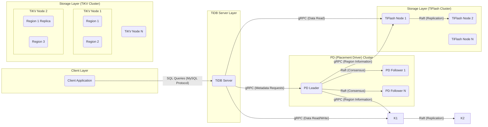

## Project Design Document: TiDB Distributed SQL Database (Improved)

**1. Introduction**

This document provides an enhanced architectural overview of the TiDB distributed SQL database system, specifically tailored for threat modeling. It builds upon the previous version by providing more granular detail and focusing on aspects relevant to security analysis. This document aims to provide a clear understanding of the system's components, interactions, and data flows to facilitate the identification of potential security vulnerabilities and attack vectors.

**2. Goals and Objectives**

The primary goal of this document remains to provide a comprehensive and understandable description of the TiDB architecture for the purpose of identifying potential security vulnerabilities and attack vectors. Improved objectives include:

*   Clearly outlining the major components of the TiDB system with more granular detail where necessary.
*   Describing the interactions and data flow between these components, including specific protocols and data types.
*   Identifying key security boundaries, trust zones, and potential attack surfaces.
*   Providing a robust foundation for systematic threat identification, risk assessment, and the development of mitigation strategies.
*   Clarifying operational aspects relevant to security.

**3. System Architecture Overview**

TiDB's architecture is designed for horizontal scalability, strong consistency, and high availability, comprising several key components working in concert. This diagram provides a high-level view, with more detail provided in subsequent sections.

**4. Key Components (Detailed)**

This section provides a more detailed breakdown of each component, emphasizing security-relevant aspects.

*   **TiDB Server:**
    *   Stateless SQL processing layer.
    *   Receives client connections and authenticates users.
        *   Supports MySQL authentication protocol.
        *   Manages user accounts and privileges.
    *   Parses SQL queries and performs authorization checks based on user privileges.
    *   Optimizes query execution plans.
    *   Communicates with PD to retrieve metadata (table schemas, region locations).
    *   Communicates with TiKV and TiFlash to access data.
        *   Uses gRPC for internal communication.
    *   Coordinates distributed transactions using a two-phase commit protocol.
    *   Potential attack surfaces: SQL injection, authentication bypass, authorization flaws, denial of service.

*   **PD (Placement Driver) Cluster:**
    *   Centralized metadata store and cluster orchestrator.
    *   Stores critical metadata: table schemas, region mappings, cluster topology, and TSO (Timestamp Oracle).
    *   Elects a leader using the Raft consensus algorithm.
    *   Manages data placement and load balancing across TiKV and TiFlash.
    *   Allocates monotonically increasing timestamps for transactions.
    *   Provides APIs for other components to access metadata.
    *   Security is paramount due to its critical role. Compromise can lead to data loss or corruption.
    *   Potential attack surfaces: Unauthorized access to metadata, disruption of consensus, denial of service.

*   **TiKV Cluster:**
    *   Distributed, transactional key-value storage engine.
    *   Stores data in Regions, which are the basic unit of data management and replication.
    *   Each Region is replicated across multiple TiKV nodes using Raft for fault tolerance and consistency.
    *   Handles read and write requests for data within its Regions.
    *   Enforces data consistency and atomicity for transactions.
    *   Supports data at rest encryption (configurable).
    *   Potential attack surfaces: Data breaches, unauthorized data modification, denial of service, Raft consensus manipulation.

*   **TiFlash Cluster:**
    *   Optional columnar storage engine for analytical queries.
    *   Replicates data from TiKV in a columnar format for efficient OLAP processing.
    *   Uses the Raft consensus algorithm for data replication and consistency.
    *   Provides near real-time analytical capabilities.
    *   Potential attack surfaces: Data breaches, unauthorized data access, denial of service.

*   **Client Application:**
    *   Any application or tool connecting to the TiDB cluster.
    *   Authenticates with TiDB Server using the MySQL protocol.
    *   Submits SQL queries for execution.
    *   Security depends on the client application's implementation and the security of the environment it runs in.

**5. Data Flow (Detailed)**

This section provides more detailed data flow descriptions, including protocols and data types.

*   **Client Connection and Authentication:**
    *   Client initiates a TCP connection to a TiDB Server.
    *   TiDB Server and client negotiate capabilities using the MySQL handshake protocol.
    *   Client provides credentials (username and password).
    *   TiDB Server authenticates the client against its internal user store or potentially an external authentication plugin.
    *   Upon successful authentication, a session is established.

*   **Write Operation (e.g., INSERT, UPDATE, DELETE):**
    *   Client sends a SQL write statement to TiDB Server via the MySQL protocol.
    *   TiDB Server parses the SQL and requests a transaction timestamp (TSO) from the PD Leader via gRPC.
    *   TiDB Server identifies the Regions in TiKV affected by the write based on metadata from PD (via gRPC).
    *   TiDB Server sends write requests (including the TSO) to the leaders of the relevant TiKV Regions via gRPC.
    *   TiKV leaders propose the write to their Raft followers within the Region.
    *   Once a quorum of followers acknowledges the write, the write is committed locally in TiKV.
    *   TiKV leader responds to the TiDB Server confirming the write.
    *   TiDB Server confirms the successful write to the client.
    *   Asynchronously, data changes in TiKV are replicated to TiFlash via the TiDB Binlog component (not explicitly shown in the high-level diagram but a crucial data flow).

*   **Read Operation (e.g., SELECT):**
    *   Client sends a SQL read statement to TiDB Server via the MySQL protocol.
    *   TiDB Server parses the SQL and determines the optimal execution plan, potentially involving TiKV and/or TiFlash.
    *   For transactional reads requiring the latest data, TiDB Server sends read requests to the leaders of the relevant TiKV Regions via gRPC.
    *   For analytical reads, TiDB Server sends read requests to TiFlash nodes via gRPC.
    *   TiKV/TiFlash nodes retrieve the requested data.
    *   Data is returned to the TiDB Server via gRPC.
    *   TiDB Server processes and aggregates the data if necessary.
    *   TiDB Server returns the result to the client via the MySQL protocol.

*   **Metadata Management:**
    *   TiDB Servers query the PD Leader for table schemas, region locations, and other metadata via gRPC.
    *   PD Leader manages metadata updates and ensures consistency across the PD cluster using the Raft consensus algorithm (internal communication between PD members).

**6. Security Considerations (Enhanced)**

This section expands on the initial security considerations, providing more specific details.

*   **Client Authentication and Authorization:**
    *   TiDB relies on the MySQL authentication protocol, which can be vulnerable to brute-force attacks if not properly configured.
    *   Consider using strong passwords and implementing account lockout policies.
    *   Explore integration with external authentication providers (e.g., LDAP, Kerberos) for centralized user management.
    *   Authorization is managed through SQL-based GRANT and REVOKE statements. Ensure proper privilege management to restrict access to sensitive data and operations.

*   **Network Security:**
    *   Communication between TiDB components (TiDB, PD, TiKV, TiFlash) uses gRPC. Secure these channels using TLS encryption.
    *   Configure firewalls to restrict network access to only necessary ports and IP addresses.
    *   Consider using network segmentation to isolate different components.

*   **Data at Rest Encryption:**
    *   TiKV supports data at rest encryption. Enable this feature to protect data stored on disk.
    *   Properly manage encryption keys. Consider using key management systems (KMS).
    *   TiFlash also supports data at rest encryption.

*   **Data in Transit Encryption:**
    *   Enable TLS encryption for all client connections to TiDB Servers.
    *   Ensure TLS is enabled for gRPC communication between internal components.

*   **Access Control for Internal Components:**
    *   Secure access to PD members. Restrict access to the PD control plane.
    *   Implement authentication and authorization mechanisms for internal APIs if exposed.

*   **Security of the PD Cluster:**
    *   The PD cluster's security is critical. Protect PD leader election and consensus mechanisms.
    *   Limit access to PD nodes and the etcd storage used by PD.

*   **Vulnerability Management:**
    *   Regularly update TiDB components to patch known vulnerabilities.
    *   Implement a process for monitoring security advisories and applying necessary updates.

*   **Auditing and Logging:**
    *   Enable comprehensive audit logging to track security-relevant events, such as login attempts, privilege changes, and data access.
    *   Securely store and monitor audit logs.

*   **Backup and Recovery:**
    *   Secure backup storage and access to backups.
    *   Encrypt backups to protect sensitive data.
    *   Regularly test recovery procedures.

*   **Operational Security:**
    *   Secure the deployment environment (e.g., cloud infrastructure, operating systems).
    *   Implement strong access controls for administrative tasks.
    *   Monitor system health and security metrics.

**7. Assumptions and Constraints**

The following assumptions and constraints are relevant to this design document:

*   The focus is on the core TiDB architecture and does not delve into specific deployment configurations or third-party integrations in detail.
*   It is assumed that best practices for operating system and network security are followed.
*   The information is based on the publicly available documentation and understanding of the TiDB architecture as of the current date.

**8. Future Considerations**

Potential future enhancements or changes that could impact the security posture of TiDB include:

*   More granular role-based access control (RBAC).
*   Enhanced auditing capabilities with more detailed event logging.
*   Integration with security information and event management (SIEM) systems.
*   Support for more advanced authentication methods (e.g., multi-factor authentication).
*   Improvements to the security of the TiDB Binlog component.

This improved document provides a more detailed and security-focused view of the TiDB architecture, serving as a stronger foundation for subsequent threat modeling activities.
