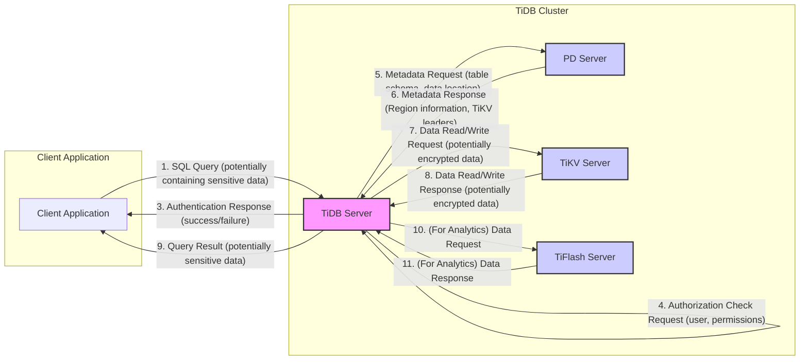

# Project Design Document: TiDB Distributed SQL Database

**Version:** 1.1
**Date:** October 26, 2023
**Author:** AI Software Architect

## 1. Introduction

This document provides an enhanced and more detailed architectural design overview of the TiDB distributed SQL database system, specifically tailored for threat modeling purposes. It builds upon the foundational understanding of TiDB's components and interactions to facilitate a comprehensive security analysis. The design is based on the open-source project available at [https://github.com/pingcap/tidb](https://github.com/pingcap/tidb).

## 2. Goals

*   Provide a highly detailed and precise description of the TiDB architecture, emphasizing security-relevant aspects.
*   Thoroughly identify key components, their internal workings, and their security responsibilities.
*   Illustrate the intricate interactions and data flow between components, highlighting potential attack surfaces.
*   Elaborate on security considerations, providing specific examples of threats and mitigation strategies.
*   Serve as a robust and actionable basis for identifying potential threats, vulnerabilities, and attack vectors.

## 3. Target Audience

This document is intended for:

*   Security engineers, architects, and penetration testers conducting in-depth threat modeling and security assessments.
*   Development teams involved in designing, building, and maintaining TiDB and its integrations, with a focus on secure development practices.
*   Operations and DevOps teams responsible for securely deploying, configuring, and managing TiDB clusters in various environments.

## 4. System Overview

TiDB is a sophisticated, horizontally scalable, distributed SQL database engineered to handle Hybrid Transactional and Analytical Processing (HTAP) workloads. Its design prioritizes high availability, strong consistency (via Raft), and operational simplicity. The architecture distinctly separates the stateless SQL processing layer from the stateful, distributed storage layer, enabling independent scaling and resilience.

## 5. Architectural Components

The TiDB architecture comprises several interconnected components, each with specific roles and security implications:

*   **TiDB Server:**
    *   The stateless SQL layer, acting as the entry point for client connections.
    *   Responsible for:
        *   Receiving and authenticating client connections.
        *   Parsing, analyzing, and optimizing SQL queries.
        *   Generating distributed execution plans.
        *   Coordinating data access across TiKV and TiFlash.
        *   Enforcing access control policies based on user privileges.
    *   Communicates with PD for cluster metadata and timestamp allocation.
    *   Interacts with TiKV to retrieve or modify data.
    *   May interact with TiFlash for analytical query execution.
    *   Security considerations include: connection security (TLS), authentication mechanisms, authorization enforcement, and protection against SQL injection.
*   **Placement Driver (PD) Server:**
    *   The central cluster management component and metadata store, crucial for cluster stability and consistency.
    *   Responsible for:
        *   Maintaining the cluster topology and the location of data (Regions) within TiKV.
        *   Managing data distribution and load balancing across TiKV nodes.
        *   Allocating globally unique, monotonically increasing timestamps for transactions.
        *   Orchestrating Region splitting and merging in TiKV.
        *   Electing a leader using the Raft consensus algorithm for fault tolerance.
    *   Built on etcd, inheriting its security characteristics.
    *   Security considerations include: securing access to the PD cluster (authentication and authorization), protecting the integrity of metadata, and ensuring the availability of the PD service. Compromise of PD can lead to cluster instability or data loss.
*   **TiKV Server:**
    *   The distributed, transactional key-value storage engine, forming the foundation of TiDB's data persistence.
    *   Responsible for:
        *   Storing data in sorted key-value pairs.
        *   Organizing data into Regions, the fundamental unit of data management and replication.
        *   Implementing the Raft consensus algorithm within each Region for high availability and data consistency.
        *   Handling read and write requests from TiDB Servers.
        *   Supporting distributed transactions using a two-phase commit protocol.
        *   Providing a raw key-value API for direct access.
        *   Supporting encryption at rest for stored data.
    *   Security considerations include: securing inter-node communication (TLS), protecting data at rest (encryption), ensuring data integrity through Raft, and controlling access to the raw key-value API.
*   **TiFlash (Optional):**
    *   A columnar storage extension integrated with TiKV, optimized for analytical query performance.
    *   Responsible for:
        *   Replicating data from TiKV in a columnar format.
        *   Providing fast data retrieval for analytical queries using vectorized processing.
        *   Supporting near real-time analytics.
    *   Security considerations include: securing data replication from TiKV, controlling access to TiFlash instances, and ensuring data consistency between TiKV and TiFlash.
*   **TiCDC (Change Data Capture) (Optional):**
    *   A component for capturing and streaming incremental data changes from TiKV in real-time.
    *   Responsible for:
        *   Monitoring changes in TiKV Regions.
        *   Formatting and streaming these changes to downstream consumers.
        *   Supporting various output formats and destinations.
    *   Security considerations include: securing the communication channel for streaming changes, authenticating and authorizing consumers of the change stream, and protecting sensitive data within the change stream.
*   **Connectors/Drivers:**
    *   Client libraries and drivers enabling applications to interact with TiDB.
    *   Examples: JDBC, Go driver, Python driver, etc.
    *   Responsible for:
        *   Establishing connections to TiDB Servers.
        *   Handling authentication and authorization.
        *   Executing SQL queries and retrieving results.
        *   Implementing security best practices like parameterized queries.
    *   Security considerations include: ensuring the security of the driver itself, using secure connection protocols (TLS), and preventing credential leakage in application code.
*   **Monitoring Components (e.g., Prometheus, Grafana):**
    *   Essential for observing the health, performance, and security of the TiDB cluster.
    *   Responsible for:
        *   Collecting metrics from various TiDB components.
        *   Storing and visualizing these metrics.
        *   Providing alerting capabilities for critical events.
    *   Security considerations include: securing access to monitoring dashboards and data, protecting sensitive information exposed in metrics, and ensuring the integrity of monitoring data.

## 6. Data Flow

The following diagram provides a more detailed illustration of the data flow for a typical SQL query in TiDB, highlighting security-relevant interactions:

**Detailed Data Flow Description with Security Focus:**

1. **Client Sends SQL Query:** A client application sends an SQL query to a TiDB Server. This query might contain sensitive data as parameters or within the SQL statement itself.
2. **Authentication Request:** The TiDB Server initiates an authentication process, requiring the client to provide credentials. This step is crucial for verifying the client's identity.
3. **Authentication Response:** The TiDB Server validates the provided credentials and responds with the authentication status (success or failure). Secure credential management and transmission are vital here.
4. **Authorization Check:** Before executing the query, the TiDB Server performs an authorization check to ensure the authenticated user has the necessary privileges to access the requested data and perform the specified operations.
5. **Metadata Request:** The TiDB Server contacts the PD Server to retrieve metadata about the tables and data locations involved in the query. This communication should be secured to prevent metadata tampering.
6. **Metadata Response:** The PD Server responds with the necessary metadata, including the Regions where the data resides and the leader TiKV servers for those Regions. The integrity of this metadata is paramount.
7. **Data Read/Write Request:** The TiDB Server sends read or write requests to the appropriate TiKV Servers to access the data. This communication should be encrypted (TLS) to protect data in transit. Data at rest in TiKV may also be encrypted.
8. **Data Read/Write Response:** The TiKV Servers process the requests and return the requested data or acknowledge the write operation. The returned data may be encrypted.
9. **Query Result:** The TiDB Server aggregates the results from TiKV and returns the final query result to the client application. This communication channel should also be secured to protect sensitive data in transit.
10. **(For Analytical Queries):** If the query involves analytical processing and TiFlash is utilized, TiDB may request data from TiFlash. This interaction needs secure channels.
11. **(For Analytical Queries):** TiFlash responds with the requested data optimized for analytical processing. Security considerations for data access and transfer to TiFlash apply.

## 7. Security Considerations

This section provides a more detailed breakdown of security considerations for the TiDB architecture, including potential threats and mitigation strategies:

*   **Authentication and Authorization:**
    *   **Threats:** Brute-force attacks on login credentials, credential stuffing, privilege escalation, unauthorized access to sensitive data.
    *   **Mitigation:** Strong password policies, multi-factor authentication, robust RBAC implementation, regular security audits of user permissions, secure storage of credentials (e.g., using hashing and salting), rate limiting on login attempts.
*   **Network Security:**
    *   **Threats:** Man-in-the-middle attacks, eavesdropping on communication channels, unauthorized access to TiDB ports, lateral movement within the network.
    *   **Mitigation:** Enforce TLS encryption for all inter-component communication and client connections, use strong cipher suites, implement network segmentation to isolate the TiDB cluster, configure firewalls or network policies to restrict access to necessary ports only, regularly review firewall rules.
*   **Data Encryption:**
    *   **Threats:** Unauthorized access to data at rest, exposure of sensitive data during transit, compromise of encryption keys.
    *   **Mitigation:** Enable encryption at rest for TiKV, enforce encryption in transit (TLS), implement secure key management practices (e.g., using a Hardware Security Module (HSM) or Key Management Service (KMS)), regularly rotate encryption keys.
*   **Audit Logging:**
    *   **Threats:** Tampering with audit logs, insufficient logging leading to difficulty in incident investigation, unauthorized access to audit logs.
    *   **Mitigation:** Enable comprehensive audit logging for all critical operations, securely store audit logs in a centralized and tamper-proof location, implement access controls for audit logs, regularly monitor audit logs for suspicious activity, integrate audit logs with a Security Information and Event Management (SIEM) system.
*   **SQL Injection Prevention:**
    *   **Threats:** Exploitation of SQL injection vulnerabilities leading to unauthorized data access, modification, or deletion.
    *   **Mitigation:** Enforce the use of parameterized queries or prepared statements in applications, implement input validation and sanitization, adopt secure coding practices, conduct regular static and dynamic application security testing (SAST/DAST).
*   **Denial of Service (DoS) Protection:**
    *   **Threats:** Overwhelming the TiDB cluster with requests, leading to service unavailability.
    *   **Mitigation:** Implement rate limiting on client connections and requests, configure connection limits, deploy load balancers with DoS protection capabilities, monitor resource utilization and set up alerts for anomalies.
*   **Backup and Recovery:**
    *   **Threats:** Data loss due to hardware failures, software bugs, or malicious attacks; unauthorized access to backup data.
    *   **Mitigation:** Implement regular and automated backups of TiDB data and metadata, securely store backups (consider encryption), test the recovery process regularly, implement access controls for backup storage.
*   **Security Updates and Patching:**
    *   **Threats:** Exploitation of known vulnerabilities in TiDB or its dependencies.
    *   **Mitigation:** Establish a process for monitoring security advisories and applying security updates promptly, automate patching where possible, perform thorough testing after applying patches.
*   **Access Control to PD:**
    *   **Threats:** Unauthorized access to the PD cluster leading to cluster instability, data corruption, or denial of service.
    *   **Mitigation:** Implement strong authentication and authorization for accessing the PD cluster (e.g., using client certificates), restrict network access to PD nodes, monitor PD logs for suspicious activity.
*   **TiCDC Security:**
    *   **Threats:** Unauthorized access to the change data stream, interception or modification of change data, exposure of sensitive data in the change stream.
    *   **Mitigation:** Secure the communication channel used by TiCDC (e.g., using TLS), implement authentication and authorization for consumers of the change data stream, encrypt sensitive data within the change stream if necessary.
*   **TiFlash Security:**
    *   **Threats:** Unauthorized access to TiFlash instances, insecure replication of data from TiKV, data inconsistency between TiKV and TiFlash.
    *   **Mitigation:** Control access to TiFlash instances through network policies and authentication, ensure secure replication of data from TiKV (leveraging existing TiKV security mechanisms), monitor data consistency.
*   **Monitoring Infrastructure Security:**
    *   **Threats:** Unauthorized access to monitoring dashboards and data, manipulation of monitoring data, exposure of sensitive information in metrics.
    *   **Mitigation:** Secure access to Prometheus and Grafana instances with strong authentication and authorization, restrict network access, protect sensitive information exposed in metrics (e.g., by filtering or masking), ensure the integrity of monitoring data.

## 8. Deployment Considerations

The security posture of a TiDB deployment is significantly influenced by the chosen deployment environment:

*   **On-Premise:** Requires careful configuration and management of the underlying infrastructure, including network security, physical security, and access control. Organizations have full control but also full responsibility for security.
*   **Cloud Environments (AWS, GCP, Azure):** Leveraging cloud-provided security services (e.g., VPCs, security groups, IAM) can enhance security, but proper configuration and understanding of the shared responsibility model are crucial. Misconfigurations can lead to vulnerabilities.
*   **Kubernetes:** Offers advantages in terms of orchestration and scalability but introduces its own set of security considerations, such as securing the Kubernetes control plane, managing network policies within the cluster, and securing access to Kubernetes resources.

## 9. Dependencies

TiDB's security is also dependent on the security of its underlying components and libraries:

*   **etcd:** Vulnerabilities in etcd could directly impact the security and availability of the PD cluster. Keeping etcd updated and following its security best practices is essential.
*   **Go Programming Language:** Security vulnerabilities in the Go runtime or standard libraries could affect TiDB. Staying updated with Go releases and security patches is important.
*   **Raft Consensus Algorithm:** While Raft provides strong consistency, implementation flaws could lead to vulnerabilities. TiDB's implementation should be regularly reviewed.
*   **gRPC:** Security vulnerabilities in the gRPC framework could impact inter-component communication. Keeping gRPC updated is necessary.
*   **Prometheus and Grafana:** Security vulnerabilities in these monitoring tools could expose sensitive information or allow unauthorized access.

## 10. Future Considerations

*   Enhanced integration with Hardware Security Modules (HSMs) for key management.
*   Implementation of data masking and anonymization features.
*   Advanced threat detection and response capabilities.
*   Formal security certifications and compliance attestations.
*   Strengthened defenses against supply chain attacks.

## 11. Conclusion

This enhanced design document provides a more granular and security-focused overview of the TiDB architecture. By detailing the components, data flows, and security considerations, it serves as a robust foundation for comprehensive threat modeling activities. Understanding these intricacies is crucial for identifying potential attack vectors and implementing effective security controls to protect the TiDB database and the sensitive data it manages. Continuous security assessment and proactive mitigation strategies are essential for maintaining a strong security posture for TiDB deployments.