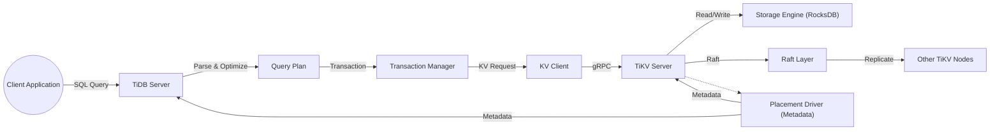

## TiDB Security Analysis - Deep Dive

Here's a deep dive security analysis of TiDB, building upon the provided security design review.

**1. Objective, Scope, and Methodology**

**Objective:**

The objective of this deep analysis is to conduct a thorough security assessment of the TiDB distributed database system, focusing on its key components, architecture, data flow, and deployment model.  The analysis aims to identify potential security vulnerabilities, assess existing security controls, and provide actionable recommendations to enhance the overall security posture of TiDB deployments.  The analysis will specifically consider the implications of TiDB's distributed nature and its use of the Raft consensus algorithm.

**Scope:**

This analysis covers the following key components of TiDB:

*   **TiDB Server (SQL Layer):**  Focus on SQL parsing, query optimization, transaction management, and client interaction.
*   **Placement Driver (PD):**  Analysis of metadata management, scheduling, and timestamp oracle (TSO) security.
*   **TiKV Server (Storage Layer):**  Deep dive into the storage engine, Raft implementation, and replication mechanisms.
*   **Deployment Model:**  Kubernetes with TiDB Operator.
*   **Build Process:**  Analysis of the CI/CD pipeline, including SAST, SCA, and testing.
*   **Data Flow:**  Tracing data movement between components and identifying potential points of vulnerability.
*   **Authentication, Authorization, and Auditing Mechanisms.**
*   **Encryption (in transit and at rest).**

**Methodology:**

1.  **Architecture and Component Inference:**  Based on the provided documentation, codebase structure (from the GitHub repository), and common architectural patterns for distributed databases, we will infer the detailed architecture, components, and data flow within TiDB.
2.  **Threat Modeling:**  For each component and interaction, we will identify potential threats using a combination of STRIDE (Spoofing, Tampering, Repudiation, Information Disclosure, Denial of Service, Elevation of Privilege) and known attack vectors against databases.
3.  **Security Control Analysis:**  We will evaluate the effectiveness of existing security controls (identified in the security design review) in mitigating the identified threats.
4.  **Vulnerability Analysis:**  We will identify potential vulnerabilities based on the architecture, threat model, and known weaknesses in similar systems.
5.  **Mitigation Strategy Recommendation:**  For each identified vulnerability, we will provide specific, actionable, and tailored mitigation strategies applicable to TiDB.  These recommendations will consider the specific context of TiDB's architecture and deployment model.

**2. Security Implications of Key Components**

**2.1 TiDB Server (SQL Layer)**

*   **Architecture Inference:** The TiDB server acts as the SQL interface, accepting connections from clients (e.g., MySQL clients, applications).  It parses SQL queries, optimizes them, and interacts with the TiKV cluster to retrieve or modify data.  It also handles transaction management.

*   **Threats:**
    *   **SQL Injection (Injection):**  The most critical threat.  Malicious SQL code injected through client inputs could bypass authorization checks and lead to unauthorized data access, modification, or deletion.
    *   **Authentication Bypass (Spoofing):**  Attackers might attempt to bypass authentication mechanisms to gain unauthorized access.
    *   **Denial of Service (DoS):**  Resource exhaustion attacks targeting the SQL parser, query optimizer, or connection handling could render the database unavailable.  Complex or poorly formed queries could be used.
    *   **Information Disclosure (Information Disclosure):**  Error messages or verbose logging could leak sensitive information about the database schema or data.
    *   **Privilege Escalation (Elevation of Privilege):**  Exploiting vulnerabilities in the authorization logic could allow users to gain higher privileges than intended.

*   **Security Control Analysis:**
    *   **Authentication:**  TiDB supports user authentication, which is crucial for preventing unauthorized access.  The strength of this control depends on the password policy and the availability of MFA.
    *   **Authorization (RBAC):**  RBAC is essential for enforcing the principle of least privilege.  The granularity and effectiveness of the RBAC implementation are critical.
    *   **Input Validation:**  Parameterized queries and strict input validation are *absolutely essential* to prevent SQL injection.  This is the primary defense against the most critical threat.
    *   **Audit Logging:**  Audit logs can help detect and investigate security incidents.  The completeness and security of the audit logs are important.

*   **Vulnerabilities:**
    *   **SQL Injection Vulnerabilities:**  Even with parameterized queries, subtle flaws in input validation or query parsing could still exist.  Edge cases and complex SQL features need thorough testing.
    *   **Authentication Weaknesses:**  Weak password policies, lack of MFA, or vulnerabilities in the authentication protocol could allow attackers to compromise accounts.
    *   **Authorization Bugs:**  Errors in the RBAC implementation could allow users to bypass intended access restrictions.
    *   **DoS Vulnerabilities:**  Inefficient query handling or resource management could make the server vulnerable to DoS attacks.

*   **Mitigation Strategies:**
    *   **Robust SQL Injection Prevention:**
        *   **Strictly enforce parameterized queries:**  Disallow any form of dynamic SQL generation using string concatenation.  Use a well-vetted, database-specific library for parameterized queries.
        *   **Input validation and sanitization:**  Implement strict input validation based on expected data types and formats.  Sanitize all user inputs before using them in queries.
        *   **Web Application Firewall (WAF):**  A WAF can provide an additional layer of defense against SQL injection attacks, especially if TiDB is exposed through a web interface.
        *   **Regular penetration testing:**  Specifically target SQL injection vulnerabilities.
    *   **Strengthen Authentication:**
        *   **Enforce strong password policies:**  Require complex passwords, enforce password expiration, and prevent password reuse.
        *   **Implement Multi-Factor Authentication (MFA):**  MFA adds a significant layer of security to authentication.
        *   **Integrate with external identity providers:**  Leverage existing identity management systems (e.g., LDAP, Active Directory) for centralized authentication and authorization.
    *   **Improve Authorization:**
        *   **Fine-grained RBAC:**  Implement granular permissions that allow users to access only the data and operations they need.
        *   **Regularly review and audit user permissions:**  Ensure that users have the appropriate level of access and that permissions are not overly permissive.
    *   **DoS Protection:**
        *   **Resource limits:**  Configure resource limits (e.g., memory, CPU, connections) to prevent resource exhaustion attacks.
        *   **Query timeouts:**  Set timeouts for queries to prevent long-running queries from consuming excessive resources.
        *   **Rate limiting:**  Limit the number of requests from a single client or IP address to prevent flooding attacks.
        *   **Connection pooling:**  Use connection pooling to manage database connections efficiently.
    *   **Secure Error Handling:**
        *   **Avoid revealing sensitive information in error messages:**  Return generic error messages to clients and log detailed error information separately.
    *   **Regular Security Audits and Penetration Testing:**  Conduct regular security audits and penetration testing to identify and address vulnerabilities.

**2.2 Placement Driver (PD)**

*   **Architecture Inference:**  The PD is the central control plane of the TiDB cluster.  It stores metadata about the cluster (region locations, node status), manages region splitting and merging, and provides a globally consistent timestamp oracle (TSO) for transactions.  It uses the Raft consensus algorithm for its own high availability and data consistency.

*   **Threats:**
    *   **Compromise of PD (Tampering, Elevation of Privilege):**  If an attacker compromises a PD node, they could potentially manipulate cluster metadata, disrupt scheduling, or gain control over the entire cluster.
    *   **TSO Manipulation (Tampering):**  If the TSO is compromised, attackers could potentially violate transaction isolation guarantees or create inconsistencies.
    *   **Denial of Service (DoS):**  Attacks targeting the PD could disrupt cluster management and make the database unavailable.
    *   **Information Disclosure (Information Disclosure):**  Exposure of metadata could reveal information about the cluster's topology and data distribution.

*   **Security Control Analysis:**
    *   **Authentication and Authorization:**  Secure communication between TiDB servers, TiKV servers, and PD is crucial.  Mutual TLS (mTLS) should be used to authenticate all components.  RBAC should control access to PD's management functions.
    *   **Raft Security:**  The security of the Raft implementation is critical for the integrity of the PD.  Secure communication between Raft nodes (using TLS) is essential.
    *   **Network Security:**  Network policies should restrict access to the PD to only authorized components.

*   **Vulnerabilities:**
    *   **Raft Implementation Bugs:**  Vulnerabilities in the Raft implementation could allow attackers to compromise the consensus process.
    *   **TSO Vulnerabilities:**  Weaknesses in the TSO implementation could allow attackers to manipulate timestamps.
    *   **Metadata Corruption:**  If the metadata store is corrupted, it could lead to data loss or inconsistency.
    *   **Configuration Errors:**  Misconfigured network policies or access controls could expose the PD to unauthorized access.

*   **Mitigation Strategies:**
    *   **Secure Raft Implementation:**
        *   **Use a well-vetted Raft library:**  Avoid custom Raft implementations.
        *   **Enable TLS for Raft communication:**  Encrypt all communication between Raft nodes.
        *   **Regularly audit the Raft implementation:**  Look for potential vulnerabilities.
    *   **Secure TSO:**
        *   **Use a secure time source:**  Ensure that the TSO is synchronized with a reliable and secure time source (e.g., NTP with authentication).
        *   **Protect the TSO from manipulation:**  Implement strong access controls and monitoring to prevent unauthorized modification of timestamps.
    *   **Protect Metadata:**
        *   **Use a reliable and secure storage engine for the metadata store:**  Ensure data integrity and availability.
        *   **Implement regular backups of the metadata:**  Allow for recovery in case of corruption.
    *   **Network Segmentation and Access Control:**
        *   **Use Kubernetes network policies to restrict access to the PD:**  Only allow communication from authorized TiDB and TiKV servers.
        *   **Implement strong authentication and authorization for all PD interactions:**  Use mTLS and RBAC.
    *   **Intrusion Detection and Prevention:**  Deploy IDPS to monitor for suspicious activity within the cluster, particularly targeting the PD.

**2.3 TiKV Server (Storage Layer)**

*   **Architecture Inference:**  TiKV is the distributed key-value storage layer of TiDB.  It uses RocksDB (or a similar storage engine) for local data persistence and the Raft consensus algorithm for data replication and consistency across multiple TiKV nodes.  Data is sharded into regions, and each region is replicated to multiple TiKV nodes for high availability.

*   **Threats:**
    *   **Data Breach (Information Disclosure):**  Unauthorized access to TiKV nodes could lead to data breaches.
    *   **Data Corruption (Tampering):**  Attackers could attempt to modify or delete data stored in TiKV.
    *   **Denial of Service (DoS):**  Attacks targeting TiKV nodes could disrupt data access and make the database unavailable.
    *   **Raft Compromise (Tampering, Elevation of Privilege):**  Compromising the Raft consensus process could allow attackers to manipulate data or gain control over the storage layer.

*   **Security Control Analysis:**
    *   **Authentication and Authorization:**  Secure communication between TiDB servers and TiKV servers is crucial (mTLS).  RBAC should control access to data stored in TiKV.
    *   **Encryption at Rest:**  Data stored in TiKV should be encrypted at rest to protect against unauthorized access if the underlying storage is compromised.
    *   **Raft Security:**  As with PD, the security of the Raft implementation is critical.  Secure communication between Raft nodes (using TLS) is essential.
    *   **Network Security:**  Network policies should restrict access to TiKV nodes to only authorized components.

*   **Vulnerabilities:**
    *   **Raft Implementation Bugs:**  Vulnerabilities in the Raft implementation could allow attackers to compromise the consensus process.
    *   **Storage Engine Vulnerabilities:**  Vulnerabilities in RocksDB (or the chosen storage engine) could allow attackers to gain unauthorized access to data or cause data corruption.
    *   **Key Management Issues:**  If encryption keys are not managed securely, attackers could decrypt data even if they gain access to the encrypted storage.
    *   **Configuration Errors:**  Misconfigured network policies or access controls could expose TiKV nodes to unauthorized access.

*   **Mitigation Strategies:**
    *   **Secure Raft Implementation:** (Same as for PD)
        *   **Use a well-vetted Raft library.**
        *   **Enable TLS for Raft communication.**
        *   **Regularly audit the Raft implementation.**
    *   **Secure Storage Engine:**
        *   **Keep the storage engine (e.g., RocksDB) up to date:**  Apply security patches promptly.
        *   **Configure the storage engine securely:**  Follow best practices for securing the chosen storage engine.
    *   **Robust Encryption at Rest:**
        *   **Use a strong encryption algorithm (e.g., AES-256).**
        *   **Implement a secure key management system:**  Use a dedicated key management service (KMS) or hardware security module (HSM) to protect encryption keys.  Rotate keys regularly.
        *   **Ensure that encryption keys are not stored on the same servers as the encrypted data.**
    *   **Network Segmentation and Access Control:**
        *   **Use Kubernetes network policies to restrict access to TiKV nodes:**  Only allow communication from authorized TiDB servers and other TiKV nodes.
        *   **Implement strong authentication and authorization for all TiKV interactions:** Use mTLS and RBAC.
    *   **Data Loss Prevention (DLP):** Implement DLP measures to prevent sensitive data from leaving the system unauthorized. This could involve monitoring data access patterns and blocking suspicious activity.
    *   **Intrusion Detection and Prevention:** Deploy IDPS to monitor for suspicious activity within the cluster, particularly targeting TiKV nodes.

**2.4 Deployment Model (Kubernetes with TiDB Operator)**

*   **Architecture Inference:**  The TiDB Operator automates the deployment, scaling, and management of TiDB clusters on Kubernetes.  It uses custom resource definitions (CRDs) to represent TiDB components and controllers to manage their lifecycle.

*   **Threats:**
    *   **Compromise of the Operator (Tampering, Elevation of Privilege):**  If an attacker compromises the TiDB Operator, they could potentially gain control over the entire TiDB cluster.
    *   **Kubernetes Cluster Compromise:**  Vulnerabilities in the underlying Kubernetes cluster could be exploited to attack TiDB.
    *   **Misconfiguration:**  Incorrectly configured Kubernetes resources (e.g., network policies, RBAC) could expose TiDB to unauthorized access.

*   **Security Control Analysis:**
    *   **Kubernetes RBAC:**  The TiDB Operator should have the minimum necessary permissions to manage the TiDB cluster.
    *   **Network Policies:**  Network policies should restrict network access to TiDB components.
    *   **Pod Security Policies (or Pod Security Admission):**  These policies should enforce security best practices for TiDB pods (e.g., preventing privilege escalation, restricting access to host resources).
    *   **Image Security:**  TiDB container images should be scanned for vulnerabilities and signed to ensure their integrity.

*   **Vulnerabilities:**
    *   **Operator Vulnerabilities:**  Bugs in the TiDB Operator could be exploited to gain control over the cluster.
    *   **Kubernetes Vulnerabilities:**  Unpatched vulnerabilities in Kubernetes could be exploited.
    *   **Misconfigured Kubernetes Resources:**  Incorrectly configured network policies, RBAC, or pod security policies could create security holes.

*   **Mitigation Strategies:**
    *   **Secure the TiDB Operator:**
        *   **Keep the Operator up to date:**  Apply security patches promptly.
        *   **Regularly audit the Operator's code and configuration.**
        *   **Use a minimal RBAC configuration for the Operator.**
    *   **Secure the Kubernetes Cluster:**
        *   **Follow Kubernetes security best practices:**  Keep Kubernetes up to date, use strong authentication and authorization, configure network policies, and use pod security policies (or Pod Security Admission).
        *   **Regularly audit the Kubernetes cluster configuration.**
        *   **Use a managed Kubernetes service (if possible):**  Managed services often handle security updates and configuration automatically.
    *   **Secure TiDB Container Images:**
        *   **Use a vulnerability scanner to scan TiDB images for known vulnerabilities.**
        *   **Sign TiDB images to ensure their integrity.**
        *   **Use a private container registry to store TiDB images.**
    *   **Implement Network Segmentation:** Use Kubernetes network policies to isolate the TiDB cluster from other applications and services.
    *   **Monitor Kubernetes Events:** Monitor Kubernetes events for suspicious activity, such as unauthorized access attempts or changes to critical resources.

**2.5 Build Process**

*   **Architecture Inference:** The build process uses Go's build system, likely with a CI/CD pipeline (e.g., GitHub Actions).  It includes static analysis (SAST), software composition analysis (SCA), and automated testing.

*   **Threats:**
    *   **Compromise of the Build Pipeline (Tampering):**  Attackers could inject malicious code into the build process.
    *   **Use of Vulnerable Dependencies (Tampering):**  TiDB could be vulnerable if it uses dependencies with known vulnerabilities.
    *   **Insufficient Testing:**  Inadequate testing could allow vulnerabilities to slip into the released code.

*   **Security Control Analysis:**
    *   **Code Reviews:**  Code reviews are essential for identifying vulnerabilities before they are merged into the codebase.
    *   **Static Analysis (SAST):**  SAST tools can automatically detect many common coding errors and security vulnerabilities.
    *   **Software Composition Analysis (SCA):**  SCA tools identify known vulnerabilities in dependencies.
    *   **Automated Testing:**  Unit and integration tests help ensure code quality and prevent regressions.

*   **Vulnerabilities:**
    *   **Vulnerabilities in Build Tools:**  The build tools themselves could have vulnerabilities.
    *   **Weaknesses in SAST/SCA Configuration:**  If SAST and SCA tools are not configured correctly, they may miss vulnerabilities.
    *   **Insufficient Test Coverage:**  If tests do not cover all critical code paths, vulnerabilities may go undetected.

*   **Mitigation Strategies:**
    *   **Secure the Build Pipeline:**
        *   **Use a secure CI/CD platform (e.g., GitHub Actions with appropriate security settings).**
        *   **Protect access to the build pipeline.**
        *   **Use signed commits to verify the authenticity of code changes.**
    *   **Improve SAST/SCA:**
        *   **Use multiple SAST and SCA tools to increase coverage.**
        *   **Regularly update SAST and SCA tools and their vulnerability databases.**
        *   **Configure SAST and SCA tools to fail the build if vulnerabilities are found.**
    *   **Enhance Testing:**
        *   **Increase test coverage to ensure that all critical code paths are tested.**
        *   **Use fuzz testing to identify unexpected vulnerabilities.**
        *   **Perform regular security testing, including penetration testing.**
    *   **Dependency Management:**
        *   **Regularly update dependencies to the latest secure versions.**
        *   **Use a dependency management tool (e.g., Go modules) to track dependencies and their vulnerabilities.**
        *   **Consider using a software bill of materials (SBOM) to document all dependencies.**
    *   **Build Provenance and Artifact Signing:**
        *   **Generate build provenance information to track the origin and build process of artifacts.**
        *   **Sign build artifacts (binaries, Docker images) to ensure their integrity and authenticity.**

**3. Data Flow Analysis**

**Key Data Flows and Security Considerations:**

1.  **Client to TiDB Server:**
    *   **Data:** SQL queries, authentication credentials.
    *   **Security:** TLS encryption, authentication, input validation (SQL injection prevention).
2.  **TiDB Server to TiKV Server:**
    *   **Data:** Key-value requests, transaction commands.
    *   **Security:** mTLS encryption, authorization (RBAC).
3.  **TiKV Server to Storage Engine:**
    *   **Data:** Raw key-value data.
    *   **Security:** Encryption at rest.
4.  **TiKV Server to TiKV Server (Replication):**
    *   **Data:** Replicated data (via Raft).
    *   **Security:** TLS encryption, Raft security (authentication, integrity checks).
5.  **TiDB Server/TiKV Server to PD:**
    *   **Data:** Metadata requests, cluster status updates.
    *   **Security:** mTLS encryption, authorization (RBAC).

**Potential Vulnerability Points:**

*   **Client-TiDB Interface:** SQL injection, authentication bypass.
*   **TiDB-TiKV Communication:** Interception or modification of requests, unauthorized access.
*   **TiKV Storage:** Data breaches, data corruption.
*   **Raft Replication:** Compromise of the consensus process.
*   **PD Interactions:** Metadata manipulation, cluster disruption.

**4. Specific Recommendations for TiDB**

Based on the above analysis, here are specific, actionable recommendations for enhancing the security of TiDB deployments:

1.  **Mandatory mTLS:** Enforce mutual TLS (mTLS) for *all* communication between TiDB servers, TiKV servers, and PD.  This is non-negotiable for a distributed database.  Use a robust certificate management system.
2.  **Strict Input Validation and Parameterized Queries:**  Absolutely no dynamic SQL generation using string concatenation.  Use a well-vetted, database-specific library for parameterized queries.  Implement strict input validation based on expected data types and formats.
3.  **Fine-Grained RBAC:** Implement granular permissions that allow users to access only the data and operations they need.  Regularly review and audit user permissions.
4.  **Encryption at Rest:**  Enable encryption at rest for TiKV data using a strong encryption algorithm (e.g., AES-256) and a secure key management system (KMS or HSM).  Rotate keys regularly.
5.  **Secure Raft Configuration:**  Use a well-vetted Raft library, enable TLS for Raft communication, and regularly audit the Raft implementation.
6.  **Kubernetes Security Best Practices:**  Follow Kubernetes security best practices, including using strong authentication and authorization, configuring network policies, and using pod security policies (or Pod Security Admission).  Keep Kubernetes up to date.
7.  **Regular Security Audits and Penetration Testing:**  Conduct regular security audits and penetration testing, specifically targeting SQL injection, Raft vulnerabilities, and Kubernetes misconfigurations.
8.  **Intrusion Detection and Prevention Systems (IDPS):** Deploy IDPS to monitor for suspicious activity within the cluster, particularly targeting the PD and TiKV nodes.
9.  **Data Loss Prevention (DLP):** Implement DLP measures to prevent sensitive data from leaving the system unauthorized.
10. **Vulnerability Scanning and Patching:** Regularly scan TiDB components (including container images) for vulnerabilities and apply security patches promptly.
11. **Secure Build Pipeline:** Use a secure CI/CD platform, protect access to the build pipeline, use signed commits, and implement robust SAST, SCA, and automated testing.
12. **Secrets Management:** Use a dedicated secrets management solution (e.g., HashiCorp Vault, AWS Secrets Manager, Kubernetes Secrets) to securely store and manage sensitive credentials.  *Never* hardcode credentials in configuration files or code.
13. **Monitoring and Alerting:** Implement comprehensive monitoring and alerting to detect and respond to security incidents.  Monitor logs, network traffic, and system performance.
14. **Compliance Requirements:**  Ensure that TiDB deployments meet all relevant compliance requirements (e.g., GDPR, HIPAA, PCI DSS).
15. **Formal Security Training:** Provide formal security training to developers and operators working with TiDB.

This deep dive analysis provides a comprehensive assessment of TiDB's security posture and offers specific, actionable recommendations to mitigate identified risks. By implementing these recommendations, organizations can significantly enhance the security of their TiDB deployments and protect their valuable data.