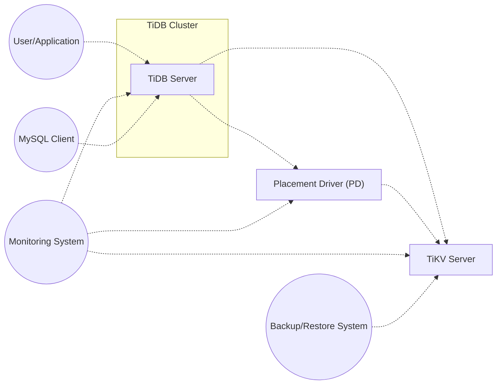
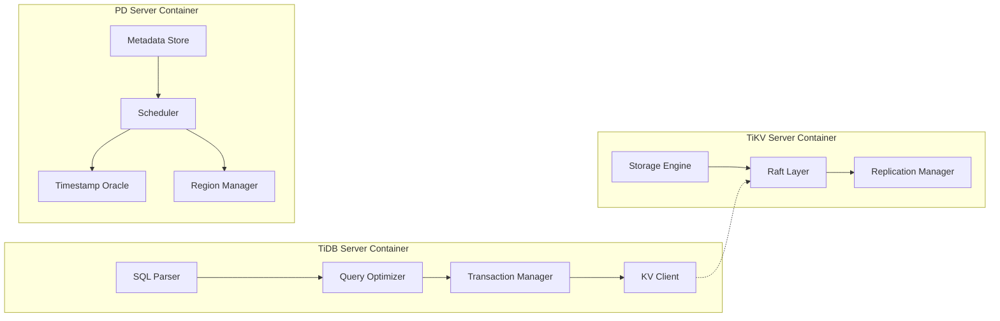
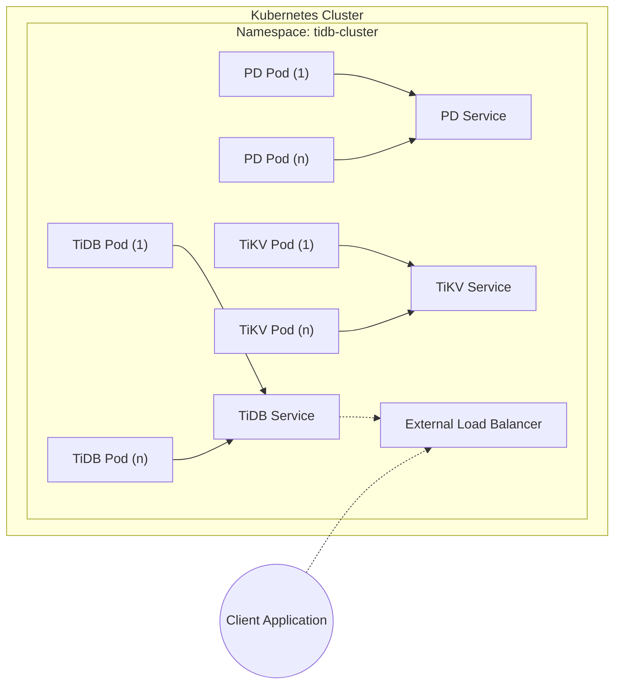

# BUSINESS POSTURE

TiDB is a complex, distributed database system. Based on the GitHub repository, here's a breakdown of the likely business posture:

Priorities and Goals:

*   Provide a highly scalable and resilient SQL database solution.
*   Offer MySQL compatibility to ease migration and adoption.
*   Ensure high availability and data consistency.
*   Support large-scale, mission-critical applications.
*   Maintain an active open-source community and ecosystem.
*   Provide both self-hosted and potentially managed (cloud) deployment options.
*   Compete with other established and emerging database solutions.

Business Risks:

*   Data loss or corruption: As a database, the most critical risk is the loss, corruption, or unauthorized access of the data it stores.
*   System downtime: Outages can significantly impact businesses relying on TiDB for critical operations.
*   Performance bottlenecks: Scalability is a key selling point, so performance issues under heavy load would be a major risk.
*   Security breaches: Unauthorized access, data breaches, or injection attacks could have severe consequences.
*   Complexity of operation: The distributed nature of TiDB introduces operational complexity, increasing the risk of misconfiguration or operational errors.
*   Competition: The database market is highly competitive. Failure to keep up with features, performance, or pricing of competitors is a risk.
*   Community and ecosystem health: Reliance on open-source contributions means a decline in community engagement could slow down development and support.

# SECURITY POSTURE

Existing Security Controls (based on the repository and common practices):

*   security control: Authentication: TiDB supports user authentication, likely with password-based and potentially other methods (e.g., external authentication providers). Implemented within the TiDB server's authentication modules.
*   security control: Authorization: Role-Based Access Control (RBAC) is likely implemented to manage user permissions and privileges. Implemented within the TiDB server's authorization modules.
*   security control: Encryption in transit: TLS/SSL is likely supported (and strongly recommended) for encrypting communication between clients and the database, and between internal components. Implemented using standard TLS libraries.
*   security control: Encryption at rest: While not explicitly clear from the repository root, encryption at rest is a *critical* feature for any production database and is likely supported, potentially through integration with underlying storage systems or dedicated encryption mechanisms.
*   security control: Input validation: As a SQL database, TiDB *must* implement robust input validation and parameterized queries to prevent SQL injection attacks. This is a fundamental part of the SQL parsing and execution engine.
*   security control: Auditing: TiDB likely provides audit logging capabilities to track user activity and database operations. Implemented within the TiDB server and potentially integrated with external logging systems.
*   security control: Network security: Deployment typically involves network-level security controls (firewalls, security groups) to restrict access to the database cluster. Implemented at the infrastructure level (e.g., cloud provider's security groups, firewalls).
*   security control: Regular security updates: The TiDB project likely follows a release process that includes security patches and updates. Implemented through the project's release management process.
*   security control: Dependency management: The project uses Go modules, which helps manage dependencies and track vulnerabilities. Implemented through Go's module system.
*   security control: Code reviews: The open-source nature of the project encourages community code reviews, which can help identify security vulnerabilities. Implemented through the GitHub pull request process.
*   security control: Static analysis: The project likely uses static analysis tools (e.g., linters, security scanners) to identify potential code quality and security issues. Implemented as part of the CI/CD pipeline.

Accepted Risks:

*   accepted risk: Operational complexity: The distributed nature of TiDB introduces significant operational complexity, which increases the risk of misconfiguration and human error. This is partially mitigated by documentation, tooling, and managed service offerings.
*   accepted risk: Potential for zero-day vulnerabilities: Like any complex software, TiDB is susceptible to undiscovered vulnerabilities. This is mitigated by ongoing security research, community contributions, and a rapid response to reported issues.
*   accepted risk: Reliance on external dependencies: TiDB relies on external libraries and components, which may have their own vulnerabilities. This is mitigated by dependency management and regular updates.

Recommended Security Controls:

*   high priority: Formal security audits: Regular, independent security audits by external experts are crucial for identifying vulnerabilities that may be missed by internal reviews.
*   high priority: Penetration testing: Regular penetration testing simulates real-world attacks to assess the security of the system.
*   high priority: Intrusion detection and prevention systems (IDPS): Deploying IDPS can help detect and respond to malicious activity within the cluster.
*   high priority: Data Loss Prevention (DLP): Implementing DLP measures can help prevent sensitive data from leaving the system unauthorized.
*   high priority: Web Application Firewall (WAF): If TiDB is exposed through a web interface or API, a WAF can provide an additional layer of protection against web-based attacks.
*   high priority: Secrets management: Securely store and manage sensitive credentials (e.g., passwords, API keys) using a dedicated secrets management solution.

Security Requirements:

*   Authentication:
    *   Support strong password policies.
    *   Offer multi-factor authentication (MFA).
    *   Integrate with external identity providers (e.g., LDAP, Active Directory).
    *   Provide mechanisms for secure password reset and recovery.
*   Authorization:
    *   Implement fine-grained RBAC.
    *   Support the principle of least privilege.
    *   Allow for granular control over access to specific databases, tables, and operations.
*   Input Validation:
    *   Strictly validate all user inputs.
    *   Use parameterized queries to prevent SQL injection.
    *   Implement robust error handling to avoid information leakage.
*   Cryptography:
    *   Use strong, industry-standard encryption algorithms.
    *   Securely manage encryption keys.
    *   Support both encryption in transit and at rest.
    *   Regularly review and update cryptographic implementations.

# DESIGN

## C4 CONTEXT

Elements Description:

*   Element:
    *   Name: User/Application
    *   Type: User
    *   Description: Represents a user or application interacting with the TiDB cluster.
    *   Responsibilities: Sending SQL queries, receiving results, managing data.
    *   Security controls: Authentication, authorization, network security.

*   Element:
    *   Name: TiDB Server
    *   Type: System
    *   Description: The SQL layer of TiDB.  Processes SQL queries, interacts with TiKV and PD.
    *   Responsibilities: SQL parsing, query optimization, transaction management, communication with TiKV and PD.
    *   Security controls: Authentication, authorization, input validation, audit logging.

*   Element:
    *   Name: Placement Driver (PD)
    *   Type: System
    *   Description: The cluster manager.  Manages metadata, schedules tasks, and ensures data consistency.
    *   Responsibilities: Metadata management, region scheduling, service discovery, timestamp allocation.
    *   Security controls: Authentication, authorization, network security, secure communication with TiDB and TiKV.

*   Element:
    *   Name: TiKV Server
    *   Type: System
    *   Description: The distributed key-value storage layer.
    *   Responsibilities: Data storage, retrieval, replication, and consistency.
    *   Security controls: Authentication, authorization, encryption at rest, network security, secure communication with TiDB and PD.

*   Element:
    *   Name: Monitoring System
    *   Type: External System
    *   Description: Collects and visualizes metrics from TiDB, PD, and TiKV.
    *   Responsibilities: Monitoring cluster health, performance, and resource usage.
    *   Security controls: Authentication, authorization, secure communication with monitored components.

*   Element:
    *   Name: Backup/Restore System
    *   Type: External System
    *   Description: Performs backups and restores of TiKV data.
    *   Responsibilities: Creating consistent backups, restoring data in case of failure.
    *   Security controls: Authentication, authorization, encryption of backup data, secure communication with TiKV.

*   Element:
    *   Name: MySQL Client
    *   Type: External System
    *   Description: Represents a standard MySQL client connecting to TiDB.
    *   Responsibilities: Sending SQL queries, receiving results.
    *   Security controls: Authentication, authorization (handled by TiDB).

## C4 CONTAINER

Elements Description:

*   Element:
    *   Name: SQL Layer
    *   Type: Container
    *   Description: Parses SQL queries received from clients.
    *   Responsibilities: Lexical analysis, syntax analysis, semantic analysis.
    *   Security controls: Input validation, SQL injection prevention.

*   Element:
    *   Name: Query Optimizer
    *   Type: Container
    *   Description: Optimizes the execution plan for SQL queries.
    *   Responsibilities: Cost estimation, plan selection, index selection.
    *   Security controls: None directly, but relies on the security of the underlying data.

*   Element:
    *   Name: Transaction Manager
    *   Type: Container
    *   Description: Manages transactions and ensures ACID properties.
    *   Responsibilities: Transaction initiation, commit, rollback, concurrency control.
    *   Security controls: Access control enforcement (relies on authorization checks).

*   Element:
    *   Name: KV Client
    *   Type: Container
    *   Description: Communicates with the TiKV cluster to read and write data.
    *   Responsibilities: Sending requests to TiKV, handling responses, retries.
    *   Security controls: Secure communication (TLS).

*   Element:
    *   Name: Metadata Store
    *   Type: Container
    *   Description: Stores cluster metadata (region information, node status).
    *   Responsibilities: Providing metadata to other PD components.
    *   Security controls: Data integrity checks, access control.

*   Element:
    *   Name: Scheduler
    *   Type: Container
    *   Description: Schedules tasks and manages data distribution across TiKV nodes.
    *   Responsibilities: Region splitting, merging, replica placement.
    *   Security controls: None directly, but relies on the security of the metadata store.

*   Element:
    *   Name: Timestamp Oracle (TSO)
    *   Type: Container
    *   Description: Provides globally unique timestamps for transactions.
    *   Responsibilities: Generating timestamps, ensuring monotonicity.
    *   Security controls: Secure time synchronization.

*   Element:
    *   Name: Region Manager
    *   Type: Container
    *   Description: Manages regions and their replicas.
    *   Responsibilities: Tracking region locations, handling replica failures.
    *   Security controls: None directly, but relies on the security of the metadata store.

*   Element:
    *   Name: Storage Engine
    *   Type: Container
    *   Description: Stores data on disk (e.g., RocksDB).
    *   Responsibilities: Data persistence, read/write operations.
    *   Security controls: Encryption at rest.

*   Element:
    *   Name: Raft Layer
    *   Type: Container
    *   Description: Implements the Raft consensus algorithm for data replication and consistency.
    *   Responsibilities: Leader election, log replication, state machine application.
    *   Security controls: Secure communication between Raft nodes (TLS).

*   Element:
    *   Name: Replication Manager
    *   Type: Container
    *   Description: Manages data replication across TiKV nodes.
    *   Responsibilities: Ensuring data consistency, handling replica failures.
    *   Security controls: None directly, but relies on the security of the Raft layer.

## DEPLOYMENT

Possible Deployment Solutions:

1.  Manual Deployment: Directly installing and configuring TiDB, PD, and TiKV on individual servers.
2.  Ansible/Puppet/Chef: Using configuration management tools to automate the deployment process.
3.  Docker Compose: Deploying TiDB components as Docker containers using Docker Compose.
4.  Kubernetes: Deploying TiDB as a stateful application on a Kubernetes cluster. This is the most likely and recommended approach for production deployments.
5.  TiDB Operator: A Kubernetes operator specifically designed for managing TiDB clusters. This simplifies deployment, scaling, and upgrades.
6.  Cloud-Specific Managed Services: Utilizing cloud provider offerings (if available) for managed TiDB deployments.

Chosen Solution: Kubernetes with TiDB Operator

Elements Description:

*   Element:
    *   Name: Client Application
    *   Type: External System
    *   Description: An application connecting to the TiDB cluster.
    *   Responsibilities: Sending requests to the database.
    *   Security controls: Authentication, authorization (handled by TiDB).

*   Element:
    *   Name: Kubernetes Cluster
    *   Type: Infrastructure
    *   Description: The Kubernetes cluster hosting the TiDB deployment.
    *   Responsibilities: Orchestrating containers, managing resources, providing networking.
    *   Security controls: Kubernetes RBAC, network policies, pod security policies.

*   Element:
    *   Name: Namespace: tidb-cluster
    *   Type: Logical Boundary
    *   Description: A Kubernetes namespace isolating the TiDB deployment.
    *   Responsibilities: Providing a scope for names and resources.
    *   Security controls: Kubernetes RBAC, network policies.

*   Element:
    *   Name: TiDB Pod (1..n)
    *   Type: Pod
    *   Description: Kubernetes pods running TiDB server instances.
    *   Responsibilities: Running the TiDB server process.
    *   Security controls: Container image security, resource limits, network policies.

*   Element:
    *   Name: PD Pod (1..n)
    *   Type: Pod
    *   Description: Kubernetes pods running PD server instances.
    *   Responsibilities: Running the PD server process.
    *   Security controls: Container image security, resource limits, network policies.

*   Element:
    *   Name: TiKV Pod (1..n)
    *   Type: Pod
    *   Description: Kubernetes pods running TiKV server instances.
    *   Responsibilities: Running the TiKV server process.
    *   Security controls: Container image security, resource limits, network policies, persistent volume security.

*   Element:
    *   Name: TiDB Service
    *   Type: Service
    *   Description: A Kubernetes service exposing TiDB pods.
    *   Responsibilities: Providing a stable endpoint for accessing TiDB.
    *   Security controls: Network policies.

*   Element:
    *   Name: PD Service
    *   Type: Service
    *   Description: A Kubernetes service exposing PD pods.
    *   Responsibilities: Providing a stable endpoint for accessing PD.
    *   Security controls: Network policies.

*   Element:
    *   Name: TiKV Service
    *   Type: Service
    *   Description: A Kubernetes service exposing TiKV pods.
    *   Responsibilities: Providing a stable endpoint for accessing TiKV.
    *   Security controls: Network policies.

*   Element:
    *   Name: External Load Balancer
    *   Type: Load Balancer
    *   Description: An external load balancer (e.g., cloud provider's load balancer) distributing traffic to the TiDB service.
    *   Responsibilities: Load balancing client connections.
    *   Security controls: TLS termination, network security rules.

## BUILD

The TiDB build process leverages Go's build system and likely incorporates several security measures.

```mermaid
graph LR
    Developer["Developer"] --> GitRepository["Git Repository (GitHub)"]
    GitRepository --> CI_Server["CI Server (GitHub Actions)"]
    CI_Server --> Build["Build (Go Build)"]
    Build --> SAST["Static Analysis (SAST)"]
    SAST --> SCA["Software Composition Analysis (SCA)"]
    SCA --> Tests["Unit & Integration Tests"]
    Tests --> Artifacts["Build Artifacts (Binaries, Docker Images)"]
    Artifacts --> ArtifactRegistry["Artifact Registry (Docker Hub, etc.)"]
```

Build Process Description:

1.  Developer commits code to the GitHub repository.
2.  A CI/CD system (likely GitHub Actions, based on the presence of `.github/workflows`) is triggered.
3.  The CI server checks out the code.
4.  The Go build system compiles the code.
5.  Static analysis tools (SAST) scan the code for potential vulnerabilities. Examples include GoSec, staticcheck.
6.  Software Composition Analysis (SCA) tools analyze dependencies for known vulnerabilities. Examples include `go list -m all` combined with vulnerability databases.
7.  Unit and integration tests are executed.
8.  If all checks and tests pass, build artifacts (binaries, Docker images) are created.
9.  The artifacts are pushed to an artifact registry (e.g., Docker Hub, a private registry).

Security Controls:

*   security control: Code reviews: Required pull requests before merging code to the main branch.
*   security control: Static analysis (SAST): Automated code scanning for vulnerabilities.
*   security control: Software Composition Analysis (SCA): Identifying vulnerabilities in dependencies.
*   security control: Automated testing: Unit and integration tests to ensure code quality and prevent regressions.
*   security control: Signed commits: Enforcing signed commits to verify the authenticity of code changes. (Potentially used, not explicitly stated in the repo root).
*   security control: Build provenance: Generating build provenance information to track the origin and build process of artifacts. (Potentially used, best practice).
*   security control: Container image signing: Signing Docker images to ensure their integrity and authenticity. (Potentially used, best practice).

# RISK ASSESSMENT

Critical Business Processes:

*   Online Transaction Processing (OLTP): TiDB is designed for OLTP workloads, so ensuring the availability, performance, and integrity of transactional operations is paramount.
*   Data Analytics (HTAP): TiDB also supports Hybrid Transactional/Analytical Processing (HTAP), making real-time analytics a critical business process.
*   Data Storage and Retrieval: The fundamental function of a database is to store and retrieve data reliably.

Data Sensitivity:

The data stored in TiDB can vary greatly in sensitivity depending on the specific use case. It could range from:

*   Non-sensitive data: Test data, publicly available information.
*   Personally Identifiable Information (PII): Names, addresses, contact details.
*   Protected Health Information (PHI): Medical records, health insurance information.
*   Financial data: Credit card numbers, bank account details, transaction history.
*   Intellectual property: Source code, trade secrets, confidential documents.
*   Authentication credentials: Usernames, passwords, API keys.

The sensitivity of the data dictates the level of security controls required. For example, storing PHI or financial data requires significantly higher security measures than storing non-sensitive data.

# QUESTIONS & ASSUMPTIONS

Questions:

*   What specific compliance requirements (e.g., GDPR, HIPAA, PCI DSS) must TiDB deployments adhere to? This will significantly impact the required security controls.
*   What is the expected threat model? Are there specific types of attackers or attacks that are of particular concern?
*   What are the specific performance and scalability requirements? This will influence the deployment architecture and resource allocation.
*   What are the existing disaster recovery and business continuity plans?
*   Is there a dedicated security team responsible for TiDB security?
*   What is the process for reporting and handling security vulnerabilities?
*   Are there any specific cloud providers or infrastructure environments that TiDB will be deployed on?
*   What level of access do developers have to production environments?
*   What are the specific monitoring and alerting requirements?
*   What is the budget allocated for security controls and tools?

Assumptions:

*   BUSINESS POSTURE: The primary goal is to provide a reliable, scalable, and secure database solution for mission-critical applications.
*   BUSINESS POSTURE: High availability and data consistency are paramount.
*   BUSINESS POSTURE: The project has a strong commitment to security and follows best practices.
*   SECURITY POSTURE: The existing security controls mentioned are in place, or their implementation is planned.
*   SECURITY POSTURE: The development team follows secure coding practices.
*   SECURITY POSTURE: Regular security updates and patches are applied promptly.
*   DESIGN: The deployment will be on Kubernetes using the TiDB Operator.
*   DESIGN: The build process includes static analysis and dependency scanning.
*   DESIGN: The system is designed to handle sensitive data, requiring robust security controls.
*   DESIGN: There is a need for both encryption in transit and at rest.