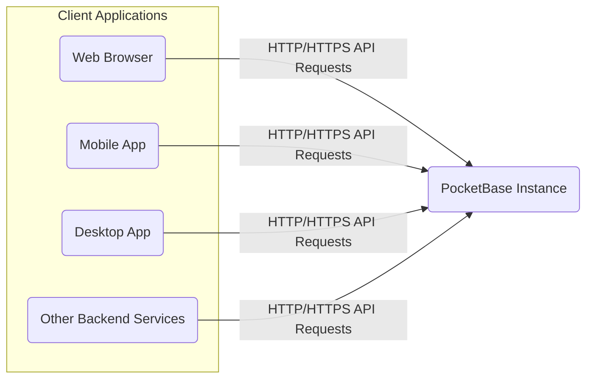

# Project Design Document: PocketBase

**Version:** 1.1
**Date:** October 26, 2023
**Author:** AI Software Architect

## 1. Introduction

This document provides an enhanced design overview of the PocketBase project, an open-source backend as a service. The purpose of this document is to clearly articulate the system's architecture, components, and data flow, specifically to serve as a robust foundation for subsequent threat modeling activities. This revision aims to provide greater clarity and detail compared to the previous version.

## 2. Goals

*   Provide a comprehensive and detailed architectural overview of PocketBase.
*   Clearly identify key components and their interactions, emphasizing security-relevant boundaries.
*   Describe the data flow within the system for various critical operations, highlighting potential vulnerabilities.
*   Elaborate on potential security considerations based on the design, directly linking them to architectural elements.
*   Serve as a precise and actionable basis for future threat modeling exercises.

## 3. High-Level Architecture

PocketBase is architected as a self-contained, single executable application. This design choice simplifies deployment and management by bundling the backend API, an embedded SQLite database, and an administrative user interface.



## 4. Detailed Architecture

The internal structure of the PocketBase instance comprises several interconnected components, each with specific responsibilities. Understanding these components is crucial for identifying potential attack surfaces.

```mermaid
graph LR
    subgraph "PocketBase Instance"
        F("HTTP Server")
        G("API Router")
        H("Authentication & Authorization Manager")
        I("Database Interface (SQLite)")
        J("Realtime Engine")
        K("File Storage Manager")
        L("Admin UI Web Server")
        M("Background Worker Queue")
    end

    F -- "Routes Requests" --> G
    G -- "Handles Authentication/Authorization" --> H
    G -- "Data Access" --> I
    G -- "Manages Realtime Connections" --> J
    G -- "File Operations" --> K
    F -- "Serves Admin UI" --> L
    M -- "Performs Background Tasks" --> I

    H -- "Queries User Data" --> I
    J -- "Publishes/Subscribes to Data Changes" --> I
    K -- "Stores/Retrieves Files" --> "File System / Cloud Storage"
```

## 5. Component Descriptions

*   **HTTP Server:**  The entry point for all external communication. It listens on configured network interfaces and ports, handling incoming HTTP/HTTPS requests and dispatching them for further processing.
    *   Responsible for TLS termination if configured.
    *   May implement basic request filtering or rate limiting.
*   **API Router:**  Examines incoming HTTP requests and routes them to the appropriate handler function based on the request method (GET, POST, PUT, DELETE, etc.) and URL path.
    *   Defines the application's API endpoints.
    *   Often implements middleware for tasks like logging and request validation.
*   **Authentication & Authorization Manager:**  Handles user authentication (verifying identity) and authorization (determining access rights).
    *   Supports various authentication methods (e.g., local accounts, OAuth2).
    *   Manages user roles and permissions.
    *   Generates and validates authentication tokens (e.g., JWTs).
*   **Database Interface (SQLite):**  Provides an abstraction layer for interacting with the embedded SQLite database.
    *   Executes SQL queries for data manipulation and retrieval.
    *   Manages database connections and transactions.
    *   Responsible for data integrity and persistence.
*   **Realtime Engine:**  Manages persistent, bidirectional communication channels with clients (typically using WebSockets).
    *   Allows clients to subscribe to specific data changes.
    *   Broadcasts updates to subscribed clients when data is modified.
    *   Needs to manage connection state and scalability.
*   **File Storage Manager:**  Handles the storage and retrieval of user-uploaded files.
    *   Can store files locally on the server's filesystem or integrate with cloud storage providers (configuration dependent).
    *   Manages file metadata (e.g., filename, size, MIME type).
    *   Needs to handle file uploads, downloads, and potentially deletion.
*   **Admin UI Web Server:**  Serves the web-based administrative interface, allowing administrators to manage the PocketBase instance.
    *   Provides functionalities for user management, schema definition, data browsing, and settings configuration.
    *   Requires strong authentication and authorization to protect sensitive administrative functions.
*   **Background Worker Queue:**  Manages asynchronous tasks that are executed outside the main request-response cycle.
    *   Examples include sending emails (e.g., password resets), processing large datasets, or performing scheduled maintenance.
    *   Often uses a queueing mechanism to manage tasks.

## 6. Data Flow

This section details the flow of data for several key operations, highlighting potential points of interaction and security relevance.

### 6.1. User Login (Email/Password)

1. Client application sends an HTTP POST request to the `/api/collections/users/auth-with-password` endpoint with email and password in the request body.
2. The **HTTP Server** receives the request and forwards it to the **API Router**.
3. The **API Router** directs the request to the **Authentication & Authorization Manager**.
4. The **Authentication & Authorization Manager** retrieves the user's record from the **Database Interface (SQLite)** based on the provided email.
5. The **Authentication & Authorization Manager** verifies the provided password against the stored password hash.
6. Upon successful verification, the **Authentication & Authorization Manager** generates a session token (typically a JWT).
7. The session token is returned to the client application in the HTTP response (often in an `Authorization` header or a cookie).

### 6.2. Creating a New Data Record

1. Client application sends an authenticated HTTP POST request to the `/api/collections/{collection_name}/records` endpoint with the new record data in the request body (JSON format).
2. The **HTTP Server** receives the request and forwards it to the **API Router**.
3. The **API Router** identifies the target collection and directs the request to the appropriate handler.
4. The handler interacts with the **Authentication & Authorization Manager** to verify the user's permissions to create records in the specified collection using the provided authentication token.
5. If authorized, the handler validates the incoming data against the collection's schema.
6. The handler sends the validated data to the **Database Interface (SQLite)** for insertion.
7. The **Database Interface (SQLite)** inserts the new record into the database.
8. If realtime subscriptions are active for this collection, the **Database Interface (SQLite)** notifies the **Realtime Engine** about the new record.
9. The **Realtime Engine** broadcasts the new record data to all clients subscribed to that collection.
10. A success response (typically including the newly created record's ID) is returned to the client application.

### 6.3. Uploading a File

1. Client application sends an authenticated HTTP POST request to the `/api/collections/{collection_name}/records` endpoint (or a dedicated file upload endpoint) with the file data as part of a multipart/form-data request.
2. The **HTTP Server** receives the request and forwards it to the **API Router**.
3. The **API Router** directs the request to the **File Storage Manager**.
4. The **File Storage Manager** receives the file data.
5. The **File Storage Manager** stores the file in the configured storage location (local filesystem or cloud storage).
6. The **File Storage Manager** (or the calling handler) may update the corresponding data record in the **Database Interface (SQLite)** with metadata about the uploaded file (e.g., filename, storage path/URL).
7. A success response, potentially including the file's URL or ID, is returned to the client application.

### 6.4. Realtime Data Subscription

1. Client application initiates a WebSocket connection to the PocketBase instance's realtime endpoint (typically `/api/realtime`).
2. The **HTTP Server** (or a dedicated WebSocket handler) upgrades the connection to a WebSocket.
3. The client application sends a subscription message to the **Realtime Engine**, specifying the collections or record IDs it wants to subscribe to.
4. The **Realtime Engine** registers the client's subscription.
5. When data changes occur in the **Database Interface (SQLite)** that match the client's subscriptions, the **Database Interface (SQLite)** notifies the **Realtime Engine**.
6. The **Realtime Engine** pushes the updated data to the subscribed client(s) over the WebSocket connection.

## 7. Security Considerations

This section outlines key security considerations based on the architecture, providing a starting point for threat modeling.

*   **Authentication and Authorization Vulnerabilities:**
    *   Weak password hashing algorithms could lead to password compromise.
    *   Implementation flaws in OAuth2 flows could allow unauthorized access.
    *   Insufficiently granular authorization rules might permit privilege escalation.
    *   Insecure storage or transmission of session tokens (e.g., JWTs) could lead to session hijacking.
*   **Data Security Risks:**
    *   The SQLite database file, if not properly protected, could be accessed directly, bypassing authentication.
    *   Lack of encryption at rest for the database could expose sensitive data.
    *   Man-in-the-middle attacks could intercept data in transit if HTTPS is not enforced or configured correctly.
    *   Insufficient input validation could lead to SQL injection attacks.
*   **File Storage Security Concerns:**
    *   Inadequate access controls on stored files could allow unauthorized access or modification.
    *   Path traversal vulnerabilities in file upload/download mechanisms could expose arbitrary files.
    *   Lack of malware scanning on uploaded files could introduce security risks.
*   **Admin UI Security Weaknesses:**
    *   Brute-force attacks against admin login could compromise the entire instance.
    *   Cross-Site Scripting (XSS) vulnerabilities in the Admin UI could allow attackers to execute malicious scripts in an administrator's browser.
    *   Cross-Site Request Forgery (CSRF) vulnerabilities could allow attackers to perform unauthorized actions on behalf of an authenticated administrator.
*   **Realtime Engine Security Issues:**
    *   Lack of proper authorization checks on realtime subscriptions could lead to unauthorized data leakage.
    *   Denial-of-service attacks targeting the WebSocket connections could disrupt realtime functionality.
    *   Injection vulnerabilities within realtime messages could compromise clients.
*   **Dependency Vulnerabilities:**
    *   Using outdated or vulnerable third-party libraries could introduce security flaws.
*   **Deployment Security Misconfigurations:**
    *   Exposing the PocketBase instance on the public internet without proper security measures (e.g., firewalls) increases the attack surface.
    *   Default or weak configuration settings could leave the instance vulnerable.
*   **Rate Limiting Deficiencies:**
    *   Absence of or insufficient rate limiting on API endpoints could allow brute-force attacks or denial-of-service attacks.

## 8. Deployment Considerations

PocketBase's design facilitates various deployment strategies:

*   **Direct Execution:** Running the single executable directly on an operating system.
    *   Requires managing dependencies and system-level security.
*   **Containerization (Docker):** Packaging PocketBase within a Docker container for isolated and reproducible deployments.
    *   Simplifies deployment and management but requires securing the container environment.
*   **Platform as a Service (PaaS):** Deploying on platforms like Heroku, Fly.io, or similar services.
    *   Leverages the platform's infrastructure and security features but requires understanding the platform's security model.

The chosen deployment method significantly impacts the specific security controls that need to be implemented.

## 9. Future Considerations

Potential future enhancements that could impact the architecture and security include:

*   **Support for Multiple Database Backends:**  Moving beyond SQLite to support more scalable database systems like PostgreSQL or MySQL. This would introduce new database interface components and security considerations.
*   **Plugin/Extension System:** Allowing developers to extend PocketBase functionality. This would require careful consideration of plugin security and isolation.
*   **Enhanced Auditing and Logging:** Implementing more comprehensive logging of security-related events and data access.
*   **Improved Scalability and High Availability:** Architecting for horizontal scaling and redundancy to handle increased load and ensure uptime.

This revised document provides a more detailed and security-focused overview of the PocketBase architecture, intended to be a valuable resource for subsequent threat modeling activities.