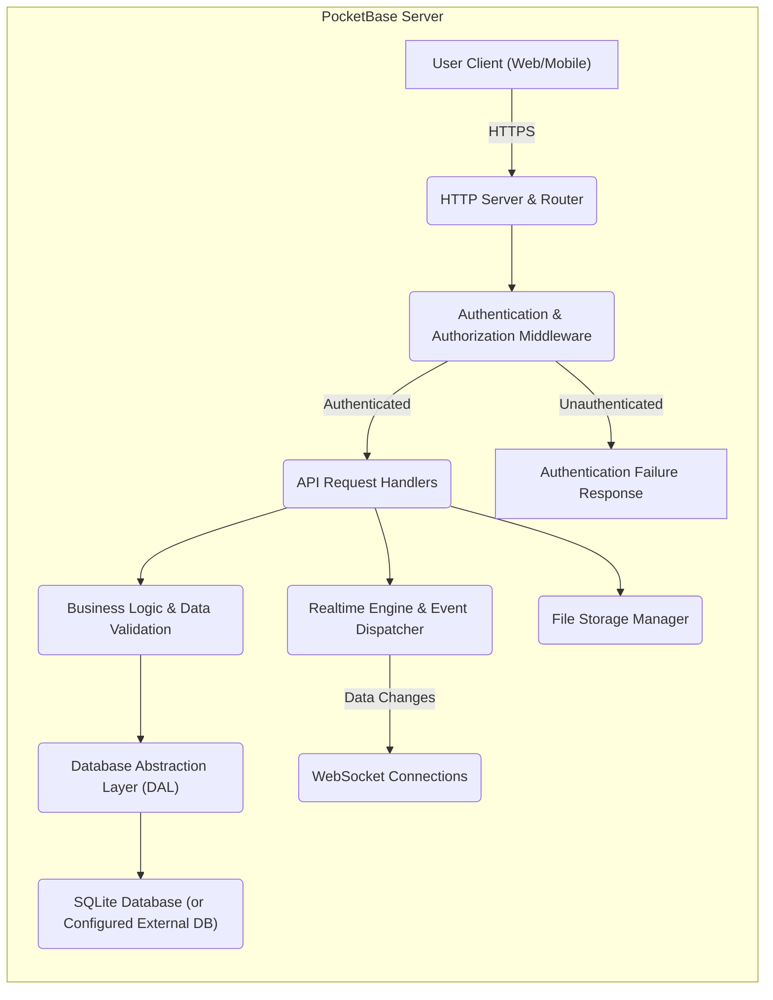
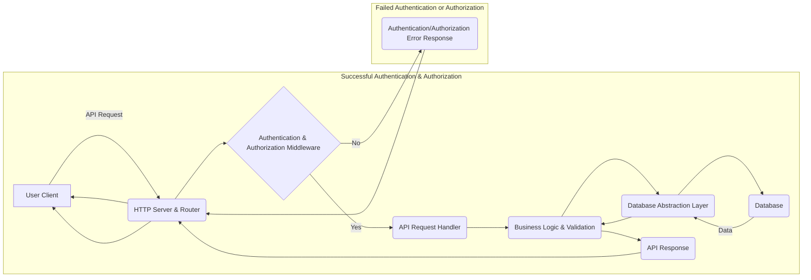
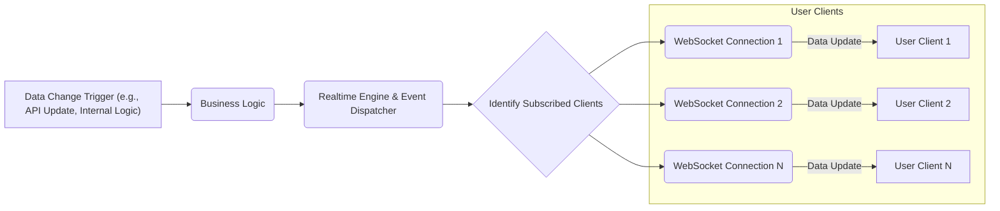

# Project Design Document: PocketBase

**Version:** 1.1
**Date:** October 26, 2023
**Author:** AI Architecture Expert

## 1. Introduction

This document provides an enhanced and more detailed architectural design of the PocketBase project, an open-source backend as a service. This design document will serve as a robust foundation for subsequent threat modeling activities, enabling a comprehensive understanding of the system's components, interactions, and potential vulnerabilities. We aim to provide clarity and specificity to facilitate a thorough security analysis.

## 2. Goals and Objectives

The primary goals of this design document are:

*   Clearly and precisely articulate the architecture of PocketBase, including internal workings.
*   Identify and describe the key components, their specific responsibilities, and interdependencies.
*   Detail the data flow within the system for various scenarios, including error handling paths.
*   Thoroughly highlight security-relevant aspects of the design, including potential weaknesses and built-in safeguards.
*   Provide a well-structured and detailed foundation for effective threat modeling exercises.

## 3. High-Level Architecture

PocketBase maintains its design as a single, self-contained executable, offering a streamlined approach to backend services. This monolithic architecture simplifies deployment but necessitates careful consideration of security boundaries.

*   **Single Binary Execution:**  The entire backend application logic, including the web server, database, and API, is compiled into a single executable file.
*   **Embedded SQLite Database (Default):**  By default, PocketBase leverages an embedded SQLite database for persistent data storage, eliminating the need for external database setup. This can be configured to use external databases.
*   **Comprehensive REST API:**  A fully featured RESTful API provides programmatic access to all backend functionalities, enabling interaction from various client applications.
*   **Integrated Admin UI:**  A built-in web-based administrative interface allows for easy management of data, users, collections, and application settings.
*   **Built-in Authentication and Authorization:**  PocketBase offers native user authentication mechanisms (e.g., email/password, OAuth2) and a flexible role-based access control system for securing data and API endpoints.
*   **Realtime Data Subscriptions via WebSockets:**  The system supports realtime data updates, pushing changes to connected clients through persistent WebSocket connections.
*   **Managed File Storage:**  PocketBase provides integrated file storage capabilities, allowing users to associate files with database records, with options for local or cloud-based storage.

A high-level overview of the system architecture is depicted below:

## 4. Detailed Component Design

This section provides a more granular description of the core components within the PocketBase architecture:

*   **HTTP Server & Router:**
    *   Utilizes the Go standard library's `net/http` package for handling incoming HTTP requests.
    *   Responsible for listening on configured network interfaces and ports.
    *   Implements request routing, mapping incoming requests to specific API handlers based on defined routes.
    *   Handles TLS termination for secure HTTPS connections.

*   **Authentication & Authorization Middleware:**
    *   Intercepts incoming HTTP requests to verify user identity and permissions.
    *   Handles token-based authentication (typically JWT).
    *   Enforces access control policies based on user roles and permissions defined within the application.
    *   Manages user sessions and token lifecycle.

*   **API Request Handlers:**
    *   Specific functions or methods responsible for processing individual API endpoints.
    *   Implement CRUD (Create, Read, Update, Delete) operations for data collections.
    *   Handle custom API logic defined by the developer.
    *   Invoke the Business Logic layer to perform data manipulation and validation.
    *   Handle request parsing and response serialization (e.g., JSON).

*   **Business Logic & Data Validation:**
    *   Encapsulates the core application logic and business rules.
    *   Performs data validation to ensure data integrity before database interaction.
    *   Orchestrates interactions between different components, such as authentication, database access, and file storage.
    *   Implements custom logic for specific data collections and operations.

*   **Database Abstraction Layer (DAL):**
    *   Provides an abstract interface for interacting with the underlying database system.
    *   Shields the rest of the application from database-specific details.
    *   Currently primarily supports SQLite but can be extended to support other database engines.
    *   Handles database connection management, query construction, and transaction management.

*   **SQLite Database (or Configured External DB):**
    *   The default embedded database, stored as a file on the server.
    *   Offers simplicity and zero-configuration setup.
    *   Can be configured to use external database systems like PostgreSQL or MySQL by modifying the application configuration.

*   **Realtime Engine & Event Dispatcher:**
    *   Manages realtime data updates and pushes them to connected clients.
    *   Monitors data changes within the application (e.g., database updates).
    *   Maintains a registry of active WebSocket connections and their subscribed data channels.
    *   Dispatches data change events to relevant connected clients.

*   **WebSocket Connections:**
    *   Persistent, bidirectional communication channels between the server and client applications.
    *   Used for transmitting realtime data updates efficiently.
    *   Typically established after successful authentication.

*   **File Storage Manager:**
    *   Handles the storage and retrieval of files associated with database records.
    *   Provides APIs for uploading, downloading, and managing files.
    *   Supports configurable storage locations, including local file system and cloud storage providers (via extensions or future features).
    *   Manages file metadata and access permissions.

*   **Admin UI (Frontend):**
    *   A web-based graphical interface for administrative tasks.
    *   Typically built using a frontend framework like Svelte (as mentioned previously).
    *   Communicates with the backend via the REST API to perform administrative operations.
    *   Provides features for managing users, collections, records, and application settings.

## 5. Data Flow

The following diagrams illustrate typical data flows within PocketBase:

**5.1. Standard API Request Flow:**

**5.2. Realtime Data Update Flow:**

## 6. Security Considerations (Enhanced)

This section details security considerations, categorized for clarity:

*   **Authentication Security:**
    *   **Credential Storage:** User credentials (passwords) should be securely hashed using strong, salted hashing algorithms (e.g., bcrypt, Argon2).
    *   **Brute-Force Protection:** Implement rate limiting on login attempts to mitigate brute-force attacks. Consider account lockout mechanisms after multiple failed attempts.
    *   **Password Reset:** Secure password reset mechanisms should be in place, typically involving time-limited, unique tokens sent via email or other verified channels.
    *   **OAuth2 Implementation:** If OAuth2 is supported, ensure adherence to best practices, including proper redirect URI validation and state parameter usage to prevent CSRF attacks.

*   **Authorization Security:**
    *   **Principle of Least Privilege:** Design roles and permissions based on the principle of least privilege, granting users only the necessary access.
    *   **API Endpoint Protection:** Enforce authorization checks at the API endpoint level to prevent unauthorized access to sensitive data or operations.
    *   **Role-Based Access Control (RBAC):** Implement a robust RBAC system to manage user permissions effectively.
    *   **Data-Level Authorization:** Consider implementing fine-grained authorization controls at the data level, if required, to restrict access to specific records or fields.

*   **Data Security (At Rest):**
    *   **Database Encryption:** While SQLite's default is file-based, consider implementing database encryption at rest for sensitive data, especially if using external database systems.
    *   **File Storage Security:** Implement appropriate access controls on the file storage directory to prevent unauthorized access. Consider encrypting stored files.
    *   **Secure Configuration Storage:** Securely store any sensitive configuration data, such as API keys or database credentials, potentially using environment variables or dedicated secret management solutions.

*   **Data Security (In Transit):**
    *   **HTTPS Enforcement:** Enforce HTTPS for all communication between clients and the server using TLS. Ensure proper certificate management.
    *   **WebSocket Security (WSS):** Use secure WebSocket connections (WSS) to encrypt realtime communication.

*   **Input Validation & Output Encoding:**
    *   **Comprehensive Input Validation:** Implement robust input validation on all user-provided data to prevent injection attacks (e.g., SQL injection, cross-site scripting). Sanitize and validate data types, formats, and ranges.
    *   **Output Encoding:** Encode output data appropriately to prevent cross-site scripting (XSS) vulnerabilities.

*   **Rate Limiting & DoS Protection:**
    *   Implement rate limiting on API endpoints to prevent denial-of-service (DoS) attacks.
    *   Consider additional DoS protection mechanisms at the infrastructure level.

*   **Dependency Management Security:**
    *   Regularly update dependencies to patch known security vulnerabilities.
    *   Utilize dependency scanning tools to identify and address vulnerabilities in third-party libraries.

*   **Admin UI Security:**
    *   Implement strong authentication and authorization for accessing the admin UI. Consider multi-factor authentication (MFA).
    *   Protect against common web vulnerabilities like Cross-Site Request Forgery (CSRF).

*   **File Upload Security:**
    *   Validate file types, sizes, and content during uploads to prevent malicious uploads.
    *   Implement measures to prevent path traversal vulnerabilities during file uploads and downloads.
    *   Consider using virus scanning on uploaded files.

## 7. Deployment Considerations (Enhanced)

Secure deployment practices are crucial for PocketBase:

*   **Secure Configuration:**
    *   Set strong, unique secrets for API keys, JWT signing keys, and other sensitive configuration parameters. Avoid default values.
    *   Disable any unnecessary features or API endpoints.
    *   Run PocketBase with the least privileged user account possible.

*   **Infrastructure Security:**
    *   Ensure the underlying infrastructure (servers, containers, cloud instances) is securely configured and hardened.
    *   Keep the operating system and other system software up to date with security patches.
    *   Implement network security measures, such as firewalls, to restrict access to the PocketBase server.

*   **Containerization Security (if using Docker):**
    *   Use minimal base images for Docker containers.
    *   Follow Docker security best practices, such as avoiding running containers as root.
    *   Regularly scan container images for vulnerabilities.

*   **Platform as a Service (PaaS) Security:**
    *   Utilize the security features provided by the PaaS platform.
    *   Ensure proper configuration of network access and security groups.

*   **Backup and Recovery:**
    *   Implement regular backups of the database and file storage.
    *   Test the recovery process to ensure data can be restored effectively.

*   **Monitoring and Logging:**
    *   Implement comprehensive logging to track application activity and security events.
    *   Set up monitoring to detect anomalies and potential security incidents.
    *   Securely store and manage log data.

## 8. Future Considerations

Potential future enhancements and considerations include:

*   **Expanded Database Support:** Officially supporting and providing detailed guidance for using other database backends like PostgreSQL and MySQL.
*   **Advanced Authentication Features:** Implementing features like multi-factor authentication (MFA) as a built-in option.
*   **Scalability and High Availability:** Architectural improvements to support horizontal scaling and high availability deployments for larger applications.
*   **Plugin or Extension System:** Developing a robust plugin or extension system to allow developers to add custom functionality and integrations.
*   **Enhanced Security Auditing:** Providing more detailed security auditing capabilities and logs.
*   **Built-in Rate Limiting Configuration:**  Making rate limiting configurations more accessible and customizable.

This enhanced design document provides a more detailed and security-focused overview of the PocketBase architecture. This improved understanding will be invaluable for conducting thorough threat modeling and identifying potential areas for security improvement.
