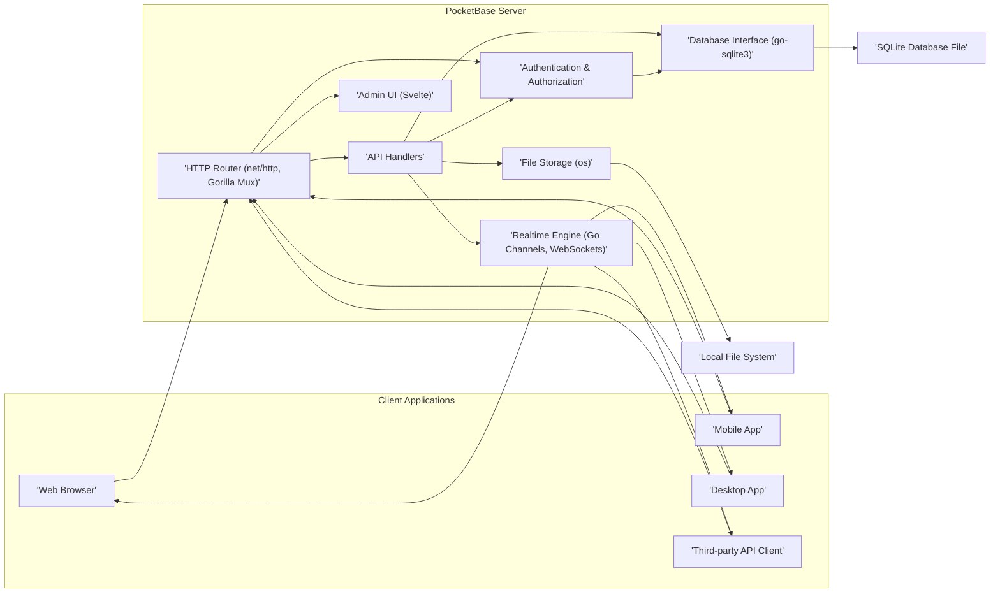
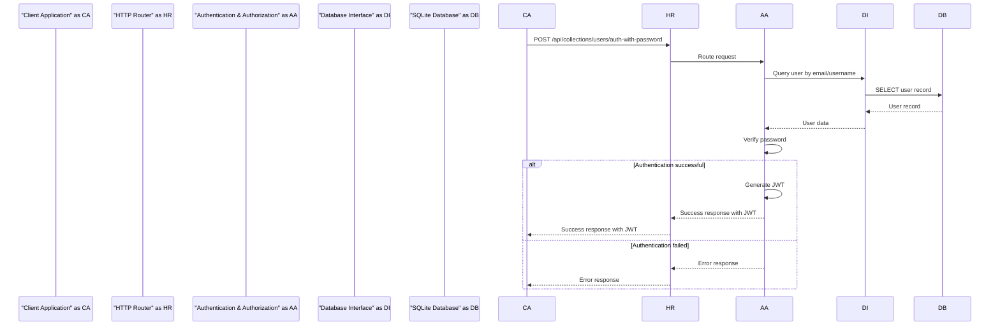
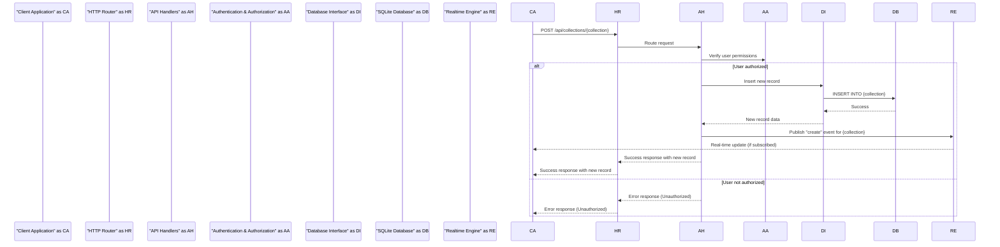
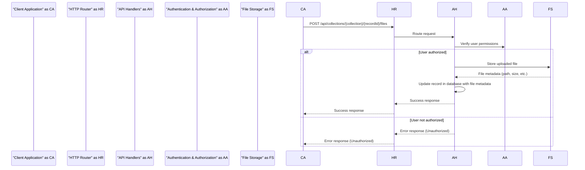

# Project Design Document: PocketBase

**Version:** 1.1
**Date:** October 26, 2023
**Author:** AI Software Architect

## 1. Introduction

This document provides an enhanced architectural design for the PocketBase project, an open-source backend as a service. This refined design aims to provide even greater clarity and detail, further strengthening its utility as a foundation for comprehensive threat modeling activities. Understanding the system's components, interactions, and potential vulnerabilities is paramount for robust security analysis.

## 2. Goals and Objectives

The primary goals of this design document are to:

*   Provide a highly detailed and clear outline of the PocketBase architecture.
*   Precisely identify the key components and their specific responsibilities and underlying technologies.
*   Thoroughly describe the interactions and data flow between components for various use cases.
*   Explicitly highlight security-relevant aspects of the design, including potential vulnerabilities and mitigation strategies.
*   Serve as a robust and actionable basis for subsequent threat modeling exercises, enabling a deeper understanding of the attack surface.

## 3. Architectural Overview

PocketBase maintains its design as a single binary application, integrating a backend API, a real-time database, and an administrative interface. This design choice continues to prioritize ease of deployment and management.

**Key Architectural Components:**

*   **Client Applications:** Encompass the various methods users interact with PocketBase, including web browsers, native mobile applications, desktop applications, and external services communicating via API calls.
*   **PocketBase Server:** The central application responsible for processing requests, managing data persistence, and facilitating real-time updates.
*   **HTTP Router:** Directs incoming HTTP requests to the appropriate API handlers or serves the static files for the admin UI. Commonly implemented using Go's standard `net/http.ServeMux` or a more feature-rich third-party router like Gorilla Mux.
*   **API Handlers:** Implement the core business logic, encompassing data manipulation, user account management, and the execution of custom API endpoints.
*   **Authentication & Authorization:** Manages user identities, authenticates users based on provided credentials, and enforces access control policies to protect resources.
*   **Realtime Engine:** Enables real-time data synchronization and pushes updates to connected clients using technologies such as Go channels and WebSockets for persistent connections.
*   **Database Interface (SQLite):** Provides an abstraction layer for interacting with the underlying SQLite database, typically using a Go SQLite driver like `go-sqlite3`.
*   **Admin UI:** A web-based graphical interface built with a frontend framework like Svelte, allowing administrators to manage the PocketBase instance, including data schemas, user roles, and application settings.
*   **File Storage:** Manages the storage and retrieval of uploaded files, typically stored directly on the local file system using the operating system's file system APIs.
*   **SQLite Database File:** The persistent storage mechanism for all application data, stored in a single SQLite database file.
*   **Local File System:** The default location where uploaded files are stored.

## 4. Component Details

This section provides a more granular description of each key component within the PocketBase architecture, including specific technologies often employed.

### 4.1. HTTP Router

*   **Responsibility:**  Receives all incoming HTTP requests and intelligently routes them to the appropriate handlers based on the defined URL paths and HTTP methods. Also responsible for serving static assets for the Admin UI.
*   **Technology:**  Typically implemented using Go's built-in `net/http` package, often leveraging the `ServeMux` for basic routing. More complex applications might utilize third-party routers like Gorilla Mux for enhanced features like route variables and middleware support.
*   **Security Relevance:**  A critical entry point for all external interactions. Proper configuration is essential to prevent unauthorized access to sensitive endpoints. Vulnerabilities here can expose the entire application.

### 4.2. API Handlers

*   **Responsibility:**  Contain the core business logic for the application. They process incoming requests, interact with the database and other components, and generate appropriate responses.
*   **Functionality:**
    *   Implementation of CRUD (Create, Read, Update, Delete) operations on database records for defined collections.
    *   Handling user registration, login, and password management.
    *   Execution of custom API endpoints defined by the application developer.
    *   Integration with the Realtime Engine to publish data changes for real-time updates.
    *   Handling file uploads and downloads, interacting with the File Storage component.
*   **Security Relevance:**  A significant attack surface. Vulnerable to injection attacks (SQL, command), business logic flaws leading to data manipulation or privilege escalation, and insecure handling of sensitive data.

### 4.3. Authentication & Authorization

*   **Responsibility:**  Verifies the identity of users attempting to access the system (authentication) and determines if they have the necessary permissions to perform the requested actions (authorization).
*   **Functionality:**
    *   User registration and login mechanisms, potentially supporting various authentication providers (e.g., email/password, OAuth2).
    *   Session management, often using JSON Web Tokens (JWTs) or secure HTTP cookies to maintain user sessions.
    *   Implementation of Role-Based Access Control (RBAC) or potentially Attribute-Based Access Control (ABAC) to manage user permissions and access to specific resources.
    *   Secure password hashing and storage using robust algorithms like Argon2id.
    *   Generation and management of API tokens for programmatic access.
*   **Security Relevance:**  A foundational security component. Weaknesses here can lead to unauthorized access, data breaches, and impersonation.

### 4.4. Realtime Engine

*   **Responsibility:**  Facilitates the near instantaneous propagation of data changes to connected clients, providing a real-time experience.
*   **Technology:**  Typically built using Go channels for efficient internal communication and WebSockets for establishing persistent, bidirectional communication channels with clients.
*   **Functionality:**
    *   Allows clients to subscribe to specific data collections or individual records.
    *   Broadcasts real-time updates to subscribed clients whenever the underlying data changes.
    *   Potentially supports filtering of updates based on client-specific criteria.
*   **Security Relevance:**  Requires secure WebSocket connections (WSS) to protect data in transit. Authorization checks are crucial to ensure clients only receive updates for data they are permitted to access. Vulnerable to denial-of-service attacks if not properly secured.

### 4.5. Database Interface (SQLite)

*   **Responsibility:**  Provides a consistent and secure way for the application to interact with the SQLite database.
*   **Technology:**  Usually implemented using a Go SQLite driver such as `go-sqlite3`, which provides the necessary functions to execute SQL queries.
*   **Functionality:**
    *   Executing SQL queries for data retrieval, insertion, updating, and deletion.
    *   Managing database connections and transactions.
    *   May provide an abstraction layer or helper functions to simplify database interactions.
*   **Security Relevance:**  Must be implemented carefully to prevent SQL injection vulnerabilities. Utilizing parameterized queries or prepared statements is essential. Proper error handling is also important to avoid leaking sensitive information.

### 4.6. Admin UI

*   **Responsibility:**  Offers a user-friendly web interface for administrators to manage the PocketBase instance.
*   **Technology:**  Likely built using a modern frontend framework like Svelte, enabling a reactive and dynamic user experience. Communicates with the backend API via standard HTTP requests.
*   **Functionality:**
    *   Definition and management of data schemas (collections and fields).
    *   User and permission management, including creating, editing, and deleting users and assigning roles.
    *   Browsing, creating, editing, and deleting data records within collections.
    *   Configuration of application settings.
    *   Potentially provides access to logs and basic monitoring information.
*   **Security Relevance:**  A high-value target for attackers. Requires strong authentication and authorization to prevent unauthorized administrative access. Susceptible to common web application vulnerabilities like Cross-Site Scripting (XSS) and Cross-Site Request Forgery (CSRF).

### 4.7. File Storage

*   **Responsibility:**  Handles the storage and retrieval of files uploaded by users or the application.
*   **Technology:**  Typically utilizes the operating system's file system APIs (e.g., the `os` package in Go) for storing files on the local file system.
*   **Functionality:**
    *   Storing uploaded files in a designated directory structure.
    *   Retrieving files based on their identifiers.
    *   Potentially supports resizing or other transformations of uploaded images.
    *   May offer options for integrating with external cloud storage providers in the future.
*   **Security Relevance:**  Requires careful implementation to prevent unauthorized access to stored files. Vulnerable to file path traversal attacks if not properly handled. Access controls must be enforced to ensure only authorized users can access specific files.

## 5. Data Flow Diagrams

This section illustrates the flow of data for key operations within PocketBase, providing a visual representation of component interactions.

### 5.1. User Authentication (with JWT)

### 5.2. Data Creation and Real-time Update

### 5.3. File Upload

## 6. Security Considerations

This section details specific security considerations based on the architectural design, categorized for clarity.

*   **Authentication and Authorization:**
    *   **Password Security:** Employ strong password hashing algorithms (e.g., Argon2id) with appropriate salt generation. Enforce password complexity policies.
    *   **Session Management:** Utilize secure and HttpOnly cookies or JWTs with appropriate expiration times. Implement measures to prevent session fixation and hijacking.
    *   **Principle of Least Privilege:** Design and enforce granular roles and permissions, ensuring users only have access to the resources they need.
    *   **Multi-Factor Authentication (MFA):** Consider implementing MFA for enhanced security, especially for administrative accounts.
    *   **API Key/Token Security:**  Treat API keys and tokens as sensitive credentials. Implement secure storage and transmission practices.
*   **Data Security:**
    *   **SQL Injection Prevention:**  Strictly use parameterized queries or prepared statements for all database interactions.
    *   **Input Validation and Sanitization:**  Thoroughly validate and sanitize all user inputs on both the client and server-side to prevent XSS, command injection, and other injection attacks.
    *   **File Storage Security:** Implement access controls to restrict access to uploaded files. Prevent directory traversal vulnerabilities. Consider storing files outside the web server's root directory.
    *   **Data Encryption:** Consider encryption at rest for sensitive data within the SQLite database. Explore options for encrypting data in transit even within the internal network if necessary. Enforce HTTPS for all external communication.
*   **Realtime Security:**
    *   **Secure WebSockets (WSS):**  Always use WSS for WebSocket connections to encrypt communication.
    *   **Authorization for Realtime Updates:** Implement authorization checks before broadcasting real-time updates to ensure clients only receive data they are authorized to access.
    *   **Rate Limiting and DoS Protection:** Implement rate limiting on WebSocket connections to prevent abuse and denial-of-service attacks.
*   **Admin UI Security:**
    *   **Strong Authentication:**  Require strong, unique credentials for accessing the admin UI. Consider IP whitelisting or other access restrictions.
    *   **Protection Against Web Application Vulnerabilities:** Implement measures to prevent XSS, CSRF, and other common web application vulnerabilities. Utilize security headers.
    *   **Regular Security Audits:** Conduct regular security audits and penetration testing of the admin UI.
*   **Deployment Security:**
    *   **Secure Server Configuration:**  Harden the server environment where PocketBase is deployed. Keep the operating system and all dependencies up to date with security patches.
    *   **Reverse Proxy Security:**  Properly configure the reverse proxy (if used) to handle SSL termination, add security headers, and provide an additional layer of defense.
    *   **Network Segmentation:**  Consider network segmentation to isolate the PocketBase server from other less trusted networks.
*   **Rate Limiting:**
    *   Implement rate limiting on API endpoints to prevent brute-force attacks and resource exhaustion.
*   **Error Handling:**
    *   Implement secure error handling practices to avoid leaking sensitive information in error messages.

## 7. Deployment Considerations

*   **Single Binary Execution:** PocketBase's design as a single executable simplifies deployment across various operating systems.
*   **Containerization (Docker):** Deploying PocketBase within Docker containers provides isolation, reproducibility, and simplifies management and scaling.
*   **Cloud Platform Deployment:**  PocketBase can be readily deployed on major cloud platforms like AWS, Google Cloud, and Azure, leveraging their infrastructure and services.
*   **Reverse Proxy Usage:**  Utilizing a reverse proxy (e.g., Nginx, Caddy) is highly recommended for handling SSL/TLS termination, load balancing across multiple instances (if needed), and adding security headers.
*   **Process Management:** Employ process managers (e.g., systemd, Supervisor) to ensure PocketBase restarts automatically in case of failures.

## 8. Future Considerations

*   **Support for Multiple Database Backends:** Expanding beyond SQLite to support other database systems like PostgreSQL or MySQL could enhance scalability and provide more options for users with different needs.
*   **Built-in Cloud Storage Integration:**  Providing native integration with popular cloud storage providers (e.g., AWS S3, Google Cloud Storage, Azure Blob Storage) for file uploads would simplify file management and improve scalability.
*   **More Granular Access Control Mechanisms:** Implementing more advanced access control models, such as attribute-based access control (ABAC), could provide finer-grained control over data access.
*   **Comprehensive Audit Logging:**  Implementing detailed audit logging for all significant actions within the system would enhance security monitoring and compliance efforts.
*   **Plugin System:**  Developing a plugin system could allow for extending PocketBase's functionality and customization.

This enhanced design document provides a more detailed and comprehensive understanding of the PocketBase architecture, serving as a valuable resource for in-depth threat modeling and future development efforts.