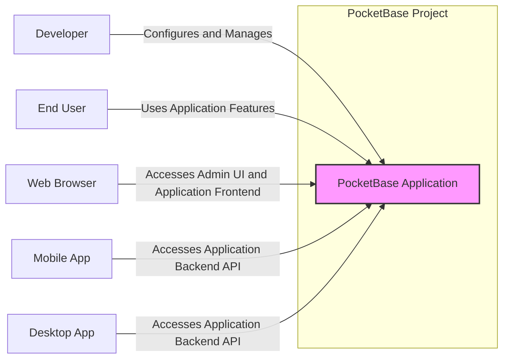
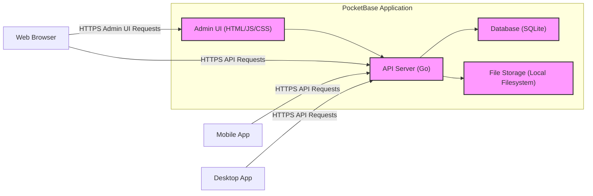
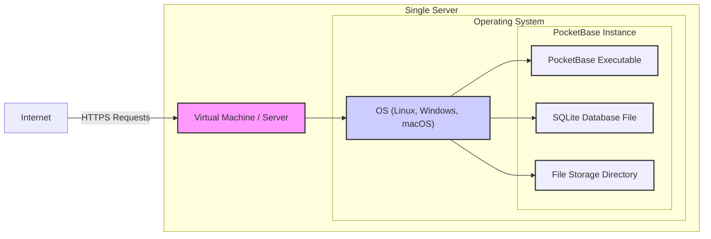

# BUSINESS POSTURE

This project, PocketBase, aims to provide a streamlined, all-in-one backend solution for developers. The primary business priority is to offer a simple and efficient way to build applications by abstracting away the complexities of setting up and managing backend infrastructure. The goal is to empower developers to rapidly prototype and deploy applications with features like real-time database, authentication, file storage, and an admin dashboard, all within a single, self-hosted executable.

The most important business risks associated with this project are:

- Data breaches and unauthorized access to sensitive application data and user information.
- Service unavailability due to security vulnerabilities or misconfigurations, impacting application uptime and user experience.
- Data integrity issues arising from software bugs or malicious attacks, leading to data corruption or loss.
- Reputational damage and loss of user trust in case of security incidents, especially if sensitive data is compromised.

# SECURITY POSTURE

Existing security controls:

- security control: HTTPS enforcement for communication between clients and the PocketBase server. (Implemented by default when using TLS certificates).
- security control: User authentication to access the admin dashboard and potentially application APIs. (Implemented within PocketBase using username/password and OAuth2).
- security control: Role-based access control (RBAC) to manage permissions within the admin dashboard and application data. (Implemented within PocketBase for admin and record access).
- security control: Input validation to prevent common web vulnerabilities like SQL injection and cross-site scripting (XSS). (Likely implemented within the PocketBase codebase, needs further investigation).
- security control: Protection against common web attacks like CSRF. (Likely implemented within the PocketBase framework, needs further investigation).

Accepted risks:

- accepted risk: Risks associated with self-hosting, where users are responsible for securing their own server infrastructure and network.
- accepted risk: Reliance on the security of the Go programming language ecosystem and its dependencies.
- accepted risk: Potential vulnerabilities in third-party libraries used by PocketBase.

Recommended security controls:

- security control: Implement automated vulnerability scanning of the PocketBase codebase and its dependencies during development and CI/CD pipeline.
- security control: Conduct regular penetration testing and security audits to identify and address potential security weaknesses.
- security control: Enforce secure coding practices throughout the development lifecycle, including code reviews and security training for developers.
- security control: Implement dependency management and security updates for all third-party libraries used by PocketBase.
- security control: Consider implementing rate limiting to protect against brute-force attacks and denial-of-service attempts.
- security control: Recommend or provide options for users to integrate a Web Application Firewall (WAF) for enhanced protection, especially in production deployments.

Security requirements:

- Authentication:
    - security requirement: Secure authentication mechanisms for admin users and application users.
    - security requirement: Support for strong password policies and multi-factor authentication (MFA) for admin users.
    - security requirement: Secure session management to prevent session hijacking.
- Authorization:
    - security requirement: Fine-grained authorization controls to manage access to data and functionalities based on user roles and permissions.
    - security requirement: Principle of least privilege should be applied to all users and roles.
    - security requirement: Secure API authorization to protect application endpoints from unauthorized access.
- Input Validation:
    - security requirement: Comprehensive input validation on all user-provided data to prevent injection attacks (SQL, NoSQL, command injection, etc.).
    - security requirement: Output encoding to prevent cross-site scripting (XSS) vulnerabilities.
    - security requirement: Protection against file upload vulnerabilities, including validation of file types and sizes.
- Cryptography:
    - security requirement: Encryption of sensitive data at rest, such as user credentials and application data. (Needs confirmation if implemented and details of encryption methods).
    - security requirement: Secure handling of cryptographic keys and secrets.
    - security requirement: Use of strong and up-to-date cryptographic algorithms and protocols.
    - security requirement: Secure communication channels using TLS/SSL for all network traffic.

# DESIGN

## C4 CONTEXT

Context Diagram Elements:

- Element:
    - Name: PocketBase Application
    - Type: Software System
    - Description: The PocketBase application itself, providing backend functionalities including database, authentication, file storage, and admin dashboard.
    - Responsibilities:
        - Manage data storage and retrieval.
        - Handle user authentication and authorization.
        - Serve application APIs and admin UI.
        - Manage file storage.
    - Security controls:
        - security control: HTTPS enforcement for all communication.
        - security control: User authentication and authorization mechanisms.
        - security control: Input validation and output encoding.
        - security control: Data encryption at rest (if implemented).
        - security control: Rate limiting and protection against common web attacks.

- Element:
    - Name: Developer
    - Type: Person
    - Description: Software developers who use PocketBase to build and manage applications.
    - Responsibilities:
        - Configure and deploy PocketBase instances.
        - Develop application frontend and integrate with PocketBase APIs.
        - Manage application data and users through the admin dashboard.
    - Security controls:
        - security control: Secure access to PocketBase admin dashboard using strong credentials.
        - security control: Following secure development practices when building applications on top of PocketBase.

- Element:
    - Name: End User
    - Type: Person
    - Description: Users who interact with applications built using PocketBase.
    - Responsibilities:
        - Use application features and access data through the application frontend.
    - Security controls:
        - security control: User authentication to access application features (if required by the application).
        - security control: Data privacy and protection as defined by the application and PocketBase.

- Element:
    - Name: Web Browser
    - Type: Software System
    - Description: Standard web browser used by developers and end-users to access the PocketBase admin UI and application frontends.
    - Responsibilities:
        - Render web pages and execute JavaScript code.
        - Communicate with the PocketBase server over HTTPS.
    - Security controls:
        - security control: Browser security features like Content Security Policy (CSP) and Same-Origin Policy (SOP) (can be configured by PocketBase application).
        - security control: User awareness of browser security best practices.

- Element:
    - Name: Mobile App
    - Type: Software System
    - Description: Mobile applications (iOS, Android, etc.) that interact with the PocketBase backend API.
    - Responsibilities:
        - Consume PocketBase APIs to access data and functionalities.
        - Present application UI to mobile users.
    - Security controls:
        - security control: Secure API communication over HTTPS.
        - security control: Secure storage of API keys or tokens within the mobile app.
        - security control: Mobile platform security features and best practices.

- Element:
    - Name: Desktop App
    - Type: Software System
    - Description: Desktop applications (Windows, macOS, Linux, etc.) that interact with the PocketBase backend API.
    - Responsibilities:
        - Consume PocketBase APIs to access data and functionalities.
        - Present application UI to desktop users.
    - Security controls:
        - security control: Secure API communication over HTTPS.
        - security control: Secure storage of API keys or tokens within the desktop app.
        - security control: Desktop platform security features and best practices.

## C4 CONTAINER

Container Diagram Elements:

- Element:
    - Name: API Server (Go)
    - Type: Container - Application
    - Description: The backend API server of PocketBase, written in Go. It handles API requests, business logic, authentication, and authorization.
    - Responsibilities:
        - Expose RESTful APIs for application functionalities.
        - Implement authentication and authorization logic.
        - Interact with the Database container for data persistence.
        - Manage file uploads and downloads through the File Storage container.
    - Security controls:
        - security control: Input validation and output encoding for API requests and responses.
        - security control: Implementation of authentication and authorization mechanisms.
        - security control: Rate limiting and protection against API abuse.
        - security control: Secure API key management (if applicable).

- Element:
    - Name: Database (SQLite)
    - Type: Container - Database
    - Description: SQLite database used by PocketBase to store application data, user information, and configurations.
    - Responsibilities:
        - Persist application data.
        - Provide data access and retrieval functionalities to the API Server.
    - Security controls:
        - security control: File system permissions to restrict access to the SQLite database file.
        - security control: Data encryption at rest for the database file (if configured and supported by underlying OS/filesystem).
        - security control: Regular backups of the database to prevent data loss.

- Element:
    - Name: Admin UI (HTML/JS/CSS)
    - Type: Container - Web Application
    - Description: Web-based admin dashboard for managing PocketBase configurations, users, and data. Built using HTML, JavaScript, and CSS.
    - Responsibilities:
        - Provide a user interface for administrative tasks.
        - Communicate with the API Server to perform actions.
    - Security controls:
        - security control: Authentication and authorization to access the admin UI.
        - security control: Protection against CSRF attacks.
        - security control: Content Security Policy (CSP) to mitigate XSS vulnerabilities.

- Element:
    - Name: File Storage (Local Filesystem)
    - Type: Container - File System
    - Description: Local filesystem directory used by PocketBase to store uploaded files.
    - Responsibilities:
        - Store and retrieve uploaded files.
        - Provide file access to the API Server.
    - Security controls:
        - security control: File system permissions to restrict access to the file storage directory.
        - security control: Validation of uploaded file types and sizes.
        - security control: Protection against directory traversal vulnerabilities.
        - security control: Virus scanning of uploaded files (recommended but might not be implemented by default).

## DEPLOYMENT

Deployment Architecture: Single Server Deployment (Detailed)

PocketBase is designed to be deployed as a single executable, simplifying deployment. A common deployment scenario is on a single server, which can be a virtual machine, a cloud instance, or a physical server.

Deployment Diagram Elements (Single Server):

- Element:
    - Name: Virtual Machine / Server
    - Type: Infrastructure - Server
    - Description: The physical or virtual server instance where PocketBase is deployed.
    - Responsibilities:
        - Provide the underlying infrastructure for running the operating system and PocketBase.
        - Network connectivity to the internet.
    - Security controls:
        - security control: Server hardening and security configuration.
        - security control: Firewall to restrict network access to necessary ports.
        - security control: Regular security patching and updates of the operating system.
        - security control: Intrusion detection and prevention systems (IDS/IPS) (optional, depending on environment).

- Element:
    - Name: Operating System (OS)
    - Type: Infrastructure - Operating System
    - Description: The operating system running on the server (e.g., Linux, Windows, macOS).
    - Responsibilities:
        - Manage system resources and provide an environment for running PocketBase.
        - File system management.
        - Network stack.
    - Security controls:
        - security control: OS-level security configurations and hardening.
        - security control: User access control and permissions.
        - security control: Security logging and auditing.

- Element:
    - Name: PocketBase Executable
    - Type: Software - Executable
    - Description: The compiled PocketBase application executable file.
    - Responsibilities:
        - Run the PocketBase application.
        - Listen for incoming requests on configured ports.
    - Security controls:
        - security control: Running PocketBase with least privilege user account.
        - security control: Regular updates to the PocketBase executable to patch vulnerabilities.

- Element:
    - Name: SQLite Database File
    - Type: Data - File
    - Description: The SQLite database file stored on the server's file system.
    - Responsibilities:
        - Persist application data.
    - Security controls:
        - security control: File system permissions to restrict access to the database file.
        - security control: Data encryption at rest (if configured at OS or filesystem level).
        - security control: Regular backups of the database file.

- Element:
    - Name: File Storage Directory
    - Type: Data - Directory
    - Description: The directory on the server's file system where uploaded files are stored.
    - Responsibilities:
        - Store uploaded files.
    - Security controls:
        - security control: File system permissions to restrict access to the file storage directory.
        - security control: Quotas and limits on file storage usage.

## BUILD

```mermaid
flowchart LR
    Developer["Developer"] --> CodeChanges["Code Changes"]
    CodeChanges --> VCS["Version Control System (GitHub)"]
    VCS --> CI["CI/CD System (GitHub Actions)"]
    CI --> BuildProcess["Build Process (Go Build)"]
    BuildProcess --> SecurityChecks["Security Checks (SAST, Dependency Scan)"]
    SecurityChecks --> BuildArtifacts["Build Artifacts (Executable)"]
    BuildArtifacts --> ReleaseRepo["Release Repository (GitHub Releases)"]
    style Developer fill:#ccf,stroke:#333,stroke-width:2px
    style VCS fill:#ccf,stroke:#333,stroke-width:2px
    style CI fill:#ccf,stroke:#333,stroke-width:2px
    style BuildProcess fill:#eef,stroke:#333,stroke-width:2px
    style SecurityChecks fill:#eef,stroke:#333,stroke-width:2px
    style BuildArtifacts fill:#eef,stroke:#333,stroke-width:2px
    style ReleaseRepo fill:#ccf,stroke:#333,stroke-width:2px
```

Build Process Description:

The PocketBase build process is likely automated using a CI/CD system like GitHub Actions, given it's hosted on GitHub.

Build Process Elements:

- Element:
    - Name: Developer
    - Type: Person
    - Description: Software developers who write and modify the PocketBase codebase.
    - Responsibilities:
        - Write and commit code changes.
        - Perform local testing and development.
    - Security controls:
        - security control: Secure development environment.
        - security control: Code reviews to identify potential security vulnerabilities.

- Element:
    - Name: Code Changes
    - Type: Data - Code
    - Description: Modifications to the PocketBase source code.
    - Responsibilities:
        - Represent the changes to be integrated into the codebase.
    - Security controls:
        - security control: Code signing (optional, for commit integrity).

- Element:
    - Name: Version Control System (GitHub)
    - Type: Tool - VCS
    - Description: GitHub repository used for managing the PocketBase source code.
    - Responsibilities:
        - Store and manage code versions.
        - Track code changes and history.
        - Facilitate collaboration among developers.
    - Security controls:
        - security control: Access control to the GitHub repository.
        - security control: Branch protection and pull request reviews.
        - security control: Audit logging of repository activities.

- Element:
    - Name: CI/CD System (GitHub Actions)
    - Type: Tool - CI/CD
    - Description: GitHub Actions used for automating the build, test, and release process.
    - Responsibilities:
        - Automate the build process upon code changes.
        - Run automated tests.
        - Perform security checks.
        - Publish build artifacts.
    - Security controls:
        - security control: Secure configuration of CI/CD pipelines.
        - security control: Access control to CI/CD workflows and secrets.
        - security control: Use of trusted and verified CI/CD actions and tools.

- Element:
    - Name: Build Process (Go Build)
    - Type: Process - Build
    - Description: The process of compiling the Go source code into an executable binary.
    - Responsibilities:
        - Compile the Go code.
        - Link dependencies.
        - Create the PocketBase executable.
    - Security controls:
        - security control: Using a secure and up-to-date Go toolchain.
        - security control: Build process isolation to prevent tampering.

- Element:
    - Name: Security Checks (SAST, Dependency Scan)
    - Type: Process - Security
    - Description: Automated security checks performed during the build process, including Static Application Security Testing (SAST) and dependency vulnerability scanning.
    - Responsibilities:
        - Identify potential security vulnerabilities in the codebase and dependencies.
        - Generate security reports.
    - Security controls:
        - security control: Configuration and use of SAST tools and dependency scanners.
        - security control: Review and remediation of identified vulnerabilities.

- Element:
    - Name: Build Artifacts (Executable)
    - Type: Data - Artifact
    - Description: The compiled PocketBase executable binary and other release artifacts.
    - Responsibilities:
        - Represent the packaged and ready-to-deploy application.
    - Security controls:
        - security control: Signing of build artifacts (optional, for integrity verification).
        - security control: Secure storage of build artifacts.

- Element:
    - Name: Release Repository (GitHub Releases)
    - Type: Tool - Repository
    - Description: GitHub Releases used to distribute and manage PocketBase releases.
    - Responsibilities:
        - Host and distribute PocketBase releases.
        - Provide download links and release notes.
    - Security controls:
        - security control: Access control to manage releases.
        - security control: Integrity verification of releases (e.g., using checksums).

# RISK ASSESSMENT

Critical business processes we are trying to protect:

- Data storage and management: Ensuring the confidentiality, integrity, and availability of application data stored in PocketBase.
- User authentication and authorization: Protecting user accounts and ensuring only authorized users can access specific functionalities and data.
- API access: Securing the API endpoints to prevent unauthorized access and data breaches.
- Admin dashboard access: Protecting the admin dashboard to prevent unauthorized configuration changes and data manipulation.

Data we are trying to protect and their sensitivity:

- User credentials (passwords, API keys, OAuth tokens): Highly sensitive, requiring strong encryption and access control.
- Application data (records in the database): Sensitivity depends on the application using PocketBase. Could range from low sensitivity (public data) to high sensitivity (personal identifiable information, financial data, health records).
- Files stored in file storage: Sensitivity depends on the type of files being stored. Could include sensitive documents, images, or other confidential information.
- Configuration data: Potentially sensitive, as it might contain database connection strings, API keys, or other secrets.

# QUESTIONS & ASSUMPTIONS

Questions:

- What specific encryption methods are used for data at rest, if any?
- What level of input validation is implemented across different parts of the application (API, admin UI)?
- Are there any regular security audits or penetration testing performed on PocketBase?
- What is the process for handling security vulnerabilities reported by the community or identified internally?
- Is there support for multi-factor authentication (MFA) for admin users?
- Are there options for integrating with external authentication providers beyond username/password and OAuth2?
- What are the recommendations for securing a production deployment of PocketBase, beyond basic HTTPS?

Assumptions:

- BUSINESS POSTURE: It is assumed that users of PocketBase prioritize ease of use and rapid development, but still require a reasonable level of security for their applications and data.
- SECURITY POSTURE: It is assumed that basic security controls like HTTPS, authentication, and authorization are implemented in PocketBase. However, the depth and robustness of these controls need further investigation. It is also assumed that users are responsible for securing their own deployment environments.
- DESIGN: It is assumed that PocketBase uses SQLite as the default database and local filesystem for file storage. The architecture is assumed to be monolithic, with all components packaged within a single executable. The build process is assumed to be automated using CI/CD practices.