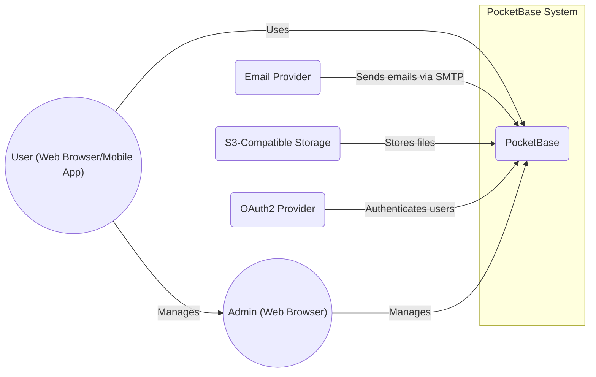
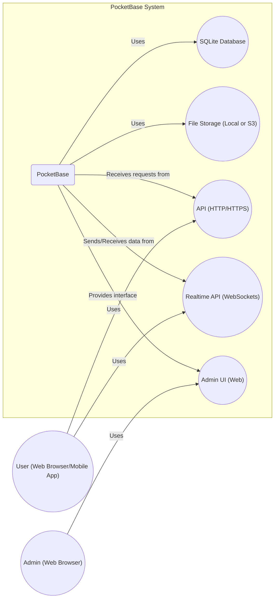
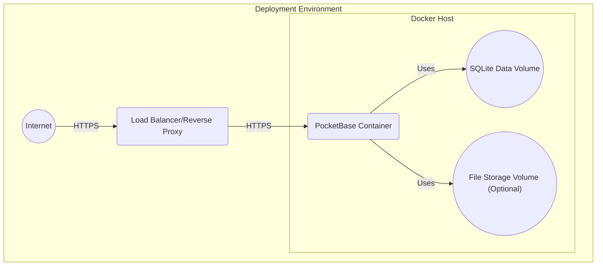
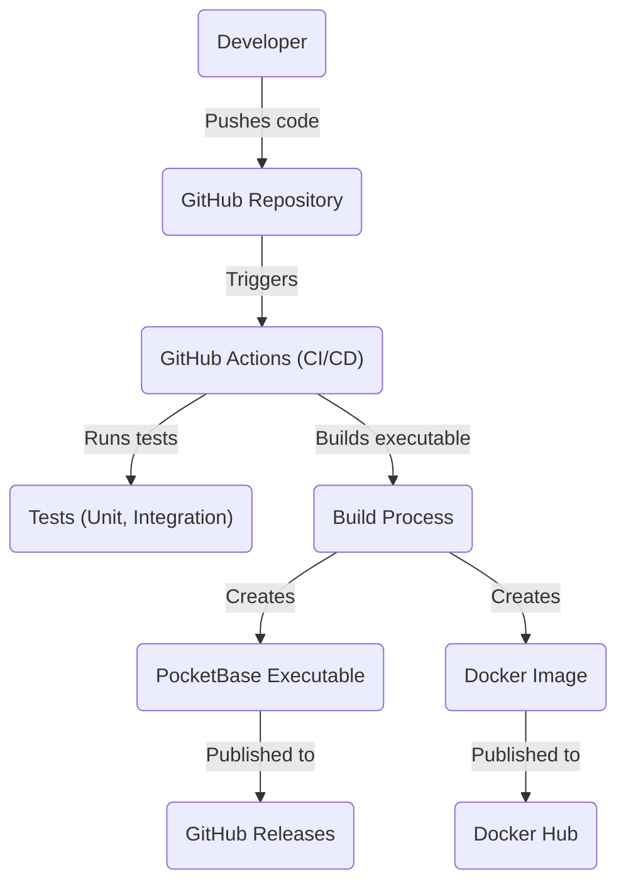

Okay, let's create a design document for PocketBase based on the provided GitHub repository.

# BUSINESS POSTURE

PocketBase aims to provide a simple, fast, and open-source backend solution for small to medium-sized projects, or even larger projects that can be built around its core features. It simplifies backend development by offering a single, portable executable that includes a database, authentication, file storage, and a real-time API.  The business priorities are likely:

*   Rapid Development: Enable developers to quickly build and prototype applications.
*   Ease of Use: Provide a user-friendly interface and simple deployment.
*   Cost-Effectiveness: Offer a free and open-source alternative to more complex backend solutions.
*   Portability: Allow easy deployment across various environments.
*   Extensibility: Allow extending default functionality with custom code.

The most important business risks that need to be addressed are:

*   Data Breaches: Unauthorized access to sensitive user data or application data.
*   Service Downtime: Interruption of service due to bugs, misconfiguration, or attacks.
*   Data Loss: Loss of data due to hardware failure, software bugs, or malicious actions.
*   Abuse of Service: Malicious users exploiting the system for spam, phishing, or other harmful activities.
*   Lack of Scalability: Inability to handle increased load as the application grows.
*   Supply Chain Attacks: Compromise of the PocketBase codebase or its dependencies.

# SECURITY POSTURE

Based on the GitHub repository and documentation, here's an assessment of the security posture:

*   security control: Secure Software Development Lifecycle (SSDLC): The project appears to follow some secure development practices, including code reviews (visible through pull requests) and issue tracking. The extent of formal security testing is unclear from the repository alone.
*   security control: Deployment Model: PocketBase is designed for self-hosting, which places the responsibility for infrastructure security on the user. It can be deployed on various platforms, including bare metal servers, VMs, and containerized environments (Docker).
*   security control: Authentication: PocketBase provides built-in user authentication with email/password, and OAuth2 providers. (Implemented in Go code and Admin UI).
*   security control: Authorization: Role-Based Access Control (RBAC) is implemented through collection API rules, allowing fine-grained control over data access. (Implemented in Go code and Admin UI).
*   security control: Input Validation: Data validation is performed on the server-side using Go structs and validation tags. (Implemented in Go code).
*   security control: Data Encryption: Data at rest encryption is not natively supported by the embedded SQLite database. Users are expected to implement full-disk encryption at the infrastructure level if required. Communication is expected to be secured via TLS (HTTPS) configured by the user.
*   security control: File Storage: PocketBase manages file storage and provides options for local storage or integration with S3-compatible services. Access control is managed through API rules. (Implemented in Go code and Admin UI).
*   security control: Real-time Subscriptions: PocketBase offers real-time updates to clients, which could be a potential vector for denial-of-service attacks if not properly managed.
*   security control: Admin UI: A web-based administrative interface is provided for managing the application. This interface must be properly secured.
*   accepted risk: Lack of built-in data-at-rest encryption within the SQLite database. Mitigation relies on user-implemented full-disk encryption.
*   accepted risk: Reliance on user-managed infrastructure security for self-hosted deployments.
*   accepted risk: Potential for denial-of-service attacks targeting the real-time subscription feature.

Recommended Security Controls (High Priority):

*   Implement automated security testing (SAST, DAST, dependency scanning) in the CI/CD pipeline.
*   Provide detailed security documentation and best practices for self-hosting deployments.
*   Consider adding support for data-at-rest encryption within the SQLite database.
*   Implement rate limiting and other measures to mitigate denial-of-service attacks, especially on the real-time subscription feature.
*   Provide options for audit logging of administrative actions and data access.

Security Requirements:

*   Authentication:
    *   Support for strong password policies (length, complexity).
    *   Secure storage of password hashes (e.g., using bcrypt or similar).
    *   Protection against brute-force attacks (e.g., account lockout).
    *   Support for multi-factor authentication (MFA).
    *   Secure session management (e.g., using HTTP-only cookies, secure cookies, and appropriate session timeouts).
*   Authorization:
    *   Fine-grained access control to all resources (data, files, API endpoints).
    *   Regular review and auditing of access control rules.
    *   Principle of least privilege should be enforced.
*   Input Validation:
    *   All user-supplied input must be validated on the server-side.
    *   Use a whitelist approach to validation whenever possible.
    *   Sanitize output to prevent cross-site scripting (XSS) vulnerabilities.
*   Cryptography:
    *   Use strong, industry-standard cryptographic algorithms and libraries.
    *   Securely manage cryptographic keys.
    *   Use TLS (HTTPS) for all communication.
    *   Consider data-at-rest encryption.

# DESIGN

## C4 CONTEXT

Element Descriptions:

*   Element:
    *   Name: User
    *   Type: Person
    *   Description: A user of the application built on PocketBase.
    *   Responsibilities: Interacts with the application's frontend, authenticates, and accesses data.
    *   Security controls: Authentication, Authorization (via PocketBase API rules).

*   Element:
    *   Name: Admin
    *   Type: Person
    *   Description: An administrator of the PocketBase instance.
    *   Responsibilities: Manages PocketBase configuration, users, and data through the Admin UI.
    *   Security controls: Authentication, Authorization (Admin UI access controls).

*   Element:
    *   Name: PocketBase
    *   Type: Software System
    *   Description: The core PocketBase application, providing backend functionalities.
    *   Responsibilities: Handles user authentication, data storage, file storage, real-time updates, and API requests.
    *   Security controls: Authentication, Authorization, Input Validation, API rules.

*   Element:
    *   Name: Email Provider
    *   Type: External System
    *   Description: An external email service used for sending transactional emails (e.g., password resets).
    *   Responsibilities: Delivers emails on behalf of PocketBase.
    *   Security controls: Relies on the security of the chosen email provider (e.g., TLS for SMTP).

*   Element:
    *   Name: S3-Compatible Storage
    *   Type: External System
    *   Description: An external storage service (e.g., AWS S3, MinIO) used for storing files.
    *   Responsibilities: Stores and retrieves files uploaded by users.
    *   Security controls: Relies on the security of the chosen S3 provider (e.g., access keys, bucket policies).

*   Element:
    *   Name: OAuth2 Provider
    *   Type: External System
    *   Description: An external OAuth2 provider (e.g., Google, GitHub) used for user authentication.
    *   Responsibilities: Authenticates users and provides user information to PocketBase.
    *   Security controls: Relies on the security of the chosen OAuth2 provider.

## C4 CONTAINER

Element Descriptions:

*   Element:
    *   Name: PocketBase
    *   Type: Application
    *   Description: The main PocketBase application, a single executable.
    *   Responsibilities: Orchestrates all backend functionalities.
    *   Security controls: Authentication, Authorization, Input Validation, API rules.

*   Element:
    *   Name: SQLite
    *   Type: Database
    *   Description: Embedded SQLite database for storing application data.
    *   Responsibilities: Stores and retrieves data.
    *   Security controls: Access control via PocketBase API rules.  Full-disk encryption (user-managed).

*   Element:
    *   Name: File Storage
    *   Type: Storage
    *   Description: Storage for user-uploaded files (local or S3-compatible).
    *   Responsibilities: Stores and retrieves files.
    *   Security controls: Access control via PocketBase API rules, S3 provider security (if used).

*   Element:
    *   Name: API
    *   Type: API
    *   Description: HTTP/HTTPS API for interacting with PocketBase.
    *   Responsibilities: Handles requests from clients, performs data operations, and enforces API rules.
    *   Security controls: Authentication, Authorization, Input Validation, TLS (HTTPS).

*   Element:
    *   Name: Realtime API
    *   Type: API
    *   Description: WebSocket-based API for real-time updates.
    *   Responsibilities: Pushes updates to subscribed clients.
    *   Security controls: Authentication, Authorization, Rate limiting (recommended).

*   Element:
    *   Name: Admin UI
    *   Type: Web Application
    *   Description: Web-based administrative interface.
    *   Responsibilities: Provides a user interface for managing PocketBase.
    *   Security controls: Authentication, Authorization, Session Management.

## DEPLOYMENT

Possible deployment solutions:

1.  Bare Metal Server/VM: Deploy the PocketBase executable directly on a server.
2.  Docker Container: Deploy PocketBase within a Docker container.
3.  Cloud Platforms (e.g., AWS, Google Cloud, Azure): Deploy on VMs or container services offered by cloud providers.

Chosen Solution (Docker Container):

Element Descriptions:

*   Element:
    *   Name: Internet
    *   Type: Network
    *   Description: The public internet.
    *   Responsibilities: Provides connectivity to the deployment environment.
    *   Security controls: Firewall, Intrusion Detection/Prevention Systems (IDS/IPS) (typically managed by the hosting provider or user).

*   Element:
    *   Name: Load Balancer
    *   Type: Network Device/Service
    *   Description: A load balancer or reverse proxy (e.g., Nginx, Traefik, Caddy).
    *   Responsibilities: Distributes traffic to the PocketBase container, handles TLS termination.
    *   Security controls: TLS (HTTPS) configuration, Web Application Firewall (WAF) (optional).

*   Element:
    *   Name: Docker Host
    *   Type: Server
    *   Description: The server hosting the Docker engine.
    *   Responsibilities: Runs Docker containers.
    *   Security controls: Operating system security, Docker daemon security, firewall.

*   Element:
    *   Name: PocketBase Container
    *   Type: Container
    *   Description: The Docker container running the PocketBase executable.
    *   Responsibilities: Runs the PocketBase application.
    *   Security controls: Container isolation, minimal base image, regular updates.

*   Element:
    *   Name: SQLite Data Volume
    *   Type: Storage Volume
    *   Description: A Docker volume for persistent storage of the SQLite database.
    *   Responsibilities: Persists database data.
    *   Security controls: Access control via Docker, full-disk encryption (recommended).

*   Element:
    *   Name: File Storage Volume
    *   Type: Storage Volume
    *   Description: A Docker volume for persistent storage of user-uploaded files (if using local storage).
    *   Responsibilities: Persists file data.
    *   Security controls: Access control via Docker, full-disk encryption (recommended).

## BUILD

Build Process Description:

1.  Developer pushes code changes to the GitHub repository.
2.  GitHub Actions (or a similar CI/CD system) is triggered.
3.  Tests (unit, integration) are executed.
4.  The PocketBase executable is built.
5.  A Docker image is created (optional, but common).
6.  The executable is published to GitHub Releases.
7.  The Docker image is published to Docker Hub (or another container registry).

Security Controls:

*   security control: Code Review: Pull requests on GitHub indicate code review practices.
*   security control: Automated Testing: The presence of tests suggests some level of automated testing.
*   security control: CI/CD: GitHub Actions provides build automation and a degree of control over the build process.
*   security control: (Recommended) Dependency Scanning: Implement tools like Dependabot or Snyk to scan for vulnerable dependencies.
*   security control: (Recommended) SAST: Integrate Static Application Security Testing (SAST) tools into the CI/CD pipeline to identify potential vulnerabilities in the code.
*   security control: (Recommended) Container Scanning: If Docker images are built, use container scanning tools (e.g., Trivy, Clair) to scan for vulnerabilities in the image layers.

# RISK ASSESSMENT

*   Critical Business Processes:
    *   User Authentication and Authorization: Ensuring only authorized users can access their data.
    *   Data Management: Storing, retrieving, and updating data reliably and securely.
    *   File Management: Storing and serving user-uploaded files securely.
    *   Real-time Functionality: Providing real-time updates to clients.
    *   Admin Functionality: Securely manage application.

*   Data Sensitivity:
    *   User Data: Email addresses, hashed passwords, potentially personally identifiable information (PII) stored by applications built on PocketBase. (High Sensitivity)
    *   Application Data: Data stored by applications built on PocketBase, which could range from low to high sensitivity depending on the application.
    *   Files: User-uploaded files, which could contain sensitive information. (Variable Sensitivity)
    *   Configuration Data: PocketBase configuration settings, including API keys and secrets. (High Sensitivity)

# QUESTIONS & ASSUMPTIONS

*   Questions:
    *   What is the expected scale of applications built with PocketBase (number of users, data volume)? This impacts scalability requirements.
    *   What are the specific compliance requirements (e.g., GDPR, HIPAA) for applications built with PocketBase?
    *   What level of security expertise is expected from users deploying PocketBase? This informs the need for detailed security documentation and guidance.
    *   Are there plans to implement more robust logging and auditing features?
    *   Are there plans to support data-at-rest encryption within the SQLite database?

*   Assumptions:
    *   Users deploying PocketBase are responsible for securing the underlying infrastructure (servers, networks, operating systems).
    *   Users will configure TLS (HTTPS) for secure communication with PocketBase.
    *   Users will implement appropriate backup and disaster recovery procedures.
    *   Users will regularly update PocketBase to the latest version to receive security patches.
    *   The primary threat model is external attackers attempting to gain unauthorized access to data or disrupt service.
    *   Internal threats (e.g., malicious administrators) are considered a lower risk, but should still be addressed through access controls and auditing.
    *   Developers using PocketBase will follow secure coding practices.