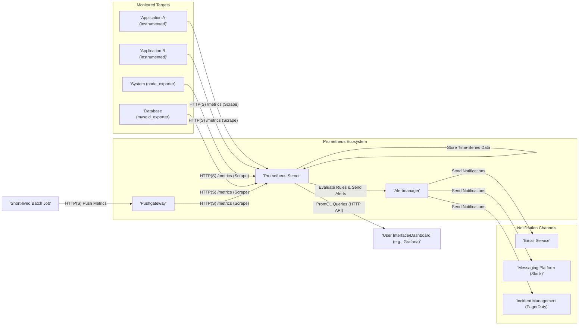

# Project Design Document: Prometheus Monitoring System

**Version:** 1.1
**Date:** October 26, 2023
**Author:** AI Architecture Expert

## 1. Introduction

This document provides an enhanced architectural design of the Prometheus monitoring system, based on the open-source project available at [https://github.com/prometheus/prometheus](https://github.com/prometheus/prometheus). Building upon the previous version, this document aims for even greater clarity in outlining the system's components, their interactions, and data flow. It serves as a robust foundation for subsequent threat modeling activities, ensuring a comprehensive understanding of the system's architecture from a security perspective.

## 2. Goals and Objectives

The primary goals of this design document are to:

*   Clearly and concisely define the architecture of the Prometheus monitoring system.
*   Identify all key components and articulate their specific responsibilities.
*   Illustrate the data flow within the system with improved clarity.
*   Provide a solid and detailed basis for identifying potential security vulnerabilities during threat modeling exercises.
*   Serve as a definitive reference for developers, operations teams, and security engineers involved with Prometheus.

## 3. System Architecture Overview

Prometheus is a powerful monitoring system designed for reliability and scalability. It operates by scraping metrics from configured targets at regular intervals. These metrics are then stored, and Prometheus allows users to query and analyze this data using its powerful query language, PromQL. Furthermore, Prometheus can evaluate rules based on these metrics to trigger alerts when specific conditions are met.

The core of Prometheus is the server itself, which handles scraping, storage, and querying. Supporting components like Exporters, the Pushgateway, and Alertmanager extend its capabilities and make it a versatile monitoring solution.

## 4. Detailed Component Description

The Prometheus ecosystem is built upon the following essential components:

*   **Prometheus Server:** The central processing unit of the system, responsible for:
    *   **Metrics Scraping:**  Periodically fetching numerical time-series data (metrics) from configured targets via HTTP(S).
    *   **Data Storage:** Persisting the scraped time-series data in an efficient local time-series database.
    *   **Query Processing:**  Executing queries written in PromQL to retrieve and analyze stored metrics.
    *   **Rule Evaluation:**  Evaluating pre-defined alerting rules and recording rules against the collected data.
    *   **Alert Generation:**  Dispatching alerts to the Alertmanager when alerting rule conditions are satisfied.
    *   **Basic Web UI:** Providing a built-in user interface for ad-hoc querying and basic visualization of metrics.

*   **Exporters:**  Specialized agents that expose metrics in a format understandable by Prometheus. These can be categorized as:
    *   **Directly Instrumented Applications:** Applications that incorporate Prometheus client libraries to expose their internal metrics directly.
    *   **Dedicated Exporters (Stand-alone):** Independent applications designed to collect metrics from other systems or services that don't natively expose Prometheus metrics (e.g., `node_exporter` for system-level metrics, database exporters like `mysqld_exporter`).

*   **Pushgateway:** An intermediary service designed to receive metrics pushed by short-lived or batch jobs. Prometheus then scrapes the Pushgateway to collect these pushed metrics, accommodating scenarios where targets are not always available for scraping.

*   **Alertmanager:**  A separate application that handles alerts sent by Prometheus servers. Its key responsibilities include:
    *   **Alert Deduplication:**  Merging identical alerts to prevent notification floods.
    *   **Alert Grouping:**  Organizing alerts based on labels for more efficient management.
    *   **Alert Routing:**  Directing alerts to the appropriate notification receivers based on configurable rules.
    *   **Alert Silencing:**  Temporarily suppressing notifications for specific alerts.
    *   **Alert Inhibition:**  Preventing certain alerts from being sent if other, more critical alerts are already active.

*   **Client Libraries:** Libraries that enable developers to instrument their applications with Prometheus metrics. These libraries are available for various programming languages (e.g., Go, Python, Java).

## 5. Data Flow Diagram

## 6. Data Flow Description

The flow of data within the Prometheus system follows these key stages:

*   **Metrics Collection (Pull Mechanism):** The Prometheus server initiates HTTP(S) requests to the `/metrics` endpoint of configured targets (Applications with client libraries, Stand-alone Exporters) at defined intervals to retrieve metrics. This is the primary method of data ingestion.
*   **Metrics Collection (Push Mechanism):** For ephemeral or batch jobs that may not be continuously running, metrics are pushed to the Pushgateway via HTTP(S). The Prometheus server then scrapes the Pushgateway to collect these metrics.
*   **Data Storage:**  The scraped metrics, which are time-series data, are stored within Prometheus's local and efficient time-series database.
*   **Rule Processing:** The Prometheus server continuously evaluates pre-configured alerting rules and recording rules against the stored metric data.
*   **Alerting and Notification:** When an alerting rule's condition is met, Prometheus generates an alert and sends it to the Alertmanager. The Alertmanager then handles the routing of these alerts to the appropriate notification channels.
*   **Querying and Visualization:** Users and external dashboarding tools (like Grafana) can query the stored metrics using PromQL through the Prometheus server's HTTP API.
*   **Notification Delivery:** The Alertmanager sends notifications to configured receivers (e.g., email servers, Slack APIs, PagerDuty APIs) based on its routing configuration.

## 7. Component Interactions

The interactions between the core components are crucial to the system's operation:

*   **Prometheus Server and Exporters:** Prometheus communicates with Exporters using HTTP(S) requests to the `/metrics` endpoint. Authentication and authorization for these endpoints are critical security considerations.
*   **Prometheus Server and Pushgateway:** Prometheus scrapes metrics from the Pushgateway via HTTP(S). The Pushgateway also receives pushed metrics via HTTP(S). Securing these endpoints is important.
*   **Prometheus Server and Alertmanager:** Prometheus sends alert notifications to the Alertmanager via HTTP(S). Authentication between these components is essential.
*   **Alertmanager and Notification Channels:** The Alertmanager interacts with notification receivers using their respective APIs or protocols (e.g., SMTP for email, HTTP-based APIs for Slack and PagerDuty). Secure configuration and credential management are vital here.
*   **Users/Dashboards and Prometheus Server:** Users and dashboards interact with the Prometheus server through its HTTP API, primarily for querying metrics using PromQL. Authentication and authorization are necessary to control access.

## 8. Security Considerations (Detailed)

Security is a paramount concern in any monitoring system. Here are key security considerations for a Prometheus deployment:

*   **Authentication and Authorization:**
    *   **Prometheus Server API:** Implement authentication and authorization for the Prometheus server's API to control who can query metrics, create recording rules, and manage the server.
    *   **Alertmanager API:** Secure the Alertmanager API to prevent unauthorized modification of alert routing, silencing, and inhibition rules.
    *   **Exporters:**  Consider implementing authentication on exporter endpoints to restrict access to metric data.
    *   **Pushgateway:** Implement authentication to prevent unauthorized pushing of metrics. Consider network segmentation to limit access to the Pushgateway.

*   **Data Confidentiality and Integrity:**
    *   **TLS Encryption:** Use TLS (HTTPS) for all communication between components (Prometheus Server and Exporters, Prometheus Server and Alertmanager, etc.) to encrypt data in transit.
    *   **Storage Security:** Secure the underlying storage where Prometheus stores its time-series data. Implement appropriate access controls and consider encryption at rest.

*   **Network Security:**
    *   **Network Segmentation:** Isolate Prometheus components within secure network segments to limit the impact of potential breaches.
    *   **Firewall Rules:** Configure firewalls to allow only necessary traffic between components.

*   **Exporter Security:**
    *   **Regular Updates:** Keep exporters up-to-date with the latest security patches.
    *   **Secure Configuration:**  Ensure exporters are configured securely, avoiding default credentials and unnecessary open ports.

*   **Pushgateway Security:**
    *   **Authentication:** Implement authentication to prevent unauthorized metric pushes.
    *   **Rate Limiting:** Consider rate limiting to prevent abuse.

*   **Alertmanager Security:**
    *   **Secure Configuration:**  Protect the Alertmanager's configuration to prevent unauthorized changes to notification routing.
    *   **Secret Management:** Securely manage credentials used by the Alertmanager to send notifications.

*   **Web UI Security:**
    *   **Authentication:** Implement authentication for the Prometheus web UI.
    *   **Content Security Policy (CSP):** Configure CSP headers to mitigate cross-site scripting (XSS) attacks.

*   **Dependency Management:**
    *   **Regular Audits:** Regularly audit the dependencies of Prometheus and its related components for known vulnerabilities.
    *   **Supply Chain Security:**  Be mindful of the sources of binaries and container images used for deployment.

## 9. Deployment Considerations

The chosen deployment method significantly impacts the security and scalability of the Prometheus system:

*   **Containerization (Docker, Kubernetes):** Offers scalability and isolation but requires careful management of container image security, network policies, and access control within the orchestration platform.
*   **Virtual Machines (VMs):** Provides isolation but requires managing the underlying operating system security.
*   **Bare Metal:** Offers direct control but requires significant effort in securing the operating system and network.
*   **Cloud-Managed Services:**  Leveraging managed Prometheus offerings from cloud providers can simplify deployment and offload some security responsibilities, but it's crucial to understand the shared responsibility model.

## 10. Future Considerations

The Prometheus ecosystem is continuously evolving. Future considerations for this design might include:

*   **Federation Enhancements:**  Exploring more secure and efficient ways to federate multiple Prometheus instances.
*   **Remote Storage Security:**  Implementing robust security measures for integrations with external long-term storage solutions.
*   **Advanced Service Discovery:**  Securing service discovery mechanisms to prevent malicious actors from injecting false targets.
*   **Granular Access Control:**  Implementing more fine-grained access control mechanisms within Prometheus and Alertmanager.
*   **Auditing and Logging:**  Enhancing auditing and logging capabilities for security monitoring and incident response.

## 11. Conclusion

This improved design document provides a more detailed and clearer understanding of the Prometheus monitoring system's architecture. By elaborating on component responsibilities, data flow, and interactions, it serves as a stronger foundation for identifying and mitigating potential security vulnerabilities during threat modeling. This document is a valuable resource for anyone involved in deploying, operating, or securing a Prometheus environment.