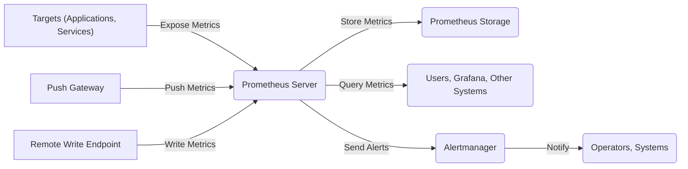

## High and Critical Prometheus Threats

This list details high and critical threats that directly involve the Prometheus application itself.

### Data Flow Diagram

### Threat Entries

*   **Threat:** Malicious Metric Injection via Push Gateway
    *   **Description:** An attacker gains unauthorized access to the Push Gateway and pushes fabricated or misleading metrics directly to the Prometheus server. This could involve scripting to repeatedly send false data or injecting metrics with manipulated values.
    *   **Impact:**  Incorrect monitoring dashboards, masking of real issues leading to delayed incident response, triggering of false alerts causing unnecessary alarm, and potential resource exhaustion on the Prometheus server due to storing large volumes of fake data.
    *   **Affected Component:** `Remote Write` endpoint of the `Prometheus Server`, `TSDB` (Time Series Database) within `Prometheus Storage`.
    *   **Risk Severity:** High
    *   **Mitigation Strategies:**
        *   Implement authentication and authorization on the Push Gateway (e.g., using HTTP basic auth or a more robust solution).
        *   Restrict network access to the Push Gateway to trusted sources.
        *   Monitor the source of pushed metrics and alert on unexpected sources.
        *   Consider alternative methods for pushing metrics if security is a primary concern.

*   **Threat:** Unauthorized Metric Scraping
    *   **Description:** An attacker gains access to the Prometheus server or its configuration and configures it to scrape targets that expose sensitive information through their metrics endpoints without proper authorization on the target. The attacker might modify the `scrape_configs` section in `prometheus.yml`.
    *   **Impact:** Exposure of sensitive data (e.g., internal system details, API keys, business metrics) to unauthorized parties who have access to the Prometheus server or its data. This can lead to further attacks or data breaches.
    *   **Affected Component:** `Scraping` module within the `Prometheus Server`, `HTTP client` used for scraping, `Target Discovery` mechanisms.
    *   **Risk Severity:** Critical
    *   **Mitigation Strategies:**
        *   Implement authentication and authorization on the metric endpoints exposed by target applications (e.g., using API keys, OAuth).
        *   Use network segmentation (firewalls, network policies) to restrict network access to metric endpoints.
        *   Regularly review and audit the `scrape_configs` in the Prometheus configuration file.
        *   Implement access control on the Prometheus server itself.

*   **Threat:** Denial of Service via Metric Explosion
    *   **Description:** A malicious target or a misconfigured application exposes a large number of unique metric series (high cardinality), overwhelming Prometheus's resources. An attacker might intentionally create new labels or label values to inflate the number of series being scraped by Prometheus.
    *   **Impact:**  Overwhelming Prometheus's storage and processing capabilities, leading to high CPU and memory usage, slow query performance, and potential unresponsiveness. This can disrupt monitoring and alerting.
    *   **Affected Component:** `Scraping` module, `TSDB` within `Prometheus Storage`, `Query Engine`.
    *   **Risk Severity:** High
    *   **Mitigation Strategies:**
        *   Implement limits on the number of time series Prometheus can ingest (using `limits` in the configuration).
        *   Monitor the cardinality of metrics being scraped and alert on sudden increases.
        *   Educate developers on best practices for exposing metrics and avoiding high cardinality.
        *   Use relabeling rules in Prometheus to drop or modify high-cardinality labels.

*   **Threat:** Compromised Prometheus Configuration
    *   **Description:** An attacker gains unauthorized access to the Prometheus configuration file (`prometheus.yml`) and modifies it. This could be through exploiting vulnerabilities in the system where Prometheus is running or through stolen credentials.
    *   **Impact:**  Can lead to scraping of unintended targets, disabling of alerts, exposure of sensitive credentials (if stored in the config, though discouraged), redirection of remote write traffic, or complete disruption of monitoring.
    *   **Affected Component:** `Configuration Loading` module within the `Prometheus Server`.
    *   **Risk Severity:** Critical
    *   **Mitigation Strategies:**
        *   Restrict access to the Prometheus configuration file using operating system permissions.
        *   Store the configuration securely and consider using encrypted storage.
        *   Use configuration management tools (e.g., Ansible, Chef) to manage and track changes to the configuration.
        *   Avoid storing sensitive credentials directly in the configuration; use secrets management solutions.

*   **Threat:** Remote Write Abuse
    *   **Description:** If the remote write endpoint of the Prometheus server is exposed without proper authentication and authorization, attackers can send arbitrary metrics directly to the Prometheus server, potentially impersonating legitimate sources.
    *   **Impact:**  Similar to malicious metric injection via Push Gateway, leading to incorrect monitoring data, false alerts, and potential resource exhaustion. Can also be used to inject misleading data to cover up malicious activities.
    *   **Affected Component:** `Remote Write` endpoint of the `Prometheus Server`, `TSDB` within `Prometheus Storage`.
    *   **Risk Severity:** High
    *   **Mitigation Strategies:**
        *   Implement strong authentication and authorization for the remote write endpoint (e.g., using TLS client certificates, API keys).
        *   Use TLS encryption for communication over the remote write endpoint.
        *   Restrict network access to the remote write endpoint based on source IP or other criteria.

*   **Threat:** Manipulation of Alerting Rules
    *   **Description:** An attacker gains unauthorized access to the Prometheus rules files and modifies alerting rules. This could involve disabling critical alerts or modifying thresholds within the Prometheus server's configuration.
    *   **Impact:**  Disabling of critical alerts can lead to missed incidents and delayed response. Modifying thresholds can mask real issues or trigger false alarms, leading to operational disruptions or unnecessary panic.
    *   **Affected Component:** `Rule Evaluation` module within the `Prometheus Server`, `Alerting` module within the `Prometheus Server`, `Configuration Loading` for rules.
    *   **Risk Severity:** High
    *   **Mitigation Strategies:**
        *   Restrict access to Prometheus rules files using operating system permissions.
        *   Implement version control for alerting rules.
        *   Implement an approval process for changes to alerting rules.
        *   Monitor changes to alerting rules.

*   **Threat:** Storage Corruption or Tampering
    *   **Description:**  An attacker gains unauthorized access to the underlying storage used by Prometheus (the TSDB) and manipulates or corrupts the stored time-series data. This could be through exploiting vulnerabilities in the storage system or the host where Prometheus is running.
    *   **Impact:**  Loss of historical monitoring data, inaccurate trends and analysis, potentially impacting decision-making based on metrics. Corrupted data can also lead to instability in Prometheus.
    *   **Affected Component:** `TSDB` within `Prometheus Storage`, underlying file system or storage volume.
    *   **Risk Severity:** High
    *   **Mitigation Strategies:**
        *   Implement appropriate access controls on the underlying storage.
        *   Consider using encrypted storage.
        *   Regularly back up Prometheus data.
        *   Monitor the integrity of the storage.