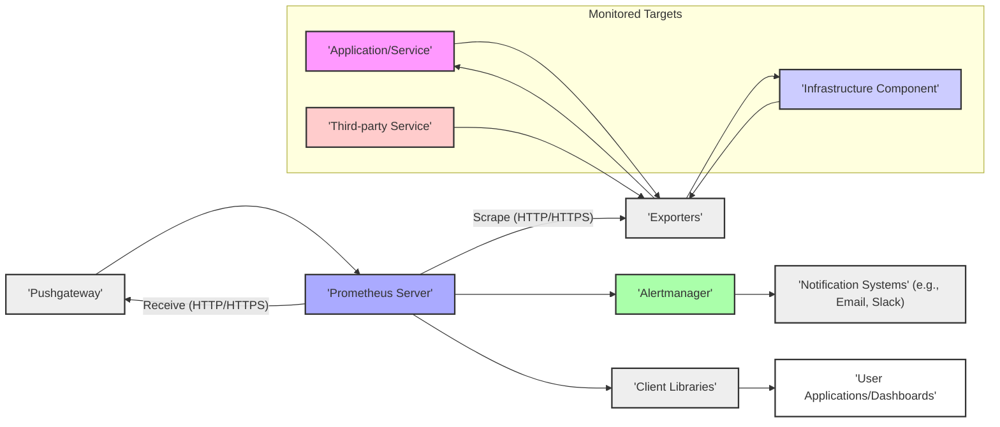
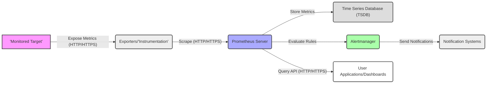

# Project Design Document: Prometheus Monitoring System

**Version:** 1.1
**Date:** October 26, 2023
**Author:** AI Cloud & Security Architect

## 1. Introduction

This document provides an enhanced architectural design of the Prometheus monitoring system, building upon the previous version. It details the core components, their interactions, data flows, and deployment considerations with a stronger focus on security aspects relevant for subsequent threat modeling. This document serves as a comprehensive blueprint for understanding the system's architecture from a security perspective.

## 2. Goals and Objectives

The primary goal of Prometheus is to offer a scalable and reliable platform for collecting, storing, querying, and alerting on time-series data. This design document aims to provide an even more granular understanding of Prometheus's architecture, specifically highlighting elements critical for identifying potential security vulnerabilities and informing the design of appropriate mitigation strategies during threat modeling.

## 3. High-Level Architecture

The Prometheus ecosystem consists of several interconnected components that enable comprehensive monitoring. The following diagram illustrates the high-level architecture, emphasizing key interactions:

## 4. Detailed Component Descriptions

This section provides an in-depth description of each component within the Prometheus architecture, with a focus on security-relevant aspects.

*   **Monitored Targets:** These are the sources of metrics.
    *   Can expose metrics directly via an HTTP(S) `/metrics` endpoint.
    *   May require specific instrumentation using client libraries.
    *   Security considerations: Vulnerabilities in the target application can be exposed through metrics.

*   **Exporters:** Act as metric translators and collectors.
    *   Fetch metrics from non-Prometheus systems and expose them in the Prometheus format.
    *   Examples: `node_exporter` (system metrics), `blackbox_exporter` (endpoint probing), database exporters (e.g., MySQL, PostgreSQL).
    *   Often require credentials to access the target system. Secure storage and management of these credentials are critical.
    *   Security considerations: Exporters can become targets for attacks if not properly secured. Vulnerabilities in the exporter itself could be exploited.

*   **Pushgateway:** Facilitates metric collection from ephemeral and batch jobs.
    *   Receives metrics pushed from jobs that may not be consistently available for scraping.
    *   Acts as a single point of contact for these metrics.
    *   Security considerations: Open Pushgateway instances can be abused to inject arbitrary metrics, potentially leading to misleading alerts or denial-of-service. Authentication and authorization are crucial for Pushgateway.

*   **Prometheus Server:** The central hub for scraping, storing, and querying metrics.
    *   **Scraping Subsystem:** Periodically pulls metrics from configured targets. Configuration defines scrape intervals, targets, and authentication details.
    *   **Storage Subsystem (TSDB):** Stores time-series data on disk. Data at rest security is a concern.
    *   **Querying Subsystem (PromQL):** Provides a powerful query language. Potential for resource exhaustion or information disclosure through crafted queries.
    *   **Rule Evaluation Engine:** Evaluates alerting and recording rules. Misconfigured rules can lead to alert fatigue or missed critical events.
    *   **HTTP API:**  Provides endpoints for querying, management, and receiving data. Requires robust authentication and authorization.
    *   Security considerations: The Prometheus server is a critical component and a prime target for attacks. Secure configuration, access control, and input validation are paramount.

*   **Alertmanager:** Manages and routes alerts generated by the Prometheus server.
    *   **Alert Processing:** Deduplicates, groups, and inhibits alerts.
    *   **Routing:** Sends notifications to configured receivers based on alert labels.
    *   **Notification Integrations:** Supports various notification channels (email, Slack, PagerDuty, etc.). Secure configuration of these integrations is essential.
    *   **HTTP API:** Allows for management of silences and alert status. Requires authentication and authorization.
    *   Security considerations: Misconfigured Alertmanager routing can lead to missed alerts. Compromised notification integrations could be used to send malicious alerts.

*   **Client Libraries:** Enable direct instrumentation of applications.
    *   Provide language-specific APIs to expose metrics in the Prometheus format.
    *   Security considerations: Developers need to be aware of potential security implications when exposing metrics, avoiding sensitive information.

*   **User Applications/Dashboards:** Visualize and analyze Prometheus data.
    *   Examples: Grafana.
    *   Interact with the Prometheus server via its HTTP API.
    *   Security considerations: Authentication and authorization are needed to control access to sensitive monitoring data. Vulnerabilities in dashboarding tools can expose Prometheus data.

*   **Notification Systems:** External services that receive alerts.
    *   Examples: Email servers, Slack channels, PagerDuty.
    *   Security considerations: The security of these systems impacts the confidentiality and integrity of alert notifications. Secure authentication and transport are necessary.

## 5. Data Flow Diagram

This diagram illustrates the flow of metric and alert data within the Prometheus ecosystem, highlighting potential security touchpoints:

**Data Flow Description:**

*   Monitored targets generate metrics, which may contain sensitive information.
*   Exporters or direct instrumentation expose these metrics, often over HTTP or HTTPS.
*   The Prometheus server scrapes these endpoints, potentially requiring authentication.
*   Scraped metrics are stored in the TSDB, raising concerns about data at rest security.
*   The Prometheus server evaluates alerting rules, and triggered alerts are sent to the Alertmanager.
*   User applications query the Prometheus server's API to retrieve and visualize metrics, requiring secure API access.
*   The Alertmanager sends notifications to external systems, highlighting the need for secure notification channel configurations.

## 6. Key Interactions and Interfaces

This section details the communication protocols and interfaces between components, emphasizing security considerations for each interaction.

*   **Prometheus Server <-> Exporters/Targets:**
    *   **Protocol:** HTTP(S). HTTPS is strongly recommended for confidentiality and integrity.
    *   **Method:** Prometheus server initiates HTTP GET requests to the `/metrics` endpoint.
    *   **Authentication:** Targets may require authentication (e.g., basic authentication, TLS client certificates) to allow scraping.
    *   **Authorization:**  No inherent authorization mechanism at the protocol level. Rely on network segmentation and secure configuration.
    *   **Data Format:** Plain text exposition format. While not inherently insecure, parsing vulnerabilities in the Prometheus server could be a concern.

*   **Prometheus Server <-> Pushgateway:**
    *   **Protocol:** HTTP(S). HTTPS is recommended.
    *   **Method:** Targets push metrics via HTTP POST or PUT. Prometheus server scrapes via HTTP GET.
    *   **Authentication:** Pushgateway can be configured with authentication to prevent unauthorized metric pushes.
    *   **Authorization:** Pushgateway can be configured with authorization rules to control which jobs can push metrics.
    *   **Data Format:** Plain text exposition format.

*   **Prometheus Server <-> Alertmanager:**
    *   **Protocol:** HTTP(S). HTTPS is mandatory for secure alert delivery.
    *   **Method:** Prometheus server sends alert notifications via HTTP POST to the `/api/v2/alerts` endpoint.
    *   **Authentication:** Alertmanager supports authentication (e.g., basic authentication, bearer tokens) to secure the alert receiver endpoint.
    *   **Authorization:** Alertmanager relies on the Prometheus server for filtering alerts based on configured rules.
    *   **Data Format:** JSON.

*   **User Applications/Dashboards <-> Prometheus Server:**
    *   **Protocol:** HTTP(S). HTTPS is essential for protecting sensitive monitoring data.
    *   **Method:** Applications send HTTP GET/POST requests to the Prometheus API (e.g., `/api/v1/query`).
    *   **Authentication:** Prometheus server supports various authentication methods (e.g., basic authentication, OAuth 2.0, OpenID Connect).
    *   **Authorization:**  Prometheus relies on external proxies or its own configuration for authorization based on user roles or permissions.
    *   **Data Format:** JSON.

*   **Alertmanager <-> Notification Systems:**
    *   **Protocol:** Varies depending on the system (e.g., SMTP for email, HTTP(S) for Slack/PagerDuty).
    *   **Authentication:**  Crucial for secure communication with notification systems. This involves configuring appropriate credentials or API keys.
    *   **Authorization:**  Determined by the notification system's access control mechanisms.
    *   **Data Format:** Varies depending on the system's API.

## 7. Deployment Considerations

Security implications vary significantly depending on the deployment model.

*   **Standalone Deployment:**
    *   Simpler to manage but presents a single point of failure and a concentrated attack surface.
    *   Security relies heavily on the host system's security.

*   **High Availability (HA) Deployment:**
    *   Increased resilience but introduces complexity in managing multiple instances and ensuring data consistency.
    *   Requires careful consideration of inter-node communication security.

*   **Federation:**
    *   Enables scalable monitoring but introduces trust relationships between Prometheus servers.
    *   Secure authentication and authorization between federated servers are critical.

*   **Containerized Deployment (e.g., Docker, Kubernetes):**
    *   Provides isolation and scalability but requires securing the container environment.
    *   Concerns include container image vulnerabilities, network policies, and secrets management within containers.

*   **Cloud-Based Deployment:**
    *   Leverages cloud provider security features but requires careful configuration of cloud resources and IAM roles.
    *   Security responsibilities are shared between the user and the cloud provider.

## 8. Security Considerations (Detailed)

This section expands on the initial security considerations, providing more specific potential threats and vulnerabilities.

*   **Authentication and Authorization:**
    *   **Threat:** Unauthorized access to Prometheus server API could allow attackers to view sensitive metrics, manipulate alerting rules, or cause denial of service.
    *   **Threat:** Lack of authentication on exporters could allow unauthorized scraping of metrics.
    *   **Threat:** Open Pushgateway instances can be exploited to inject malicious metrics.
    *   **Mitigation:** Implement strong authentication mechanisms (e.g., OAuth 2.0, OpenID Connect) for the Prometheus server and Alertmanager APIs. Configure authentication for exporters and the Pushgateway.

*   **Data Confidentiality:**
    *   **Threat:** Sensitive information exposed in metrics could be intercepted during transit if HTTP is used.
    *   **Threat:** Data at rest in the TSDB could be compromised if the storage is not properly secured.
    *   **Mitigation:** Enforce HTTPS for all communication between components. Consider encryption at rest for the TSDB. Carefully review metrics to avoid exposing sensitive data.

*   **Data Integrity:**
    *   **Threat:** Attackers could tamper with metrics in transit or at rest, leading to inaccurate monitoring and potentially misleading alerts.
    *   **Threat:** Malicious actors could inject false metrics via an open Pushgateway.
    *   **Mitigation:** Use HTTPS to ensure the integrity of metrics in transit. Implement authentication and authorization for the Pushgateway.

*   **Availability:**
    *   **Threat:** Denial-of-service attacks against the Prometheus server or Alertmanager could disrupt monitoring and alerting.
    *   **Threat:** Resource exhaustion due to poorly written PromQL queries.
    *   **Mitigation:** Implement rate limiting and resource quotas. Deploy Prometheus in a highly available configuration. Secure network access to prevent unauthorized access.

*   **Network Security:**
    *   **Threat:** Unauthorized access to Prometheus components through open network ports.
    *   **Mitigation:** Implement strict firewall rules and network segmentation to limit access to Prometheus components.

*   **Input Validation:**
    *   **Threat:** PromQL injection attacks could allow attackers to execute arbitrary code or access sensitive data.
    *   **Threat:** Maliciously crafted alert configurations could cause unexpected behavior in the Alertmanager.
    *   **Mitigation:** Implement robust input validation for PromQL queries and alert configurations.

*   **Dependency Management:**
    *   **Threat:** Vulnerabilities in third-party libraries used by Prometheus components could be exploited.
    *   **Mitigation:** Regularly update dependencies to patch known vulnerabilities.

*   **Secrets Management:**
    *   **Threat:** Storing credentials in configuration files or environment variables can lead to exposure.
    *   **Mitigation:** Utilize secure secrets management solutions (e.g., HashiCorp Vault, Kubernetes Secrets) to manage sensitive credentials.

## 9. Assumptions and Constraints

The following assumptions and constraints remain relevant to this enhanced design:

*   The Prometheus project documentation is the definitive source of truth.
*   This document focuses on core components and common deployment scenarios.
*   Security considerations are intended to be comprehensive but may not cover all edge cases.

## 10. Future Considerations

*   Implementation of specific security hardening guidelines for each component.
*   Integration with Security Information and Event Management (SIEM) systems for security monitoring.
*   Regular security audits and penetration testing of Prometheus deployments.
*   Development of automated security checks for Prometheus configurations.

This improved design document provides a more detailed and security-focused view of the Prometheus architecture, offering a stronger foundation for effective threat modeling and the development of robust security measures.