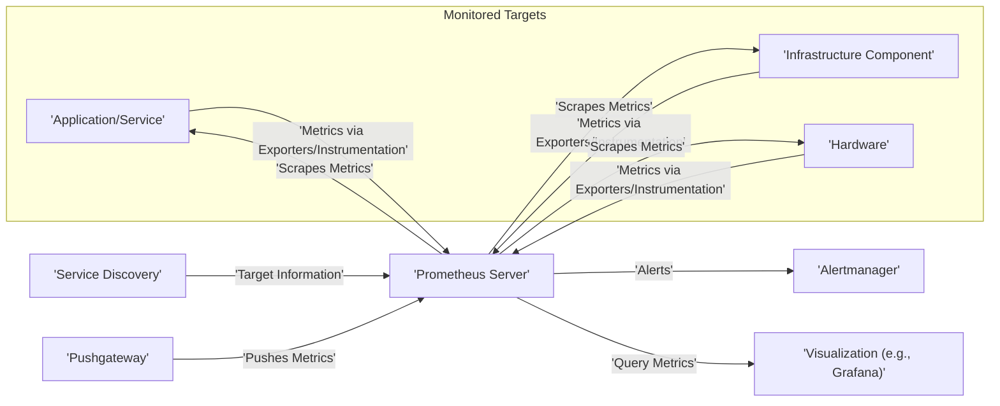
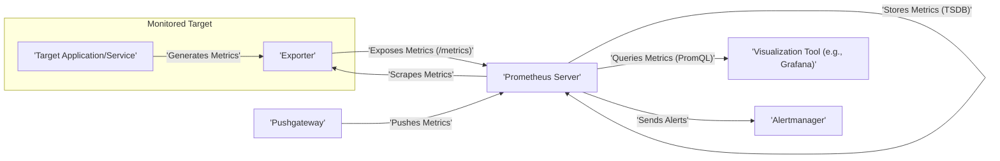

# Project Design Document: Prometheus Monitoring System

**Version:** 1.1
**Date:** October 26, 2023
**Author:** AI Software Architect

## 1. Introduction

This document provides an enhanced and detailed design overview of the Prometheus monitoring system. It elaborates on the key components, their interactions, data flow, and deployment considerations. This document serves as a robust foundation for understanding the system's architecture and will be used as a critical input for subsequent threat modeling activities.

## 2. Goals and Objectives

*   Provide a comprehensive and easily understandable architectural overview of Prometheus.
*   Clearly define the roles, responsibilities, and key configurations of each component.
*   Illustrate the data flow within the system with enhanced clarity.
*   Outline common deployment scenarios with specific security considerations.
*   Identify key security considerations with more detailed examples for effective threat modeling.

## 3. System Overview

Prometheus is a powerful open-source systems monitoring and alerting toolkit. Its strength lies in recording real-time metrics within a purpose-built time series database, utilizing an efficient HTTP pull model. It offers a flexible query language and robust real-time alerting capabilities.

### 3.1. High-Level Architecture

### 3.2. Key Components

*   **Prometheus Server:** The central component responsible for discovering targets, scraping metrics, storing time-series data in its local database (TSDB), and providing a query interface.
*   **Service Discovery:**  An automated mechanism for dynamically identifying and managing the list of targets from which Prometheus should scrape metrics.
*   **Exporters:**  Standalone applications or libraries that expose metrics from various systems in a format Prometheus understands.
*   **Pushgateway:** An intermediary service allowing ephemeral and batch jobs to push their metrics to Prometheus, addressing scenarios where direct scraping is not feasible.
*   **Alertmanager:**  A dedicated service that handles alerts generated by Prometheus, managing deduplication, grouping, and routing them to appropriate notification channels.
*   **Visualization Tools (e.g., Grafana):** External applications used to create dashboards and visualize the metrics data collected and stored by Prometheus.

## 4. Component Details

### 4.1. Prometheus Server

*   **Functionality:**
    *   **Target Discovery:**  Identifies targets to monitor based on configured service discovery mechanisms.
    *   **Scraping:** Periodically retrieves metrics from discovered targets via HTTP(S).
    *   **Data Storage:** Stores scraped metrics in its time-series database (TSDB), optimized for time-based data.
    *   **Querying:** Provides a powerful query language (PromQL) to retrieve and aggregate stored metrics.
    *   **Alerting:** Evaluates predefined alerting rules against the stored metrics and sends notifications to Alertmanager when conditions are met.
    *   **Web UI:** Offers a basic web interface for querying metrics, viewing configuration, and checking the status of scrape targets.
*   **Key Features:**
    *   **Efficient TSDB:** Optimized for storing and querying time-series data with high ingestion rates.
    *   **PromQL:** A flexible and expressive query language for data exploration and analysis.
    *   **Rule-Based Alerting:** Allows defining complex alerting conditions based on metric values.
    *   **Multiple Service Discovery Mechanisms:** Supports various methods for discovering targets in dynamic environments.
    *   **Pull-Based Model:** Actively pulls metrics from targets, offering better control and reliability compared to push-based systems for most use cases.
*   **Configuration:**
    *   **`prometheus.yml`:** The primary configuration file defining global settings, scrape configurations, alerting rules, and remote read/write configurations.
    *   **Service Discovery Configurations:** Sections within `prometheus.yml` or separate files defining how targets are discovered (e.g., file-based, Kubernetes SD, cloud provider integrations).
    *   **Rule Files:** Separate files (referenced in `prometheus.yml`) containing alerting and recording rules written in PromQL.

### 4.2. Service Discovery

*   **Functionality:** Automates the process of finding and updating the list of targets that Prometheus should monitor, especially crucial in dynamic environments.
*   **Types of Service Discovery:**
    *   **Static Configuration:** Manually defining a list of target endpoints directly within the `prometheus.yml` file. Suitable for small, static environments.
    *   **File-Based Service Discovery:** Reading target information from one or more files, allowing for easier management than static configuration.
    *   **DNS-Based Service Discovery:** Resolving target addresses using DNS lookups, useful for services with stable DNS names.
    *   **Cloud Provider Integrations:** Leveraging APIs of cloud providers (AWS, Azure, GCP) to automatically discover and monitor resources like EC2 instances, VMs, and containers.
    *   **Kubernetes Service Discovery:** Integrating with the Kubernetes API to discover services, pods, and nodes within a cluster, adapting to dynamic scaling and deployments.
*   **Configuration:** Defined within the `scrape_configs` section of the `prometheus.yml` file, specifying the type of discovery and relevant parameters.

### 4.3. Exporters

*   **Functionality:** Act as agents that collect metrics from specific applications, services, or infrastructure components and expose them in a format that Prometheus can scrape (typically via HTTP on the `/metrics` endpoint with the Prometheus exposition format).
*   **Types of Exporters:**
    *   **Official Exporters:** Developed and maintained by the Prometheus community, providing metrics for common infrastructure components like operating systems (Node Exporter), databases (e.g., MySQL, PostgreSQL), and message queues (e.g., Kafka).
    *   **Third-Party Exporters:** Developed by the community or vendors for specific applications and services not covered by official exporters.
    *   **Instrumentation Libraries (Client Libraries):** Libraries that can be integrated directly into application code to expose metrics without requiring a separate exporter process. Prometheus provides client libraries for various programming languages.
*   **Deployment:** Typically deployed alongside the application or service being monitored, either as a separate process or embedded within the application itself (using client libraries).

### 4.4. Pushgateway

*   **Functionality:** Serves as a metrics cache where short-lived and batch jobs can push their metrics. Prometheus then scrapes the Pushgateway to collect these metrics. This is useful when targets cannot be directly scraped by Prometheus.
*   **Use Cases:**
    *   Monitoring batch jobs that run infrequently and might not be active when Prometheus attempts to scrape.
    *   Monitoring services running behind firewalls or in environments where direct scraping is not feasible.
*   **Considerations:**
    *   The Pushgateway can become a single point of failure for metrics from pushed jobs.
    *   Properly manage the lifecycle of metrics pushed to the gateway to avoid stale data.
    *   Implement authentication and authorization to prevent unauthorized metric pushes.

### 4.5. Alertmanager

*   **Functionality:** Receives alerts from Prometheus servers, deduplicates identical alerts, groups related alerts, and routes them to the appropriate notification receivers based on configured routing rules. It also handles silencing and inhibition of alerts.
*   **Key Features:**
    *   **Deduplication:** Collapses multiple identical alerts into a single notification.
    *   **Grouping:** Bundles related alerts together based on labels, reducing notification noise.
    *   **Routing:** Directs alerts to specific receivers (e.g., email, Slack, PagerDuty) based on labels attached to the alerts.
    *   **Silencing:** Allows temporarily suppressing notifications for specific alerts or groups of alerts.
    *   **Inhibition:** Prevents notifications for certain alerts if other, more critical alerts are already firing.
*   **Configuration:** The `alertmanager.yml` file defines routing rules, notification receivers (including their configuration), inhibit rules, and silence configurations.

### 4.6. Visualization Tools (e.g., Grafana)

*   **Functionality:** Provides a user-friendly interface for visualizing metrics queried from Prometheus and other data sources. Enables the creation of interactive dashboards, graphs, and alerts based on metric thresholds.
*   **Key Features:**
    *   **Dashboard Creation:** Allows users to create custom dashboards with various panels displaying different metrics.
    *   **PromQL Support:** Directly queries Prometheus using its native query language.
    *   **Alerting (Grafana Managed Alerts):** Can also define alerts within Grafana, although integrating with Alertmanager is generally recommended for more advanced alerting logic.
    *   **Data Source Integration:** Supports multiple data sources, including Prometheus.
    *   **User and Permission Management:** Allows controlling access to dashboards and data sources.
*   **Integration with Prometheus:** Configured as a data source by providing the URL of the Prometheus server.

## 5. Data Flow

The typical data flow within the Prometheus system involves the following steps:

1. **Metrics Generation:** Applications, services, and infrastructure components generate numerical metrics representing their state and performance.
2. **Metrics Exposure:** These metrics are exposed via exporters or instrumentation libraries, typically on an HTTP endpoint (`/metrics`) using the Prometheus exposition format.
3. **Service Discovery:** The Prometheus server utilizes configured service discovery mechanisms to dynamically discover and maintain a list of available targets to monitor.
4. **Scraping:** The Prometheus server periodically sends HTTP requests to the `/metrics` endpoints of the discovered targets to retrieve the current metric values.
5. **Data Storage:** The scraped metrics, along with timestamps and labels, are stored in Prometheus's local time-series database (TSDB).
6. **Querying:** Users interact with Prometheus through its API or visualization tools like Grafana, using PromQL to query and analyze the stored metrics.
7. **Alerting Rule Evaluation:** The Prometheus server continuously evaluates configured alerting rules against the stored metrics.
8. **Alert Sending:** When an alerting rule's condition is met, Prometheus generates an alert and sends it to the configured Alertmanager instance.
9. **Alert Processing and Routing:** Alertmanager receives alerts, deduplicates and groups them, and then routes them to the appropriate notification receivers based on its configuration.
10. **Pushing Metrics (Optional):** In scenarios where direct scraping is not feasible, short-lived jobs can push their metrics to the Pushgateway, which Prometheus then scrapes as a regular target.

## 6. Deployment Considerations

Prometheus components can be deployed in various environments, each with its own security implications:

*   **Bare Metal:** Deploying directly on physical servers offers control but requires manual configuration and management. Security relies on OS-level hardening and network segmentation.
*   **Virtual Machines:** Deployment within virtual machines provides isolation but still requires careful configuration of the VM and network.
*   **Containers (Docker):** Containerizing Prometheus and its components simplifies deployment and management. Security considerations include container image security, secure container runtime configuration, and network policies.
*   **Container Orchestration (Kubernetes):** Deploying within Kubernetes provides scalability and resilience. Security best practices include using Network Policies to restrict traffic, Role-Based Access Control (RBAC) for authorization, and securely managing secrets.
*   **Cloud Environments:** Leveraging managed services in cloud environments (AWS, Azure, GCP) can simplify deployment and provide built-in security features. However, proper configuration of cloud security services (firewalls, IAM, etc.) is crucial.

**Deployment Considerations for Security:**

*   **Network Segmentation:** Isolate Prometheus and its components within dedicated network segments, restricting access based on the principle of least privilege. Use firewalls to control inbound and outbound traffic.
*   **Access Control:** Implement strong authentication and authorization mechanisms for accessing Prometheus servers, configuration files, and APIs. Use tools like TLS client certificates or OAuth 2.0 for API access.
*   **Secure Communication:** Enforce TLS/HTTPS for all communication between components, including scraping targets, API access, and communication with Alertmanager and visualization tools.
*   **Resource Limits:** Configure appropriate resource limits (CPU, memory) for Prometheus and its components to prevent resource exhaustion and potential denial-of-service attacks.
*   **Storage Security:** Secure the underlying storage used by Prometheus's TSDB. Consider encryption at rest for sensitive metric data.
*   **Regular Updates:** Keep Prometheus and its dependencies up-to-date with the latest security patches to mitigate known vulnerabilities.

## 7. Security Considerations (For Threat Modeling)

This section provides more specific examples of potential threats and considerations for threat modeling:

*   **Data Confidentiality:**
    *   **Threat:** Unauthorized access to the Prometheus server or its storage could expose sensitive performance metrics, potentially revealing business secrets or security vulnerabilities.
    *   **Mitigation:** Implement strong authentication and authorization, encrypt data at rest and in transit, and restrict network access.
*   **Data Integrity:**
    *   **Threat:** Malicious actors could tamper with metrics data, leading to incorrect analysis, flawed decision-making, or masking of actual issues.
    *   **Mitigation:** Secure access to the Prometheus server and its API, implement input validation, and consider using signed metrics (if supported by exporters).
*   **Availability:**
    *   **Threat:** Denial-of-service (DoS) attacks against the Prometheus server could disrupt monitoring capabilities, hindering the ability to detect and respond to critical issues.
    *   **Mitigation:** Implement rate limiting, configure resource limits, and deploy Prometheus in a highly available configuration.
*   **Authentication and Authorization:**
    *   **Threat:** Lack of proper authentication and authorization could allow unauthorized users to query sensitive metrics, modify configurations, or send malicious alerts.
    *   **Mitigation:** Enforce authentication for API access and the web UI, implement role-based access control (RBAC), and secure communication between components.
*   **Input Validation:**
    *   **Threat:** Injection attacks (e.g., PromQL injection) could be possible if input is not properly validated, potentially allowing attackers to retrieve arbitrary data or cause harm.
    *   **Mitigation:** Sanitize and validate all user inputs, especially PromQL queries and configuration parameters.
*   **Network Security:**
    *   **Threat:** Man-in-the-middle attacks could intercept communication between Prometheus and its targets or other components, potentially exposing sensitive data or allowing for manipulation.
    *   **Mitigation:** Enforce TLS/HTTPS for all communication, use strong cryptographic protocols, and implement network segmentation.
*   **Dependency Management:**
    *   **Threat:** Vulnerabilities in Prometheus's dependencies could be exploited by attackers.
    *   **Mitigation:** Regularly scan dependencies for known vulnerabilities and update them promptly.
*   **Configuration Security:**
    *   **Threat:** Unauthorized access or modification of configuration files (`prometheus.yml`, `alertmanager.yml`) could compromise the entire monitoring system.
    *   **Mitigation:** Secure access to configuration files, use version control, and avoid storing sensitive information directly in configuration files (use secrets management).
*   **Exporter Security:**
    *   **Threat:** Compromised exporters could expose sensitive information or be used as entry points for attacks.
    *   **Mitigation:** Secure the endpoints exposed by exporters, ensure exporters only expose necessary metrics, and keep exporters updated.
*   **Pushgateway Security:**
    *   **Threat:** An open Pushgateway could allow anyone to push arbitrary metrics, potentially leading to misleading data or resource exhaustion.
    *   **Mitigation:** Implement authentication and authorization for pushing metrics to the Pushgateway.

## 8. Dependencies

Prometheus relies on the following key technologies and libraries:

*   **Go Programming Language:** The primary programming language in which Prometheus is developed.
*   **HTTP/HTTPS:** Used for scraping metrics, API communication, and web UI access.
*   **Protocol Buffers:** Used for efficient data serialization and communication.
*   **Various Go libraries:** Including libraries for networking, storage (e.g., the TSDB implementation), and handling the Prometheus exposition format.

## 9. Conclusion

This enhanced design document provides a more detailed and comprehensive overview of the Prometheus monitoring system. By elaborating on the functionality of each component, clarifying the data flow, and providing more specific security considerations, this document serves as a valuable and robust foundation for conducting thorough threat modeling activities and ensuring the secure deployment and operation of Prometheus.