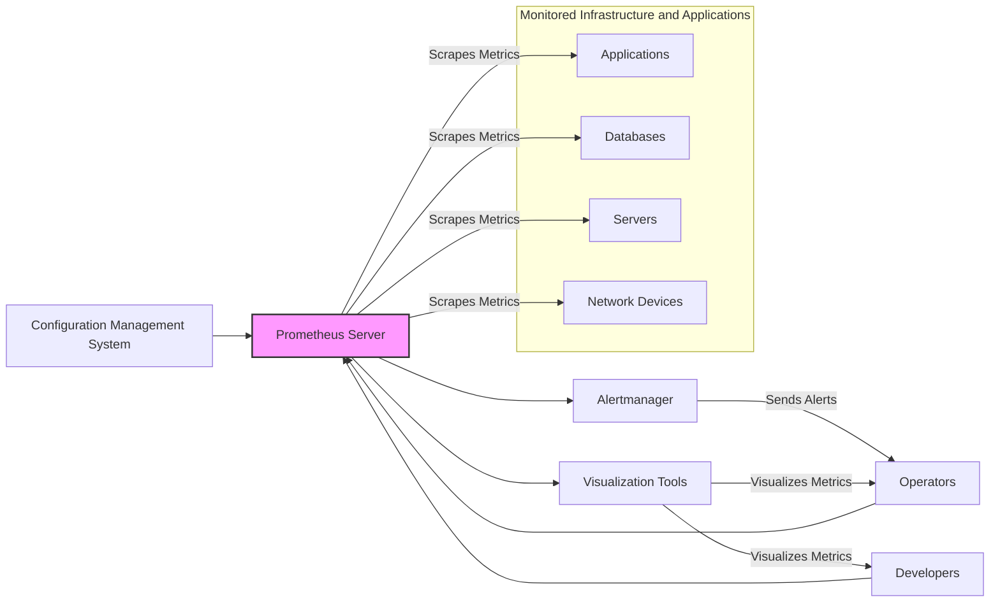
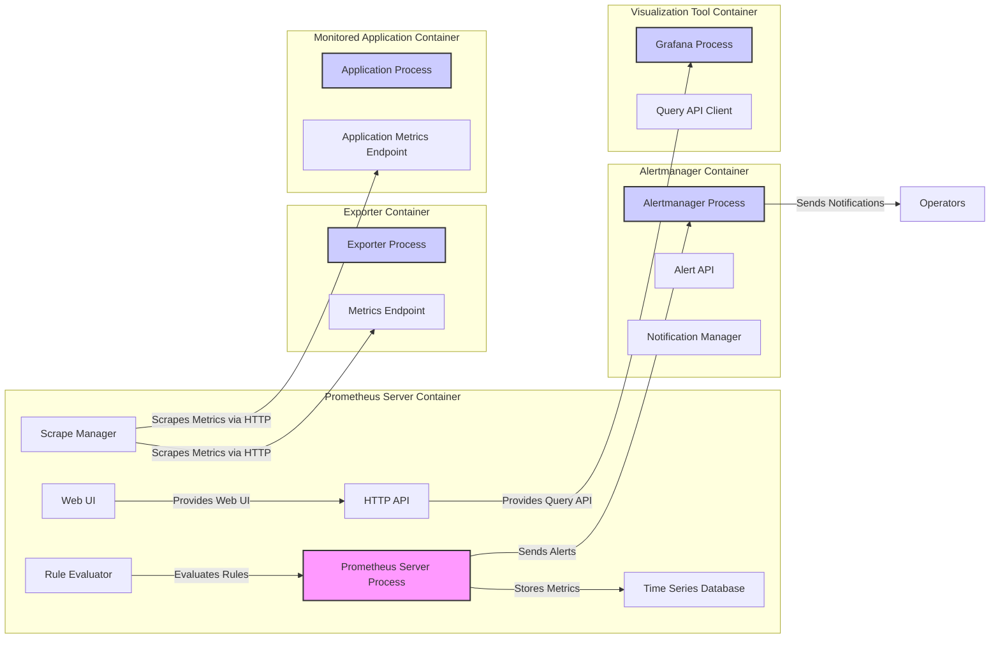
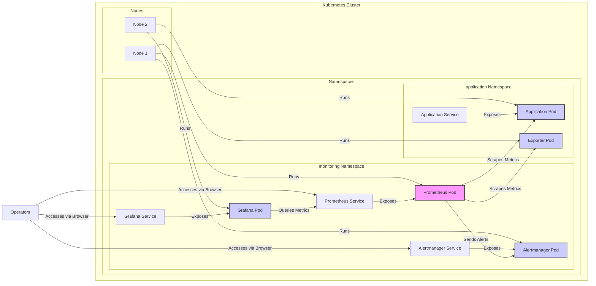

# BUSINESS POSTURE

- Business Priorities and Goals:
  - Ensure observability of infrastructure and applications.
  - Provide reliable monitoring and alerting to detect and resolve issues quickly.
  - Enable performance analysis and capacity planning.
  - Support root cause analysis and troubleshooting.
  - Facilitate proactive issue detection and prevention.
- Business Risks:
  - Data integrity and availability of monitoring data. If monitoring system is down or data is corrupted, it impacts ability to detect and resolve production issues.
  - Unauthorized access to monitoring data. Sensitive metrics might be exposed if access control is not properly implemented.
  - Performance impact of monitoring system on monitored applications. If monitoring system consumes too many resources, it can degrade performance of monitored applications.
  - Incorrect or delayed alerts. False positives can cause alert fatigue, false negatives can lead to undetected issues.
  - Security vulnerabilities in monitoring system itself can be exploited to gain access to monitored infrastructure.

# SECURITY POSTURE

- Existing Security Controls:
  - security control: Code review process for contributions (described in project's CONTRIBUTING.md).
  - security control: Static analysis and linters used during development (likely integrated in CI, not explicitly documented in security context).
  - security control: Community security reporting and vulnerability disclosure process (described in project's SECURITY.md).
  - accepted risk: Reliance on community for security vulnerability discovery and patching.
  - accepted risk: Limited formal security testing and penetration testing.
- Recommended Security Controls:
  - security control: Implement automated security scanning tools in CI/CD pipeline (SAST, DAST, dependency scanning).
  - security control: Conduct regular penetration testing and security audits.
  - security control: Formalize security incident response plan and procedures.
  - security control: Enhance supply chain security measures, including dependency management and artifact signing.
- Security Requirements:
  - Authentication:
    - Requirement: Implement authentication for access to Prometheus UI and API.
    - Requirement: Support secure authentication mechanisms (e.g., OAuth 2.0, OpenID Connect, mutual TLS).
  - Authorization:
    - Requirement: Implement role-based access control (RBAC) to restrict access to metrics, alerts, and configuration based on user roles.
    - Requirement: Enforce least privilege principle for all users and services interacting with Prometheus.
  - Input Validation:
    - Requirement: Implement robust input validation for all user inputs, especially PromQL queries, to prevent injection attacks.
    - Requirement: Sanitize and encode output data to prevent cross-site scripting (XSS) vulnerabilities in the UI.
  - Cryptography:
    - Requirement: Use TLS/HTTPS for all communication channels to encrypt data in transit (between exporters, Prometheus server, Alertmanager, UI, etc.).
    - Requirement: Consider encryption for sensitive data at rest, if applicable (e.g., secrets management for authentication).

# DESIGN

## C4 CONTEXT



- Context Diagram Elements:
  - - Name: Applications
    - Type: System
    - Description: Applications being monitored by Prometheus, generating metrics.
    - Responsibilities: Expose metrics in Prometheus format via HTTP endpoints.
    - Security controls: security control: Implement authentication and authorization for metrics endpoints if sensitive data is exposed. security control: Ensure application security best practices to prevent compromise that could lead to metric manipulation.
  - - Name: Databases
    - Type: System
    - Description: Databases being monitored by Prometheus, generating metrics.
    - Responsibilities: Expose metrics in Prometheus format via HTTP endpoints.
    - Security controls: security control: Implement database access controls. security control: Ensure database security best practices to prevent compromise that could lead to metric manipulation.
  - - Name: Servers
    - Type: System
    - Description: Servers and virtual machines being monitored by Prometheus, using node exporter or similar agents.
    - Responsibilities: Run node exporter to collect and expose system metrics.
    - Security controls: security control: Secure server operating system and harden node exporter installation. security control: Limit access to node exporter port.
  - - Name: Network Devices
    - Type: System
    - Description: Network devices being monitored by Prometheus, using SNMP exporter or direct integrations.
    - Responsibilities: Expose metrics via SNMP or other protocols.
    - Security controls: security control: Secure network device configurations. security control: Implement access control for SNMP or other metric protocols.
  - - Name: Prometheus Server
    - Type: System
    - Description: Core component of Prometheus, responsible for scraping, storing, and querying metrics.
    - Responsibilities: Scrape metrics from targets, store time-series data, provide PromQL query interface, trigger alerts.
    - Security controls: security control: Implement authentication and authorization for UI and API access. security control: Input validation for PromQL queries. security control: TLS/HTTPS for all communication. security control: Secure storage of metrics data.
  - - Name: Alertmanager
    - Type: System
    - Description: Handles alerts generated by Prometheus, deduplicates, groups, and routes them to notification receivers.
    - Responsibilities: Receive alerts from Prometheus, manage alert notifications, route alerts to appropriate channels.
    - Security controls: security control: Implement authentication and authorization for Alertmanager API and UI. security control: Secure communication with Prometheus and notification receivers.
  - - Name: Visualization Tools
    - Type: System
    - Description: Tools like Grafana that visualize metrics data from Prometheus.
    - Responsibilities: Query Prometheus API to retrieve and display metrics, create dashboards and visualizations.
    - Security controls: security control: Implement authentication and authorization for access to visualization tools. security control: Secure communication with Prometheus API.
  - - Name: Operators
    - Type: Person
    - Description: Operations teams responsible for monitoring infrastructure and applications, using Prometheus for alerting and troubleshooting.
    - Responsibilities: Configure Prometheus, manage alerts, respond to incidents, use dashboards for monitoring.
    - Security controls: security control: Role-based access control to Prometheus and related tools. security control: Security awareness training.
  - - Name: Developers
    - Type: Person
    - Description: Development teams using Prometheus to monitor application performance and debug issues.
    - Responsibilities: Instrument applications with metrics, use dashboards for performance analysis, troubleshoot application issues.
    - Security controls: security control: Role-based access control to Prometheus and related tools. security control: Security awareness training.
  - - Name: Configuration Management System
    - Type: System
    - Description: System used to manage and automate the configuration of Prometheus and related components.
    - Responsibilities: Automate deployment and configuration of Prometheus, exporters, and Alertmanager.
    - Security controls: security control: Secure access to configuration management system. security control: Version control and audit logging of configuration changes.

## C4 CONTAINER



- Container Diagram Elements:
  - - Name: Prometheus Server Process
    - Type: Process
    - Description: The core Prometheus server application, written in Go.
    - Responsibilities: Scrapes metrics, stores data in TSDB, evaluates alerting rules, exposes HTTP API and UI.
    - Security controls: security control: Authentication and authorization for HTTP API and UI. security control: Input validation for PromQL queries. security control: TLS/HTTPS for all HTTP communication. security control: Secure configuration management.
  - - Name: Time Series Database (TSDB)
    - Type: Data Store
    - Description: Prometheus's embedded time-series database for storing metrics data.
    - Responsibilities: Persistently store time-series data, provide efficient data retrieval for queries.
    - Security controls: security control: File system permissions to protect data files. security control: Encryption at rest if required for sensitive data (consider volume encryption).
  - - Name: HTTP API
    - Type: Interface
    - Description: Prometheus's HTTP API for querying metrics, managing configuration, and other operations.
    - Responsibilities: Provide programmatic access to Prometheus functionality.
    - Security controls: security control: Authentication and authorization. security control: Input validation. security control: Rate limiting to prevent abuse. security control: TLS/HTTPS.
  - - Name: Web UI
    - Type: Interface
    - Description: Prometheus's built-in web UI for querying metrics and viewing basic dashboards.
    - Responsibilities: Provide user-friendly interface for interacting with Prometheus.
    - Security controls: security control: Authentication and authorization. security control: Content Security Policy (CSP) to mitigate XSS. security control: TLS/HTTPS.
  - - Name: Scrape Manager
    - Type: Component
    - Description: Component within Prometheus server responsible for discovering and scraping metrics from targets.
    - Responsibilities: Target discovery, scheduling scrapes, handling scrape failures.
    - Security controls: security control: Secure configuration of scrape targets. security control: Limit network access from Prometheus server to scrape targets.
  - - Name: Rule Evaluator
    - Type: Component
    - Description: Component within Prometheus server responsible for evaluating alerting and recording rules.
    - Responsibilities: Evaluate PromQL rules, generate alerts, create derived metrics.
    - Security controls: security control: Secure configuration of alerting and recording rules. security control: Input validation for rules.
  - - Name: Exporter Process
    - Type: Process
    - Description: Standalone application that collects metrics from a specific system (e.g., node exporter for system metrics, database exporter for database metrics) and exposes them in Prometheus format.
    - Responsibilities: Collect metrics from target system, expose metrics via HTTP endpoint.
    - Security controls: security control: Secure installation and configuration of exporter. security control: Limit access to exporter port. security control: Consider authentication for exporter metrics endpoint if exposing sensitive data.
  - - Name: Metrics Endpoint
    - Type: Interface
    - Description: HTTP endpoint exposed by exporters and applications to provide metrics in Prometheus format.
    - Responsibilities: Serve metrics data in Prometheus exposition format.
    - Security controls: security control: TLS/HTTPS if required. security control: Authentication and authorization if exposing sensitive data.
  - - Name: Alertmanager Process
    - Type: Process
    - Description: Standalone application for handling alerts from Prometheus.
    - Responsibilities: Receive alerts, deduplicate, group, route, and send notifications.
    - Security controls: security control: Authentication and authorization for Alertmanager API and UI. security control: Secure configuration of notification receivers. security control: TLS/HTTPS for communication.
  - - Name: Alert API
    - Type: Interface
    - Description: Alertmanager's HTTP API for receiving alerts from Prometheus and managing alert configurations.
    - Responsibilities: Provide programmatic interface for alert management.
    - Security controls: security control: Authentication and authorization. security control: Input validation. security control: TLS/HTTPS.
  - - Name: Notification Manager
    - Type: Component
    - Description: Component within Alertmanager responsible for sending alert notifications to configured receivers (e.g., email, Slack, PagerDuty).
    - Responsibilities: Manage notification channels, send alert notifications.
    - Security controls: security control: Secure configuration of notification receivers (credentials management). security control: Encryption of sensitive data in notifications if applicable.
  - - Name: Grafana Process
    - Type: Process
    - Description: Popular open-source data visualization and monitoring tool, often used with Prometheus.
    - Responsibilities: Visualize metrics data from Prometheus, create dashboards and alerts.
    - Security controls: security control: Authentication and authorization for Grafana UI and API. security control: Secure configuration of Grafana data sources. security control: TLS/HTTPS.
  - - Name: Query API Client
    - Type: Component
    - Description: Grafana's component for querying Prometheus HTTP API.
    - Responsibilities: Query Prometheus API to retrieve metrics data.
    - Security controls: security control: Securely store Prometheus API credentials. security control: TLS/HTTPS for communication with Prometheus API.
  - - Name: Application Process
    - Type: Process
    - Description: Example application being monitored by Prometheus.
    - Responsibilities: Implement application logic, expose application metrics.
    - Security controls: security control: Application security best practices. security control: Secure implementation of application metrics endpoint.
  - - Name: Application Metrics Endpoint
    - Type: Interface
    - Description: HTTP endpoint exposed by application to provide application-specific metrics in Prometheus format.
    - Responsibilities: Serve application metrics data.
    - Security controls: security control: TLS/HTTPS if required. security control: Authentication and authorization if exposing sensitive data.

## DEPLOYMENT

Deployment Solution: Kubernetes Cluster



- Deployment Diagram Elements:
  - - Name: Kubernetes Cluster
    - Type: Environment
    - Description: Container orchestration platform used to deploy and manage Prometheus and related components.
    - Responsibilities: Provide infrastructure for running containers, manage networking, storage, and scaling.
    - Security controls: security control: Kubernetes RBAC for access control. security control: Network policies to restrict network traffic between namespaces and pods. security control: Pod security policies/Pod security admission to enforce security constraints on pods. security control: Regular security updates and patching of Kubernetes cluster.
  - - Name: Nodes
    - Type: Infrastructure
    - Description: Worker nodes in the Kubernetes cluster, physical or virtual machines.
    - Responsibilities: Run pods, provide compute resources.
    - Security controls: security control: Operating system hardening. security control: Regular security updates and patching. security control: Network security controls (firewalls, network segmentation).
  - - Name: monitoring Namespace
    - Type: Container
    - Description: Kubernetes namespace dedicated to deploying Prometheus, Alertmanager, and Grafana.
    - Responsibilities: Isolate monitoring components from other applications.
    - Security controls: security control: Kubernetes RBAC to control access to the namespace. security control: Network policies to restrict network traffic to and from the namespace.
  - - Name: application Namespace
    - Type: Container
    - Description: Kubernetes namespace where monitored applications and exporters are deployed.
    - Responsibilities: Run applications and exporters.
    - Security controls: security control: Kubernetes RBAC to control access to the namespace. security control: Network policies to restrict network traffic to and from the namespace.
  - - Name: Prometheus Pod
    - Type: Container
    - Description: Kubernetes pod running the Prometheus Server container.
    - Responsibilities: Run Prometheus server process.
    - Security controls: security control: Pod security context to limit pod capabilities. security control: Network policies to restrict network access from the pod. security control: Secure configuration of Prometheus container image.
  - - Name: Alertmanager Pod
    - Type: Container
    - Description: Kubernetes pod running the Alertmanager container.
    - Responsibilities: Run Alertmanager process.
    - Security controls: security control: Pod security context. security control: Network policies. security control: Secure configuration of Alertmanager container image.
  - - Name: Grafana Pod
    - Type: Container
    - Description: Kubernetes pod running the Grafana container.
    - Responsibilities: Run Grafana process.
    - Security controls: security control: Pod security context. security control: Network policies. security control: Secure configuration of Grafana container image.
  - - Name: Exporter Pod
    - Type: Container
    - Description: Kubernetes pod running an exporter container (e.g., node exporter).
    - Responsibilities: Run exporter process.
    - Security controls: security control: Pod security context. security control: Network policies. security control: Secure configuration of exporter container image.
  - - Name: Application Pod
    - Type: Container
    - Description: Kubernetes pod running the monitored application container.
    - Responsibilities: Run application process.
    - Security controls: security control: Application security best practices. security control: Pod security context. security control: Network policies.
  - - Name: Prometheus Service
    - Type: Load Balancer
    - Description: Kubernetes service to expose Prometheus pod.
    - Responsibilities: Provide stable endpoint for accessing Prometheus UI and API.
    - Security controls: security control: Network policies to control access to the service. security control: Consider using Ingress with TLS termination for secure access.
  - - Name: Alertmanager Service
    - Type: Load Balancer
    - Description: Kubernetes service to expose Alertmanager pod.
    - Responsibilities: Provide stable endpoint for accessing Alertmanager UI and API.
    - Security controls: security control: Network policies. security control: Consider using Ingress with TLS termination for secure access.
  - - Name: Grafana Service
    - Type: Load Balancer
    - Description: Kubernetes service to expose Grafana pod.
    - Responsibilities: Provide stable endpoint for accessing Grafana UI.
    - Security controls: security control: Network policies. security control: Consider using Ingress with TLS termination and authentication for secure access.
  - - Name: App Service
    - Type: Load Balancer
    - Description: Kubernetes service to expose application pod.
    - Responsibilities: Provide stable endpoint for accessing application.
    - Security controls: security control: Application specific security controls.
  - - Name: Operators
    - Type: Person
    - Description: Operations teams accessing Prometheus, Alertmanager, and Grafana.
    - Responsibilities: Monitor system, manage alerts, troubleshoot issues.
    - Security controls: security control: Kubernetes RBAC for access to Kubernetes resources. security control: Authentication and authorization for accessing services.

## BUILD

```mermaid
flowchart LR
    Developer[Developer] --> SourceCode[Source Code Repository (GitHub)]
    SourceCode -- "Code Changes" --> CI[CI/CD System (GitHub Actions)]
    CI -- "Build & Test" --> BuildArtifacts[Build Artifacts (Container Images, Binaries)]
    BuildArtifacts -- "Publish" --> Registry[Container Registry / Artifact Repository]
    Registry -- "Deploy" --> KubernetesCluster[Kubernetes Cluster]

    subgraph CI[CI/CD System (GitHub Actions)]
        direction LR
        Build[Build Stage]
        Test[Test Stage]
        SecurityChecks[Security Checks Stage]
        SignArtifacts[Sign Artifacts Stage]

        Build --> Test
        Test --> SecurityChecks
        SecurityChecks --> SignArtifacts
    end

    subgraph SecurityChecks[Security Checks Stage]
        direction TB
        SAST[SAST Scanner]
        DependencyScan[Dependency Scanner]
        Linting[Linting]

        SAST
        DependencyScan
        Linting
    end

    style CI fill:#ccf,stroke:#333,stroke-width:2px
    style SecurityChecks fill:#ccf,stroke:#333,stroke-width:2px
```

- Build Process Elements:
  - - Name: Developer
    - Type: Person
    - Description: Software developers contributing to the Prometheus project.
    - Responsibilities: Write code, commit changes to source code repository.
    - Security controls: security control: Secure developer workstations. security control: Code review process. security control: Security awareness training.
  - - Name: Source Code Repository (GitHub)
    - Type: System
    - Description: GitHub repository hosting the Prometheus source code.
    - Responsibilities: Version control, code collaboration, issue tracking.
    - Security controls: security control: Access control to repository (authentication and authorization). security control: Branch protection rules. security control: Audit logging of repository activities.
  - - Name: CI/CD System (GitHub Actions)
    - Type: System
    - Description: GitHub Actions used for automated build, test, and deployment pipelines.
    - Responsibilities: Automate build process, run tests, perform security checks, publish artifacts.
    - Security controls: security control: Secure configuration of CI/CD pipelines. security control: Access control to CI/CD system. security control: Secret management for credentials used in CI/CD.
  - - Name: Build Stage
    - Type: Component
    - Description: Stage in CI/CD pipeline responsible for compiling code and creating build artifacts.
    - Responsibilities: Compile code, build binaries, create container images.
    - Security controls: security control: Use of secure build environments. security control: Dependency management and vulnerability scanning.
  - - Name: Test Stage
    - Type: Component
    - Description: Stage in CI/CD pipeline responsible for running automated tests.
    - Responsibilities: Execute unit tests, integration tests, and other automated tests.
    - Security controls: security control: Secure test environments. security control: Test coverage analysis.
  - - Name: Security Checks Stage
    - Type: Component
    - Description: Stage in CI/CD pipeline performing security checks on the codebase and build artifacts.
    - Responsibilities: Run SAST scanners, dependency scanners, linters, and other security tools.
    - Security controls: security control: Regularly updated security scanning tools and rulesets. security control: Automated vulnerability reporting and remediation workflows.
  - - Name: SAST Scanner
    - Type: Tool
    - Description: Static Application Security Testing tool used to analyze source code for security vulnerabilities.
    - Responsibilities: Identify potential security flaws in the code.
    - Security controls: security control: Regularly updated vulnerability signatures. security control: Configuration to match project security policies.
  - - Name: Dependency Scanner
    - Type: Tool
    - Description: Tool used to scan project dependencies for known vulnerabilities.
    - Responsibilities: Identify vulnerable dependencies.
    - Security controls: security control: Regularly updated vulnerability database. security control: Automated dependency update workflows.
  - - Name: Linting
    - Type: Tool
    - Description: Code linting tools used to enforce code quality and style guidelines, which can indirectly improve security.
    - Responsibilities: Identify code style issues and potential bugs.
    - Security controls: security control: Configuration to enforce secure coding practices.
  - - Name: Sign Artifacts Stage
    - Type: Component
    - Description: Stage in CI/CD pipeline responsible for signing build artifacts to ensure integrity and authenticity.
    - Responsibilities: Sign container images and binaries using cryptographic signatures.
    - Security controls: security control: Secure key management for signing keys. security control: Verification of signatures during deployment.
  - - Name: Build Artifacts (Container Images, Binaries)
    - Type: Data
    - Description: Output of the build process, including container images and binaries.
    - Responsibilities: Deployable artifacts of the Prometheus project.
    - Security controls: security control: Artifact signing. security control: Storage in secure artifact repository.
  - - Name: Registry (Container Registry / Artifact Repository)
    - Type: System
    - Description: Container registry (e.g., Docker Hub, GitHub Container Registry) and artifact repository used to store and distribute build artifacts.
    - Responsibilities: Securely store and distribute container images and binaries.
    - Security controls: security control: Access control to registry. security control: Vulnerability scanning of container images in registry. security control: Audit logging of registry access.
  - - Name: Kubernetes Cluster
    - Type: Environment
    - Description: Target deployment environment where Prometheus is deployed.
    - Responsibilities: Run Prometheus application.
    - Security controls: security control: Image verification during deployment (using image signatures). security control: Kubernetes security controls.

# RISK ASSESSMENT

- Critical Business Processes:
  - Monitoring infrastructure and application availability and performance.
  - Alerting on critical issues and service disruptions.
  - Capacity planning and performance analysis.
  - Incident response and troubleshooting.
- Data Sensitivity:
  - Metrics data: Operational data, performance metrics, system resource utilization. Generally considered technical data, but can reveal sensitive information about system architecture, performance bottlenecks, and potentially business activity patterns. Sensitivity level: Medium.
  - Alert data: Information about system failures and anomalies. Can contain details about incidents and potential security issues. Sensitivity level: Medium to High depending on the context of alerts.
  - Configuration data: Prometheus configuration, alerting rules, recording rules, scrape configurations. Can contain sensitive information like API keys, passwords, and internal network details if not properly managed. Sensitivity level: High if secrets are not properly managed.

# QUESTIONS & ASSUMPTIONS

- Questions:
  - What are the specific compliance requirements for the project (e.g., GDPR, HIPAA, PCI DSS)?
  - What is the organization's risk appetite regarding open-source software and security vulnerabilities?
  - Are there specific security tools or technologies already in use within the organization that should be integrated with Prometheus?
  - What are the expected user roles and access requirements for Prometheus (operators, developers, business users)?
  - Are there any specific data retention requirements for metrics data?
- Assumptions:
  - BUSINESS POSTURE: The primary business goal is to ensure system observability and reliability.
  - SECURITY POSTURE: Security is important but balanced with the need for rapid development and community contributions typical of open-source projects. The deployment environment is assumed to be security-conscious and will implement recommended security controls.
  - DESIGN: Prometheus is deployed in a Kubernetes environment. Standard exporters are used for collecting metrics. Grafana is used for visualization. Authentication and authorization are required for accessing Prometheus UI and API. TLS/HTTPS is used for all communication channels.