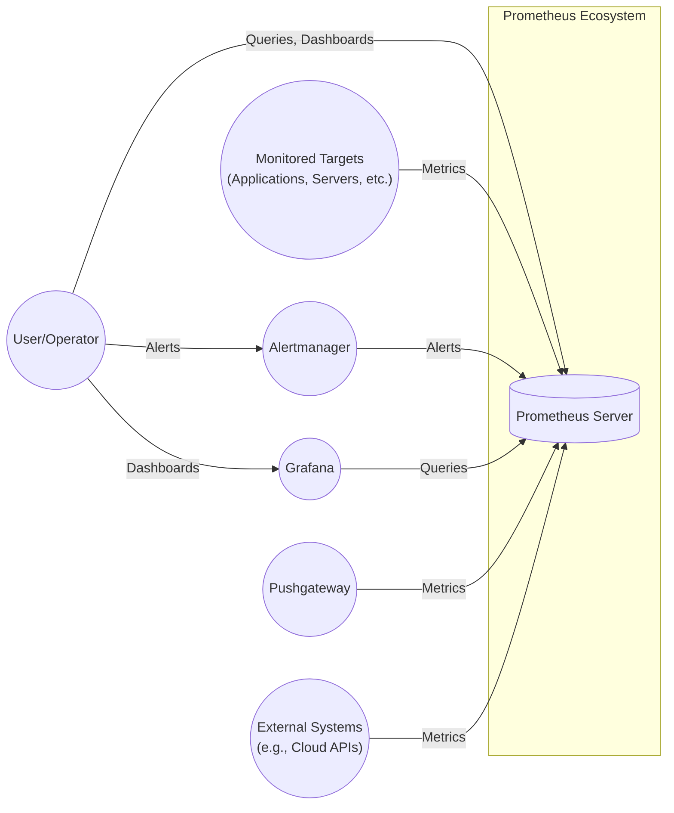
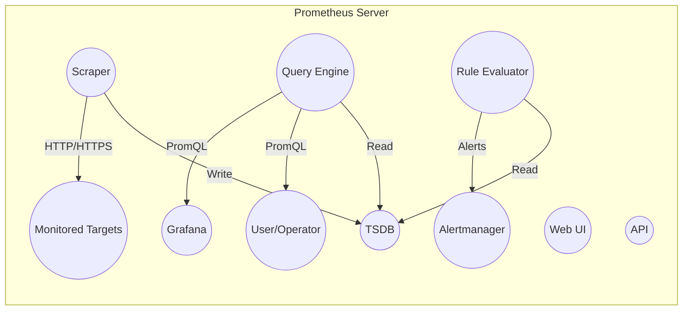
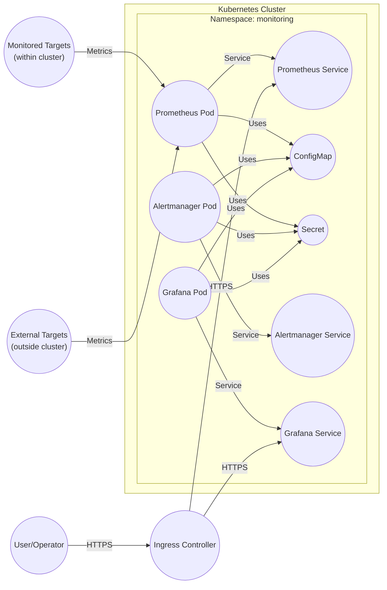
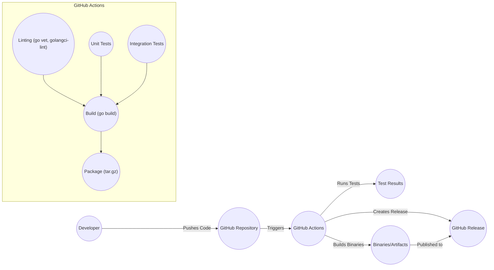

Okay, let's create a design document for the Prometheus project, focusing on aspects relevant for threat modeling.

# BUSINESS POSTURE

Prometheus is a leading open-source monitoring and alerting system.  It's widely adopted across various industries, from small startups to large enterprises.  Given its nature, the business priorities revolve around:

*   Reliability:  Prometheus must be highly available and resilient.  Outages or data loss can directly impact a company's ability to detect and respond to incidents.
*   Accuracy:  The data collected and the alerts generated must be accurate and trustworthy.  False positives or false negatives can lead to wasted effort or missed critical issues.
*   Scalability:  Prometheus deployments must scale to handle increasing data volumes and query loads as monitored environments grow.
*   Extensibility:  The ability to integrate with a wide range of systems and data sources is crucial for broad adoption.
*   Security: Protecting the integrity and confidentiality of the monitoring data, and preventing unauthorized access or modification of the Prometheus system itself, is paramount.
*   Cost-Effectiveness: As an open-source project, cost-effectiveness is inherent, but deployments should be optimized to minimize resource consumption.
*   Community: Maintaining a vibrant and active open-source community is essential for long-term sustainability and innovation.

Key Business Risks:

*   Operational Disruption:  A compromised or unavailable Prometheus instance can blind an organization to critical issues in their infrastructure and applications.
*   Data Breach:  Sensitive metrics data, if exposed, could reveal confidential business information or provide attackers with insights to exploit vulnerabilities.
*   Data Manipulation:  Altered metrics or alerts could mislead operators, leading to incorrect decisions or delayed responses.
*   Reputational Damage:  Security incidents or data breaches related to Prometheus could damage the reputation of both the project and the organizations using it.
*   Compliance Violations:  Depending on the industry and the data being monitored, there may be compliance requirements (e.g., GDPR, HIPAA) that need to be addressed.

# SECURITY POSTURE

Existing Security Controls (based on the GitHub repository and common practices):

*   security control: Authentication: Prometheus supports basic authentication and TLS client authentication for accessing its API and web interface. (Described in Prometheus documentation and configuration options).
*   security control: Authorization: Limited built-in authorization capabilities. Typically, authorization is handled at the network level (e.g., firewall rules, reverse proxies) or through external tools. (Described in Prometheus documentation and community best practices).
*   security control: TLS Encryption:  Prometheus supports TLS for encrypting communication between Prometheus servers, targets, and clients. (Described in Prometheus documentation and configuration options).
*   security control: Input Validation:  Prometheus performs input validation on PromQL queries and configuration files to prevent certain types of attacks (e.g., injection). (Implemented in the Prometheus codebase).
*   security control: Regular Updates:  The Prometheus project releases regular updates, including security patches. (Tracked in the GitHub repository and release notes).
*   security control: Community Security Audits: The large and active Prometheus community contributes to identifying and addressing security vulnerabilities.
*   security control: Secure by default configuration: Prometheus is moving towards more secure defaults, but still requires careful configuration.
*   security control: Deployment best practices: Documentation and community resources provide guidance on secure deployment configurations.

Accepted Risks:

*   accepted risk: Limited Built-in Authorization:  Reliance on external mechanisms for fine-grained authorization is an accepted risk, requiring careful configuration of those external systems.
*   accepted risk: Complexity of Secure Configuration:  Achieving a highly secure Prometheus deployment can be complex, requiring expertise in TLS, network security, and potentially external authentication/authorization systems.
*   accepted risk: Dependency on External Components:  Security relies on the security of underlying components (e.g., operating system, network infrastructure) and integrated systems (e.g., Alertmanager, Grafana).
*   accepted risk: Exposure of Target Metadata: Prometheus stores and may expose metadata about monitored targets, which could potentially aid attackers.

Recommended Security Controls:

*   Implement a robust authentication and authorization mechanism using a reverse proxy (e.g., Nginx, Envoy) or an authentication proxy (e.g., OAuth2 Proxy).
*   Enforce TLS encryption for all communication channels (server-to-server, server-to-target, server-to-client).
*   Regularly review and update Prometheus and its dependencies to the latest versions.
*   Implement network segmentation to isolate Prometheus from untrusted networks.
*   Monitor Prometheus itself for security events and anomalies.
*   Consider using a secrets management solution to securely store and manage sensitive configuration values (e.g., API keys, passwords).
*   Implement robust logging and auditing of Prometheus operations.

Security Requirements:

*   Authentication:
    *   All access to the Prometheus API and web interface must be authenticated.
    *   Support for strong authentication mechanisms (e.g., multi-factor authentication) should be considered.
    *   Authentication credentials must be securely stored and managed.

*   Authorization:
    *   Access to Prometheus resources (e.g., metrics, alerts, configuration) should be controlled based on the principle of least privilege.
    *   Fine-grained authorization rules should be implemented to restrict access based on user roles and responsibilities.

*   Input Validation:
    *   All user-supplied input (e.g., PromQL queries, configuration files) must be validated to prevent injection attacks and other vulnerabilities.
    *   Regular expressions used for input validation should be carefully reviewed to avoid ReDoS vulnerabilities.

*   Cryptography:
    *   TLS should be used to encrypt all communication channels.
    *   Strong cryptographic algorithms and key lengths should be used.
    *   Certificates should be properly managed and validated.

# DESIGN

## C4 CONTEXT

C4 Context Element List:

*   Element:
    *   Name: Prometheus Server
    *   Type: System
    *   Description: The core Prometheus server that scrapes metrics, evaluates rules, and stores data.
    *   Responsibilities: Scraping metrics from targets, evaluating alerting rules, storing time-series data, providing a query API.
    *   Security controls: Authentication (basic auth, TLS client auth), TLS encryption, input validation, regular updates.

*   Element:
    *   Name: User/Operator
    *   Type: User
    *   Description: A person interacting with Prometheus to view dashboards, configure alerts, or manage the system.
    *   Responsibilities: Monitoring system health, responding to alerts, configuring Prometheus.
    *   Security controls: Strong passwords, multi-factor authentication (if supported by the authentication mechanism).

*   Element:
    *   Name: Monitored Targets
    *   Type: System
    *   Description: Applications, servers, and other systems that expose metrics in a format Prometheus can scrape.
    *   Responsibilities: Providing metrics data.
    *   Security controls: Authentication (if required by the target), TLS encryption (if supported by the target).

*   Element:
    *   Name: Alertmanager
    *   Type: System
    *   Description: A separate component that handles alerts generated by Prometheus, including deduplication, grouping, and routing.
    *   Responsibilities: Receiving alerts from Prometheus, managing alert state, sending notifications.
    *   Security controls: Authentication, TLS encryption, access controls.

*   Element:
    *   Name: Grafana
    *   Type: System
    *   Description: A visualization tool often used with Prometheus to create dashboards and explore metrics.
    *   Responsibilities: Providing a user interface for visualizing Prometheus data.
    *   Security controls: Authentication, authorization, TLS encryption, access controls.

*   Element:
    *   Name: Pushgateway
    *   Type: System
    *   Description: An intermediary service that allows ephemeral and batch jobs to expose metrics to Prometheus.
    *   Responsibilities: Receiving metrics from short-lived jobs and making them available to Prometheus.
    *   Security controls: Authentication, TLS encryption.

*   Element:
    *   Name: External Systems
    *   Type: System
    *   Description: External systems, such as cloud provider APIs, that can be scraped for metrics.
    *   Responsibilities: Providing metrics data.
    *   Security controls: Authentication (API keys, service accounts), TLS encryption.

## C4 CONTAINER

C4 Container Element List:

*   Element:
    *   Name: Scraper
    *   Type: Container
    *   Description: Responsible for periodically fetching metrics from configured targets.
    *   Responsibilities: Making HTTP requests to targets, parsing responses, writing data to storage.
    *   Security controls: TLS configuration for secure scraping, authentication to targets.

*   Element:
    *   Name: TSDB (Time Series Database)
    *   Type: Container
    *   Description: The storage engine for Prometheus, optimized for storing and querying time-series data.
    *   Responsibilities: Storing metrics data, providing efficient data retrieval.
    *   Security controls: Data encryption at rest (if configured), access controls (via the API).

*   Element:
    *   Name: Query Engine
    *   Type: Container
    *   Description: Processes PromQL queries and retrieves data from the TSDB.
    *   Responsibilities: Parsing PromQL queries, executing queries against the TSDB, returning results.
    *   Security controls: Input validation (PromQL parsing), rate limiting (to prevent DoS).

*   Element:
    *   Name: Rule Evaluator
    *   Type: Container
    *   Description: Periodically evaluates alerting and recording rules.
    *   Responsibilities: Evaluating rules against the TSDB, generating alerts.
    *   Security controls: Input validation (rule configuration).

*   Element:
    *   Name: Web UI
    *   Type: Container
    *   Description: Provides a web interface for interacting with Prometheus.
    *   Responsibilities: Serving web pages, handling user interactions.
    *   Security controls: Authentication, TLS encryption, XSS protection.

*   Element:
    *   Name: API
    *   Type: Container
    *   Description: Provides an HTTP API for accessing Prometheus data and functionality.
    *   Responsibilities: Handling API requests, returning responses.
    *   Security controls: Authentication, TLS encryption, input validation, rate limiting.

*   Element:
    *   Name: Monitored Targets
    *   Type: External System
    *   Description: Applications, servers, and other systems that expose metrics.
    *   Responsibilities: Providing metrics data.
    *   Security controls: Authentication (if required by the target), TLS encryption (if supported by the target).

*   Element:
    *   Name: Alertmanager
    *   Type: External System
    *   Description: Handles alerts generated by Prometheus.
    *   Responsibilities: Receiving, deduplicating, grouping, and routing alerts.
    *   Security controls: Authentication, TLS encryption, access controls.

*   Element:
    *   Name: Grafana
    *   Type: External System
    *   Description: Visualization tool for creating dashboards.
    *   Responsibilities: Querying Prometheus and displaying data.
    *   Security controls: Authentication, authorization, TLS encryption, access controls.

*   Element:
    *   Name: User/Operator
    *   Type: User
    *   Description: A person interacting with the system.
    *   Responsibilities: Monitoring, configuring, and managing Prometheus.
    *   Security controls: Strong passwords, multi-factor authentication.

## DEPLOYMENT

Possible Deployment Solutions:

1.  Bare-metal/VM deployment:  Prometheus binaries are directly installed and run on servers.
2.  Containerized deployment (Docker): Prometheus is run within Docker containers.
3.  Kubernetes deployment: Prometheus is deployed as a set of pods within a Kubernetes cluster. This is a very common and recommended approach.
4.  Cloud-managed Prometheus (e.g., Amazon Managed Service for Prometheus, Google Cloud Managed Service for Prometheus):  Leveraging cloud provider services for managed Prometheus deployments.

Chosen Deployment Solution (for detailed description): Kubernetes Deployment

Deployment Element List:

*   Element:
    *   Name: Kubernetes Cluster
    *   Type: Infrastructure
    *   Description: The Kubernetes cluster where Prometheus is deployed.
    *   Responsibilities: Orchestrating and managing containers.
    *   Security controls: Kubernetes RBAC, network policies, pod security policies, node security.

*   Element:
    *   Name: Namespace: monitoring
    *   Type: Logical Boundary
    *   Description: A Kubernetes namespace dedicated to monitoring resources.
    *   Responsibilities: Isolating monitoring components from other applications.
    *   Security controls: Kubernetes RBAC, network policies.

*   Element:
    *   Name: Prometheus Pod
    *   Type: Container Instance
    *   Description: A pod running the Prometheus server container.
    *   Responsibilities: Running the Prometheus server.
    *   Security controls: Pod security context, resource limits.

*   Element:
    *   Name: Prometheus Service
    *   Type: Service
    *   Description: A Kubernetes service that exposes the Prometheus pod.
    *   Responsibilities: Providing a stable endpoint for accessing Prometheus.
    *   Security controls: Network policies.

*   Element:
    *   Name: ConfigMap
    *   Type: Configuration
    *   Description: A Kubernetes ConfigMap containing Prometheus configuration files.
    *   Responsibilities: Storing Prometheus configuration.
    *   Security controls: Kubernetes RBAC.

*   Element:
    *   Name: Secret
    *   Type: Configuration
    *   Description: A Kubernetes Secret containing sensitive configuration values (e.g., passwords, API keys).
    *   Responsibilities: Securely storing sensitive data.
    *   Security controls: Kubernetes RBAC, encryption at rest (if configured).

*   Element:
    *   Name: Alertmanager Pod, Alertmanager Service, Grafana Pod, Grafana Service
    *   Type: Container Instance, Service
    *   Description: Similar to Prometheus Pod and Service, but for Alertmanager and Grafana.
    *   Responsibilities: Running Alertmanager/Grafana and providing stable endpoints.
    *   Security controls: Similar to Prometheus Pod and Service.

*   Element:
    *   Name: Ingress Controller
    *   Type: Infrastructure
    *   Description: A Kubernetes Ingress controller that manages external access to services.
    *   Responsibilities: Routing external traffic to the Prometheus and Grafana services.
    *   Security controls: TLS termination, authentication (if configured), WAF (if configured).

*   Element:
    *   Name: User/Operator
    *   Type: User
    *   Description: A person accessing Prometheus and Grafana via the Ingress.
    *   Responsibilities: Monitoring, configuring, and managing the system.
    *   Security controls: Strong passwords, multi-factor authentication.

*   Element:
    *   Name: Monitored Targets (within cluster)
    *   Type: Application/Service
    *   Description: Applications and services running within the Kubernetes cluster that are monitored by Prometheus.
    *   Responsibilities: Providing metrics data.
    *   Security controls: Pod security context, network policies.

*   Element:
    *   Name: External Targets (outside cluster)
    *   Type: Application/Service
    *   Description: Applications and services running outside the Kubernetes cluster that are monitored by Prometheus.
    *   Responsibilities: Providing metrics data.
    *   Security controls: Authentication, TLS encryption.

## BUILD

The Prometheus build process is automated using a combination of Makefiles, shell scripts, and Go build tools.  It leverages GitHub Actions for continuous integration and testing.

Build Process Security Controls:

*   security control: Code Review: All code changes are reviewed by other developers before being merged. (GitHub pull request process).
*   security control: Static Analysis:  Linters (go vet, golangci-lint) are used to identify potential code quality and security issues. (GitHub Actions workflow).
*   security control: Automated Testing:  Unit tests and integration tests are run automatically on every code change. (GitHub Actions workflow).
*   security control: Dependency Management: Go modules are used to manage dependencies and ensure reproducible builds.  Dependencies are vendored.
*   security control: Signed Releases:  Releases are signed with a GPG key to verify their authenticity. (GitHub Releases and documentation).
*   security control: Build Reproducibility: Efforts are made to ensure that builds are reproducible, meaning that the same source code will always produce the same binary.

# RISK ASSESSMENT

Critical Business Processes to Protect:

*   Monitoring and Alerting:  The core function of Prometheus is to provide reliable monitoring and alerting.  Disrupting this process can have severe consequences for the organizations relying on it.
*   Incident Response:  Prometheus data is crucial for diagnosing and resolving incidents.  Loss or corruption of this data can hinder incident response efforts.
*   Capacity Planning:  Prometheus metrics are used to track resource utilization and plan for future capacity needs.  Inaccurate data can lead to incorrect capacity planning decisions.

Data to Protect and Sensitivity:

*   Metrics Data:  The sensitivity of metrics data varies greatly depending on what is being monitored.  Some metrics may be publicly available (e.g., website uptime), while others may be highly confidential (e.g., internal application performance data, financial metrics).  Data sensitivity should be assessed on a case-by-case basis.
*   Configuration Data:  Prometheus configuration files may contain sensitive information, such as API keys, passwords, and target addresses.  This data should be treated as highly sensitive.
*   Alerting Rules:  Alerting rules may reveal information about an organization's infrastructure and security posture.  This data should be considered sensitive.
*   Logs: Prometheus logs may contain sensitive information, such as IP addresses, usernames, and query details.  Access to logs should be restricted.

# QUESTIONS & ASSUMPTIONS

Questions:

*   What specific compliance requirements (e.g., GDPR, HIPAA) apply to the organizations using Prometheus?
*   What is the expected threat model for Prometheus deployments? (e.g., external attackers, insider threats)
*   What are the specific security requirements for integrating Prometheus with other systems (e.g., Alertmanager, Grafana)?
*   What level of detail is required for the threat model? (e.g., specific attack vectors, mitigation strategies)
*   Are there any specific security concerns or priorities that have been identified by the Prometheus community?

Assumptions:

*   BUSINESS POSTURE: Organizations using Prometheus prioritize the availability, accuracy, and security of their monitoring data.
*   SECURITY POSTURE: Organizations deploying Prometheus will follow security best practices and implement appropriate security controls.
*   DESIGN: The deployment architecture will be based on Kubernetes, as this is a common and recommended approach. The build process will follow standard Prometheus procedures.