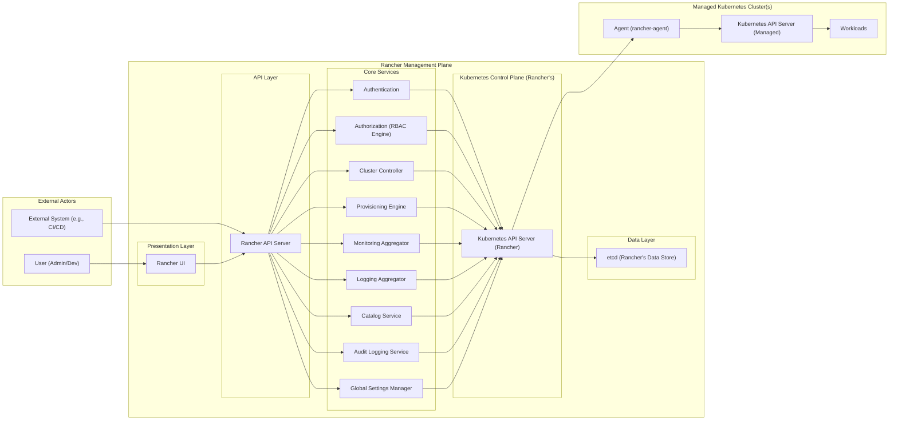
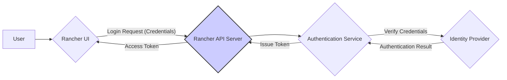
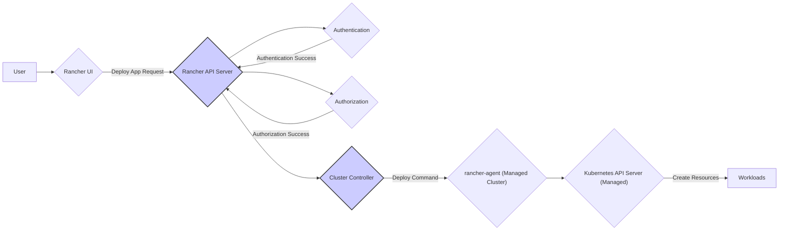

# Project Design Document: Rancher (Improved)

**1. Introduction**

* **Project Name:** Rancher
* **Project Repository:** [https://github.com/rancher/rancher](https://github.com/rancher/rancher)
* **Document Purpose:** This document provides an enhanced architectural overview of the Rancher project, specifically tailored for threat modeling activities. It details key components, their interactions, data flows, and technologies, offering a deeper understanding of the system's attack surface.
* **Target Audience:** Security engineers, architects, developers, and anyone involved in the threat modeling process for the Rancher project, requiring a more granular understanding of its architecture.
* **Document Scope:** This document focuses on the core Rancher management server and its interactions with managed Kubernetes clusters. It provides a more detailed breakdown of internal components and data exchanges. The scope includes the user interface, API, authentication and authorization mechanisms, the agents deployed on managed clusters, and key internal services. It does not delve into the specifics of the underlying operating systems or infrastructure providers beyond their interaction points with Rancher.

**2. High-Level Architecture**

Rancher acts as a centralized management plane for multiple Kubernetes clusters. It provides a unified interface and API for managing these clusters, regardless of their location or provider.

**3. Detailed Component Description**

* **External Actors:**
    * **User (Admin/Dev):** Individuals interacting with Rancher for cluster and application management.
    * **External System (e.g., CI/CD):** Automated systems interacting with the Rancher API for programmatic management.

* **Rancher UI:**
    * A single-page application providing a graphical interface for user interaction.
    * Communicates with the Rancher API Server via HTTPS.
    * Implements client-side rendering and user interface logic.

* **Rancher API Server:**
    * The central gateway for all management operations.
    * Exposes a RESTful API (primarily JSON).
    * Enforces authentication and authorization for all incoming requests.
    * Routes requests to appropriate internal services.

* **Authentication:**
    * Responsible for verifying user and service identities.
    * Supports local authentication, Active Directory, LDAP, OAuth 2.0, SAML, and potentially other identity providers.
    * Manages user credentials and session tokens.

* **Authorization (RBAC Engine):**
    * Enforces role-based access control policies within Rancher and for managed clusters.
    * Determines if an authenticated user or service has permission to perform a specific action.
    * Manages roles, permissions, and bindings.

* **Cluster Controller:**
    * Manages the lifecycle of managed Kubernetes clusters.
    * Handles cluster registration, creation, upgrade, and deletion.
    * Monitors the health and status of managed clusters.

* **Provisioning Engine:**
    * Responsible for provisioning new Kubernetes clusters on various infrastructure providers.
    * Utilizes drivers and plugins for interacting with cloud provider APIs (e.g., AWS, Azure, GCP) and on-premise infrastructure.
    * Manages the deployment of Kubernetes components on provisioned nodes.

* **Monitoring Aggregator:**
    * Collects and aggregates monitoring data from managed clusters.
    * Typically integrates with Prometheus or similar monitoring solutions deployed within managed clusters.
    * Provides APIs for accessing collected metrics.

* **Logging Aggregator:**
    * Collects and aggregates logs from managed clusters.
    * Often integrates with Elasticsearch, Fluentd, and Kibana (EFK stack) or similar logging solutions.
    * Provides APIs for querying and viewing logs.

* **Catalog Service:**
    * Manages catalogs of applications (Helm charts, Rancher charts) that can be deployed to managed clusters.
    * Provides an interface for browsing and deploying applications from configured catalogs.

* **Audit Logging Service:**
    * Records auditable events within the Rancher system, including user actions, API calls, and system events.
    * Stores audit logs for security and compliance purposes.

* **Global Settings Manager:**
    * Manages global configuration settings for the Rancher platform.
    * Includes settings for authentication providers, notification channels, security configurations, and feature flags.

* **etcd (Rancher's Data Store):**
    * The distributed key-value store used by Rancher to store its state and configuration.
    * Contains sensitive information, including cluster connection details, user credentials (hashed), and RBAC policies.

* **Kubernetes API Server (Rancher):**
    * The API server of the underlying Kubernetes cluster where the Rancher management plane is deployed.
    * Used by Rancher's internal components for orchestration and management.

* **Agent (rancher-agent):**
    * Deployed as a DaemonSet on each managed Kubernetes cluster.
    * Establishes a secure, bidirectional connection (typically using TLS) with the Rancher management server.
    * Acts as a communication proxy between the Rancher control plane and the managed cluster's API server.
    * Facilitates management operations initiated from Rancher.

* **Kubernetes API Server (Managed):**
    * The API server of the managed Kubernetes cluster.
    * Receives requests proxied through the `rancher-agent`.

* **Workloads:**
    * The applications and services running within the managed Kubernetes clusters.

**4. Data Flow (Examples)**

* **User Login:**
    * User submits login credentials via the Rancher UI.
    * Rancher UI sends credentials to the Rancher API Server over HTTPS.
    * Rancher API Server forwards credentials to the Authentication service.
    * Authentication service verifies credentials against the configured identity provider.
    * Upon successful authentication, the Authentication service generates an access token.
    * The access token is returned to the Rancher API Server and then to the UI (e.g., stored in a cookie or local storage).

* **Deploying an Application to a Managed Cluster:**
    * User selects an application from the Catalog via the Rancher UI.
    * Rancher UI sends a deployment request to the Rancher API Server.
    * Rancher API Server authenticates and authorizes the request using the Authentication and Authorization services.
    * The request is routed to the Cluster Controller.
    * The Cluster Controller communicates with the `rancher-agent` on the target managed cluster.
    * The `rancher-agent` forwards the deployment request to the managed cluster's Kubernetes API Server.
    * The managed cluster's API Server schedules and deploys the application's workloads.

* **Fetching Monitoring Data:**
    * User views monitoring dashboards in the Rancher UI.
    * Rancher UI requests monitoring data from the Rancher API Server.
    * Rancher API Server authenticates and authorizes the request.
    * The request is routed to the Monitoring Aggregator.
    * The Monitoring Aggregator queries the monitoring system (e.g., Prometheus) in the managed cluster.
    * Monitoring data is returned to the Monitoring Aggregator, then to the API Server, and finally to the UI.

**5. Key Technologies**

* **Programming Languages:** Go, JavaScript, TypeScript
* **Containerization:** Docker
* **Orchestration:** Kubernetes
* **Data Store:** etcd
* **API:** RESTful API (JSON), gRPC (internal communication)
* **UI Framework:**  React
* **Authentication Protocols:** OAuth 2.0, SAML, LDAP, Active Directory, Local
* **Networking:** TLS for secure communication

**6. Security Considerations (Detailed)**

* **Authentication and Authorization:**
    * **Threats:** Credential stuffing, brute-force attacks, compromised identity providers, insecure storage of API keys, privilege escalation due to misconfigured RBAC, bypassing authentication mechanisms.
    * **Considerations:** Strong password policies, multi-factor authentication, secure storage of secrets, regular review of RBAC policies, secure integration with identity providers, rate limiting on login attempts.

* **API Security:**
    * **Threats:** Injection attacks (SQL, command), cross-site scripting (XSS), cross-site request forgery (CSRF), insecure direct object references, broken authentication/authorization, excessive data exposure, lack of resource limiting.
    * **Considerations:** Input validation, output encoding, anti-CSRF tokens, proper authorization checks for all API endpoints, secure coding practices, rate limiting, API security testing.

* **Communication Security:**
    * **Threats:** Man-in-the-middle attacks, eavesdropping, tampering of communication between Rancher components and managed clusters, compromised `rancher-agent`.
    * **Considerations:** Mandatory TLS for all communication, mutual TLS between Rancher and agents, secure key management, regular rotation of certificates.

* **Data Security:**
    * **Threats:** Unauthorized access to sensitive data in etcd (cluster credentials, secrets), data breaches, insecure storage of backups, exposure of sensitive information in logs.
    * **Considerations:** Encryption at rest for etcd, access control to etcd, secure backup and restore procedures, sanitization of sensitive data in logs, encryption of sensitive data in transit and at rest.

* **Supply Chain Security:**
    * **Threats:** Vulnerabilities in third-party dependencies, compromised container images used by Rancher, malicious code injected into the build process.
    * **Considerations:** Regular vulnerability scanning of dependencies, using trusted container image registries, verifying image signatures, secure software development lifecycle practices.

* **Infrastructure Security:**
    * **Threats:** Unauthorized access to the Rancher server infrastructure, vulnerabilities in the underlying operating system or Kubernetes cluster hosting Rancher.
    * **Considerations:** Strong access controls, regular security patching, network segmentation, security hardening of the underlying infrastructure.

* **Managed Cluster Security:**
    * **Threats:** Misconfigurations pushed to managed clusters by Rancher, vulnerabilities in Kubernetes versions managed by Rancher, compromised workloads within managed clusters.
    * **Considerations:** Secure defaults for cluster configurations, regular security audits of managed clusters, vulnerability scanning of Kubernetes versions, secure workload deployment practices.

**7. Deployment Model (Expanded)**

* **Single Node Docker Installation:** Suitable for development and testing, but not recommended for production due to lack of high availability.
* **High-Availability Kubernetes Cluster (RKE, K3s, etc.):** Recommended for production environments, providing redundancy and scalability for the Rancher management plane.
* **Hosted Kubernetes Services (AKS, EKS, GKE):** Rancher can be deployed on existing managed Kubernetes services.
* **Air-Gapped Environments:** Rancher supports deployment in environments with limited or no internet access, requiring specific considerations for image management and updates.

**8. Diagrams**

* **High-Level Architecture Diagram:** (As provided in Section 2)
* **Data Flow Diagram (User Authentication):**

* **Data Flow Diagram (Deploying Application):**

This improved document provides a more detailed and structured overview of the Rancher architecture, enhancing its utility for comprehensive threat modeling. The added granularity in component descriptions, data flows, and security considerations allows for a more thorough identification of potential vulnerabilities and attack vectors.