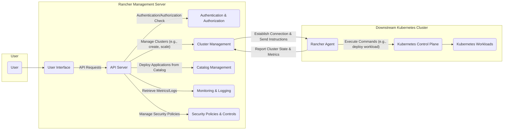

## Project Design Document: Rancher (Improved)

**Version:** 1.1
**Date:** October 26, 2023
**Author:** AI Cloud & Security Architect

### 1. Project Overview

Rancher is an open-source, enterprise-grade Kubernetes management platform designed to simplify the operation of multiple Kubernetes clusters across various infrastructures. It provides a unified control plane to manage all your Kubernetes environments, whether they are running on-premises, in public clouds, or at the edge. This document details the architecture and key components of Rancher, serving as a foundation for subsequent threat modeling and security analysis.

### 2. Goals

* Provide a comprehensive and easily understandable overview of the Rancher architecture.
* Clearly identify the core components, their responsibilities, and interactions.
* Highlight critical security considerations and potential attack vectors for informed threat modeling.
* Serve as a living document for architectural understanding and security analysis.

### 3. Target Audience

This document is primarily intended for security engineers, cloud architects, software developers, and DevOps personnel involved in the design, deployment, and security assessment of Rancher.

### 4. High-Level Architecture

Rancher employs a centralized management server architecture to oversee and control multiple downstream Kubernetes clusters.

* **Rancher Management Server:** The central control plane responsible for:
    * **Centralized Authentication and Authorization:** Managing user identities, roles, and permissions across all managed clusters.
    * **Cluster Registration and Lifecycle Management:**  Onboarding new clusters (importing existing or provisioning new ones), managing upgrades, scaling, and deletion.
    * **Unified User Interface (UI) and API:** Providing a single pane of glass for users and programmatic access for managing all Kubernetes environments.
    * **Rancher Agent Management:** Deploying, managing, and monitoring the Rancher Agent on downstream clusters.
    * **Centralized Logging and Monitoring Aggregation:** Collecting and visualizing logs and metrics from managed clusters.
    * **Application Catalog Management:** Providing a curated catalog of applications (Helm charts, Rancher charts) for easy deployment.
    * **Global Security Policy Enforcement:** Defining and applying consistent security policies across all managed clusters.

* **Downstream Kubernetes Clusters:** The individual Kubernetes clusters being managed by the Rancher Management Server. These can be:
    * **Imported Clusters:** Pre-existing Kubernetes clusters (e.g., self-managed, cloud provider managed) brought under Rancher's control.
    * **Provisioned Clusters:** New Kubernetes clusters created and managed by Rancher using various providers:
        * **RKE (Rancher Kubernetes Engine):** A certified Kubernetes distribution that runs entirely within Docker containers.
        * **K3s:** A lightweight, certified Kubernetes distribution designed for resource-constrained environments.
        * **Cloud Provider Managed Kubernetes:** Integration with managed Kubernetes services like Amazon EKS, Azure AKS, and Google GKE.

* **Rancher Agent:** A lightweight agent deployed as a set of deployments within the `cattle-system` namespace on each downstream Kubernetes cluster. Its primary responsibilities include:
    * **Establishing Secure Communication:** Maintaining a secure, bidirectional connection with the Rancher Management Server.
    * **Relaying Cluster State and Metrics:** Reporting the health, status, and resource utilization of the downstream cluster.
    * **Executing Commands:** Carrying out actions initiated from the Rancher Management Server, such as deploying workloads or applying configurations.
    * **Enforcing Policies:** Implementing security policies and configurations pushed from the management server.

### 5. Key Components and Interactions

The following list provides a more detailed breakdown of the key components and their interactions within the Rancher ecosystem:

* **User Interface (UI):**
    * A web-based graphical interface providing users with an intuitive way to interact with Rancher.
    * Enables users to manage clusters, deploy and manage applications, configure settings, and monitor resources.
    * Communicates with the Rancher API Server to perform actions.

* **API Server:**
    * The central gateway for all interactions with the Rancher Management Server.
    * Exposes a RESTful API used by the UI, the Rancher CLI (`rctl`), and other integrations.
    * Enforces authentication and authorization before processing requests.

* **Authentication and Authorization:**
    * Responsible for verifying user identities and granting access based on defined roles and permissions.
    * Supports various authentication providers, including:
        * Local Authentication (username/password).
        * Active Directory / LDAP.
        * OAuth 2.0 providers (e.g., GitHub, Google).
        * SAML.
    * Implements Role-Based Access Control (RBAC) at both the Rancher Management Server level and within managed Kubernetes clusters.

* **Cluster Management:**
    * Handles the complete lifecycle of downstream Kubernetes clusters.
    * Facilitates the registration of existing clusters and the provisioning of new clusters using various providers.
    * Manages cluster upgrades, scaling operations, and node pool management.
    * Integrates with infrastructure providers through drivers and plugins.

* **Agent Communication:**
    * Establishes and maintains secure communication channels between the Rancher Management Server and the Rancher Agent on each downstream cluster.
    * Typically utilizes a secure WebSocket connection over TLS, often initiated from the agent to the management server.

* **Catalog Management:**
    * Provides a mechanism to manage and share reusable application templates.
    * Supports different types of catalogs, including:
        * Helm chart repositories.
        * Rancher Application Catalogs.
    * Simplifies the deployment of applications to managed clusters.

* **Monitoring and Logging:**
    * Collects metrics and logs from managed clusters, providing operational visibility.
    * Often leverages Prometheus for metrics collection and Grafana for visualization.
    * Integrates with logging solutions like Elasticsearch, Fluentd, and Kibana (EFK stack).

* **Security Policies and Controls:**
    * Enables the definition and enforcement of security policies across managed clusters.
    * Can integrate with security scanning tools for vulnerability analysis.
    * Allows for the implementation of network policies and other security measures.

### 6. Data Flow Diagram

### 7. Security Considerations (Detailed)

The following are key security considerations for Rancher, providing a basis for threat modeling:

* **Rancher Management Server Security:**
    * **Access Control:** Restricting access to the Rancher Management Server is paramount. Strong password policies, multi-factor authentication (MFA), and principle of least privilege should be enforced.
    * **API Security:** The API should be protected against common web vulnerabilities (e.g., injection attacks, cross-site scripting). Rate limiting and input validation are crucial.
    * **Secure Configuration:** Hardening the operating system and application configuration of the Rancher Management Server is essential.
    * **Secrets Management:** Securely storing and managing sensitive credentials used by Rancher to connect to downstream clusters and infrastructure providers. Consider using dedicated secrets management solutions (e.g., HashiCorp Vault).
    * **Regular Updates and Patching:** Keeping the Rancher Management Server and its dependencies up-to-date with the latest security patches is critical.

* **Downstream Kubernetes Cluster Security:**
    * **Agent Security:** The communication between the Rancher Management Server and the Rancher Agent must be secured using mutual TLS and strong authentication to prevent eavesdropping and tampering.
    * **RBAC Configuration:** Properly configuring RBAC within managed clusters is crucial to prevent unauthorized access to resources. Rancher's role management should be aligned with cluster-level RBAC.
    * **Network Policies:** Implementing network policies within managed clusters to restrict network traffic and segment workloads.
    * **Pod Security Policies/Pod Security Admission:** Enforcing security standards for pods deployed within managed clusters.
    * **Image Security:** Scanning container images for vulnerabilities before deployment.

* **Authentication and Authorization Security:**
    * **Authentication Provider Vulnerabilities:** Ensure the chosen authentication providers are secure and properly configured.
    * **Session Management:** Securely managing user sessions to prevent session hijacking.
    * **Authorization Bypass:** Preventing vulnerabilities that could allow users to bypass authorization checks.

* **Supply Chain Security:**
    * **Rancher Image Verification:** Verifying the integrity and authenticity of the Rancher Management Server and Agent images.
    * **Dependency Management:** Carefully managing and auditing the dependencies of Rancher components.

* **Multi-tenancy Security:**
    * **Namespace Isolation:** Properly isolating tenants and their workloads within managed clusters using Kubernetes namespaces and resource quotas.
    * **Resource Quotas and Limits:** Preventing resource exhaustion by limiting the resources that tenants can consume.

* **Backup and Recovery:**
    * Regularly backing up the Rancher Management Server's data to ensure recoverability in case of failure.

### 8. Deployment Models

Rancher can be deployed in various configurations, each with its own security implications:

* **Single Node Docker Installation:** Suitable for development and testing, but not recommended for production due to lack of redundancy.
* **High-Availability (HA) Kubernetes Cluster Installation:** Recommended for production environments, providing resilience and fault tolerance. This typically involves deploying Rancher on a dedicated Kubernetes cluster.
* **RKE (Rancher Kubernetes Engine) Installation:** Rancher can manage its own underlying Kubernetes cluster using RKE.
* **K3s Installation:** Rancher can be deployed on a lightweight K3s cluster.

The chosen deployment model impacts the underlying infrastructure security and the overall resilience of the Rancher platform.

### 9. Technology Stack (Overview)

Rancher utilizes a variety of technologies, including:

* **Go:** Primarily used for backend development.
* **Kubernetes:** The core orchestration platform being managed.
* **Docker:** Container runtime environment.
* **Helm:** Package manager for Kubernetes.
* **Prometheus and Grafana:** For monitoring and visualization.
* **Various databases:** For storing Rancher's state and configuration.

Understanding the underlying technology stack can help in identifying potential vulnerabilities and security considerations.

### 10. Assumptions and Limitations

* This document provides a general overview of the Rancher architecture. Specific implementation details and configurations may vary depending on the Rancher version and deployment environment.
* The focus is on the core Rancher platform. Integrations with external systems and specific cloud provider implementations are not detailed extensively.
* This document serves as a foundation for security analysis and does not constitute a complete security audit.

### 11. Next Steps

* Conduct a thorough threat modeling exercise based on this design document.
* Perform vulnerability assessments and penetration testing of the Rancher platform and its managed clusters.
* Develop and implement security best practices and hardening guidelines for Rancher deployments.
* Regularly review and update this document to reflect changes in the Rancher architecture and security landscape.
