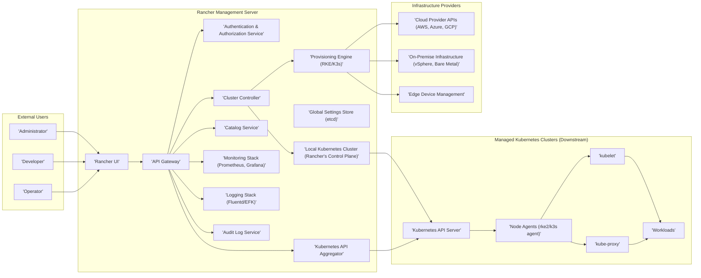

# Project Design Document: Rancher

**Version:** 1.1
**Date:** October 26, 2023
**Author:** AI Software Architect

## 1. Introduction

This document provides an enhanced architectural design overview of the Rancher project, building upon the initial version and focusing on details relevant for threat modeling. It is based on the information available at [https://github.com/rancher/rancher](https://github.com/rancher/rancher). This document aims to provide a more granular understanding of the key components, their interactions, and potential security considerations.

Rancher is an open-source multi-cluster management platform for Kubernetes, offering a centralized control plane to manage Kubernetes clusters across various environments. It simplifies cluster lifecycle management, enhances security posture, and provides consistent governance across diverse Kubernetes deployments.

## 2. System Architecture

The following diagram provides a more detailed illustration of the Rancher architecture, highlighting key interactions and components:

## 3. Key Components

This section provides a more detailed description of the major components within the Rancher system:

*   **External Users:**
    *   **Administrator:** Responsible for managing the Rancher platform itself, including user management, global configurations, and infrastructure provider integrations.
    *   **Developer:** Focuses on deploying and managing applications within the managed Kubernetes clusters, utilizing features like namespaces, deployments, and services.
    *   **Operator:** Monitors the health and performance of both the Rancher platform and the managed Kubernetes clusters, often utilizing the monitoring and logging capabilities.

*   **Rancher Management Server:** The core control plane of Rancher, responsible for managing and orchestrating the entire multi-cluster environment.
    *   **Authentication & Authorization Service:** Handles user authentication through various providers (local, Active Directory, LDAP, OAuth, SAML) and enforces authorization policies (RBAC) to control access to Rancher resources.
    *   **API Gateway:**  The entry point for all API requests to the Rancher Management Server. It handles routing, authentication, and potentially rate limiting.
    *   **Rancher UI:** The web-based graphical interface that allows users to interact with and manage the Rancher platform and its managed clusters.
    *   **Cluster Controller:** Manages the lifecycle of downstream Kubernetes clusters, including creation, scaling, upgrading, and deletion.
    *   **Provisioning Engine (RKE/K3s):**  Utilizes Rancher Kubernetes Engine (RKE) or K3s to provision and manage Kubernetes clusters on various infrastructure providers.
    *   **Catalog Service:** Provides a repository of pre-packaged applications (Helm charts, Rancher charts) that can be easily deployed to managed clusters.
    *   **Monitoring Stack (Prometheus, Grafana):**  Collects and visualizes metrics from the Rancher platform and managed clusters, providing insights into performance and health.
    *   **Logging Stack (Fluentd/EFK):** Aggregates and centralizes logs from the Rancher platform and managed clusters, facilitating troubleshooting and analysis.
    *   **Global Settings Store (etcd):** A distributed key-value store that holds the global configuration and state of the Rancher platform.
    *   **Audit Log Service:** Records auditable events within the Rancher system, providing a trail of actions for security and compliance purposes.
    *   **Kubernetes API Aggregator:**  Aggregates the API servers of the managed Kubernetes clusters, allowing users to interact with them through the Rancher API.
    *   **Local Kubernetes Cluster (Rancher's Control Plane):** The underlying Kubernetes cluster where the Rancher Management Server components are deployed and managed.

*   **Managed Kubernetes Clusters (Downstream):** The individual Kubernetes clusters managed by the Rancher platform.
    *   **Kubernetes API Server:** The central control plane component of each managed Kubernetes cluster, responsible for managing and controlling the cluster's resources.
    *   **Node Agents (rke2/k3s agent):** Agents running on each node of the managed cluster that communicate with the Rancher Management Server to facilitate management tasks.
    *   **Workloads:** The applications and services deployed and running within the managed Kubernetes clusters.
    *   **kubelet:** The primary node agent that runs on each node and ensures that containers are running in a Pod.
    *   **kube-proxy:** A network proxy that runs on each node and implements part of the Kubernetes Service concept.

*   **Infrastructure Providers:** The underlying infrastructure where the Kubernetes clusters are provisioned and run.
    *   **Cloud Provider APIs (AWS, Azure, GCP):** APIs provided by cloud providers for managing virtual machines, networks, and other resources used by the Kubernetes clusters.
    *   **On-Premise Infrastructure (vSphere, Bare Metal):**  On-premise virtualization platforms or physical servers used to host the Kubernetes clusters.
    *   **Edge Device Management:**  Capabilities for managing Kubernetes clusters deployed on edge devices with specific constraints and requirements.

## 4. Data Flow

This section details specific data flow scenarios within the Rancher system:

*   **User Authentication:**
    *   A user attempts to log in through the Rancher UI.
    *   The Rancher UI sends authentication requests to the **API Gateway**.
    *   The **API Gateway** forwards the request to the **Authentication & Authorization Service**.
    *   The **Authentication & Authorization Service** verifies the user's credentials against the configured identity provider.
    *   Upon successful authentication, a token is issued and returned to the user.

*   **Cluster Creation (using a Cloud Provider):**
    *   An Administrator initiates cluster creation through the Rancher UI.
    *   The UI sends a request to the **API Gateway**.
    *   The **API Gateway** routes the request to the **Cluster Controller**.
    *   The **Cluster Controller** instructs the **Provisioning Engine (RKE/K3s)** to create the cluster.
    *   The **Provisioning Engine** interacts with the **Cloud Provider APIs** to provision necessary infrastructure (VMs, networks, etc.).
    *   Once the infrastructure is provisioned, the **Provisioning Engine** deploys the Kubernetes control plane and worker nodes.
    *   **Node Agents** on the new cluster establish a connection back to the Rancher Management Server.

*   **Deploying an Application from the Catalog:**
    *   A Developer selects an application from the **Catalog Service** through the Rancher UI.
    *   The UI sends a request to the **API Gateway**.
    *   The **API Gateway** routes the request to the **Catalog Service**.
    *   The **Catalog Service** retrieves the application's deployment manifest (e.g., Helm chart).
    *   Rancher uses the **Kubernetes API Aggregator** to send the deployment manifest to the **Kubernetes API Server** of the target managed cluster.
    *   The **Kubernetes API Server** schedules and deploys the application's workloads.

*   **Monitoring Cluster Health:**
    *   **Node Agents** and other components within the managed clusters collect metrics.
    *   These metrics are scraped by **Prometheus** within the **Monitoring Stack**.
    *   **Grafana** queries **Prometheus** to visualize the metrics, which can be viewed through the Rancher UI.

*   **Accessing a Managed Cluster's API:**
    *   A user attempts to interact with a managed cluster's API (e.g., using `kubectl` configured with Rancher credentials).
    *   The request is routed through the Rancher **API Gateway**.
    *   The **API Gateway** authenticates and authorizes the request.
    *   The **Kubernetes API Aggregator** forwards the request to the **Kubernetes API Server** of the target managed cluster.
    *   The managed cluster's API server processes the request.

## 5. Security Considerations (for Threat Modeling)

This section expands on the security considerations, providing more specific examples of potential threats:

*   **Authentication and Authorization:**
    *   **Threat:** Brute-force attacks against the Rancher login page or API endpoints.
    *   **Threat:** Exploiting vulnerabilities in the configured authentication providers (e.g., SAML assertion injection).
    *   **Threat:** Privilege escalation by exploiting misconfigured RBAC roles within Rancher or managed clusters.
    *   **Threat:** Storing API keys or credentials in insecure locations (e.g., environment variables, code).

*   **API Security:**
    *   **Threat:** Unauthorized access to sensitive Rancher API endpoints, potentially leading to cluster manipulation or data exfiltration.
    *   **Threat:** Denial-of-service attacks targeting the Rancher API Gateway.
    *   **Threat:** Injection vulnerabilities (e.g., command injection through API parameters) if input validation is insufficient.
    *   **Threat:** Cross-Site Scripting (XSS) vulnerabilities in the Rancher UI, allowing attackers to execute malicious scripts in user browsers.
    *   **Threat:** Cross-Site Request Forgery (CSRF) attacks, forcing authenticated users to perform unintended actions.

*   **Network Security:**
    *   **Threat:** Man-in-the-middle attacks intercepting communication between Rancher components or between Rancher and managed clusters if TLS is not properly configured or enforced.
    *   **Threat:** Unauthorized access to Rancher management ports (e.g., 6443) if exposed to the public internet.
    *   **Threat:** Lateral movement within managed clusters due to insecure network policies.

*   **Secrets Management:**
    *   **Threat:** Exposure of sensitive secrets (e.g., cloud provider credentials, database passwords) stored within the **Global Settings Store (etcd)** or Kubernetes Secrets in the Rancher control plane.
    *   **Threat:** Accidental exposure of secrets in logs generated by Rancher components or managed clusters.
    *   **Threat:** Insecure handling of secrets during application deployment from the catalog.

*   **Supply Chain Security:**
    *   **Threat:** Using compromised base images for Rancher components or applications deployed through the catalog.
    *   **Threat:** Vulnerabilities in third-party libraries or dependencies used by Rancher.

*   **Access Control to Managed Clusters:**
    *   **Threat:** Users gaining unauthorized access to resources within managed clusters due to misconfigured namespaces or RBAC policies.
    *   **Threat:** Container escape vulnerabilities allowing attackers to gain access to the underlying node.

*   **Audit Logging:**
    *   **Threat:** Insufficient audit logging making it difficult to detect and investigate security incidents.
    *   **Threat:** Tampering with or deletion of audit logs by malicious actors.
    *   **Threat:** Insecure storage of audit logs, allowing unauthorized access.

*   **Monitoring and Logging:**
    *   **Threat:** Sensitive information being inadvertently logged, potentially exposing credentials or other confidential data.
    *   **Threat:** Manipulation of monitoring data to hide malicious activity.
    *   **Threat:** Denial-of-service attacks targeting the monitoring and logging infrastructure.

*   **Compliance:**
    *   **Threat:** Failure to implement necessary security controls to meet industry compliance standards (e.g., PCI DSS, HIPAA).

## 6. Assumptions and Constraints

The following assumptions and constraints remain relevant for this enhanced version of the document:

*   This document is based on the general architecture of Rancher as understood from the public GitHub repository and general knowledge of the platform. Specific implementation details may vary depending on the Rancher version and configuration.
*   The focus is on the core Rancher platform and its interaction with managed Kubernetes clusters. Specific features and integrations (e.g., Istio integration, multi-tenancy features) may have their own unique architectures and security considerations that are not exhaustively covered here.
*   The threat modeling process will require further in-depth analysis of specific components, configurations, and potential attack vectors. This document provides a more detailed foundation for that process.
*   It is assumed that the threat model will consider both the Rancher Management Server and the managed Kubernetes clusters as distinct attack surfaces with their own sets of potential threats.
*   This document does not delve into the security hardening of the underlying operating systems or infrastructure components, which are also crucial for overall security.

This enhanced design document provides a more detailed understanding of the Rancher architecture, facilitating a more comprehensive and effective threat modeling process.