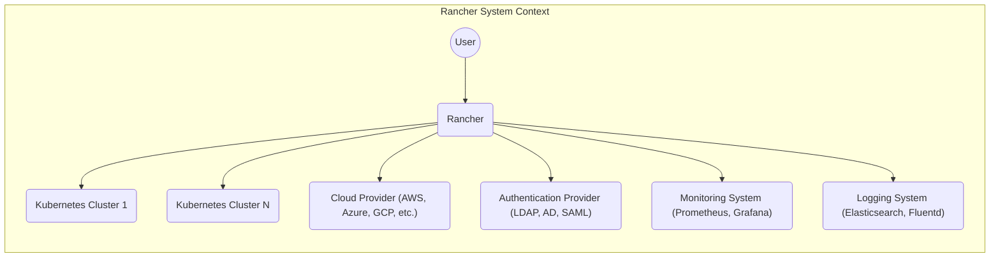
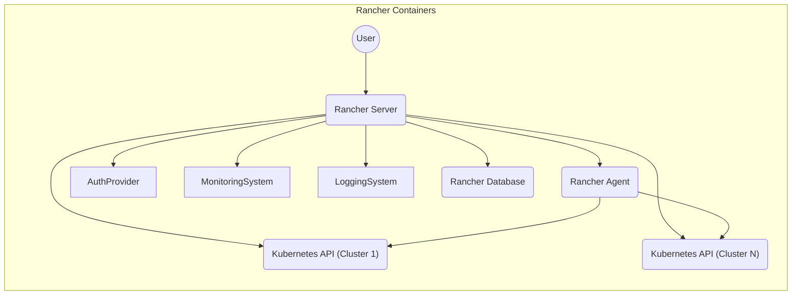
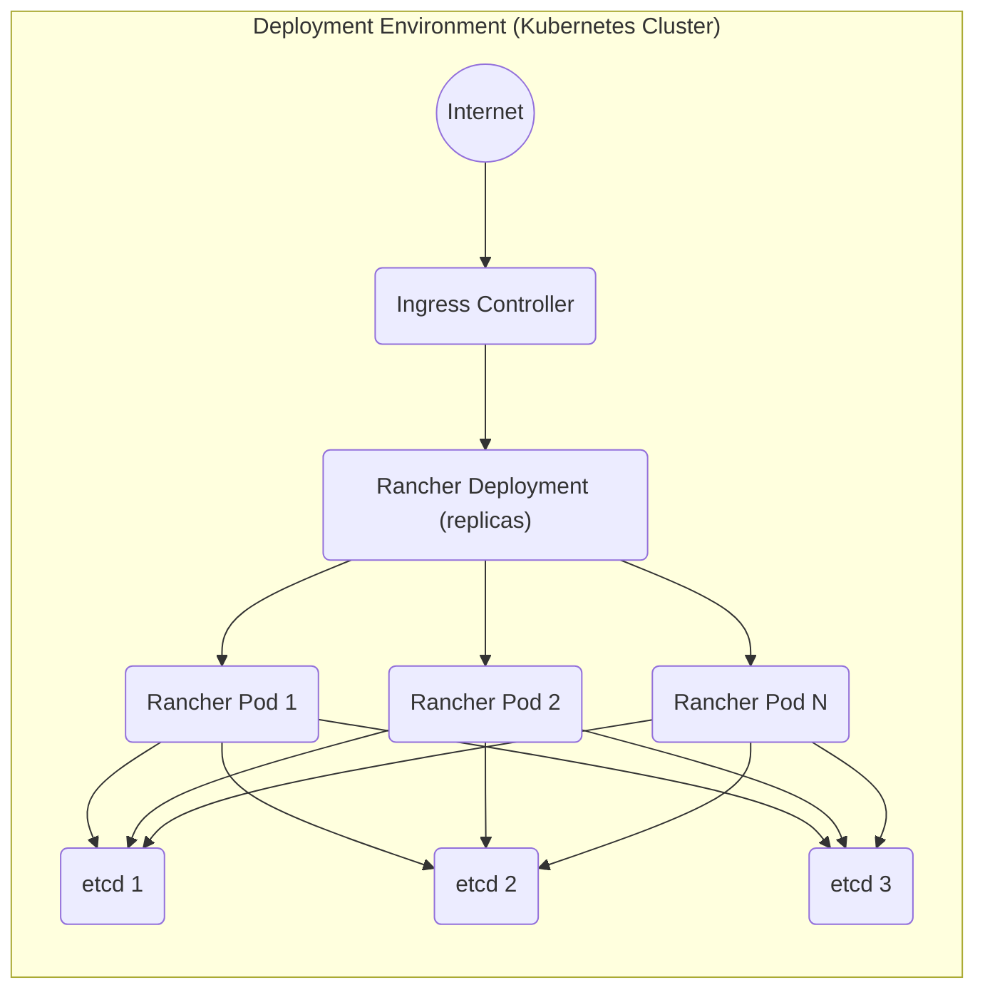
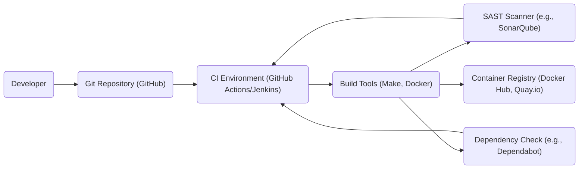

Okay, let's create a design document for the Rancher project, focusing on aspects relevant for threat modeling.

# BUSINESS POSTURE

Rancher is a complete software stack for teams adopting containers. It addresses the operational and security challenges of managing multiple Kubernetes clusters across any infrastructure, while providing DevOps teams with integrated tools for running containerized workloads.  Given its role in managing Kubernetes clusters, which often host critical applications and data, the business posture leans towards high availability, security, and operational efficiency.  The target audience includes enterprises and organizations with significant reliance on containerized workloads, suggesting a lower risk appetite than a very early-stage startup.

Business Priorities:

*   Enable organizations to run Kubernetes everywhere.
*   Provide centralized management and visibility for multiple Kubernetes clusters.
*   Simplify Kubernetes operations and reduce the operational burden on teams.
*   Ensure the security and compliance of Kubernetes deployments.
*   Offer a consistent user experience across different Kubernetes distributions and infrastructure providers.

Business Goals:

*   Increase adoption of Rancher as a leading Kubernetes management platform.
*   Maintain high customer satisfaction and retention.
*   Expand the ecosystem of integrations and supported technologies.
*   Drive innovation in the Kubernetes management space.

Most Important Business Risks:

*   Security breaches that compromise customer Kubernetes clusters or data.
*   Service downtime or performance degradation that impacts customer applications.
*   Inability to keep pace with the rapidly evolving Kubernetes ecosystem.
*   Loss of customer trust due to security or operational failures.
*   Competition from other Kubernetes management solutions.

# SECURITY POSTURE

Existing Security Controls:

*   security control: Role-Based Access Control (RBAC): Rancher implements RBAC to control user access to resources within the platform and managed clusters. Described in Rancher documentation and implemented in the codebase.
*   security control: Authentication: Rancher supports various authentication providers, including local authentication, Active Directory, LDAP, and SAML. Described in Rancher documentation and implemented in the codebase.
*   security control: Pod Security Policies (PSPs) / Pod Security Admission (PSA): Rancher allows administrators to define and enforce PSPs/PSA to control the security context of pods running in managed clusters. Described in Rancher documentation and implemented as Kubernetes configurations.
*   security control: Network Policies: Rancher supports the configuration of Kubernetes Network Policies to control network traffic between pods and namespaces. Described in Rancher documentation and implemented as Kubernetes configurations.
*   security control: Encryption in Transit: Rancher uses TLS to encrypt communication between its components and with managed clusters. Described in Rancher documentation and implemented using standard TLS libraries.
*   security control: Audit Logging: Rancher provides audit logs to track user activity and system events. Described in Rancher documentation and implemented in the codebase.
*   security control: Regular Security Updates: The Rancher team releases regular security updates and patches to address vulnerabilities. Described in Rancher release notes and security advisories.
*   security control: Hardened Base Images: Rancher uses hardened base images for its components to minimize the attack surface. Described in Rancher build process.

Accepted Risks:

*   accepted risk: Reliance on Third-Party Components: Rancher relies on various third-party components, such as Kubernetes, etcd, and various container runtimes. Vulnerabilities in these components could impact Rancher's security.
*   accepted risk: Complexity of Kubernetes Security: Kubernetes itself is a complex system, and misconfigurations or vulnerabilities in Kubernetes could impact Rancher's security.
*   accepted risk: User Misconfiguration: Rancher provides extensive configuration options, and users could inadvertently introduce security vulnerabilities through misconfiguration.

Recommended Security Controls:

*   Implement regular vulnerability scanning and penetration testing of the Rancher platform.
*   Provide enhanced security hardening guides and best practices for deploying and operating Rancher.
*   Offer integration with security information and event management (SIEM) systems for centralized security monitoring.
*   Implement a robust secrets management solution for storing and managing sensitive credentials.
*   Introduce supply chain security measures to verify the integrity of Rancher components and dependencies.

Security Requirements:

*   Authentication:
    *   Support for multi-factor authentication (MFA).
    *   Integration with enterprise identity providers (IdPs).
    *   Secure password management policies.
    *   Session management with appropriate timeouts.

*   Authorization:
    *   Fine-grained RBAC with least privilege principles.
    *   Support for attribute-based access control (ABAC).
    *   Regular review and auditing of user permissions.

*   Input Validation:
    *   Validate all user inputs to prevent injection attacks (e.g., command injection, SQL injection).
    *   Sanitize user inputs to prevent cross-site scripting (XSS) attacks.
    *   Implement appropriate error handling to avoid information disclosure.

*   Cryptography:
    *   Use strong, industry-standard cryptographic algorithms and protocols.
    *   Securely manage cryptographic keys.
    *   Encrypt sensitive data at rest and in transit.
    *   Regularly review and update cryptographic configurations.

# DESIGN

## C4 CONTEXT

Element Descriptions:

*   Element:
    *   Name: User
    *   Type: Person
    *   Description: Represents a user interacting with Rancher, such as an administrator, developer, or operator.
    *   Responsibilities: Managing Kubernetes clusters, deploying applications, configuring Rancher settings.
    *   Security controls: Authentication, Authorization (RBAC).

*   Element:
    *   Name: Rancher
    *   Type: Software System
    *   Description: The Rancher Kubernetes management platform.
    *   Responsibilities: Centralized management of Kubernetes clusters, user authentication, RBAC, application deployment, monitoring, and logging.
    *   Security controls: Authentication, Authorization (RBAC), Encryption in Transit, Audit Logging, Pod Security Policies/Admission, Network Policies.

*   Element:
    *   Name: Kubernetes Cluster 1
    *   Type: Software System
    *   Description: A Kubernetes cluster managed by Rancher.
    *   Responsibilities: Running containerized workloads, providing compute, storage, and networking resources.
    *   Security controls: Kubernetes-native security controls (RBAC, Network Policies, PSPs/PSA), security hardening.

*   Element:
    *   Name: Kubernetes Cluster N
    *   Type: Software System
    *   Description: Another Kubernetes cluster managed by Rancher (representing multiple clusters).
    *   Responsibilities: Running containerized workloads, providing compute, storage, and networking resources.
    *   Security controls: Kubernetes-native security controls (RBAC, Network Policies, PSPs/PSA), security hardening.

*   Element:
    *   Name: Cloud Provider (AWS, Azure, GCP, etc.)
    *   Type: Software System
    *   Description: The underlying infrastructure provider for Kubernetes clusters.
    *   Responsibilities: Providing compute, storage, networking, and other infrastructure services.
    *   Security controls: Cloud provider's security controls (IAM, VPCs, security groups, etc.).

*   Element:
    *   Name: Authentication Provider (LDAP, AD, SAML)
    *   Type: Software System
    *   Description: An external identity provider used for user authentication.
    *   Responsibilities: Authenticating users, providing user identity information.
    *   Security controls: Authentication provider's security controls (password policies, MFA, etc.).

*   Element:
    *   Name: Monitoring System (Prometheus, Grafana)
    *   Type: Software System
    *   Description: A system for monitoring the health and performance of Rancher and managed clusters.
    *   Responsibilities: Collecting and visualizing metrics, alerting on anomalies.
    *   Security controls: Access controls, data encryption.

*   Element:
    *   Name: Logging System (Elasticsearch, Fluentd)
    *   Type: Software System
    *   Description: A system for collecting and analyzing logs from Rancher and managed clusters.
    *   Responsibilities: Centralized log storage, search, and analysis.
    *   Security controls: Access controls, data encryption, audit logging.

## C4 CONTAINER

Element Descriptions:

*   Element:
    *   Name: Rancher Server
    *   Type: Container
    *   Description: The main Rancher server component, providing the API and UI.
    *   Responsibilities: User authentication, RBAC, cluster management, API handling, UI serving.
    *   Security controls: Authentication, Authorization (RBAC), Encryption in Transit, Input Validation.

*   Element:
    *   Name: Rancher Agent
    *   Type: Container
    *   Description: An agent running on each node in managed clusters, communicating with the Rancher server.
    *   Responsibilities: Executing commands from the Rancher server, collecting node information, managing workloads.
    *   Security controls: Secure communication with Rancher Server (TLS), limited privileges.

*   Element:
    *   Name: Kubernetes API (Cluster 1)
    *   Type: Container
    *   Description: The API server of a managed Kubernetes cluster.
    *   Responsibilities: Providing access to the Kubernetes API.
    *   Security controls: Kubernetes-native security controls (RBAC, TLS).

*   Element:
    *   Name: Kubernetes API (Cluster N)
    *   Type: Container
    *   Description: The API server of another managed Kubernetes cluster.
    *   Responsibilities: Providing access to the Kubernetes API.
    *   Security controls: Kubernetes-native security controls (RBAC, TLS).

*   Element:
    *   Name: Rancher Database
    *   Type: Container
    *   Description: The database storing Rancher's configuration and state.
    *   Responsibilities: Persisting Rancher data.
    *   Security controls: Access controls, data encryption at rest.

*   Element:
     *   Name: Auth Provider, Monitoring System, Logging System - see C4 Context.

## DEPLOYMENT

Possible Deployment Solutions:

1.  Single-Node Docker Installation: Rancher server running in a single Docker container. Suitable for testing and small deployments.
2.  High-Availability (HA) Kubernetes Installation: Rancher server running as a deployment in a Kubernetes cluster, with multiple replicas for redundancy. Suitable for production deployments.
3.  RancherD Installation: Simplified, opinionated installation method using RancherD.

Chosen Solution (for detailed description): High-Availability (HA) Kubernetes Installation.

Element Descriptions:

*   Element:
    *   Name: Internet
    *   Type: External Network
    *   Description: The public internet.
    *   Responsibilities: Providing external access to Rancher.
    *   Security controls: Firewall, DDoS protection.

*   Element:
    *   Name: Ingress Controller
    *   Type: Kubernetes Ingress Controller
    *   Description: A Kubernetes Ingress controller managing external access to the Rancher server.
    *   Responsibilities: Routing traffic to the Rancher pods, TLS termination.
    *   Security controls: TLS configuration, access controls.

*   Element:
    *   Name: Rancher Deployment (replicas)
    *   Type: Kubernetes Deployment
    *   Description: A Kubernetes Deployment managing multiple replicas of the Rancher server pod.
    *   Responsibilities: Ensuring high availability and scalability of the Rancher server.
    *   Security controls: Kubernetes RBAC.

*   Element:
    *   Name: Rancher Pod 1, Rancher Pod 2, Rancher Pod N
    *   Type: Kubernetes Pod
    *   Description: Instances of the Rancher server container.
    *   Responsibilities: Running the Rancher server application.
    *   Security controls: Container security best practices.

*   Element:
    *   Name: etcd 1, etcd 2, etcd 3
    *   Type: etcd instances
    *   Description:  etcd cluster used by Rancher for storing its configuration and state.
    *   Responsibilities: Providing a distributed key-value store.
    *   Security controls: etcd security configuration (TLS, authentication).

## BUILD

Rancher's build process is automated and utilizes various tools and techniques to ensure security and quality.

Build Process Description:

1.  Developers commit code to the Git repository (GitHub).
2.  The CI environment (GitHub Actions or Jenkins) is triggered by code changes.
3.  Build tools (Make, Docker) are used to compile the code and build container images.
4.  SAST scanners (e.g., SonarQube) are run to analyze the code for security vulnerabilities.
5.  Dependency checks (e.g., Dependabot) are performed to identify vulnerable dependencies.
6.  If all checks pass, the container images are pushed to a container registry (Docker Hub, Quay.io).

Security Controls in Build Process:

*   security control: Code Review: All code changes are reviewed by other developers before being merged.
*   security control: SAST Scanning: Static Application Security Testing (SAST) is performed to identify vulnerabilities in the code.
*   security control: Dependency Scanning: Dependencies are scanned for known vulnerabilities.
*   security control: Build Automation: The build process is automated to ensure consistency and repeatability.
*   security control: Signed Commits: Developers are encouraged to sign their commits to ensure authenticity.
*   security control: Container Image Signing: Container images can be signed to ensure their integrity.

# RISK ASSESSMENT

Critical Business Processes to Protect:

*   Kubernetes Cluster Management: Ensuring the availability, security, and stability of managed Kubernetes clusters.
*   User Authentication and Authorization: Protecting user accounts and ensuring appropriate access control.
*   Application Deployment: Enabling secure and reliable deployment of containerized applications.
*   Data Backup and Recovery: Protecting Rancher's configuration and state data.

Data to Protect and Sensitivity:

*   Kubernetes Cluster Credentials: Highly sensitive. Compromise could lead to full control over customer clusters.
*   User Credentials: Highly sensitive. Compromise could lead to unauthorized access to Rancher and managed clusters.
*   Rancher Configuration Data: Sensitive. Contains information about managed clusters, users, and settings.
*   Application Data (indirectly): Rancher manages clusters that host application data. The sensitivity of this data depends on the specific applications.
*   Audit Logs: Moderately sensitive. Contains information about user activity and system events.

# QUESTIONS & ASSUMPTIONS

Questions:

*   What specific compliance requirements (e.g., PCI DSS, HIPAA, GDPR) must Rancher deployments adhere to?
*   What are the specific threat models or attack scenarios that are of greatest concern?
*   What is the expected scale of Rancher deployments (number of clusters, nodes, users)?
*   What are the existing security monitoring and incident response capabilities?
*   Are there any specific security certifications or audits that Rancher has undergone or plans to undergo?

Assumptions:

*   BUSINESS POSTURE: Assumes a relatively low risk appetite due to the critical nature of Kubernetes management.
*   SECURITY POSTURE: Assumes that basic security controls are in place, but there is room for improvement and enhancement.
*   DESIGN: Assumes a high-availability deployment model for production environments. Assumes use of standard Kubernetes security features. Assumes a secure build process with automated security checks.