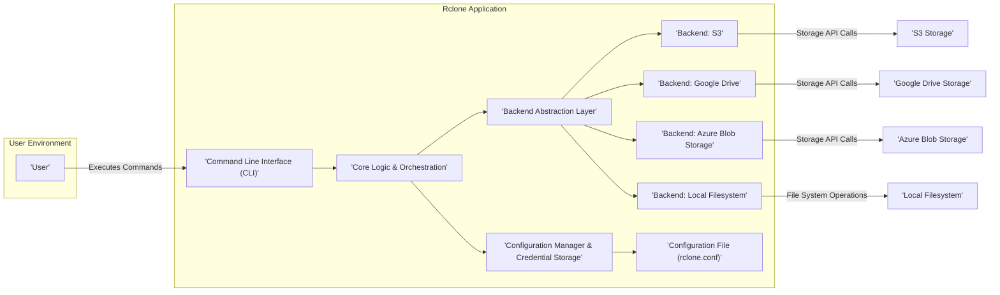

# Project Design Document: Rclone (Improved)

**Version:** 1.1
**Date:** October 26, 2023
**Author:** AI Software Architect

## 1. Introduction

This document provides an enhanced and more detailed design overview of the Rclone project, a versatile command-line program for managing files on cloud storage and local filesystems. It aims to offer a clear understanding of the system's architecture, data flow, and key components, specifically tailored for subsequent threat modeling activities. This revision incorporates more detail and clarifies certain aspects of the original design.

## 2. Goals

*   Deliver a refined and more comprehensive architectural overview of Rclone.
*   Provide a clearer description of the key components and their interactions, emphasizing security-relevant aspects.
*   Illustrate the typical data flow during various file operations with a focus on potential attack vectors.
*   Highlight critical security considerations within the design, providing specific examples relevant to threat modeling.
*   Serve as a robust and detailed foundation for identifying potential security threats, vulnerabilities, and attack surfaces.

## 3. Scope

This document encompasses the core architecture and functionality of the Rclone application, with a particular emphasis on aspects relevant to security. It focuses on the command-line interface, the underlying mechanisms for data transfer, management, and the interaction with various storage backends. The scope includes:

*   The core Rclone application and its command-line interface, including command parsing and option handling.
*   The interaction between Rclone and a diverse range of cloud storage providers and local filesystems.
*   The configuration mechanisms for defining remotes, including storage of sensitive credentials and encryption keys.
*   The data flow during various file operations: upload, download, synchronization, copy, move, and deletion.
*   Key security features such as encryption (both in-transit and at-rest), authentication, authorization, and integrity checks.
*   Error handling and logging mechanisms.

This document explicitly excludes:

*   In-depth implementation details of individual cloud storage backend APIs.
*   The intricate workings of third-party libraries utilized by Rclone.
*   The software development lifecycle, build processes, and testing methodologies of Rclone.
*   Detailed analysis of specific, highly customized use cases or edge case configurations.

## 4. High-Level Architecture

Rclone functions as a command-line utility that orchestrates file operations between various storage locations based on user-defined configurations. The central components work together to facilitate secure and efficient data transfer and management.

**Component Descriptions:**

*   **User:** The individual or system interacting with Rclone through the command-line interface.
*   **Command Line Interface (CLI):** The primary interface for user interaction, responsible for parsing commands, flags, and arguments. This is a key entry point for potential attacks.
*   **Core Logic & Orchestration:** The central engine of Rclone, responsible for interpreting commands, managing the flow of operations, handling errors, and coordinating interactions between other components. This component makes decisions about which backends to use and how to transfer data.
*   **Configuration Manager & Credential Storage:** Manages the loading, parsing, and secure storage of Rclone's configuration, including sensitive information like API keys, OAuth tokens, and encryption passwords. The security of this component is paramount.
*   **Backend Abstraction Layer:** Provides a unified interface for interacting with diverse storage backends, abstracting away the specific API details of each provider. This layer handles the translation of Rclone's internal commands into backend-specific API calls.
*   **Backend: S3, Backend: Google Drive, Backend: Azure Blob Storage, Backend: Local Filesystem:** Represent the various storage providers supported by Rclone. Each backend implementation handles authentication, authorization, and data transfer according to the provider's specific API.
*   **Configuration File (rclone.conf):** A file, typically located at `~/.config/rclone/rclone.conf`, that stores the definitions of remotes, including connection details, authentication credentials, encryption settings, and other configuration parameters. This file is a critical security target.
*   **S3 Storage, Google Drive Storage, Azure Blob Storage, Local Filesystem:** The actual storage locations managed by the respective backends.

## 5. Data Flow (Synchronization Operation)

The following diagram illustrates a more detailed data flow during a file synchronization operation from a local filesystem to a remote cloud storage backend, highlighting security-relevant steps.

```mermaid
graph LR
    A["'User'"] --> B["'Rclone CLI'"];
    B --> C["'Parse Command & Options'"];
    C --> D["'Load & Decrypt Configuration'"];
    D --> E["'Identify Source & Destination Remotes'"];
    E --> F["'Backend: List Source Files'"];
    E --> G["'Backend: List Destination Files'"];
    F --> H["'Compare File Lists & Determine Actions'"];
    G --> H;
    H --> I{"'Action: Upload File?'"};
    I -- Yes --> J["'Read Source File'"];
    J --> K["'Apply Encryption (if configured)'"];
    K --> L["'Establish Secure Connection to Destination'"];
    L --> M["'Authenticate with Destination Backend'"];
    M --> N["'Transfer Encrypted Data'"];
    N --> O["'Backend: Verify Upload (Checksum)'"];
    O --> P["'Backend: Update Metadata'"];
    P --> Q["'Report Status to User'"];
    I -- No --> Q;
```

**Detailed Data Flow Steps:**

1. **User:** Initiates an Rclone command (e.g., `rclone sync /local/data remote:bucket`).
2. **Rclone CLI:** Receives the command and associated flags from the user.
3. **Parse Command & Options:** The CLI parses the command, extracting the operation (sync), source, destination, and any specified options. This stage is vulnerable to command injection if not handled carefully.
4. **Load & Decrypt Configuration:** The Configuration Manager loads the `rclone.conf` file. If the configuration is encrypted, it decrypts it using the provided password or key. Secure handling of the decryption key is crucial.
5. **Identify Source & Destination Remotes:** Rclone identifies the source and destination storage locations based on the parsed command and the loaded configuration.
6. **Backend: List Source Files:** Rclone interacts with the source backend (e.g., local filesystem) to retrieve a list of files and their metadata. This involves file system permissions and access controls.
7. **Backend: List Destination Files:** Rclone interacts with the destination backend (e.g., cloud storage) to retrieve a list of files and their metadata. This involves API calls and authentication.
8. **Compare File Lists & Determine Actions:** The Core Logic compares the source and destination file lists to determine the necessary actions (e.g., upload new files, update modified files, delete extraneous files).
9. **Action: Upload File?:**  A decision point based on the comparison.
10. **Read Source File:** If an upload is required, Rclone reads the data of the file from the source. This is subject to local file system permissions.
11. **Apply Encryption (if configured):** If client-side encryption is enabled, Rclone encrypts the file data before transferring it. The encryption key is managed by the user and stored in the configuration.
12. **Establish Secure Connection to Destination:** Rclone establishes a secure connection (typically HTTPS/TLS) to the destination backend's API endpoint. This ensures data in transit is protected.
13. **Authenticate with Destination Backend:** Rclone authenticates with the destination backend using the credentials stored in the configuration (e.g., API keys, OAuth tokens). Secure credential management is vital here.
14. **Transfer Encrypted Data:** The (potentially encrypted) file data is transferred to the destination backend over the secure connection.
15. **Backend: Verify Upload (Checksum):** After the upload, Rclone (or the backend) verifies the integrity of the transferred data, often using checksums. This ensures data has not been corrupted during transit.
16. **Backend: Update Metadata:** Rclone updates the metadata of the file on the destination backend (e.g., timestamps, permissions).
17. **Report Status to User:** Rclone reports the status of the synchronization operation to the user via the CLI.

## 6. Security Considerations (Expanded)

Security is paramount for Rclone due to its role in managing and transferring potentially sensitive data across various storage platforms. The following are key security considerations, elaborated for threat modeling:

*   **Credential Management & Storage:**
    *   **Threat:**  Compromise of the `rclone.conf` file could expose sensitive credentials (API keys, passwords, OAuth tokens).
    *   **Mitigation:** Rclone supports encrypting the configuration file. Secure storage and access control for the encryption password are critical. Consider using operating system-level secrets management.
    *   **Threat:**  Credentials stored in memory during runtime could be vulnerable to memory dumping attacks.
    *   **Mitigation:**  Minimize the duration credentials are held in memory and use secure memory management practices.
*   **Authentication & Authorization:**
    *   **Threat:** Weak or compromised authentication mechanisms on the backend storage could allow unauthorized access.
    *   **Mitigation:** Rclone relies on the authentication mechanisms provided by the storage backends. Users should follow best practices for securing their cloud storage accounts (e.g., strong passwords, multi-factor authentication).
    *   **Threat:** Insufficient authorization on the backend could allow Rclone to perform actions beyond its intended scope.
    *   **Mitigation:** Apply the principle of least privilege when configuring access permissions for Rclone on the storage backends.
*   **Data Encryption in Transit:**
    *   **Threat:** Man-in-the-middle attacks could intercept data during transfer if connections are not properly secured.
    *   **Mitigation:** Rclone enforces the use of HTTPS/TLS for communication with most cloud storage APIs. Ensure TLS certificates are valid and up-to-date.
*   **Data Encryption at Rest (Client-Side Encryption):**
    *   **Threat:** If client-side encryption is not used, data stored on the cloud is vulnerable if the storage provider is compromised.
    *   **Mitigation:** Rclone offers client-side encryption using user-provided passwords or keys. Secure management of these encryption keys is crucial. Loss of the key means permanent data loss.
    *   **Threat:** Weak encryption algorithms or key management practices could compromise the confidentiality of encrypted data.
    *   **Mitigation:** Rclone uses industry-standard encryption algorithms. Users should choose strong passwords for encryption.
*   **Command Injection Vulnerabilities:**
    *   **Threat:** If user-provided input (e.g., filenames, remote paths) is not properly sanitized, attackers could inject malicious commands.
    *   **Mitigation:** Rclone developers must implement robust input validation and sanitization techniques to prevent command injection.
*   **Dependency Vulnerabilities:**
    *   **Threat:** Vulnerabilities in third-party libraries used by Rclone could be exploited.
    *   **Mitigation:** Regularly update dependencies to their latest secure versions. Employ dependency scanning tools to identify potential vulnerabilities.
*   **Logging and Auditing:**
    *   **Threat:** Insufficient logging can hinder incident response and forensic analysis.
    *   **Mitigation:** Rclone provides logging capabilities. Configure logging appropriately to capture relevant security events without logging sensitive data.
    *   **Threat:** Logs themselves could contain sensitive information if not handled securely.
    *   **Mitigation:** Secure storage and access control for Rclone logs are necessary.
*   **Secure Defaults:**
    *   **Threat:** Insecure default configurations could leave users vulnerable.
    *   **Mitigation:** Rclone should strive for secure default settings. Users should be educated about the security implications of different configuration options.
*   **Error Handling:**
    *   **Threat:** Verbose error messages could leak sensitive information about the system or configuration.
    *   **Mitigation:** Implement secure error handling that avoids revealing sensitive details.

## 7. Deployment Considerations

Secure deployment of Rclone requires careful attention to several factors:

*   **Operating System Security:** Ensure the operating system where Rclone is deployed is secure and up-to-date with security patches.
*   **Access Control:** Restrict access to the Rclone executable and configuration file to authorized users only.
*   **Secure Storage of `rclone.conf`:**  The configuration file should be stored securely with appropriate file system permissions. Consider using encrypted storage.
*   **Automation Security:** When using Rclone in automated scripts, ensure that credentials and encryption keys are handled securely (e.g., using environment variables or dedicated secrets management tools instead of hardcoding them in scripts).
*   **Container Security:** If deploying Rclone in containers, follow container security best practices, including using minimal base images and regularly scanning for vulnerabilities.
*   **Network Security:** Ensure the network where Rclone operates is secure to prevent man-in-the-middle attacks.

## 8. Assumptions

The following assumptions underpin this design document:

*   Users have a basic understanding of command-line interfaces, cloud storage concepts, and security best practices.
*   The security considerations are based on common and well-understood security threats and vulnerabilities.
*   Rclone is used as intended, following the documented functionalities and configurations.

## 9. Future Considerations

Potential future enhancements and security considerations for Rclone include:

*   **Hardware Security Module (HSM) Integration:**  Support for using HSMs for secure storage and management of encryption keys.
*   **Improved Secrets Management Integration:**  More seamless integration with operating system-level secrets management solutions.
*   **Formal Security Audits and Penetration Testing:** Regular independent security assessments to identify and address potential vulnerabilities.
*   **Enhanced Logging and Monitoring Capabilities:**  Integration with centralized logging and monitoring systems for improved security observability.
*   **Support for More Advanced Authentication Methods:**  Exploring support for more modern and secure authentication protocols.

This improved document provides a more detailed and security-focused overview of the Rclone project, serving as a more robust foundation for subsequent threat modeling activities.