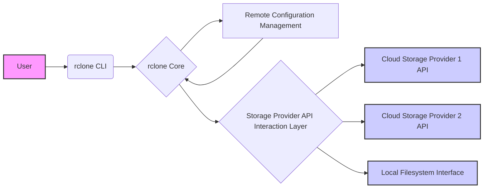
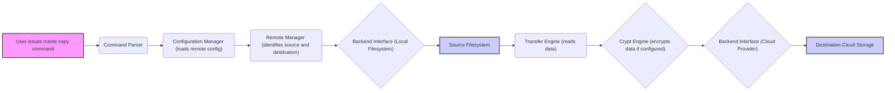

# Project Design Document: rclone

**Version:** 1.1
**Date:** October 26, 2023
**Author:** AI Architecture Expert

## 1. Introduction

This document provides a detailed architectural design of the rclone project, a versatile command-line program for managing files on cloud storage and local filesystems. It serves as a feature-rich alternative to vendor-specific web interfaces. The primary purpose of this document is to provide a clear understanding of rclone's architecture for subsequent threat modeling activities.

## 2. Goals and Objectives

* **Primary Goal:** Provide a robust and flexible command-line tool for interacting with a wide array of cloud storage providers and local file systems.
* **Key Objectives:**
    * **Broad Provider Support:**  Enable seamless interaction with numerous cloud storage services (e.g., "Amazon S3", "Google Cloud Storage", "Azure Blob Storage", "Backblaze B2").
    * **Unified Interface:** Offer a consistent command structure and behavior across different storage backends.
    * **Core File Operations:** Facilitate essential file management tasks including copying, synchronizing, moving, deleting, and listing files and directories.
    * **Advanced Functionality:** Support features like data encryption, compression, bandwidth limiting, and file hashing for integrity checks.
    * **Performance and Efficiency:** Optimize data transfer speeds and resource utilization.
    * **Cross-Platform Compatibility:** Ensure functionality across various operating systems ("Linux", "macOS", "Windows").

## 3. High-Level Architecture

rclone operates as a client-side application, directly interacting with storage providers. It does not rely on a central rclone-managed server for its core file transfer and management functionalities.

* **User:** The individual or automated system invoking rclone commands through the command line.
* **rclone CLI:** The command-line interface responsible for parsing user input and initiating actions.
* **rclone Core:** The central component encompassing core logic for command execution, data manipulation, and remote interaction management.
* **Remote Configuration Management:**  Manages the storage and retrieval of configuration details for accessing different storage providers (including credentials and connection parameters).
* **Storage Provider API Interaction Layer:** An abstraction layer that handles the specific communication protocols and API calls required by each storage provider.
* **Cloud Storage Provider 1 API, Cloud Storage Provider 2 API:** The specific APIs of various cloud storage services.
* **Local Filesystem Interface:** The component responsible for interacting with the local operating system's file system.

## 4. Detailed Design

### 4.1. Components

* **Command Parser:**
    *  Parses user-provided commands and their arguments.
    *  Validates command syntax and extracts parameters for further processing.
* **Configuration Manager:**
    *  Loads, saves, and manages the rclone configuration file (`rclone.conf`).
    *  Handles storage of remote definitions, encryption keys, and global settings.
    *  Provides mechanisms for encrypting the configuration file itself.
* **Remote Manager:**
    *  Manages the collection of configured "remotes," each representing a connection to a storage provider or the local filesystem.
    *  Provides methods for accessing and retrieving remote configurations.
* **Backend Interface:**
    *  Defines an interface for interacting with different storage providers.
    *  Each supported provider has a specific backend implementation adhering to this interface.
    *  This allows rclone to support new providers by implementing a new backend.
* **Transfer Engine:**
    *  Manages the core data transfer process between source and destination.
    *  Handles data chunking, concurrent transfers, retries, and error handling.
    *  Can utilize different transfer protocols and strategies based on the backend.
* **Crypt Engine (Optional):**
    *  Provides on-the-fly encryption and decryption of data during transfer and at rest.
    *  Supports various encryption algorithms.
    *  Integrates with the Transfer Engine to process data streams.
* **Hasher:**
    *  Calculates checksums (hashes) of files using various algorithms (e.g., MD5, SHA1, SHA256).
    *  Used for data integrity verification during and after transfers.
* **Filter Engine:**
    *  Applies user-defined filters to select specific files or directories for operations.
    *  Filters can be based on names, sizes, modification times, and other attributes.
* **Logger:**
    *  Manages the logging of rclone's activities, including informational messages, warnings, and errors.
    *  Supports different logging levels and output destinations.
* **Authenticator:**
    *  Handles the authentication process with different storage providers.
    *  Supports various authentication methods including:
        *  API Keys (e.g., for "Amazon S3").
        *  OAuth 2.0 flows (e.g., for "Google Drive", "Dropbox").
        *  Username/Password (less common for cloud providers).
        *  Service Accounts (e.g., for "Google Cloud Storage").
        *  Client Certificates.

### 4.2. Data Flow

The following illustrates the data flow for copying a file from a local filesystem to a cloud storage provider:

* **User issues rclone copy command:** The user initiates a file copy operation via the command line.
* **Command Parser:** The command is parsed, and the source and destination are identified.
* **Configuration Manager (loads remote config):**  The configuration for the source and destination remotes is loaded.
* **Remote Manager (identifies source and destination):** The specific remote configurations are retrieved.
* **Backend Interface (Local Filesystem):** The local filesystem backend is invoked to access the source file.
* **Source Filesystem:** The file data is read from the local filesystem.
* **Transfer Engine (reads data):** The Transfer Engine manages the reading of data, potentially in chunks.
* **Crypt Engine (encrypts data if configured):** If encryption is enabled for the destination remote, the data is encrypted.
* **Backend Interface (Cloud Provider):** The appropriate cloud provider backend is invoked.
* **Destination Cloud Storage:** The encrypted (or unencrypted) data is written to the destination cloud storage.

### 4.3. Key Interactions

* **User to rclone CLI:** Providing commands and arguments.
* **rclone CLI to Configuration Manager:** Reading and writing configuration details, including remote definitions and encryption passwords.
* **rclone CLI to Remote Manager:** Requesting information about configured remotes and their capabilities.
* **Remote Manager to Backend Interface:** Invoking specific backend functions for operations like listing files, creating directories, reading, and writing data.
* **Backend Interface to Storage Provider APIs:** Communicating with cloud storage services using HTTP/HTTPS and provider-specific API protocols (e.g., REST, SOAP).
* **Transfer Engine to Backend Interface:** Requesting data streams for reading from the source and writing to the destination.
* **Crypt Engine to Transfer Engine:** Providing encrypted data streams for writing and decrypting data streams for reading.

## 5. Security Considerations

This section details security considerations relevant for threat modeling rclone.

* **Credential Storage:**
    * rclone stores sensitive credentials (API keys, OAuth tokens, passwords) within the `rclone.conf` file.
    * The configuration file can be optionally encrypted using a user-provided password.
    * **Threat:**  If the `rclone.conf` file is compromised (e.g., due to unauthorized access to the system), attackers could gain access to stored credentials and potentially access the user's cloud storage.
    * **Mitigation:**  Encrypting the `rclone.conf` file with a strong, unique password is crucial. Secure file system permissions should be enforced to restrict access to the configuration file. Consider using operating system-level secrets management where applicable.
* **Data in Transit Security:**
    * rclone primarily uses HTTPS for communication with cloud storage providers, providing encryption during data transfer.
    * **Threat:**  Man-in-the-middle (MITM) attacks could potentially intercept communication if HTTPS is not used or if there are vulnerabilities in the TLS/SSL implementation.
    * **Mitigation:**  Ensure rclone is configured to enforce HTTPS connections. Regularly update rclone to benefit from security patches in its underlying libraries.
* **Data at Rest Security:**
    * rclone's core functionality does not inherently provide data-at-rest encryption on the storage provider's side (except for the `crypt` backend).
    * **Threat:** Data stored on the cloud provider is vulnerable if the provider's security is compromised.
    * **Mitigation:** Utilize the `crypt` backend to encrypt data before uploading. Understand and leverage the data-at-rest encryption options provided by the cloud storage provider.
* **Configuration File Vulnerabilities:**
    * **Threat:**  If the configuration file is not properly secured, attackers could modify it to point rclone to malicious destinations or exfiltrate data.
    * **Mitigation:**  As mentioned before, encrypt the configuration file and enforce strict file system permissions.
* **Command Injection Risks:**
    * **Threat:** While rclone itself does not directly execute arbitrary shell commands based on user input during its core operations, scripts or other applications using rclone might be vulnerable if they construct rclone commands using unsanitized user input.
    * **Mitigation:**  Carefully sanitize any user input used to construct rclone commands in scripts or applications. Avoid using shell interpolation directly with user-provided data.
* **Dependency Vulnerabilities:**
    * rclone is built using Go and relies on various third-party libraries.
    * **Threat:** Vulnerabilities in these dependencies could potentially be exploited to compromise rclone's security.
    * **Mitigation:**  Regularly update rclone to benefit from updates to its dependencies that address security vulnerabilities. Utilize dependency scanning tools during development.
* **Authentication and Authorization Weaknesses:**
    * **Threat:** Misconfigured permissions on the cloud storage side or compromised authentication credentials can lead to unauthorized access and data breaches.
    * **Mitigation:** Follow the security best practices recommended by the cloud storage providers for managing access permissions and credentials. Securely manage OAuth 2.0 tokens and API keys.
* **Backend/Plugin Security:**
    * **Threat:**  Security vulnerabilities in third-party or custom backend implementations could introduce risks.
    * **Mitigation:**  Exercise caution when using third-party backends. Review the code and security practices of custom backend implementations.

## 6. Deployment Model

rclone is a versatile tool deployable in various scenarios:

* **Desktop/Laptop Usage:** Individual users install rclone on their personal computers for managing cloud storage.
* **Server-Side Automation:** rclone is frequently used on servers for automated backups, data synchronization tasks, and data migrations.
* **Containerized Environments:** rclone can be easily containerized using Docker or similar technologies for deployment in orchestrated environments like Kubernetes.
* **Integration in Scripts and Applications:** rclone's command-line interface makes it suitable for integration into shell scripts, Python scripts, and other applications for automating cloud storage management.
* **NAS Devices:** Some Network Attached Storage (NAS) devices offer rclone as a built-in or installable package.

## 7. Assumptions and Constraints

* **Assumption:** Users possess valid and authorized credentials for the target cloud storage providers.
* **Assumption:** The network connection between the rclone client and the storage provider is functional and reasonably reliable.
* **Constraint:** rclone's capabilities are ultimately limited by the APIs and functionalities exposed by the respective storage providers.
* **Constraint:** Data transfer performance is subject to network bandwidth limitations and the performance characteristics of the storage providers.

## 8. Future Considerations

* **Enhanced GUI Development:** While primarily a command-line tool, further development of a graphical user interface could improve accessibility for some users.
* **Advanced Monitoring and Logging:** Implementing more granular monitoring and logging features could aid in troubleshooting, performance analysis, and security auditing.
* **Improved Security Features:** Exploring integration with hardware security modules (HSMs) for key storage or implementing multi-factor authentication for configuration settings.
* **Expansion of Backend Support:** Continuously adding support for new and emerging cloud storage providers and protocols.

This document provides a detailed architectural overview of the rclone project, with a strong emphasis on security considerations. This information is essential for conducting thorough threat modeling exercises to identify potential vulnerabilities and develop appropriate mitigation strategies.