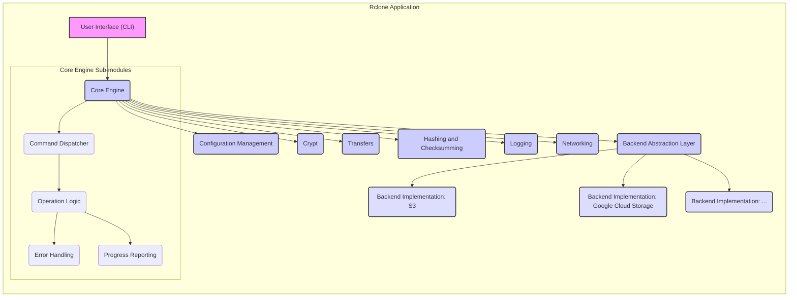
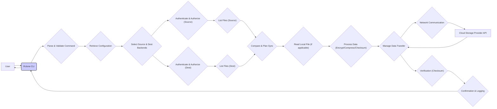

# Project Design Document: Rclone

**Version:** 1.1
**Date:** October 26, 2023
**Author:** AI Cloud & Security Architect

## 1. Introduction

This document provides a detailed architectural design of the Rclone project, an open-source command-line program to manage files on cloud storage. This document is intended to serve as a foundation for threat modeling activities, providing a comprehensive understanding of the system's components, data flow, and interactions.

### 1.1. Purpose

The primary purpose of this document is to outline the architecture of Rclone in sufficient detail to facilitate effective threat modeling. It aims to identify key components, data flows, and potential attack surfaces within the system.

### 1.2. Scope

This document covers the core architectural components and functionalities of Rclone. It focuses on the logical and physical structure of the application, including its interactions with external systems (cloud storage providers). It does not delve into the specifics of individual cloud provider APIs or the internal implementation details of specific algorithms, unless directly relevant to understanding potential security implications.

### 1.3. Target Audience

This document is intended for:

* Security engineers and architects involved in threat modeling Rclone.
* Developers contributing to the Rclone project, particularly those working on security-sensitive areas.
* Individuals seeking a detailed understanding of Rclone's architecture for security analysis.

## 2. Overview

Rclone is a versatile command-line program designed for managing files on various cloud storage services, as well as local file systems. It supports a wide array of backends, including popular cloud providers like Amazon S3, Google Cloud Storage, Microsoft Azure Blob Storage, and many others, as well as protocols like SFTP and WebDAV. Rclone provides functionalities such as copying, syncing (one-way and two-way), moving, and listing files, along with advanced features like encryption, compression, and checksum verification.

### 2.1. Key Features

* **Unified Interface:** Provides a consistent command-line interface for interacting with a diverse set of storage backends.
* **Multiple Backend Support:** Supports a vast number of cloud storage providers, network protocols, and local file systems.
* **Data Transfer Operations:** Enables efficient copying, syncing, moving, deleting, and listing of data between local and remote storage, or between different remote storage locations.
* **Encryption (Crypt):** Offers client-side, authenticated encryption to protect data at rest in cloud storage, including file content and names.
* **Compression:** Supports on-the-fly compression of data during transfer to reduce bandwidth usage and storage costs.
* **Mounting (rclone mount):** Allows remote storage to be mounted as a local file system using FUSE, enabling access through standard file system operations.
* **Caching:** Implements various caching mechanisms (metadata, chunked transfers) to improve performance and reduce API calls.
* **Filtering and Selection:** Provides powerful filtering options based on file name, size, modification time, and other criteria to select specific files or directories for operations.
* **Configuration Management:** Uses a configuration file (typically `rclone.conf`) to store connection details (credentials, endpoints, etc.) for different backends.
* **Checksum Verification:** Supports verification of data integrity using checksums during and after transfers.

## 3. Architectural Design

Rclone's architecture can be broadly categorized into the following key components:

* **User Interface (CLI):** The primary interface for users to interact with Rclone. It parses commands and arguments provided by the user, handling input validation and error reporting.
* **Core Engine:** The central component responsible for orchestrating the file management operations. It comprises several sub-modules:
    * **Command Dispatcher:** Interprets user commands and routes them to the appropriate handler.
    * **Operation Logic:** Implements the core logic for different operations like copy, sync, move, etc., including planning and execution.
    * **Error Handling:** Manages errors during operations, including retries and reporting.
    * **Progress Reporting:** Provides feedback to the user on the progress of ongoing operations.
* **Backend Abstraction Layer:** This layer provides a consistent interface for the Core Engine to interact with different storage backends. It defines a set of common operations (e.g., `List`, `Put`, `Get`, `Delete`) that each backend implementation must adhere to. This layer isolates the Core Engine from the specific details of each backend's API.
* **Backend Implementations:** Specific modules that implement the logic for interacting with individual cloud storage providers, network protocols, or local file systems. Each backend implementation handles:
    * **Authentication and Authorization:** Managing credentials and authenticating with the remote service.
    * **API Communication:** Making API calls to the remote service.
    * **Data Transfer:** Reading and writing data to/from the remote service.
    * **Metadata Handling:** Managing file metadata (e.g., timestamps, sizes).
* **Configuration Management:** Handles the loading, parsing, and management of the Rclone configuration file (`rclone.conf`), which stores connection details (credentials, endpoints, encryption keys, etc.) for different backends. This includes secure storage and retrieval of sensitive information.
* **Crypt:** A module responsible for handling client-side encryption and decryption of data. It supports different encryption modes and key management strategies.
* **Transfers:** Manages the concurrent transfer of files, optimizing performance by using multiple parallel connections and handling potential network interruptions. This includes chunking large files and managing retries.
* **Hashing and Checksumming:** Provides functionalities for calculating and verifying file checksums to ensure data integrity during and after transfers.
* **Logging:** Provides mechanisms for logging events, errors, and debugging information. Log levels can be configured to control the verbosity of the logs.
* **Networking:** Handles the underlying network communication with remote storage providers, including establishing connections, managing timeouts, and handling network errors.

### 3.1. Component Diagram

## 4. Data Flow

The following outlines the typical data flow for a common operation, such as syncing a local directory to a cloud storage provider:

1. **User Command:** The user executes an Rclone command via the command-line interface, specifying the source, destination, and operation (e.g., `rclone sync local_dir remote:bucket`).
2. **Command Parsing and Validation:** The User Interface (CLI) component parses the command and its arguments, performing basic validation to ensure the command is well-formed.
3. **Configuration Retrieval:** The Core Engine's Command Dispatcher interacts with the Configuration Management component to retrieve the connection details for the specified remote backend. This involves securely accessing and decrypting (if necessary) the relevant section of the `rclone.conf` file.
4. **Backend Selection:** Based on the destination specified in the command, the Core Engine selects the appropriate Backend Implementation.
5. **Authentication and Authorization:** The selected Backend Implementation uses the retrieved configuration details (credentials) to authenticate and authorize with the target cloud storage provider. This typically involves using API keys, access tokens, OAuth flows, or other authentication mechanisms specific to the provider.
6. **Source and Destination Listing:** The Operation Logic instructs the Backend Implementation for both the source and destination to list the files and directories.
7. **Comparison and Planning:** The Operation Logic compares the file lists from the source and destination to determine which files need to be transferred, deleted, or updated based on the sync operation.
8. **Data Retrieval (Local):** For files that need to be transferred from the local system, the Core Engine reads the data from the local file system.
9. **Data Processing (Optional):** If encryption or compression is enabled for the destination backend, the Crypt module processes the data accordingly before transfer. The Hashing and Checksumming module may calculate checksums for integrity verification.
10. **Data Transfer:** The Transfers component manages the transfer of data to the remote storage provider. This involves breaking the data into chunks, potentially compressing and encrypting them, and sending them over the network using the Networking component.
11. **API Interaction:** The Backend Implementation interacts with the cloud provider's API to upload the data, set metadata, and perform other necessary operations.
12. **Verification (Optional):** After transfer, the Hashing and Checksumming module may verify the integrity of the transferred data by comparing checksums.
13. **Confirmation and Logging:** Upon successful transfer (or failure), the Core Engine receives confirmation from the Backend Implementation, and the Logging component records the event, including any errors encountered.
14. **Error Handling and Retries:** If errors occur during any stage, the Error Handling sub-module attempts retries based on configured policies.

### 4.1. Data Flow Diagram (Sync Operation)

## 5. Security Considerations (For Threat Modeling)

Based on the architecture and data flow, several potential security considerations emerge that should be explored during threat modeling. These can be categorized as follows:

* **Authentication and Authorization:**
    * **Threat:** Compromise of stored credentials in `rclone.conf` (e.g., through file system access, malware).
    * **Threat:** Weak or default credentials used for cloud storage accounts.
    * **Threat:** Vulnerabilities in the authentication mechanisms used by specific backend implementations (e.g., OAuth flaws).
    * **Threat:** Insufficient access controls configured on the cloud storage side, allowing Rclone to perform unintended actions.
* **Data Confidentiality:**
    * **Threat:** Exposure of sensitive data during transfer if HTTPS is not enforced or compromised.
    * **Threat:** Weak encryption algorithms or improper implementation in the Crypt module.
    * **Threat:** Loss or compromise of encryption keys, rendering encrypted data inaccessible or exposing it.
    * **Threat:** Accidental logging of sensitive data in plain text.
* **Data Integrity:**
    * **Threat:** Data corruption during transfer due to network issues or software bugs.
    * **Threat:** Manipulation of data in transit (man-in-the-middle attacks).
    * **Threat:** Inadequate checksum verification leading to undetected data corruption.
* **Availability:**
    * **Threat:** Denial-of-service attacks against the Rclone application itself (e.g., resource exhaustion).
    * **Threat:** Throttling or blocking by cloud providers due to excessive API calls.
    * **Threat:** Dependencies on external libraries with known vulnerabilities that could impact availability.
* **Input Validation and Command Injection:**
    * **Threat:** Maliciously crafted commands or file paths leading to unintended actions or system compromise.
    * **Threat:** Exploitation of vulnerabilities in the CLI parsing logic.
* **Configuration Management Security:**
    * **Threat:** Unauthorized modification of the `rclone.conf` file to gain access to cloud storage.
    * **Threat:** Insecure storage of the `rclone.conf` file with overly permissive access controls.
* **Mounting Security (rclone mount):**
    * **Threat:** Unauthorized access to mounted remote storage through the local file system interface.
    * **Threat:** Exploitation of vulnerabilities in the FUSE implementation.
* **Dependency Management:**
    * **Threat:** Use of vulnerable third-party libraries that could be exploited.
    * **Threat:** Supply chain attacks targeting Rclone's dependencies.
* **Logging Security:**
    * **Threat:** Exposure of sensitive information in log files.
    * **Threat:** Manipulation or deletion of log files to hide malicious activity.

## 6. Assumptions and Constraints

* **Secure Local Environment:** It is assumed that the environment where Rclone is executed is reasonably secure and free from malware that could compromise credentials or interfere with operations.
* **Trusted Cloud Providers:** The security of the underlying cloud storage providers and their APIs is assumed to be generally robust. Rclone relies on the security mechanisms provided by these providers for aspects like server-side encryption and access control policies.
* **User Responsibility:** Users are responsible for securely managing their cloud provider credentials, configuring Rclone appropriately (e.g., enabling encryption), and understanding the security implications of their actions.
* **Command-Line Interface Focus:** The primary mode of interaction is through the command-line interface. Security considerations specific to potential future graphical user interfaces are not within the scope of this document.
* **Configuration File Security:** The security of the `rclone.conf` file is paramount. Users are expected to protect this file from unauthorized access.

## 7. Future Considerations

* **Web Interface:**  A potential future enhancement could involve a web-based interface for managing Rclone, which would introduce new security considerations related to web application security, such as cross-site scripting (XSS), cross-site request forgery (CSRF), and authentication/authorization in a web context.
* **Centralized Configuration Management:** Exploring options for more secure and centralized management of Rclone configurations, especially in enterprise environments, potentially using secrets management solutions or vault technologies. This would need careful consideration of access control and secure storage of master keys.
* **Integration with Identity Providers:**  Integrating with identity providers (e.g., OAuth 2.0, SAML) for more robust and federated authentication and authorization mechanisms, reducing the reliance on storing long-term credentials in the configuration file.
* **Hardware Security Module (HSM) Integration:**  Supporting the use of HSMs for secure storage and management of encryption keys, enhancing the security of the Crypt module.
* **Security Audits and Penetration Testing:** Regular security audits and penetration testing are crucial to identify and address potential vulnerabilities in the Rclone codebase.