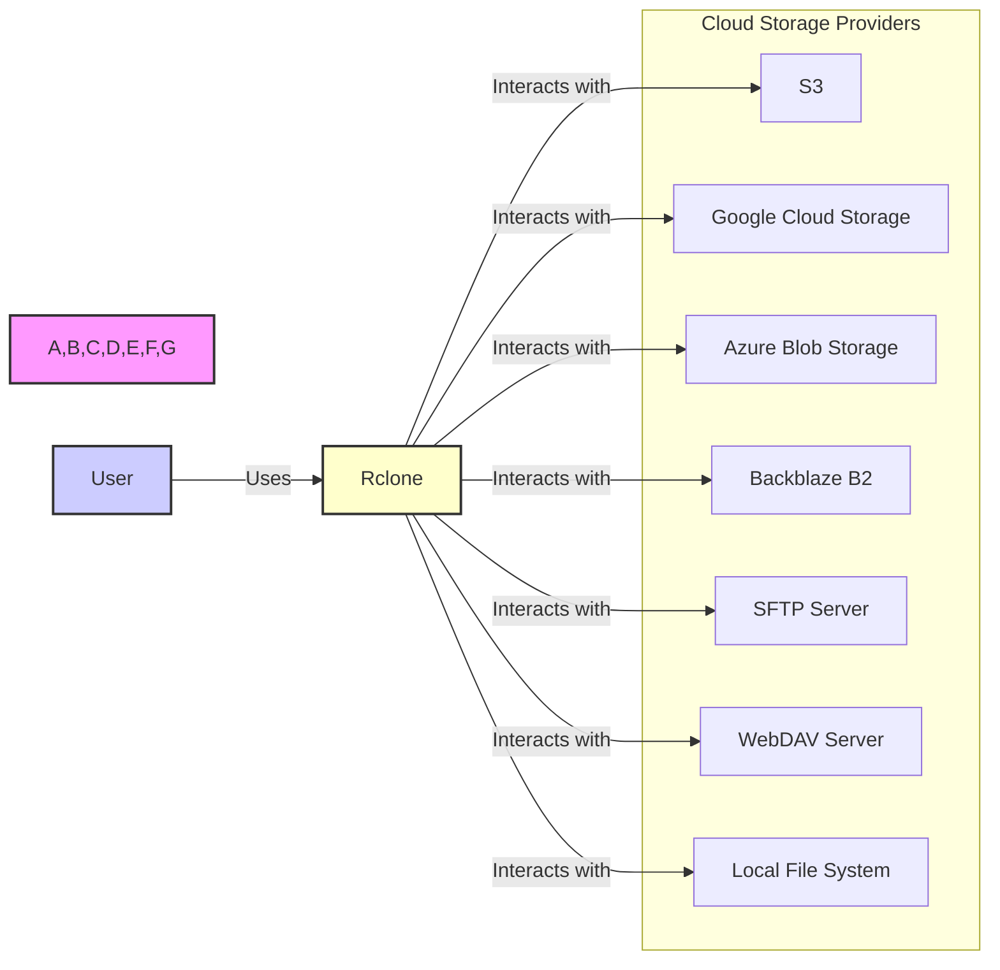
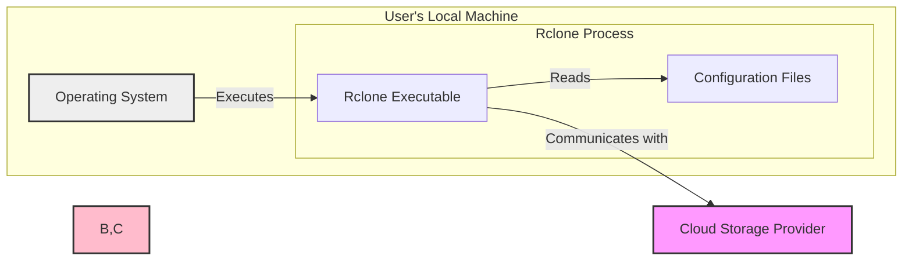
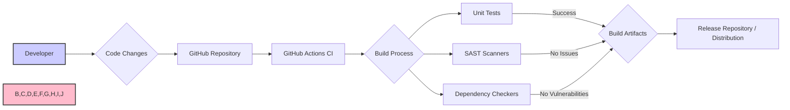

# BUSINESS POSTURE

- Business Priorities and Goals:
  - Provide a versatile command-line tool for managing files across various cloud storage services and local storage.
  - Enable users to backup, synchronize, migrate, and manage data efficiently and reliably.
  - Support a wide range of storage providers and protocols to cater to diverse user needs.
  - Offer advanced features like encryption, compression, and bandwidth limiting for enhanced data management.
  - Maintain a strong open-source community and actively develop and improve the tool.

- Business Risks:
  - Data Loss: Incorrect configuration or bugs in rclone could lead to unintentional data deletion or corruption.
  - Data Breach: Mismanagement of credentials or vulnerabilities in rclone could expose sensitive data stored in cloud services.
  - Service Disruption: Issues with rclone or its dependencies could disrupt data access and management workflows.
  - Reputational Damage: Security vulnerabilities or data loss incidents could damage the reputation of rclone and its community.
  - Supply Chain Attacks: Compromise of the build process or dependencies could lead to distribution of malicious versions of rclone.

# SECURITY POSTURE

- Existing Security Controls:
  - security control: Encryption in transit using TLS for communication with cloud storage providers. Implemented by default in rclone when interacting with services over HTTPS.
  - security control: Encryption at rest using rclone's built-in encryption feature (symmetric encryption using AES-256-CTR and authenticated encryption using HMAC-SHA-512). Described in rclone documentation.
  - security control: Hashing algorithms (MD5, SHA1, SHA256, SHA512) for data integrity verification during transfer and storage. Implemented in rclone core functionality.
  - security control: Credential management through configuration files and environment variables. Described in rclone documentation.
  - security control: Support for cloud provider's authentication and authorization mechanisms (API keys, OAuth, etc.). Implemented through rclone's backend integrations.
  - security control: Regular updates and bug fixes provided by the open-source community. Managed through GitHub repository and release process.
  - security control: Code review process within the open-source community. Managed through GitHub pull requests.

- Accepted Risks:
  - accepted risk: User responsibility for secure storage of rclone configuration files and credentials. Documented in rclone security guidelines.
  - accepted risk: Reliance on the security of underlying cloud storage providers and their infrastructure. Implicitly accepted by design as rclone is a client-side tool.
  - accepted risk: Potential vulnerabilities in third-party libraries and dependencies. Mitigated by community updates and dependency management.

- Recommended Security Controls:
  - security control: Implement static application security testing (SAST) in the build process to automatically detect potential code vulnerabilities.
  - security control: Implement dependency scanning in the build process to identify and manage vulnerable dependencies.
  - security control: Encourage and facilitate security audits and penetration testing by external security experts.
  - security control: Provide clearer guidance and tools for secure credential management, potentially including integration with secrets management solutions.
  - security control: Implement rate limiting and input validation to protect against denial-of-service and injection attacks, especially in rclone serve modes.

- Security Requirements:
  - Authentication:
    - Requirement: Rclone must securely authenticate to various cloud storage providers using their respective authentication mechanisms (API keys, OAuth, service accounts, etc.).
    - Requirement: Rclone configuration files storing credentials must be protected from unauthorized access.
    - Requirement: When running in "serve" mode, rclone should offer authentication mechanisms to control access to served data.

  - Authorization:
    - Requirement: Rclone must respect the authorization policies enforced by the cloud storage providers.
    - Requirement: Users should be able to configure rclone with minimal necessary permissions to access cloud storage.
    - Requirement: When running in "serve" mode, rclone should offer authorization mechanisms to control access to served data.

  - Input Validation:
    - Requirement: Rclone must validate all user inputs, including command-line arguments, configuration parameters, and file paths, to prevent injection attacks and unexpected behavior.
    - Requirement: Input validation should be applied to data received from external sources, especially in "serve" modes.

  - Cryptography:
    - Requirement: Rclone must use strong cryptographic algorithms and libraries for encryption and hashing.
    - Requirement: Cryptographic keys must be securely generated, stored, and managed.
    - Requirement: Encryption should be applied to sensitive data both in transit and at rest when configured by the user.

# DESIGN

## C4 CONTEXT



- Context Diagram Elements:
  - - Name: User
    - Type: Person
    - Description: An individual or system administrator who uses rclone to manage files.
    - Responsibilities: Configures and executes rclone commands to interact with storage systems. Manages rclone configuration and credentials.
    - Security controls: Responsible for secure storage of rclone configuration and credentials. Follows security best practices when using rclone.

  - - Name: Rclone
    - Type: Software System
    - Description: Command-line program for managing files on cloud and local storage.
    - Responsibilities: Provides file transfer, synchronization, encryption, and management functionalities. Interacts with various storage providers using their APIs or protocols.
    - Security controls: Implements encryption in transit and at rest. Supports secure authentication mechanisms for storage providers. Performs data integrity checks.

  - - Name: S3
    - Type: External System
    - Description: Amazon Simple Storage Service. Cloud object storage service.
    - Responsibilities: Stores and retrieves data objects. Manages access control and permissions. Provides API for data access.
    - Security controls: Implements access control lists (ACLs) and IAM policies for authorization. Provides encryption options.

  - - Name: Google Cloud Storage
    - Type: External System
    - Description: Google Cloud Storage. Cloud object storage service.
    - Responsibilities: Stores and retrieves data objects. Manages access control and permissions. Provides API for data access.
    - Security controls: Implements IAM for authorization. Provides encryption options.

  - - Name: Azure Blob Storage
    - Type: External System
    - Description: Microsoft Azure Blob Storage. Cloud object storage service.
    - Responsibilities: Stores and retrieves data objects. Manages access control and permissions. Provides API for data access.
    - Security controls: Implements Azure AD for authorization. Provides encryption options.

  - - Name: Backblaze B2
    - Type: External System
    - Description: Backblaze B2 Cloud Storage. Cloud object storage service.
    - Responsibilities: Stores and retrieves data objects. Manages access control and permissions. Provides API for data access.
    - Security controls: Implements application keys for authorization. Provides encryption options.

  - - Name: SFTP Server
    - Type: External System
    - Description: Secure File Transfer Protocol server. Used for file transfer over SSH.
    - Responsibilities: Provides secure file access and transfer. Manages user authentication and authorization.
    - Security controls: Implements SSH for secure communication and authentication.

  - - Name: WebDAV Server
    - Type: External System
    - Description: Web Distributed Authoring and Versioning server. Used for file sharing and collaboration over HTTP.
    - Responsibilities: Provides file access and management over HTTP. Manages authentication and authorization.
    - Security controls: Can implement HTTPS for secure communication. Authentication mechanisms vary depending on server configuration.

  - - Name: Local File System
    - Type: External System
    - Description: Local file system on the user's machine or server.
    - Responsibilities: Stores and retrieves files locally. Manages file permissions.
    - Security controls: File system permissions managed by the operating system.

## C4 CONTAINER

```mermaid
flowchart LR
    subgraph "User Machine / Server"
        subgraph "Rclone Container"
            A[Command-Line Interface]
            B[Core Logic]
            C[Backend Modules]
            D[Configuration Manager]
            E[Encryption Module]
        end
    end

    F[Cloud Storage Providers]

    A -- Invokes --> B
    B -- Uses --> C
    B -- Uses --> D
    B -- Uses --> E
    C -- Interacts with --> F
    D -- Stores/Retrieves --> "Configuration Files"
    E -- Encrypts/Decrypts --> B

    style A,B,C,D,E fill:#fbc,stroke:#333,stroke-width:2px
    style F fill:#f9f,stroke:#333,stroke-width:2px

    direction LR
    linkStyle default interpolate basis
```

- Container Diagram Elements:
  - - Name: Command-Line Interface
    - Type: Application
    - Description: Provides the command-line interface for users to interact with rclone. Parses user commands and arguments.
    - Responsibilities: Accepts user commands. Validates user input. Passes commands to Core Logic. Displays output to the user.
    - Security controls: Input validation to prevent command injection.

  - - Name: Core Logic
    - Type: Application
    - Description: Contains the main business logic of rclone. Orchestrates file operations, synchronization, and other functionalities.
    - Responsibilities: Implements core rclone features. Manages data flow between Backend Modules and other components. Handles error conditions.
    - Security controls: Implements data integrity checks using hashing. Manages encryption and decryption processes.

  - - Name: Backend Modules
    - Type: Library
    - Description: Collection of modules that handle interactions with specific cloud storage providers and protocols.
    - Responsibilities: Implements API interactions with cloud storage services (S3, GCS, Azure, etc.) and protocols (SFTP, WebDAV, etc.). Handles authentication and authorization with storage providers.
    - Security controls: Implements secure communication using TLS. Manages credentials securely (delegating to Configuration Manager).

  - - Name: Configuration Manager
    - Type: Application
    - Description: Manages rclone configuration files, including storage provider credentials and settings.
    - Responsibilities: Loads and saves configuration files. Securely stores and retrieves credentials. Provides configuration data to other components.
    - Security controls: Secure storage of configuration files (user responsibility). Potentially integration with secrets management solutions.

  - - Name: Encryption Module
    - Type: Library
    - Description: Provides encryption and decryption functionalities for data at rest.
    - Responsibilities: Implements encryption algorithms (AES-256-CTR, HMAC-SHA-512). Manages encryption keys. Provides APIs for encrypting and decrypting data.
    - Security controls: Uses strong cryptographic algorithms. Key management (user responsibility for secure key storage if using custom keys).

## DEPLOYMENT

Deployment Scenario: User's Local Machine



- Deployment Diagram Elements:
  - - Name: Operating System
    - Type: Infrastructure
    - Description: User's local operating system (Windows, macOS, Linux, etc.). Provides the environment for running rclone.
    - Responsibilities: Executes rclone process. Manages file system access. Provides network connectivity.
    - Security controls: Operating system level security controls (firewall, user permissions, etc.).

  - - Name: Rclone Executable
    - Type: Software
    - Description: The compiled rclone binary.
    - Responsibilities: Executes rclone program logic. Interacts with configuration files and cloud storage providers.
    - Security controls: Software integrity verification (e.g., checksums).

  - - Name: Configuration Files
    - Type: Data Store
    - Description: Files storing rclone configuration, including credentials and settings.
    - Responsibilities: Stores configuration data. Provides configuration to rclone executable.
    - Security controls: File system permissions to restrict access. Encryption of sensitive data within configuration files (if implemented by user or rclone features).

  - - Name: Cloud Storage Provider
    - Type: Infrastructure
    - Description: External cloud storage service (S3, GCS, Azure, etc.).
    - Responsibilities: Stores and retrieves data. Manages access control.
    - Security controls: Cloud provider's security infrastructure and controls (access control policies, encryption, etc.).

## BUILD



- Build Process Elements:
  - - Name: Developer
    - Type: Person
    - Description: Software developer contributing to rclone project.
    - Responsibilities: Writes code, fixes bugs, implements new features. Submits code changes to the repository.
    - Security controls: Code review process. Secure development practices.

  - - Name: Code Changes
    - Type: Data
    - Description: Modifications to the rclone source code.
    - Responsibilities: Represents changes to the codebase.
    - Security controls: Version control system (Git) for tracking changes and history.

  - - Name: GitHub Repository
    - Type: Code Repository
    - Description: GitHub repository hosting rclone source code.
    - Responsibilities: Stores source code, manages version control, facilitates collaboration.
    - Security controls: Access control to repository. Audit logs.

  - - Name: GitHub Actions CI
    - Type: Automation System
    - Description: GitHub's built-in CI/CD service used for automated builds and testing.
    - Responsibilities: Automates build process. Runs tests and security checks. Creates build artifacts.
    - Security controls: Secure build environment. Access control to CI workflows and secrets.

  - - Name: Build Process
    - Type: Process
    - Description: Automated steps to compile, test, and package rclone.
    - Responsibilities: Compiles code. Runs unit tests. Performs security scans (SAST, dependency checks). Creates build artifacts.
    - Security controls: SAST scanners. Dependency checkers. Secure build environment.

  - - Name: Unit Tests
    - Type: Automated Tests
    - Description: Automated tests to verify the functionality of individual code units.
    - Responsibilities: Verifies code correctness. Detects regressions.
    - Security controls: Helps ensure code quality and reduce vulnerabilities.

  - - Name: SAST Scanners
    - Type: Security Tool
    - Description: Static Application Security Testing tools to analyze code for potential vulnerabilities.
    - Responsibilities: Identifies potential security flaws in the code.
    - Security controls: Automated vulnerability detection.

  - - Name: Dependency Checkers
    - Type: Security Tool
    - Description: Tools to check for known vulnerabilities in project dependencies.
    - Responsibilities: Identifies vulnerable dependencies.
    - Security controls: Supply chain security.

  - - Name: Build Artifacts
    - Type: Software
    - Description: Compiled rclone executables and packages.
    - Responsibilities: Distributable versions of rclone.
    - Security controls: Code signing (potentially). Checksums for integrity verification.

  - - Name: Release Repository / Distribution
    - Type: Distribution System
    - Description: Platforms for distributing rclone releases (GitHub Releases, website, package managers).
    - Responsibilities: Distributes rclone to users.
    - Security controls: Secure distribution channels (HTTPS). Integrity verification mechanisms (checksums, signatures).

# RISK ASSESSMENT

- Critical Business Processes:
  - Data Backup and Recovery: Rclone is used to backup critical data to cloud or local storage, ensuring business continuity in case of data loss.
  - Data Synchronization: Rclone is used to synchronize data across different locations, ensuring data consistency and availability.
  - Data Migration: Rclone is used to migrate data between different storage systems, facilitating infrastructure changes and upgrades.
  - Data Archiving: Rclone is used to archive data for long-term storage and compliance purposes.

- Data Sensitivity:
  - Data handled by rclone can vary greatly in sensitivity depending on the user and their use case.
  - Data can include:
    - Publicly available data (low sensitivity).
    - Internal business documents (medium sensitivity).
    - Personally Identifiable Information (PII) (high sensitivity).
    - Financial data (high sensitivity).
    - Intellectual property (high sensitivity).
    - Secrets and credentials (very high sensitivity).
  - The sensitivity of data depends on the context and the potential impact of its unauthorized disclosure, modification, or loss.

# QUESTIONS & ASSUMPTIONS

- Questions:
  - What is the typical user profile for rclone (individual users, small businesses, large enterprises)?
  - What are the most common use cases for rclone?
  - Are there specific regulatory compliance requirements that rclone users need to adhere to (e.g., GDPR, HIPAA)?
  - What is the process for reporting and handling security vulnerabilities in rclone?
  - Are there any specific security features or enhancements planned for future releases of rclone?

- Assumptions:
  - Assumption: Users are responsible for securely managing their rclone configuration files and credentials.
  - Assumption: Users understand the security implications of using cloud storage and choose providers and configurations that meet their security requirements.
  - Assumption: Rclone is primarily used as a command-line tool, although "serve" modes exist and are considered for security.
  - Assumption: The open-source community actively maintains and improves rclone, including addressing security vulnerabilities.
  - Assumption: The provided GitHub repository represents the current and authoritative source code for rclone.