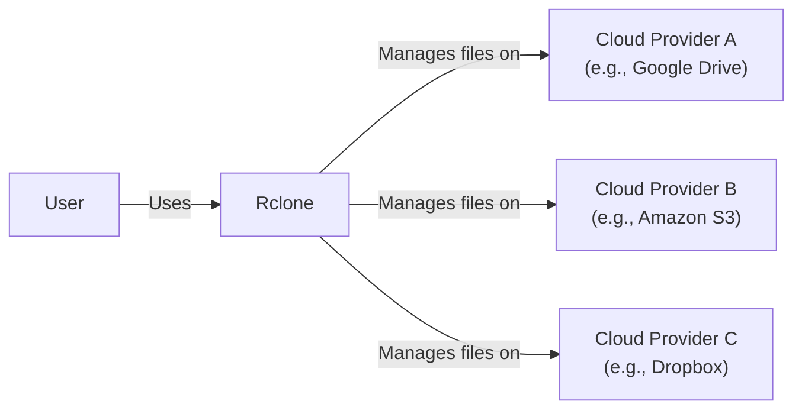
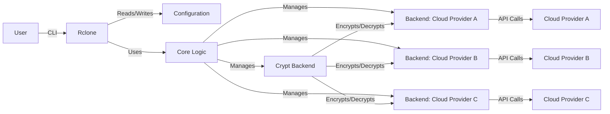
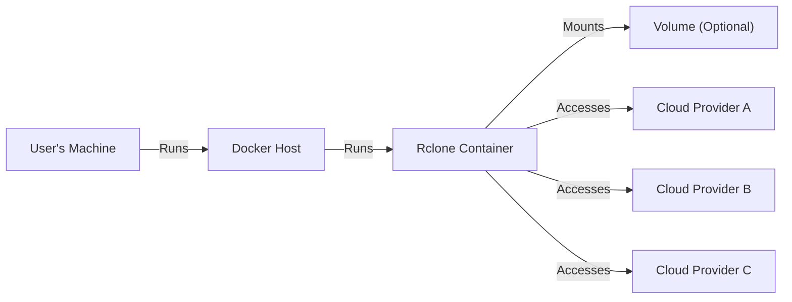
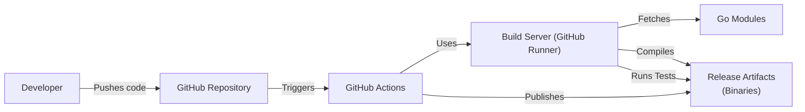

Okay, let's create a design document for Rclone, focusing on aspects relevant for threat modeling.

# BUSINESS POSTURE

Rclone is a command-line program to manage files on cloud storage.  It's an open-source project widely used by individuals and organizations to synchronize, transfer, and manage data across various cloud providers.  The business priorities and goals can be inferred as follows:

*   _Data Availability_: Ensuring users can reliably access their data stored across different cloud services.
*   _Data Integrity_: Maintaining the integrity of user data during transfer and synchronization.
*   _Data Confidentiality_: Protecting user data from unauthorized access, both in transit and at rest (depending on the user's chosen cloud provider and Rclone configuration).
*   _Ease of Use_: Providing a user-friendly command-line interface for managing cloud storage.
*   _Broad Cloud Support_: Supporting a wide range of cloud storage providers to cater to diverse user needs.
*   _Cost-Effectiveness_: Offering a free and open-source solution for cloud data management.
*   _Community Support_: Maintaining an active community for support, development, and feature enhancements.
*   _Extensibility_: Allowing for the addition of new cloud providers and features.

_Most Important Business Risks_:

*   _Data Breach_: Unauthorized access to user data due to vulnerabilities in Rclone or misconfiguration.
*   _Data Loss_: Accidental deletion or corruption of user data due to bugs or operational errors.
*   _Service Disruption_: Inability to access or manage cloud data due to issues with Rclone or the underlying cloud providers.
*   _Reputation Damage_: Negative impact on Rclone's reputation due to security incidents or data breaches.
*   _Compliance Violations_: Failure to comply with data privacy regulations (e.g., GDPR, CCPA) if user data is mishandled.
*   _Supply Chain Attacks_: Compromise of the Rclone codebase or build process, leading to the distribution of malicious versions.

# SECURITY POSTURE

Rclone has several built-in security features and relies on the security of the underlying cloud providers.  Here's a breakdown:

*   _security control_: _Encryption in Transit_: Rclone supports encrypted connections (HTTPS) to most cloud providers, protecting data during transfer. Implemented in communication modules with each cloud provider.
*   _security control_: _Encryption at Rest (Backend Dependent)_: Rclone itself doesn't directly handle encryption at rest; this is primarily the responsibility of the chosen cloud storage provider. However, Rclone does support a `crypt` backend which allows for client-side encryption. Implemented in `crypt` backend.
*   _security control_: _Configuration File Encryption_: Rclone allows users to encrypt their configuration file, which contains sensitive credentials. Implemented in configuration management module.
*   _security control_: _Checksum Verification_: Rclone can verify the integrity of files using checksums (e.g., MD5, SHA1) to detect data corruption during transfer. Implemented in transfer and synchronization modules.
*   _security control_: _Bandwidth Limiting_: Rclone allows users to limit bandwidth usage, which can help prevent denial-of-service attacks against the user's network or cloud storage account. Implemented in transfer module.
*   _security control_: _OAuth 2.0 Support_: Rclone uses OAuth 2.0 for authentication with many cloud providers, avoiding the need to store user passwords directly. Implemented in authentication modules for each supported provider.
*   _accepted risk_: _Plaintext Credentials in Configuration (if not encrypted)_: If the user chooses not to encrypt their Rclone configuration file, credentials will be stored in plaintext.
*   _accepted risk_: _Reliance on Third-Party Cloud Provider Security_: Rclone's security is heavily dependent on the security practices of the chosen cloud storage providers.
*   _accepted risk_: _Potential for Misconfiguration_: Users can misconfigure Rclone, leading to security vulnerabilities (e.g., using weak passwords, exposing credentials).
*   _accepted risk_: _Command-Line Interface Security_: As a command-line tool, Rclone's security is also tied to the security of the user's operating system and terminal environment.
*   _accepted risk_: _Supply Chain Security_: While efforts are made to secure the build process, there's always a risk of compromise in the software supply chain.

_Recommended Security Controls_:

*   _High Priority_: Implement Software Bill of Materials (SBOM) generation during the build process to improve supply chain transparency.
*   _High Priority_: Integrate with code scanning tools (SAST, DAST) in the CI/CD pipeline to identify potential vulnerabilities early.
*   _High Priority_: Conduct regular security audits and penetration testing of the Rclone codebase.
*   _High Priority_: Provide clear and concise security documentation, including best practices for configuration and usage.

_Security Requirements_:

*   _Authentication_:
    *   Support OAuth 2.0 for all possible cloud providers.
    *   Provide clear guidance on securely storing and managing credentials.
    *   Offer options for multi-factor authentication (MFA) where supported by the cloud provider.
*   _Authorization_:
    *   Ensure that Rclone only accesses the resources it's authorized to access on the cloud provider.
    *   Follow the principle of least privilege.
*   _Input Validation_:
    *   Validate all user inputs to prevent command injection or other injection vulnerabilities.
    *   Sanitize file paths and other parameters to avoid unexpected behavior.
*   _Cryptography_:
    *   Use strong, industry-standard cryptographic algorithms for encryption (both in transit and at rest with `crypt` backend).
    *   Properly manage cryptographic keys.
    *   Regularly review and update cryptographic implementations to address new vulnerabilities.

# DESIGN

## C4 CONTEXT

_C4 Context Element Descriptions_:

*   Element:
    *   Name: User
    *   Type: Person
    *   Description: A person who uses Rclone to manage their files on cloud storage.
    *   Responsibilities:
        *   Installs and configures Rclone.
        *   Issues commands to Rclone to perform file operations.
        *   Provides credentials for cloud storage providers.
    *   Security controls:
        *   Uses strong passwords.
        *   Enables multi-factor authentication where available.
        *   Keeps their operating system and Rclone installation up to date.

*   Element:
    *   Name: Rclone
    *   Type: Software System
    *   Description: A command-line program for managing files on cloud storage.
    *   Responsibilities:
        *   Connects to various cloud storage providers.
        *   Synchronizes files between local storage and cloud storage.
        *   Transfers files between different cloud storage providers.
        *   Provides features like encryption, checksum verification, and bandwidth limiting.
    *   Security controls:
        *   Uses encrypted connections (HTTPS) for data transfer.
        *   Supports OAuth 2.0 for authentication.
        *   Allows configuration file encryption.
        *   Verifies file integrity using checksums.

*   Element:
    *   Name: Cloud Provider A (e.g., Google Drive)
    *   Type: External System
    *   Description: A cloud storage provider (example: Google Drive).
    *   Responsibilities:
        *   Stores user data.
        *   Provides APIs for accessing and managing data.
        *   Handles user authentication and authorization.
    *   Security controls:
        *   Provides encryption at rest.
        *   Offers various security features (e.g., MFA, access controls).
        *   Complies with relevant security standards and regulations.

*   Element:
    *   Name: Cloud Provider B (e.g., Amazon S3)
    *   Type: External System
    *   Description: A cloud storage provider (example: Amazon S3).
    *   Responsibilities:
        *   Stores user data.
        *   Provides APIs for accessing and managing data.
        *   Handles user authentication and authorization.
    *   Security controls:
        *   Provides encryption at rest.
        *   Offers various security features (e.g., MFA, access controls).
        *   Complies with relevant security standards and regulations.

*   Element:
    *   Name: Cloud Provider C (e.g., Dropbox)
    *   Type: External System
    *   Description: A cloud storage provider (example: Dropbox).
    *   Responsibilities:
        *   Stores user data.
        *   Provides APIs for accessing and managing data.
        *   Handles user authentication and authorization.
    *   Security controls:
        *   Provides encryption at rest.
        *   Offers various security features (e.g., MFA, access controls).
        *   Complies with relevant security standards and regulations.

## C4 CONTAINER

Since Rclone is a single executable, the container diagram is essentially an expanded view of the context diagram.  It highlights the internal components within the Rclone application.

_C4 Container Element Descriptions_:

*  Element:
    *   Name: User
    *   Type: Person
    *   Description: A person interacting with Rclone via the command line.
    *   Responsibilities: Provides commands and parameters to Rclone.
    *   Security controls: Uses secure terminal practices.

*  Element:
    *   Name: Rclone
    *   Type: Application
    *   Description: The main Rclone application.
    *   Responsibilities: Parses commands, manages configuration, interacts with backends.
    *   Security controls: Input validation, secure configuration handling.

*  Element:
    *   Name: Configuration
    *   Type: Data Store
    *   Description: Stores Rclone's configuration, including credentials.
    *   Responsibilities: Persists configuration data.
    *   Security controls: Can be encrypted by the user.

*  Element:
    *   Name: Core Logic
    *   Type: Component
    *   Description: Contains the core logic for Rclone's operations (sync, copy, etc.).
    *   Responsibilities: Orchestrates file operations, manages backends.
    *   Security controls: Implements checksum verification, bandwidth limiting.

*  Element:
    *   Name: Backend: Cloud Provider A
    *   Type: Component
    *   Description: Code specific to interacting with Cloud Provider A.
    *   Responsibilities: Handles API calls, authentication, data transfer.
    *   Security controls: Uses HTTPS, OAuth 2.0 where available.

*  Element:
    *   Name: Backend: Cloud Provider B
    *   Type: Component
    *   Description: Code specific to interacting with Cloud Provider B.
    *   Responsibilities: Handles API calls, authentication, data transfer.
    *   Security controls: Uses HTTPS, OAuth 2.0 where available.

*  Element:
    *   Name: Backend: Cloud Provider C
    *   Type: Component
    *   Description: Code specific to interacting with Cloud Provider C.
    *   Responsibilities: Handles API calls, authentication, data transfer.
    *   Security controls: Uses HTTPS, OAuth 2.0 where available.

*  Element:
    *   Name: Crypt Backend
    *   Type: Component
    *   Description: Provides client-side encryption/decryption.
    *   Responsibilities: Encrypts and decrypts data before sending to/receiving from other backends.
    *   Security controls: Uses strong encryption algorithms.

*  Element:
    *   Name: Cloud Provider A
    *   Type: External System
    *   Description: The external cloud storage provider (e.g., Google Drive).
    *   Responsibilities: Stores and manages user data.
    *   Security controls: Implements its own security measures.

*  Element:
    *   Name: Cloud Provider B
    *   Type: External System
    *   Description: The external cloud storage provider (e.g., Amazon S3).
    *   Responsibilities: Stores and manages user data.
    *   Security controls: Implements its own security measures.

*  Element:
    *   Name: Cloud Provider C
    *   Type: External System
    *   Description: The external cloud storage provider (e.g., Dropbox).
    *   Responsibilities: Stores and manages user data.
    *   Security controls: Implements its own security measures.

## DEPLOYMENT

Rclone is a standalone executable and doesn't have a complex deployment process in the traditional sense. It's typically downloaded and run directly on the user's machine. However, we can consider different deployment *scenarios*:

_Possible Deployment Solutions_:

1.  _Direct Download and Execution_: The user downloads the pre-compiled binary for their operating system and runs it directly.
2.  _Package Manager_: Rclone is available through various package managers (e.g., apt, brew, choco), simplifying installation and updates.
3.  _Docker Container_: Rclone can be run within a Docker container, providing isolation and consistency across different environments.
4.  _Build from Source_: Users can build Rclone from source code, allowing for customization and auditing.

_Chosen Deployment Scenario (Docker Container)_:

_Deployment Element Descriptions_:

*   Element:
    *   Name: User's Machine
    *   Type: Device
    *   Description: The user's computer or server.
    *   Responsibilities: Hosts the Docker environment.
    *   Security controls: Operating system security, firewall.

*   Element:
    *   Name: Docker Host
    *   Type: Server
    *   Description: The machine running the Docker daemon.
    *   Responsibilities: Manages Docker containers.
    *   Security controls: Docker daemon security configuration, host OS security.

*   Element:
    *   Name: Rclone Container
    *   Type: Container
    *   Description: A Docker container running the Rclone executable.
    *   Responsibilities: Executes Rclone commands.
    *   Security controls: Container isolation, limited privileges.

*   Element:
    *   Name: Cloud Provider A
    *   Type: External System
    *   Description: A cloud storage provider.
    *   Responsibilities: Stores user data.
    *   Security controls: Cloud provider's security measures.

*   Element:
    *   Name: Cloud Provider B
    *   Type: External System
    *   Description: A cloud storage provider.
    *   Responsibilities: Stores user data.
    *   Security controls: Cloud provider's security measures.

*   Element:
    *   Name: Cloud Provider C
    *   Type: External System
    *   Description: A cloud storage provider.
    *   Responsibilities: Stores user data.
    *   Security controls: Cloud provider's security measures.

*   Element:
    *   Name: Volume (Optional)
    *   Type: Data Store
    *   Description: A Docker volume for persistent storage (e.g., Rclone configuration).
    *   Responsibilities: Provides persistent storage for the container.
    *   Security controls: Access controls on the volume.

## BUILD

Rclone's build process is automated using GitHub Actions. The process involves compiling the Go source code, running tests, and creating release artifacts.

_Build Process Security Controls_:

*   _security control_: _Automated Build System (GitHub Actions)_: Ensures consistent and reproducible builds.
*   _security control_: _Version Control (Git)_: Tracks all code changes and allows for auditing.
*   _security control_: _Dependency Management (Go Modules)_: Manages external dependencies and their versions.
*   _security control_: _Automated Testing_: Includes unit tests and integration tests to verify code functionality and prevent regressions.
*   _security control_: _Code Signing (Potentially)_: Although not explicitly mentioned in the repository, code signing of release artifacts is a recommended practice to ensure authenticity and integrity.
*   _security control_: _Static Analysis (Potentially)_: The workflow could be enhanced to include static analysis tools (e.g., `go vet`, `staticcheck`) to identify potential code quality and security issues.

# RISK ASSESSMENT

*   _Critical Business Processes_:
    *   Data synchronization between local storage and cloud providers.
    *   Data transfer between different cloud providers.
    *   Secure access to cloud storage using Rclone.

*   _Data We Are Trying to Protect_:
    *   _User Files_: The primary data being managed by Rclone. Sensitivity varies greatly depending on the user and the files they store. This could range from personal photos to sensitive business documents.
    *   _Rclone Configuration File_: Contains credentials (potentially in plaintext if not encrypted) for accessing cloud storage providers. This is highly sensitive data.
    *   _Cached Data (if applicable)_: Rclone may temporarily cache data during transfers. The sensitivity of this data depends on the files being transferred.

# QUESTIONS & ASSUMPTIONS

*   _Questions_:
    *   Are there any specific compliance requirements (e.g., HIPAA, GDPR) that Rclone needs to adhere to?  While Rclone itself doesn't store data, its usage might fall under these regulations.
    *   What is the expected threat model for typical Rclone users? (e.g., individual users, small businesses, large enterprises)
    *   Are there any plans to implement more advanced security features, such as hardware security module (HSM) support for key management?
    *   What is the process for handling security vulnerabilities reported by external researchers?
    *   Is there a dedicated security contact or team for Rclone?
    *   What level of assurance is provided for the integrity of pre-built binaries?
    *   Are there any plans to integrate dynamic analysis (DAST) into the CI/CD pipeline?

*   _Assumptions_:
    *   _BUSINESS POSTURE_: Rclone's primary goal is to provide a reliable and efficient way to manage files on cloud storage, prioritizing ease of use and broad cloud support.
    *   _SECURITY POSTURE_: Users are responsible for securing their own systems and credentials. Rclone provides tools to help with security (e.g., configuration file encryption), but ultimately relies on the user to configure it securely.
    *   _DESIGN_: Rclone's architecture is relatively simple, with a focus on modularity and extensibility to support various cloud providers. The security of Rclone is heavily dependent on the security of the underlying cloud providers and the user's configuration.
    *   _DESIGN_: The build process is automated and secure, but there's always room for improvement (e.g., adding SBOM generation, code signing).
    *   _DESIGN_: Users will follow best practices for securing their credentials and systems.
    *   _DESIGN_: The underlying operating system and network environment are secure.