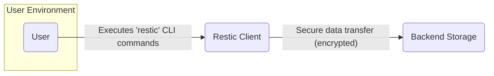
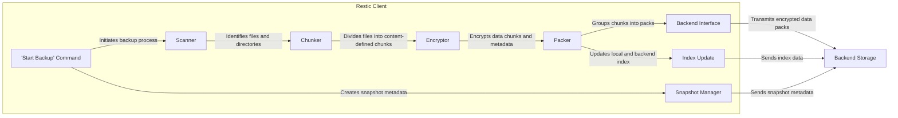
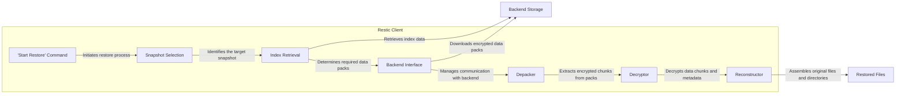

# Project Design Document: Restic Backup System

**Version:** 1.1
**Date:** October 26, 2023
**Author:** AI Software Architect

## 1. Introduction

This document provides an enhanced design overview of the Restic backup system. Restic is a modern backup program engineered for ease of use, speed, efficiency, and robust security. This document elaborates on the core architectural components, data flows, and security mechanisms of Restic, specifically tailored for subsequent threat modeling activities.

## 2. Goals and Non-Goals

**Goals:**

*   Deliver a refined and more detailed description of Restic's architecture and functionality.
*   Provide clearer explanations of the interactions between key components.
*   Offer a more granular view of the data flow during both backup and restore operations.
*   Elaborate on the security mechanisms implemented within Restic, including key management.
*   Serve as a robust and comprehensive foundation for threat modeling the Restic system.

**Non-Goals:**

*   Provide a line-by-line code-level implementation guide or API documentation.
*   Document every single command-line option, flag, or obscure configuration parameter.
*   Conduct a security assessment or penetration testing of specific backend storage providers.
*   Undertake a formal, static code analysis or security audit of the Restic codebase.

## 3. High-Level Architecture

Restic operates as a client-side application, initiated by a user, that interacts with a remote backend storage system. The fundamental functionalities encompass backing up user data, restoring data from backups, and managing the lifecycle of these backups.

*   **User:** The individual or system administrator who interacts with the `restic` command-line interface (CLI) to perform backup and restore operations.
*   **Restic Client:** The central application responsible for orchestrating all aspects of the backup and restore process. Key responsibilities include:
    *   Scanning the file system for data to back up.
    *   Dividing data into content-defined chunks.
    *   Encrypting data chunks and metadata.
    *   Establishing and managing connections with the backend storage.
    *   Organizing backups into snapshots and managing their metadata.
*   **Backend Storage:** The remote repository where the encrypted backup data is persistently stored. Restic's design supports a diverse range of backend types, offering flexibility in deployment:
    *   Local file system directories (`local`)
    *   Secure File Transfer Protocol servers (`sftp`)
    *   Amazon Simple Storage Service (`s3`) and S3-compatible services
    *   Microsoft Azure Blob Storage (`azure`)
    *   Google Cloud Storage (`gcs`)
    *   Generic REST servers (utilizing the separate `rest-server` component)
    *   Other community-supported backends.

## 4. Detailed Design

### 4.1. Restic Client Components

The Restic client's architecture is modular, with distinct components handling specific tasks:

*   **Command Parser:** Interprets commands entered by the user via the CLI, validating syntax and triggering the corresponding internal functions.
*   **Repository Manager:** Handles the lifecycle of the backup repository, including initialization, password management, and establishing secure connections to the backend.
*   **Scanner:** Systematically traverses the specified file system paths, identifying files and directories that match the backup criteria.
*   **Chunker:** Implements a content-defined chunking algorithm. This divides files into variable-sized chunks based on their content, enabling efficient deduplication across backups.
*   **Encryptor:** Encrypts data chunks and metadata before they are transmitted to the backend. Restic employs authenticated encryption with associated data (AEAD), utilizing a randomly generated repository key protected by the user's password.
*   **Packer:** Aggregates multiple encrypted chunks into larger "pack" files. This optimizes storage efficiency on the backend and reduces the number of individual files to manage.
*   **Backend Interface:** Provides an abstraction layer that allows the Restic client to interact with various backend storage types using their specific protocols and APIs.
*   **Snapshot Manager:** Creates and manages snapshots, which are immutable records of the backup state at a specific point in time. Snapshots contain metadata about the backed-up files and directories.
*   **Index:** Maintains a local and backend index that maps chunks to their locations within the pack files. This index is crucial for efficient retrieval during restore operations.
*   **Pruner:** Implements retention policies by identifying and removing unused data chunks from the backend, reclaiming storage space while adhering to defined backup schedules.
*   **Checker:** Verifies the integrity of the backup data stored in the backend by comparing checksums and ensuring the consistency of the index and data packs.
*   **Restorer:** Retrieves the necessary data chunks from the backend, decrypts them, and reconstructs the original files and directories at the specified destination.

### 4.2. Data Flow - Backup Operation

1. **'Start Backup' Command:** The user initiates a backup operation using the `restic backup` command, specifying the source directories or files to be backed up.
2. **Scanner:** The scanner component recursively traverses the specified paths, identifying files and directories that meet the backup criteria (e.g., excluding specified patterns).
3. **Chunker:** Each file is processed by the chunker, which divides it into content-defined chunks. This ensures that only changed portions of files are backed up in subsequent backups.
4. **Encryptor:** The encryptor encrypts each data chunk and the associated metadata using the repository's encryption key, ensuring confidentiality and integrity.
5. **Packer:** The packer groups multiple encrypted chunks into larger pack files. This improves storage efficiency and reduces the overhead of managing numerous small files on the backend.
6. **Backend Interface:** The backend interface handles the communication with the configured backend storage, transferring the encrypted data packs using the appropriate protocol (e.g., HTTPS for S3).
7. **Snapshot Manager:** A new snapshot is created, capturing the state of the backup, including the root directory, hostname, tags, and timestamps.
8. **Index Update:** The local and backend indices are updated with information about the newly created chunks, their locations within the pack files, and their association with the current snapshot.

### 4.3. Data Flow - Restore Operation

1. **'Start Restore' Command:** The user initiates a restore operation using the `restic restore` command, specifying the snapshot to restore and the destination path.
2. **Snapshot Selection:** The user selects the specific snapshot they wish to restore from. Restic uses the snapshot metadata to identify the relevant data.
3. **Index Retrieval:** The Restic client retrieves the index from the backend storage. This index maps the files and directories in the selected snapshot to the corresponding data chunks.
4. **Backend Interface:** The client uses the index to determine which encrypted data packs are needed and requests them from the backend storage.
5. **Depacker:** The downloaded data packs are unpacked to extract the individual encrypted data chunks.
6. **Decryptor:** The extracted encrypted chunks are decrypted using the repository's encryption key.
7. **Reconstructor:** The decrypted chunks are assembled back into the original files and directories, and written to the specified destination on the user's system.

### 4.4. Key Management

*   Upon repository initialization, Restic generates a unique, randomly generated master key for that repository.
*   This master key is then encrypted using a key derived from the user-provided password using a computationally intensive key derivation function (Argon2id). This protects against brute-force attacks on the password.
*   The encrypted master key, along with other repository metadata, is stored securely within the backend storage.
*   To access the repository and perform backup or restore operations, the user must provide the correct password. This password is used to derive the encryption key, which decrypts the master key, allowing access to the backup data.
*   Restic also supports the concept of multiple users with different passwords accessing the same repository, each having their own encrypted copy of the master key.

### 4.5. Backend Interaction

Restic's interaction with the backend storage is mediated by the backend interface, which handles the specifics of each backend type:

*   **Authentication and Authorization:** Restic utilizes the authentication mechanisms provided by the specific backend (e.g., API keys for S3, connection strings for Azure).
*   **Data Transfer:** Encrypted data packs are uploaded to and downloaded from the backend using the backend's API or protocol.
*   **Metadata Operations:** Restic reads and writes metadata, such as snapshot information and the index, to the backend.
*   **Listing and Deletion:** Restic performs operations to list existing data and delete obsolete data during pruning.
*   **Error Handling:** The backend interface handles potential errors during communication with the backend, providing feedback to the user.

## 5. Security Considerations

Restic's design incorporates several key security features:

*   **Strong Encryption at Rest:** All data stored in the backend, including both data chunks and metadata, is encrypted using authenticated encryption (AEAD) algorithms like AES-256-GCM. This ensures the confidentiality and integrity of the backed-up data.
*   **Secure Key Management:** The repository's master key is protected by a strong, password-derived key using Argon2id, a memory-hard key derivation function resistant to various attacks.
*   **Integrity Verification:** Restic calculates cryptographic checksums (using SHA-256) for all data chunks and metadata. These checksums are used to verify the integrity of the data during backup, transfer, and restore operations, detecting any corruption or tampering.
*   **Deduplication Security:** While deduplication optimizes storage, Restic ensures that even deduplicated chunks are encrypted, preventing unauthorized access to shared data.
*   **Password Salting:**  Argon2id inherently uses a salt, further enhancing the security of the password hashing process.
*   **Immutability Support (Backend Dependent):** Restic can leverage immutability features offered by certain backends (e.g., AWS S3 Object Lock, Azure Blob Storage immutability policies). This prevents accidental or malicious deletion or modification of backups.
*   **No Reliance on Backend Encryption:** Restic performs encryption client-side, ensuring that the data is protected regardless of the security measures implemented by the backend provider.

**Potential Security Considerations for Threat Modeling:**

*   **Password Strength and Management:** The security of the entire repository hinges on the strength and secrecy of the user's password. Weak or compromised passwords can lead to unauthorized access.
*   **Loss of Password:** If the password is lost, the backup data becomes permanently inaccessible. Secure password management practices are crucial.
*   **Compromise of Backend Credentials:** If the credentials used to access the backend storage are compromised, an attacker could potentially delete or corrupt the backups.
*   **Man-in-the-Middle Attacks (Network Security):** While Restic encrypts the data, ensuring secure communication channels (e.g., HTTPS, SSH) is essential to prevent interception and potential manipulation of data in transit.
*   **Client-Side Security:** If the system running the Restic client is compromised, an attacker might be able to extract the repository password or encryption key from memory or configuration files.
*   **Supply Chain Attacks:**  Compromise of the Restic software itself or its dependencies could introduce vulnerabilities.
*   **Denial of Service Attacks:** An attacker could potentially attempt to exhaust backend resources or corrupt repository metadata, leading to a denial of service.
*   **Side-Channel Attacks:** While less likely, potential vulnerabilities in the encryption implementation could be exploited through side-channel attacks.

## 6. Deployment Considerations

Restic is designed for straightforward deployment across various environments:

*   **Installation:** Restic is typically installed as a standalone binary, available for various operating systems. Installation methods include downloading pre-compiled binaries or building from source.
*   **Configuration:** Users configure Restic by specifying the backend storage location, providing credentials (if necessary), and setting a strong password for the repository. Configuration can be done via command-line flags or environment variables.
*   **Scheduling:** Backup operations are commonly automated using system schedulers like `cron` (on Linux/macOS) or Task Scheduler (on Windows).
*   **Rest Server Deployment:** The `rest-server` component can be deployed as a separate service to provide access to a Restic repository over a REST API, useful for scenarios where direct backend access is restricted. This server needs to be secured appropriately.
*   **Containerization:** Restic can be easily containerized using Docker or similar technologies, simplifying deployment and management in containerized environments.

## 7. Future Considerations

*   Enhanced support for more diverse backend storage providers and features.
*   Improved monitoring and logging capabilities for better observability.
*   Performance optimizations for handling extremely large backups and repositories.
*   Exploration of features like data compression algorithms to further reduce storage footprint.
*   Potential development of a more user-friendly graphical user interface (GUI) for certain operations.

This improved design document provides a more detailed and nuanced understanding of the Restic backup system's architecture, data flows, and security mechanisms. This enhanced level of detail will be beneficial for conducting thorough and effective threat modeling exercises.