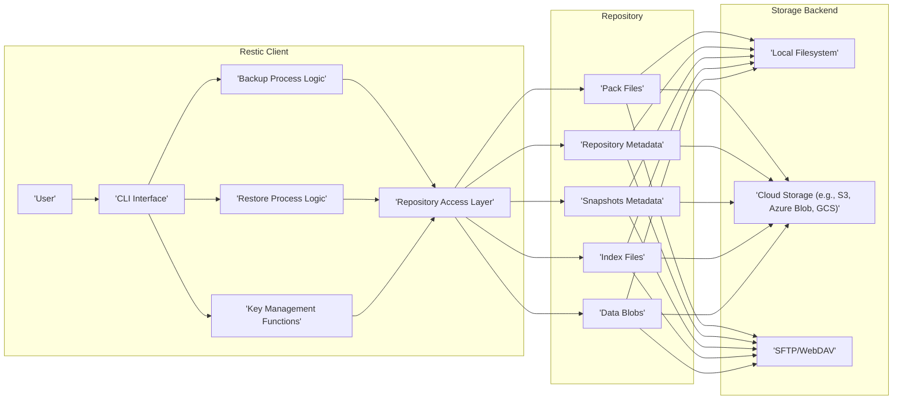
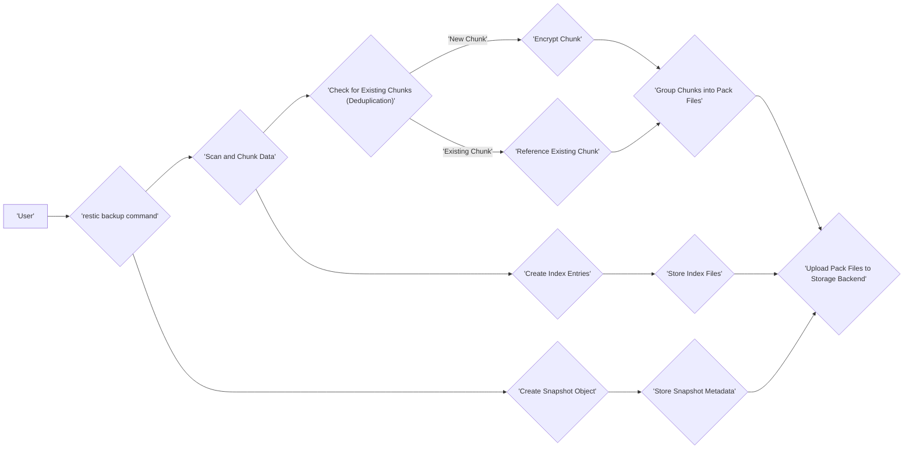
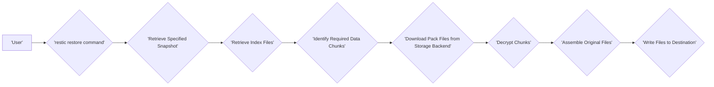

# Project Design Document: restic - Secure and Efficient Backup Program

**Version:** 1.1
**Date:** October 26, 2023
**Author:** Gemini (AI Language Model)

## 1. Introduction

This document provides a detailed design overview of the restic backup program, a modern backup solution renowned for its ease of use, speed, efficiency, and robust security features. This document elaborates on the core architectural elements, intricate data flow mechanisms, and critical security considerations inherent in restic's design. It is intended to serve as a comprehensive reference, particularly for threat modeling exercises, by providing a thorough understanding of the system's inner workings. The information contained herein is derived from the publicly accessible source code and documentation of restic, available at [https://github.com/restic/restic](https://github.com/restic/restic).

## 2. Goals and Objectives

The fundamental goals driving the design of restic are:

*   **Robust Security for Backups:** Guaranteeing the confidentiality and integrity of backed-up data through the implementation of strong encryption and authentication protocols.
*   **Storage Efficiency:** Minimizing the required storage footprint through the utilization of content-defined deduplication techniques.
*   **User-Friendly Interface:** Offering a straightforward and intuitive command-line interface for ease of interaction.
*   **High Performance:** Optimizing both backup and restore operations to achieve speed and efficiency.
*   **Broad Compatibility:** Ensuring operability across a diverse range of operating systems and storage backends.
*   **Verifiable Backup Integrity:** Enabling users to independently verify the integrity and consistency of their backup data.

## 3. Target Audience

This document is primarily intended for:

*   Security engineers and architects tasked with conducting threat modeling exercises and security assessments of systems employing restic for backups.
*   Software developers involved in the development, maintenance, or integration of restic into larger systems.
*   System administrators responsible for the deployment, configuration, and management of restic backup infrastructure.

## 4. System Architecture

restic's architecture comprises several interconnected components working in concert:

*   **Client:**
    *   The primary command-line interface (CLI) application through which users interact with restic.
    *   Handles parsing user commands, managing repository connections, and orchestrating backup and restore workflows.
*   **Repository:**
    *   The designated storage location for all backup data, metadata, and configuration files.
    *   Abstracts the underlying storage backend, allowing restic to operate with various storage technologies.
*   **Storage Backend:**
    *   The concrete technology used for persistent storage of the repository's contents.
    *   Examples include:
        *   Local file systems (on various operating systems)
        *   Object storage services (e.g., AWS S3, Azure Blob Storage, Google Cloud Storage, Backblaze B2)
        *   Network file systems (e.g., SFTP, WebDAV)
*   **Key Management Subsystem:**
    *   Responsible for managing encryption keys, including:
        *   Password handling and derivation of the repository master key using Argon2id.
        *   Generation and management of content encryption keys for individual data blobs.
        *   Secure storage of key-related metadata within the repository.
*   **Snapshot:**
    *   A read-only, point-in-time representation of the backed-up data.
    *   Contains metadata describing the state of the files and directories at the time of the backup.
    *   References the specific index files associated with that backup.
*   **Data Blobs:**
    *   The actual content of the backed-up files, divided into variable-sized chunks.
    *   Each blob is independently encrypted and identified by its content hash.
*   **Index:**
    *   Metadata structures that map file paths and their contents to the corresponding data blobs.
    *   Facilitates efficient retrieval of data during restore operations.
    *   Stored within the repository as index files.
*   **Pack Files:**
    *   Containers within the repository that group together multiple data blobs and index entries.
    *   Optimizes storage and retrieval efficiency by bundling related data.

## 5. Data Flow

The primary data flows within restic occur during backup and restore operations:

### 5.1. Backup Process

1. **Initiation:** The user executes the `restic backup` command, specifying the target directories or files for backup.
    *   The CLI interface parses the command and initiates the backup process.
2. **Scanning and Chunking:** The client scans the specified data sources and divides files into variable-sized content-defined chunks.
    *   Chunk boundaries are determined by the content of the data, enabling efficient deduplication.
3. **Deduplication Check:** The client checks if the content hash of each newly created chunk already exists within the repository's index.
    *   If a matching chunk exists, a reference to the existing chunk is created, avoiding redundant storage.
4. **Encryption:** New, unique data chunks are encrypted using a randomly generated content encryption key.
    *   This content encryption key is then encrypted using the repository master key, derived from the user's password.
5. **Pack File Creation and Upload:** Encrypted data chunks are grouped into pack files.
    *   These pack files are then uploaded to the configured storage backend.
6. **Index Update:** Metadata about the backed-up files, including their chunk mappings and other relevant information, is generated and added to the index.
    *   Updated index files are written to the storage backend.
7. **Snapshot Creation:** A snapshot object is created, capturing the state of the backup.
    *   This includes metadata such as the root directory, backup timestamps, and references to the relevant index files.
8. **Metadata Storage:** The newly created snapshot object and any updated repository metadata are written to the storage backend.

### 5.2. Restore Process

1. **Initiation:** The user executes the `restic restore` command, specifying the desired snapshot to restore and the target destination.
    *   The CLI interface processes the command and initiates the restore process.
2. **Snapshot Retrieval:** The client retrieves the metadata of the specified snapshot from the repository.
3. **Index Retrieval:** The client retrieves the index files referenced by the selected snapshot.
4. **Chunk Identification:** Using the information in the index files, the client identifies the specific data chunks required to reconstruct the files being restored.
5. **Pack File Download:** The client downloads the necessary pack files containing the encrypted data chunks from the storage backend.
6. **Decryption:** The downloaded data chunks are decrypted using the repository master key (derived from the user's password) and the corresponding content encryption keys retrieved from the index.
7. **Data Assembly:** The decrypted data chunks are assembled in the correct order to reconstruct the original files.
8. **File Writing:** The reconstructed files are written to the specified destination directory.

## 6. Security Considerations

restic incorporates several security mechanisms into its design:

*   **Comprehensive Encryption:** All data at rest within the repository, including both file content and metadata, is encrypted using authenticated encryption (AES-256-GCM by default).
*   **Password-Based Authentication and Key Derivation:** Access to the repository is controlled by a user-defined password. This password is used to derive the strong repository master key using the Argon2id key derivation function, which is resistant to various attacks.
*   **Data Integrity Verification:** restic employs cryptographic checksums (SHA256) to ensure the integrity of data blobs and metadata. This allows for detection of data corruption or tampering.
*   **Secure Deduplication:** While deduplication offers storage efficiency, restic's content-defined approach ensures that encryption is applied *before* deduplication, mitigating potential information leakage through deduplication patterns.
*   **Repository Locking Mechanism:** restic utilizes locks to prevent concurrent modifications to the repository, ensuring data consistency and preventing race conditions that could lead to corruption.
*   **Client-Side Architecture:** As a client-side application, restic minimizes the attack surface associated with server-based backup solutions, as there is no central server component to compromise.

However, it's crucial to acknowledge potential security considerations:

*   **Password Strength and Security:** The overall security of the backup system is critically dependent on the strength and secrecy of the repository password. A weak or compromised password can lead to unauthorized access and decryption of backups.
*   **User Responsibility for Key Management:** Users bear the responsibility for securely storing and managing their repository password. Loss of the password results in permanent loss of access to the backups.
*   **Storage Backend Security Dependence:** The security of the backups is inherently tied to the security posture of the chosen storage backend. Compromises of the storage backend's infrastructure could expose backup data.
*   **Potential for Client-Side Vulnerabilities:** While restic aims for secure coding practices, vulnerabilities in the client application itself could potentially be exploited to gain access to repository credentials or manipulate backup operations.
*   **Metadata Exposure (Even Encrypted):** While metadata is encrypted, sophisticated attacks might attempt to infer information from metadata patterns or timing information, even without decrypting the content.
*   **Risk of Phishing or Social Engineering:** Attackers might target users to obtain their repository passwords through phishing or social engineering tactics.

## 7. Technology Stack

*   **Primary Programming Language:** Go
*   **Core Cryptography Library:** Utilizes standard Go cryptographic libraries, including:
    *   `crypto/aes` for AES encryption.
    *   `golang.org/x/crypto/argon2` for Argon2id key derivation.
    *   `crypto/sha256` for SHA256 hashing.
    *   `crypto/cipher` for cryptographic primitives.
*   **Storage Backend Interaction Libraries:**  Employs specific Go SDKs or libraries for interacting with different storage backends:
    *   `github.com/aws/aws-sdk-go-v2` for AWS S3.
    *   `github.com/Azure/azure-sdk-for-go/sdk/storage/azblob` for Azure Blob Storage.
    *   `cloud.google.com/go/storage` for Google Cloud Storage.
    *   Standard Go libraries for SFTP and WebDAV.
*   **Command-Line Interface Handling:** Built using Go's standard `flag` package or similar libraries for command-line argument parsing.

## 8. Deployment

restic is typically deployed as a command-line tool directly on the systems requiring backup. Common deployment scenarios include:

*   **Individual User Workstations:** Users install restic on their personal computers to back up personal files and data to local or remote repositories.
*   **Server Infrastructure:** restic is deployed on servers to back up critical system data, application configurations, and databases. Backups are often scheduled using cron jobs, systemd timers, or other scheduling mechanisms.
*   **Integration with Configuration Management:** Tools like Ansible, Chef, or Puppet can be used to automate the deployment and configuration of restic across multiple systems.
*   **Containerized Environments (e.g., Docker, Kubernetes):** restic can be run within containers to back up persistent volumes or data residing within containerized applications.
*   **Backup as a Service (BaaS) Platforms:** Some BaaS providers may leverage restic as the underlying backup engine, offering managed backup solutions to their customers.

## 9. Future Considerations

Potential future enhancements and areas of development for restic include:

*   **Graphical User Interface (GUI):** Development of a web-based or desktop GUI to provide a more user-friendly interface for managing backups and restores.
*   **Advanced Key Management Options:** Exploring integration with hardware security modules (HSMs) or dedicated key management services (KMS) for enhanced key security.
*   **Multi-Factor Authentication (MFA):** Implementing MFA for repository access to add an extra layer of security beyond just the password.
*   **Performance Optimizations:** Continuously seeking opportunities to optimize backup and restore speeds, especially for large datasets.
*   **Expanded Platform and Service Integrations:** Broadening support for additional storage backends, operating systems, and cloud services.
*   **Enhanced Monitoring and Reporting:** Providing more detailed monitoring and reporting capabilities for backup status and potential issues.

This document provides a comprehensive design overview of the restic backup program, intended to facilitate a thorough understanding of its architecture, data flow, and security considerations. This information is crucial for conducting effective threat modeling and identifying potential security vulnerabilities.