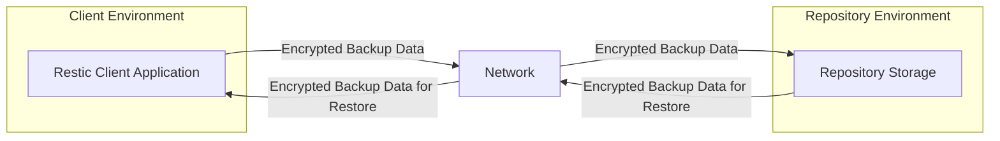
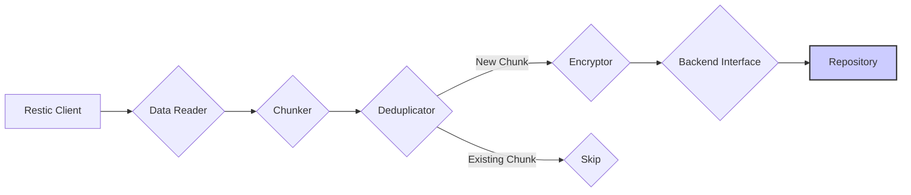
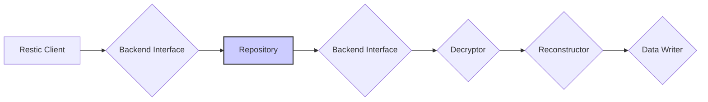

# Project Design Document: Restic Backup System

**Version:** 1.1
**Date:** October 26, 2023
**Author:** AI Software Architect

## 1. Introduction

This document provides an enhanced and detailed design overview of the Restic backup system. It elaborates on the key components, their interactions, and the overall architecture of the system. This document serves as a robust foundation for subsequent threat modeling activities, providing a comprehensive understanding of the system's inner workings.

## 2. Goals and Non-Goals

**Goals:**

* Provide a clear, comprehensive, and more detailed description of the Restic architecture.
* Identify the major components and their specific responsibilities and functionalities.
* Illustrate the data flow during both backup and restore operations with greater precision.
* Highlight key security considerations within the design, providing more context and examples.
* Serve as a well-defined and informative input for threat modeling exercises.

**Non-Goals:**

* Provide a low-level implementation guide or source code analysis.
* Cover every single feature, command-line option, or configuration parameter of Restic.
* Analyze the performance benchmarks or scalability characteristics of the system.
* Discuss the intricacies of the user interface or command-line interface usage in detail.

## 3. High-Level Architecture

The Restic system employs a client-server architecture where the client application, residing on the user's machine, performs backup and restore operations against a remote repository. This repository can be hosted on various storage backends.

**Components:**

* **Restic Client Application:** The command-line tool executed on the user's machine to initiate, manage, and monitor backup and restore operations. This is the primary interface for interacting with the Restic system.
* **Network:** The communication channel, typically an IP network, facilitating the secure transfer of data between the client and the repository. This network should ideally provide encryption in transit (e.g., TLS).
* **Repository:** The designated storage location where all backup data, including encrypted data chunks and metadata, is persistently stored. The repository's structure and access methods depend on the chosen backend.

## 4. Detailed Component Design

### 4.1. Restic Client Application

The Restic client is the core component responsible for orchestrating the backup and restore processes.

* **Responsibilities:**
    * **Data Acquisition:** Reading data from the specified source paths, including files and directories, to be backed up.
    * **Data Segmentation (Chunking):** Dividing the input data stream into variable-sized, content-defined chunks. This is crucial for deduplication.
    * **Deduplication Logic:** Identifying and eliminating redundant data chunks by comparing their cryptographic hashes. This minimizes storage space and bandwidth usage.
    * **Encryption and Decryption:** Encrypting data chunks and metadata before sending them to the repository and decrypting them upon retrieval.
    * **Repository Communication:** Interacting with the chosen repository backend using its specific API or protocol.
    * **Snapshot Management:** Creating, listing, tagging, and managing snapshots, which represent point-in-time backups.
    * **Data Restoration:** Retrieving encrypted data chunks and metadata from the repository and reconstructing the original data.
    * **Backup Integrity Verification:** Verifying the integrity of backups by checking cryptographic hashes of data chunks and metadata.

* **Key Internal Modules:**
    * **`Data Reader`:** Responsible for efficiently reading data from the specified source paths, handling file system interactions.
    * **`Chunker`:** Implements the content-defined chunking algorithm to divide the data stream into chunks.
    * **`Deduplicator`:** Maintains an index of existing chunks in the repository to identify duplicates.
    * **`Encryptor`:** Utilizes the configured encryption algorithm (AES-256-GCM by default) to encrypt data and metadata.
    * **`Backend Interface`:** Provides an abstraction layer for interacting with different repository backends (e.g., local disk, S3, SFTP).
    * **`Snapshot Manager`:** Handles the creation, listing, and deletion of snapshots, storing metadata about each backup.
    * **`Restore Manager`:** Orchestrates the retrieval and decryption of data chunks to restore files and directories.
    * **`Integrity Checker`:** Verifies the integrity of backup data by comparing stored hashes with recalculated hashes.
    * **`Key Manager`:**  Manages the encryption key derived from the user-provided password.

### 4.2. Repository

The repository serves as the persistent storage backend for the backup data. Its structure is logical, and the physical implementation depends on the chosen backend.

* **Responsibilities:**
    * **Encrypted Data Storage:** Storing encrypted data chunks received from the client.
    * **Metadata Storage:** Storing metadata about backups, including snapshots, trees (directory structures), and pack file information.
    * **Data Retrieval:** Providing access to stored data chunks and metadata when requested by the client during restore operations.
    * **Data Durability and Availability:** Ensuring the long-term durability and availability of the stored backup data (dependent on the backend's capabilities).

* **Logical Structure:**
    * **`data/`:** Contains encrypted data chunks, typically organized into pack files for efficient storage and retrieval.
    * **`index/`:** Contains index files that map chunk IDs to their locations within the pack files. This is crucial for efficient deduplication and retrieval.
    * **`snapshots/`:** Stores metadata about each backup snapshot, including timestamps, tags, and references to the root tree.
    * **`trees/`:** Contains metadata representing the directory structure of each snapshot, linking files and directories to their corresponding data chunks.
    * **`locks/`:** Used for implementing locking mechanisms to prevent concurrent modifications to the repository, ensuring data consistency.
    * **`config`:** Stores repository-level configuration information, such as the encryption parameters used for the repository.

* **Supported Backends (Examples with more detail):**
    * **Local Disk:** Stores data directly on the local file system of the machine where the repository is located.
    * **SFTP:** Utilizes the Secure File Transfer Protocol (SFTP) to store data on a remote server.
    * **AWS S3 (Simple Storage Service):** Leverages Amazon's scalable object storage service.
    * **Azure Blob Storage:** Utilizes Microsoft Azure's object storage solution.
    * **Google Cloud Storage:** Employs Google's object storage service.
    * **Rest Server:** Restic's own lightweight server implementation, allowing for a self-hosted repository over HTTP(S).

### 4.3. Network

The network provides the communication pathway between the Restic client and the repository. Security and reliability are key considerations for this component.

* **Responsibilities:**
    * **Reliable Data Transport:** Providing a reliable transport layer (typically TCP/IP) for transferring backup data and metadata.
    * **Secure Communication:** Ensuring the confidentiality and integrity of data in transit, ideally through the use of TLS/HTTPS encryption.

* **Considerations:**
    * **Latency:** Network latency can significantly impact the speed of backup and restore operations.
    * **Bandwidth:** Available network bandwidth affects the throughput of data transfer.
    * **Security:** Network security measures, such as firewalls and intrusion detection systems, are important to protect backup data during transmission.

## 5. Data Flow

### 5.1. Backup Operation (Detailed)

1. **`Restic Client`**: Initiates the backup process.
2. **`Data Reader`**: Reads data from the specified source files and directories.
3. **`Chunker`**: Divides the input data stream into content-defined chunks.
4. **`Deduplicator`**: Checks if the generated chunk already exists in the repository's index.
5. **`Encryptor`**: If the chunk is new, it's encrypted using the derived key.
6. **`Skip`**: If the chunk already exists, it's skipped to avoid redundant storage.
7. **`Backend Interface`**: Communicates with the configured repository backend to upload the encrypted chunk and update metadata.
8. **`Repository`**: Stores the received encrypted data chunk and updates its index.

### 5.2. Restore Operation (Detailed)

1. **`Restic Client`**: Initiates the restore process for a specific snapshot.
2. **`Backend Interface`**: Requests the necessary metadata (snapshot information, tree structure, chunk lists) from the repository.
3. **`Repository`**: Provides the requested metadata.
4. **`Backend Interface`**: Requests the necessary encrypted data chunks from the repository.
5. **`Decryptor`**: Decrypts the retrieved data chunks using the derived key.
6. **`Reconstructor`**: Assembles the decrypted chunks back into the original files and directories based on the retrieved metadata.
7. **`Data Writer`**: Writes the restored data to the specified destination on the client machine.

## 6. Security Considerations (Elaborated)

* **Encryption (AES-256-GCM):** Restic employs strong authenticated encryption using AES-256 in Galois/Counter Mode (GCM). This provides both confidentiality and integrity for data at rest within the repository and for metadata. The encryption key is derived from the user-provided password using the bcrypt key derivation function, which is resistant to brute-force attacks.
* **Authentication (Password-Based):** Access to the repository is primarily controlled by the encryption password. Anyone possessing the correct password can access, decrypt, and potentially modify the backups. This highlights the critical importance of choosing a strong and unique password and keeping it secure.
* **Data Integrity (SHA256 Hashing):** Restic utilizes SHA256 cryptographic hashes to ensure the integrity of data chunks and metadata. Before encryption, each chunk's hash is calculated and stored. During restore, these hashes are recalculated and compared to detect any data corruption or tampering, either during transit or at rest.
* **Key Management (User-Provided Password):** The security of the entire backup system hinges on the secrecy and strength of the user's password. Restic does not store the password directly. Instead, it uses the password to derive the encryption key. Loss of the password results in permanent loss of access to the backups. Secure password management practices are crucial.
* **Backend Security (Provider Responsibility):** The security of the repository is also dependent on the security measures implemented by the chosen backend provider (e.g., AWS, Azure, Google). This includes access control policies, encryption at rest and in transit provided by the platform, and physical security of the data centers. Users should choose reputable providers and configure appropriate security settings.
* **Client-Side Security (User Responsibility):** The security of the client machine is paramount. If the client machine is compromised (e.g., malware infection), the backup password could be exposed, potentially compromising the entire backup set. Users should employ strong security practices on their client machines, including up-to-date antivirus software and operating system patches.
* **Repository Locking (Concurrency Control):** Restic implements locking mechanisms to prevent concurrent modifications to the repository. This ensures data consistency and prevents corruption that could occur if multiple clients tried to write to the repository simultaneously.
* **Transport Security (TLS/HTTPS):** When communicating with remote repositories (e.g., over SFTP, REST Server, cloud storage APIs), Restic strongly encourages and often defaults to using TLS/HTTPS to encrypt data in transit, protecting it from eavesdropping and tampering.

## 7. Deployment Considerations (More Practical)

* **Client Installation and Configuration:** Restic is typically deployed by installing the command-line tool on each machine that needs to be backed up. Configuration involves specifying the repository location, backend type, and initial password.
* **Repository Initialization and Password Management:** The repository must be initialized with a strong, unique password before the first backup. Securely storing and managing this password is critical. Consider using password managers or secure key storage solutions.
* **Backend Selection and Configuration:** Choosing the appropriate backend depends on factors like cost, scalability, availability, and security requirements. Each backend has its own specific configuration parameters (e.g., S3 bucket name, access keys).
* **Backup Scheduling and Automation:** Backup operations are typically automated using system schedulers like `cron` (on Linux/macOS) or Task Scheduler (on Windows). Careful planning of backup schedules is important to balance data protection with system resource usage.
* **Monitoring and Alerting:** Implementing monitoring for backup success and failures is crucial. Tools or scripts can be used to check backup logs and send alerts in case of errors.
* **Disaster Recovery Planning:**  Consider the steps required to recover data in case of a disaster. This includes having a documented restore process and testing it periodically.
* **Regular Repository Maintenance:** Restic provides commands for repository maintenance, such as `prune` (to remove unused data) and `check` (to verify integrity). Regular maintenance helps optimize storage and ensure data integrity.

## 8. Future Considerations (Specific Enhancements)

* **Graphical User Interface (GUI):** Developing a user-friendly GUI to simplify backup and restore management for less technical users.
* **Multi-Factor Authentication (MFA) for Repository Access:** Implementing MFA to add an extra layer of security for accessing and modifying the repository, beyond just the password.
* **Improved Key Management Options:** Exploring more advanced key management solutions, such as integration with hardware security modules (HSMs) or key management services.
* **Centralized Management Console:** Developing a centralized console for managing multiple Restic clients and repositories.
* **Integration with Monitoring Systems:** Providing better integration with popular monitoring systems (e.g., Prometheus, Grafana) for enhanced observability.
* **Support for More Backend Types:** Expanding the number of supported storage backends to offer greater flexibility.
* **Advanced Retention Policies:** Implementing more sophisticated retention policies based on factors beyond just the number of snapshots.

This enhanced document provides a more detailed and comprehensive design overview of the Restic backup system, offering a deeper understanding of its components, data flows, and security considerations. This level of detail will be invaluable for conducting thorough threat modeling exercises.