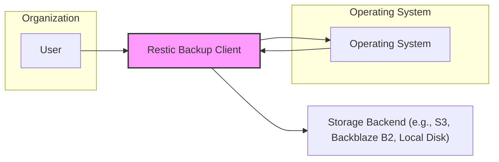
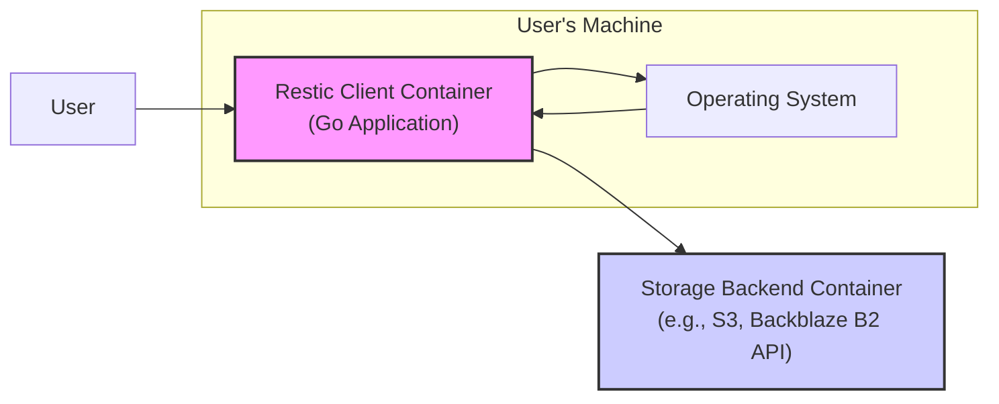
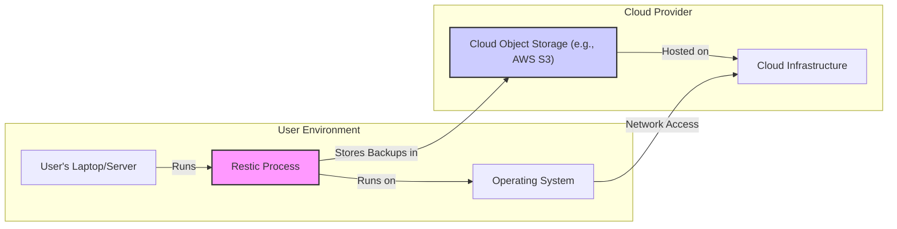
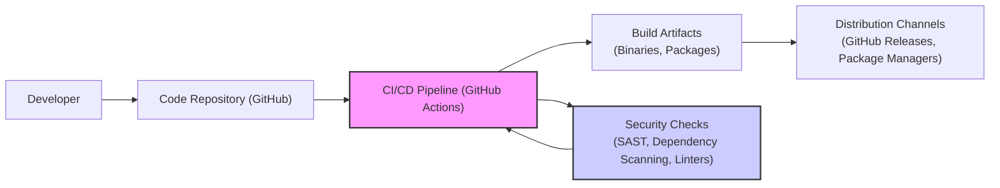

# BUSINESS POSTURE

This project, restic, addresses the critical business need for reliable and secure data backup and recovery. Data loss can lead to significant business disruption, financial losses, reputational damage, and regulatory non-compliance. Restic aims to mitigate these risks by providing a robust and user-friendly backup solution.

Business priorities and goals for restic are:
- Data Integrity: Ensuring backups are consistent, verifiable, and free from corruption.
- Data Confidentiality: Protecting backup data from unauthorized access through strong encryption.
- Reliability: Providing a dependable backup and restore process.
- Efficiency: Minimizing backup time and storage space usage.
- Usability: Offering a simple and intuitive user experience.
- Platform Compatibility: Supporting various operating systems and storage backends.

Most important business risks that need to be addressed:
- Data Loss: Failure to properly backup or restore data due to software bugs, operational errors, or infrastructure failures.
- Data Breach: Unauthorized access to backup data due to compromised encryption keys, vulnerabilities in restic, or insecure storage backend configurations.
- Data Corruption: Backup data becoming unusable due to bit rot, storage failures, or software errors.
- Availability Disruption: Inability to access or restore backups in a timely manner when needed.
- Compliance Violations: Failure to meet regulatory requirements related to data backup and retention.

# SECURITY POSTURE

Existing security controls:
- security control: Encryption of backup data at rest and in transit using AES-256-CTR and ChaCha20-Poly1305. Described in restic documentation and implemented in the source code.
- security control: Authentication to backup repositories using passwords or key files. Described in restic documentation and implemented in the source code.
- security control: Data integrity checks using content-addressable storage and cryptographic hashes (SHA256). Described in restic documentation and implemented in the source code.
- security control: Support for various secure storage backends, including cloud storage providers with their own security measures. Described in restic documentation.
- security control: Open source and publicly auditable codebase. Available on GitHub.

Accepted risks:
- accepted risk: User responsibility for secure key management and password protection. Restic relies on users to generate and securely store their encryption keys and passwords.
- accepted risk: Reliance on the security of chosen storage backend. Restic depends on the underlying storage provider for physical security and infrastructure security.
- accepted risk: Potential vulnerabilities in dependencies. Restic uses third-party libraries, which may contain security vulnerabilities.

Recommended security controls:
- security control: Implement automated vulnerability scanning of restic codebase and dependencies in CI/CD pipeline.
- security control: Conduct regular security audits and penetration testing of restic.
- security control: Provide guidance and best practices for users on secure key management and storage backend configuration.
- security control: Implement rate limiting and brute-force protection for repository access.
- security control: Consider adding support for hardware security modules (HSMs) or key management systems (KMS) for enhanced key protection.

Security requirements:
- Authentication:
    - Requirement: Restic must authenticate users or processes attempting to access or modify backup repositories.
    - Implementation: Password-based authentication and key file authentication are currently implemented.
    - Requirement: Authentication mechanism should be resistant to brute-force attacks.
    - Implementation: Consider implementing rate limiting and account lockout policies.
- Authorization:
    - Requirement: Restic must control access to backup repositories based on user roles or permissions (though currently restic is mostly single-user focused).
    - Implementation: Currently, authorization is implicitly tied to authentication - whoever has the password or key can access the repository. For future enhancements, consider role-based access control for shared repositories.
    - Requirement: Principle of least privilege should be applied.
    - Implementation: Restic client should only require necessary permissions to access storage backend.
- Input Validation:
    - Requirement: Restic must validate all user inputs to prevent injection attacks and other input-related vulnerabilities.
    - Implementation: Input validation should be performed on command-line arguments, configuration files, and data received from storage backends.
    - Requirement: Handle filenames and paths securely to prevent path traversal vulnerabilities.
    - Implementation: Sanitize and validate file paths to prevent access outside of allowed backup scope.
- Cryptography:
    - Requirement: Restic must use strong cryptography to protect the confidentiality and integrity of backup data.
    - Implementation: AES-256-CTR and ChaCha20-Poly1305 encryption are currently used. SHA256 hashing is used for data integrity.
    - Requirement: Cryptographic keys must be securely generated, stored, and managed.
    - Implementation: Restic relies on user-generated passwords or key files. Enhance user guidance on secure key management and consider KMS integration.
    - Requirement: Use TLS/HTTPS for communication with remote storage backends when applicable.
    - Implementation: Restic supports TLS for backends like rest-server and cloud storage providers.

# DESIGN

## C4 CONTEXT

Context Diagram Elements:

- Element:
    - Name: User
    - Type: Person
    - Description: Individual or system administrator responsible for initiating and managing backups and restores.
    - Responsibilities: Configuring restic, initiating backup and restore operations, managing encryption keys, and monitoring backup status.
    - Security controls: Responsible for secure password/key management. Access control to the system where restic is installed.

- Element:
    - Name: Restic Backup Client
    - Type: Software System
    - Description: The restic application itself, responsible for encrypting, compressing, and storing backup data, as well as restoring data from backups.
    - Responsibilities: Data backup and restore, encryption, decryption, data integrity, communication with storage backend, command-line interface.
    - Security controls: Encryption of data at rest and in transit, authentication to storage backend, input validation, secure handling of cryptographic keys in memory.

- Element:
    - Name: Storage Backend (e.g., S3, Backblaze B2, Local Disk)
    - Type: External System
    - Description: The storage location where backup data is stored. Can be cloud storage, network storage, or local storage.
    - Responsibilities: Data storage, data retrieval, data durability, access control (provided by the storage backend itself).
    - Security controls: Access control mechanisms provided by the storage backend (e.g., IAM roles, access keys, permissions), encryption at rest (depending on backend), physical security of storage infrastructure (depending on backend provider).

- Element:
    - Name: Operating System
    - Type: Software System
    - Description: The operating system on which restic client is running. Provides system resources and interfaces for restic to interact with hardware and other software.
    - Responsibilities: Providing execution environment for restic, file system access, network access, process management.
    - Security controls: Operating system level security controls such as user permissions, access control lists, security patches, and system hardening.

## C4 CONTAINER

Container Diagram Elements:

- Element:
    - Name: Restic Client Container
    - Type: Application
    - Description: This is the main restic application, written in Go. It handles all backup and restore logic, including encryption, data processing, and communication with the storage backend. It runs as a command-line application within the user's operating system.
    - Responsibilities: Command-line interface, backup scheduling and execution, data encryption and decryption, data chunking and deduplication, repository management, communication with storage backend API.
    - Security controls: Input validation of command-line arguments, secure handling of encryption keys in memory, implementation of cryptographic algorithms, secure communication with storage backend (TLS/HTTPS), access control to local files and resources.

- Element:
    - Name: Storage Backend Container (e.g., S3, Backblaze B2 API)
    - Type: Data Store / API
    - Description: Represents the interface to the chosen storage backend. This could be an API for cloud storage services like AWS S3 or Backblaze B2, or direct file system access for local or network storage. Restic interacts with this container to store and retrieve backup data.
    - Responsibilities: Providing API for object storage (for cloud backends) or file system operations (for local/network backends), managing data storage and retrieval, handling authentication and authorization for access to storage.
    - Security controls: Authentication and authorization mechanisms provided by the storage backend API (e.g., API keys, IAM roles), encryption at rest and in transit (depending on backend), access logging and monitoring provided by the backend service.

- Element:
    - Name: Operating System
    - Type: Infrastructure
    - Description: The operating system environment where the Restic Client Container runs. Provides necessary system calls and libraries for the application to function.
    - Responsibilities: Providing execution environment, managing system resources, providing file system and network access, enforcing system-level security policies.
    - Security controls: Operating system level security controls, such as user access control, process isolation, security updates, and system hardening.

## DEPLOYMENT

Deployment Architecture: Standalone Client with Cloud Storage Backend

Deployment Diagram Elements:

- Element:
    - Name: User's Laptop/Server
    - Type: Infrastructure
    - Description: Represents the physical or virtual machine where the user runs the restic client. This could be a personal laptop, a server in a data center, or a virtual machine in the cloud.
    - Responsibilities: Providing compute resources for running restic, network connectivity, local storage (if used as backup target).
    - Security controls: Physical security of the machine, operating system security hardening, access control to the machine, endpoint security software.

- Element:
    - Name: Restic Process
    - Type: Software Process
    - Description: An instance of the restic client application running on the user's machine. Responsible for executing backup and restore commands.
    - Responsibilities: Running backup and restore jobs, encrypting and decrypting data, communicating with storage backend.
    - Security controls: Process isolation provided by the operating system, secure coding practices within restic application, secure handling of credentials in memory.

- Element:
    - Name: Operating System
    - Type: Software
    - Description: The operating system installed on the user's machine, providing the runtime environment for the restic process.
    - Responsibilities: Process management, memory management, file system access, network stack.
    - Security controls: Operating system level security controls, such as user permissions, security patches, firewalls, and intrusion detection systems.

- Element:
    - Name: Cloud Object Storage (e.g., AWS S3)
    - Type: Infrastructure Service
    - Description: A cloud-based object storage service used as the backup destination. Provides scalable and durable storage.
    - Responsibilities: Storing backup data objects, providing data durability and availability, managing access control to stored objects.
    - Security controls: Access control policies (IAM), encryption at rest (server-side encryption), encryption in transit (HTTPS), logging and monitoring, physical security of cloud data centers.

- Element:
    - Name: Cloud Infrastructure
    - Type: Infrastructure
    - Description: The underlying infrastructure provided by the cloud provider that hosts the object storage service.
    - Responsibilities: Physical infrastructure, network infrastructure, power, cooling, physical security.
    - Security controls: Physical security of data centers, network security controls, infrastructure hardening, compliance certifications of the cloud provider.

## BUILD

Build Process Diagram:

Build Process Description:

- Developer: Developers write code, commit changes, and push them to the code repository.
    - Security controls: Developer workstations security, secure coding practices, code review process.

- Code Repository (GitHub): Hosts the source code of restic and its version history.
    - Security controls: Access control to the repository (authentication and authorization), branch protection, audit logging of repository activities.

- CI/CD Pipeline (GitHub Actions): Automates the build, test, and release process. In restic's case, GitHub Actions are used.
    - Security controls: Secure configuration of CI/CD pipeline, access control to CI/CD workflows and secrets, isolation of build environments, audit logging of CI/CD activities.

- Security Checks (SAST, Dependency Scanning, Linters): Automated security checks integrated into the CI/CD pipeline. These include:
    - Static Application Security Testing (SAST): Scans the source code for potential vulnerabilities.
    - Dependency Scanning: Checks for known vulnerabilities in third-party dependencies.
    - Linters: Enforce code quality and coding standards, which can indirectly improve security.
    - Security controls: Regularly updated vulnerability databases for dependency scanning, configuration of SAST tools to detect relevant vulnerability types, integration of security checks into the CI/CD pipeline to fail builds on обнаружение of critical issues.

- Build Artifacts (Binaries, Packages): The output of the build process, including executable binaries for different platforms and package files.
    - Security controls: Signing of build artifacts to ensure authenticity and integrity, secure storage of build artifacts before distribution.

- Distribution Channels (GitHub Releases, Package Managers): Mechanisms for distributing restic binaries and packages to users.
    - Security controls: Secure distribution channels (HTTPS), verification of signatures by users when downloading binaries, package manager security controls.

# RISK ASSESSMENT

Critical business process we are trying to protect:
- Data Backup and Recovery: Ensuring the ability to reliably backup and restore critical data to maintain business continuity and prevent data loss.

Data we are trying to protect and their sensitivity:
- User Data: Restic is designed to backup any type of user data, which can include highly sensitive information such as:
    - Personal Identifiable Information (PII): Names, addresses, social security numbers, financial details, medical records.
    - Intellectual Property: Trade secrets, proprietary algorithms, design documents, source code.
    - Business Critical Data: Financial records, customer databases, operational data, strategic plans.
    - Credentials and Secrets: API keys, passwords, certificates.

Sensitivity Level: High. The data backed up by restic can be highly sensitive and confidential. Unauthorized disclosure, modification, or loss of this data can have severe consequences for individuals and organizations.

# QUESTIONS & ASSUMPTIONS

Questions:
- What is the intended user base for restic? (Individuals, small businesses, large enterprises?) This will influence the risk appetite and security requirements.
- Are there any specific compliance requirements that restic needs to adhere to (e.g., GDPR, HIPAA, PCI DSS)?
- What is the expected lifespan of backups created with restic? (Retention policies, archival requirements).
- Are there any specific performance requirements for backup and restore operations?
- Is there a dedicated security team or individual responsible for restic project security?

Assumptions:
- BUSINESS POSTURE:
    - Data loss and data breaches are considered significant business risks.
    - Data confidentiality and integrity are high priorities.
    - Usability and efficiency are also important to encourage adoption.
- SECURITY POSTURE:
    - Users are expected to have some level of technical expertise to manage restic and their backups.
    - Security is a primary design consideration for restic.
    - Open source nature of restic is considered a security benefit through community review and auditability.
- DESIGN:
    - Restic is primarily used as a command-line tool.
    - Users are responsible for choosing and configuring their storage backend.
    - Encryption keys are managed by the users.
    - Deployment is typically on user-managed infrastructure or cloud environments.
    - Build process relies on GitHub Actions for CI/CD.