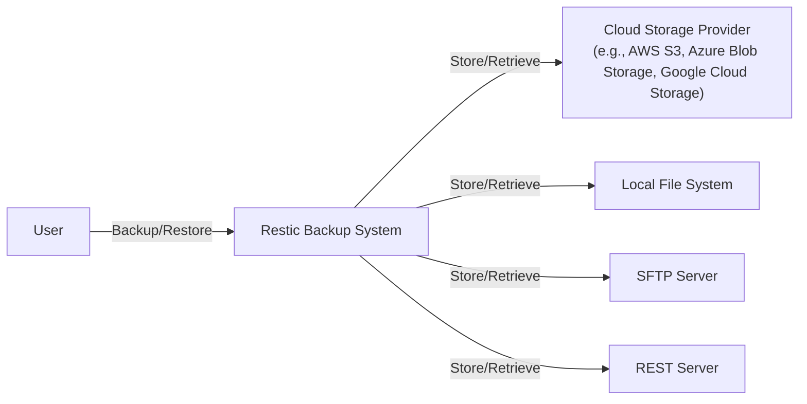
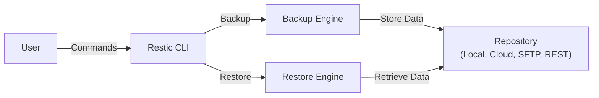
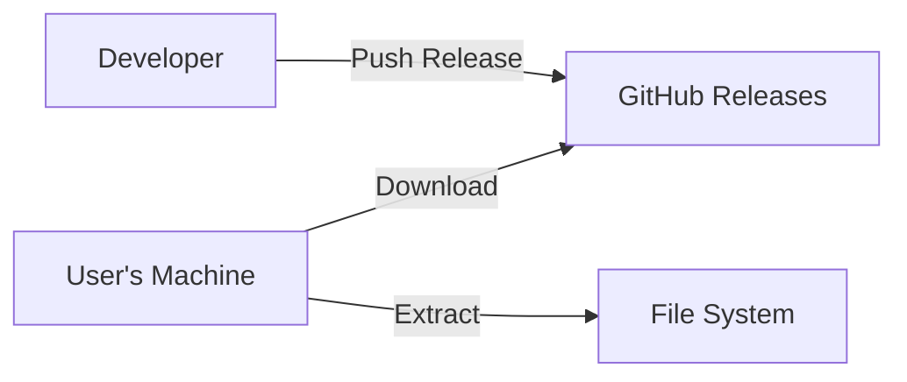
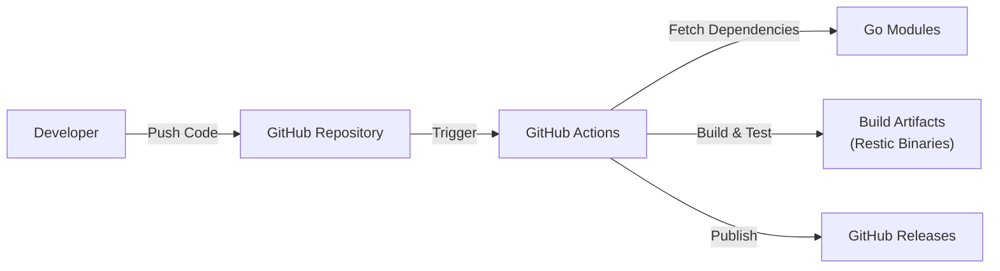

# Project Design Document: Restic

## BUSINESS POSTURE

Restic is a backup program designed to be fast, efficient, and secure. The business priorities and goals for Restic are centered around providing a reliable and user-friendly backup solution.

Priorities:

*   Data Integrity: Ensuring that backups are created and restored without corruption.
*   Security: Protecting backup data from unauthorized access and modification.
*   Efficiency: Minimizing storage space and bandwidth usage.
*   Ease of Use: Providing a simple and intuitive interface for users.
*   Cross-Platform Compatibility: Supporting various operating systems and cloud storage providers.
*   Open Source: Maintaining transparency and community involvement.

Business Risks:

*   Data Loss: Failure to properly back up or restore data, leading to potential business disruption.
*   Data Breach: Unauthorized access to sensitive backup data.
*   Reputational Damage: Loss of user trust due to data loss, security breaches, or poor performance.
*   Compliance Violations: Failure to meet regulatory requirements for data protection.
*   Operational Inefficiency: Excessive resource consumption (storage, bandwidth) leading to increased costs.

## SECURITY POSTURE

Existing Security Controls:

*   security control: Encryption at Rest: Restic encrypts all data before it leaves the client machine using AES-256 in CTR mode with a unique key derived from a user-provided password. (Implemented in Restic's core cryptographic functions.)
*   security control: Encryption in Transit: Data is encrypted during transmission to the storage backend. (Implemented using HTTPS for cloud providers and SSH for SFTP.)
*   security control: Data Integrity Verification: Restic uses cryptographic hashing (SHA-256) to detect data corruption and tampering. (Implemented in Restic's core data handling functions.)
*   security control: Authentication: Access to repositories requires a password. (Implemented in Restic's repository access control.)
*   security control: Open Source Codebase: The open-source nature of Restic allows for community scrutiny and auditing of the code. (Available on GitHub.)

Accepted Risks:

*   accepted risk: Single Point of Failure (Password): If the user forgets their password, the data is unrecoverable.
*   accepted risk: Reliance on Third-Party Storage: Security of the backup data ultimately depends on the security of the chosen storage provider (e.g., cloud provider, SFTP server).
*   accepted risk: Potential for Supply Chain Attacks: Although mitigated by open-source review, there's a theoretical risk of malicious code being introduced into the build process.

Recommended Security Controls:

*   security control: Implement Multi-Factor Authentication (MFA): Add an option for MFA to enhance repository access security.
*   security control: Integrate with Hardware Security Modules (HSMs): Allow users to store encryption keys in HSMs for increased security.
*   security control: Formal Security Audits: Conduct regular, independent security audits of the codebase.

Security Requirements:

*   Authentication:
    *   Users must authenticate with a strong, unique password to access and manage backups.
    *   Consider supporting multi-factor authentication (MFA) for enhanced security.
*   Authorization:
    *   Access control mechanisms should restrict unauthorized access to backup repositories and data.
    *   Consider role-based access control (RBAC) for managing permissions in multi-user environments.
*   Input Validation:
    *   All user inputs, including file paths, repository locations, and configuration parameters, must be validated to prevent injection attacks and other vulnerabilities.
*   Cryptography:
    *   All data must be encrypted at rest and in transit using strong, industry-standard cryptographic algorithms (AES-256).
    *   Key management must be secure, protecting encryption keys from unauthorized access.
    *   Cryptographic operations must be implemented correctly to avoid vulnerabilities.

## DESIGN

### C4 CONTEXT

Element Descriptions:

*   Element:
    *   Name: User
    *   Type: Person
    *   Description: A person who uses Restic to back up and restore their data.
    *   Responsibilities: Initiates backup and restore operations, provides credentials, manages configuration.
    *   Security controls: Password protection, potential MFA.

*   Element:
    *   Name: Restic Backup System
    *   Type: Software System
    *   Description: The Restic backup program itself.
    *   Responsibilities: Handles data encryption, compression, deduplication, storage, and retrieval.
    *   Security controls: Encryption at rest, data integrity checks, authentication.

*   Element:
    *   Name: Cloud Storage Provider
    *   Type: External System
    *   Description: A cloud-based storage service (e.g., AWS S3, Azure Blob Storage, Google Cloud Storage).
    *   Responsibilities: Stores backup data.
    *   Security controls: Provider-managed security controls (e.g., access control, encryption).

*   Element:
    *   Name: Local File System
    *   Type: External System
    *   Description: The local file system on the user's machine.
    *   Responsibilities: Can be a source of data to be backed up or a destination for backups.
    *   Security controls: Operating system-level file permissions.

*   Element:
    *   Name: SFTP Server
    *   Type: External System
    *   Description: A server supporting the Secure File Transfer Protocol.
    *   Responsibilities: Stores backup data.
    *   Security controls: SSH encryption, user authentication.

*   Element:
    *   Name: REST Server
    *   Type: External System
    *   Description: A server supporting the Restic REST backend protocol.
    *   Responsibilities: Stores backup data.
    *   Security controls: HTTPS encryption, user authentication.

### C4 CONTAINER

Element Descriptions:

*   Element:
    *   Name: User
    *   Type: Person
    *   Description: A person who uses Restic to back up and restore their data.
    *   Responsibilities: Initiates backup and restore operations, provides credentials, manages configuration.
    *   Security controls: Password protection, potential MFA.

*   Element:
    *   Name: Restic CLI
    *   Type: Application
    *   Description: The command-line interface for interacting with Restic.
    *   Responsibilities: Parses user commands, handles user input, displays output.
    *   Security controls: Input validation.

*   Element:
    *   Name: Backup Engine
    *   Type: Component
    *   Description: The component responsible for creating backups.
    *   Responsibilities: Reads data from the source, encrypts, compresses, deduplicates, and sends data to the repository.
    *   Security controls: Encryption at rest, data integrity checks.

*   Element:
    *   Name: Restore Engine
    *   Type: Component
    *   Description: The component responsible for restoring backups.
    *   Responsibilities: Reads data from the repository, decrypts, verifies integrity, and writes data to the destination.
    *   Security controls: Data integrity checks, decryption.

*   Element:
    *   Name: Repository
    *   Type: Data Store
    *   Description: The storage location for backup data. Can be local, cloud-based, SFTP, or REST.
    *   Responsibilities: Stores backup data.
    *   Security controls: Dependent on the storage backend (e.g., cloud provider security, SFTP server security).

### DEPLOYMENT

Restic is a standalone executable, making deployment straightforward. It can be deployed in several ways:

1.  Manual Download and Installation: Users download the pre-compiled binary for their operating system and place it in a directory within their PATH.
2.  Package Managers: Restic can be installed via package managers like apt (Debian/Ubuntu), yum (Fedora/CentOS/RHEL), brew (macOS), and Chocolatey (Windows).
3.  Docker Container: Restic can be run within a Docker container.
4.  Build from Source: Users can compile Restic from source code.

Chosen Deployment Method (Example: Manual Download and Installation on Linux):

Element Descriptions:

*   Element:
    *   Name: Developer
    *   Type: Person
    *   Description: Restic developers who create and publish releases.
    *   Responsibilities: Write code, build releases, publish releases.
    *   Security controls: Code signing (potentially).

*   Element:
    *   Name: GitHub Releases
    *   Type: Platform
    *   Description: The release hosting platform for Restic.
    *   Responsibilities: Stores and serves Restic releases.
    *   Security controls: GitHub's platform security.

*   Element:
    *   Name: User's Machine
    *   Type: Machine
    *   Description: The user's computer where Restic will be deployed.
    *   Responsibilities: Downloads, extracts, and runs Restic.
    *   Security controls: Operating system security, user permissions.

*   Element:
    *   Name: File System
    *   Type: Data Store
    *   Description: The location on the user's machine where the Restic binary is placed.
    *   Responsibilities: Stores the Restic executable.
    *   Security controls: File system permissions.

### BUILD

Restic's build process is automated using Go modules and GitHub Actions.

Build Process Description:

1.  Developers push code changes to the Restic repository on GitHub.
2.  GitHub Actions workflows are triggered by these pushes.
3.  The workflow sets up the Go environment.
4.  Go Modules are used to manage dependencies.
5.  The code is built and tested. Static analysis (SAST) using linters like `go vet`, `staticcheck` and `govulncheck` are implicitly part of the Go build process and can be explicitly run as separate steps.
6.  If the build and tests are successful, build artifacts (Restic binaries for various operating systems) are created.
7.  These artifacts are then published to GitHub Releases.

Security Controls in Build Process:

*   security control: Dependency Management: Go Modules ensure that dependencies are tracked and versioned, reducing the risk of using vulnerable libraries.
*   security control: Automated Build: GitHub Actions provides a consistent and reproducible build environment.
*   security control: Static Analysis: Go's built-in tools and linters perform static analysis to identify potential security vulnerabilities.
*   security control: Code Signing (Potentially): Restic releases could be digitally signed to ensure their authenticity and integrity.

## RISK ASSESSMENT

Critical Business Processes:

*   Data Backup: Ensuring that data is regularly and reliably backed up.
*   Data Restoration: Ensuring that data can be quickly and completely restored in case of data loss.
*   Business Continuity: Minimizing downtime and data loss in the event of a disaster.

Data Sensitivity:

*   Backup Data: The data being backed up can range from non-sensitive to highly sensitive, depending on the user and their data. This could include personal information, financial data, intellectual property, and other confidential information. The sensitivity of the data is determined by the user, not by Restic itself. Restic treats all data as potentially sensitive and encrypts it accordingly.

## QUESTIONS & ASSUMPTIONS

Questions:

*   Are there any specific compliance requirements (e.g., GDPR, HIPAA) that need to be considered?
*   What is the expected scale of usage (number of users, data volume)?
*   Are there any existing security policies or guidelines that need to be followed?
*   What level of support will be provided for different storage backends?
*   What is the process for handling security vulnerabilities discovered in Restic?

Assumptions:

*   BUSINESS POSTURE: Users are responsible for choosing a strong password and managing their encryption keys securely.
*   BUSINESS POSTURE: Users are responsible for the security of their chosen storage backend.
*   SECURITY POSTURE: The underlying operating system and network infrastructure are secure.
*   DESIGN: Restic's default cryptographic settings are sufficient for most users.
*   DESIGN: Users will follow best practices for secure software deployment and usage.