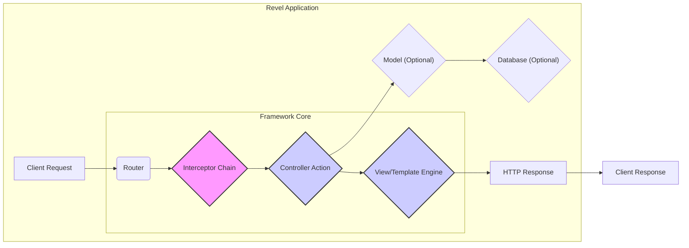
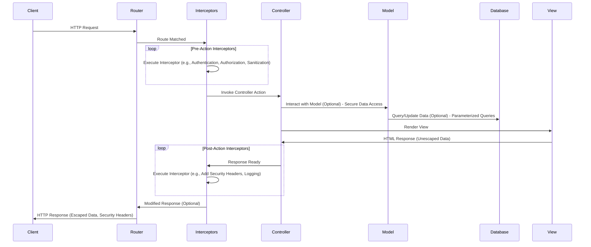

## Project Design Document: Revel Web Framework (Improved)

**1. Introduction**

This document provides an enhanced and more detailed architectural design of the Revel web framework, an open-source, full-stack web framework for the Go programming language. This improved document aims to serve as a robust foundation for subsequent threat modeling activities, offering a deeper understanding of the framework's intricate components, data flow, and interactions. The target audience remains security engineers, developers, and anyone involved in assessing the security posture of applications built with Revel. This version includes more specific details relevant to security analysis.

**2. Project Overview**

Revel is engineered as a highly productive and convention-over-configuration web framework for Go, drawing inspiration from frameworks like Ruby on Rails and Django. Its goal is to provide a comprehensive and integrated suite of tools and features essential for building modern web applications efficiently. This includes robust routing, controller management, model handling, a flexible templating engine, and comprehensive testing capabilities. Revel prioritizes developer efficiency by minimizing boilerplate code and promoting a streamlined development experience.

**3. Architectural Design**

The Revel framework adheres to the Model-View-Controller (MVC) architectural pattern, augmented with additional components that enrich its functionality and provide extensibility. The core components and their interactions are illustrated below, with a focus on points relevant to security considerations:

**3.1. Key Components (Detailed):**

*   **Router:**
    *   **Functionality:**  The central dispatcher for incoming HTTP requests. It maps URLs to specific controller actions based on a defined set of routes.
    *   **Configuration:** Routes are typically defined in a `routes` file using a specific syntax. This file dictates how URLs are parsed and which controller and action should handle them.
    *   **Parameter Extraction:**  The router can extract parameters from the URL path or query string and pass them to the controller action. This is a critical point for input validation.
    *   **Reverse Routing:**  Allows generating URLs dynamically based on route names, which helps maintain consistency and reduces hardcoding of URLs.
    *   **Security Relevance:**  Misconfigured routes can expose unintended endpoints. Lack of input sanitization on extracted parameters can lead to injection vulnerabilities.

*   **Interceptor Chain:**
    *   **Functionality:** A pipeline of functions (interceptors or middleware) that execute before and after a controller action. This allows for implementing cross-cutting concerns.
    *   **Order of Execution:** Interceptors are executed in a predefined order, which is crucial for ensuring security checks are performed correctly.
    *   **Common Uses:** Authentication, authorization, logging, request/response modification, setting security headers.
    *   **Types of Interceptors:** Revel supports different types of interceptors, including those that run before the action, after the action, or around the action.
    *   **Security Relevance:**  Vulnerabilities in interceptor logic can compromise the entire application. Incorrect ordering can lead to bypasses of security checks. Improperly implemented authentication or authorization interceptors are critical security flaws.

*   **Controller:**
    *   **Functionality:**  Receives requests from the router (after passing through the interceptor chain) and orchestrates the application logic to handle them.
    *   **Action Methods:** Contains specific methods (actions) that correspond to different routes and handle the business logic for those requests.
    *   **Model Interaction:**  Controllers often interact with models to retrieve, create, update, or delete data.
    *   **View Rendering:**  Controllers select the appropriate view/template and pass data to it for rendering the response.
    *   **Input Handling:** Responsible for receiving and processing input from the request (e.g., form data, query parameters). This is a primary area for security vulnerabilities if not handled correctly.
    *   **Security Relevance:**  Controllers are a prime target for attacks due to their direct interaction with user input. Lack of input validation, improper authorization checks, and insecure data handling are common vulnerabilities.

*   **Model:**
    *   **Functionality:** Represents the data structure of the application and encapsulates the logic for interacting with the underlying data storage (often a database).
    *   **Data Access Layer:** Provides an abstraction layer for data access, making the application more maintainable and testable.
    *   **Database Agnostic:** While often used with databases, Revel's model layer can interact with various data sources.
    *   **Object-Relational Mapping (ORM) Considerations:** If an ORM is used (though not strictly part of Revel core), it introduces its own set of security considerations.
    *   **Security Relevance:**  While controllers are the primary entry point, models play a role in data integrity and security. Improperly implemented models can lead to data breaches or manipulation.

*   **View/Template Engine:**
    *   **Functionality:** Responsible for rendering dynamic web pages by combining templates with data provided by the controller.
    *   **Template Language:** Revel uses its own template engine based on Go's `html/template` package.
    *   **Dynamic Content Generation:** Allows embedding Go code within templates to generate dynamic content.
    *   **Security Relevance:**  A major source of Cross-Site Scripting (XSS) vulnerabilities if user-provided data is not properly escaped before being rendered. Server-Side Template Injection (SSTI) is a risk if template code is dynamically generated based on user input.

*   **Session Management:**
    *   **Functionality:** Provides mechanisms for managing user sessions, allowing the application to maintain state between requests.
    *   **Storage Backends:** Supports various session storage backends, including in-memory, cookie-based, and database storage. The choice of backend has security implications.
    *   **Session ID Generation:** The method used to generate session IDs is critical for security. Weak or predictable IDs can be easily compromised.
    *   **Session Hijacking Prevention:** Mechanisms to prevent session hijacking, such as secure cookies (HttpOnly, Secure flags) and proper session invalidation.
    *   **Security Relevance:**  Insecure session management is a common vulnerability that can lead to unauthorized access and account takeover.

*   **Configuration Management:**
    *   **Functionality:**  Allows configuring the application's behavior through configuration files (typically `conf/app.conf`).
    *   **Configuration Sources:** Supports different configuration sources and environments (e.g., development, production).
    *   **Security Relevance:**  Sensitive information (e.g., database credentials, API keys, secret keys) stored insecurely in configuration files is a significant risk. Default configurations should be reviewed for security implications.

*   **Testing Framework:**
    *   **Functionality:** Provides tools and utilities for writing various types of tests (unit, functional, integration).
    *   **Security Testing:**  While not a core security component, a robust testing framework is essential for identifying security vulnerabilities early in the development process.
    *   **Security Relevance:**  Writing specific security tests (e.g., testing for XSS, SQL injection) is crucial for ensuring the application's security.

*   **Command-Line Interface (CLI):**
    *   **Functionality:** Offers commands for common development and management tasks, such as creating new projects, running the application, generating code, and managing dependencies.
    *   **Security Relevance:**  Care should be taken with CLI commands that interact with sensitive data or system resources. Improperly secured CLI access can be a vulnerability.

**3.2. Data Flow (Detailed with Security Focus):**

The typical request lifecycle within a Revel application, highlighting security-relevant steps:

1. **Client Request:** A user or system sends an HTTP request to the Revel application. This is the initial point of potential attack vectors.
2. **Router:** The Router receives the request and matches the URL against the defined routes. **Security Note:**  Ensure routes are correctly defined and do not expose unintended functionality.
3. **Interceptor Chain (Pre-Action):** Configured interceptors execute in order *before* the controller action. **Security Note:** This is where authentication, authorization, input sanitization, and setting security headers should ideally occur. Improperly implemented interceptors can introduce vulnerabilities or bypass security checks.
4. **Controller Action:** The Router invokes the corresponding action method in the designated controller. **Security Note:** This is where the core application logic resides and where input validation and secure data handling are paramount.
5. **Model Interaction (Optional):** The controller action may interact with models to retrieve or manipulate data. **Security Note:** Ensure models use parameterized queries or ORM features that prevent SQL injection. Enforce data access controls at this level.
6. **Database Interaction (Optional):** Models may interact with a database to persist or retrieve data. **Security Note:** Secure database credentials and proper database configuration are essential.
7. **View Rendering:** The controller action selects a view/template and passes data to it. The template engine renders the HTML response. **Security Note:**  Data passed to the template engine must be properly escaped to prevent XSS vulnerabilities.
8. **Interceptor Chain (Post-Action):** Configured interceptors execute in reverse order *after* the controller action. **Security Note:** This can be used for tasks like logging, adding final security headers, or modifying the response.
9. **HTTP Response:** The rendered HTML (or other response format) is sent back to the client. **Security Note:** Ensure appropriate security headers are set in the response.
10. **Client Response:** The client receives and processes the response.

**4. Security Considerations (Detailed for Threat Modeling)**

This section expands on the initial security considerations, providing more specific examples of potential threats and vulnerabilities associated with each component, which is crucial for effective threat modeling.

*   **Router Vulnerabilities:**
    *   **Unprotected Routes:**  Routes that expose administrative or sensitive functionality without proper authentication or authorization.
    *   **Parameter Tampering:**  Manipulating route parameters to access unintended resources or trigger errors.
    *   **Denial of Service (DoS):**  Crafting requests with excessively long or malformed parameters to overwhelm the router.
    *   **Route Injection:**  In some cases, vulnerabilities in the routing logic could allow attackers to inject or manipulate routes.

*   **Interceptor Security:**
    *   **Authentication Bypass:**  Flaws in authentication interceptors allowing unauthorized access.
    *   **Authorization Failures:**  Incorrectly implemented authorization interceptors granting access to resources the user should not have.
    *   **Input Sanitization Issues:**  Interceptors failing to properly sanitize input, leading to injection vulnerabilities later in the request lifecycle.
    *   **Security Header Misconfiguration:**  Interceptors setting incorrect or missing security headers.
    *   **Logging Sensitive Information:**  Interceptors inadvertently logging sensitive data.

*   **Controller Security:**
    *   **Cross-Site Scripting (XSS):**  Failing to properly escape user input before rendering it in views.
    *   **SQL Injection:**  Constructing database queries using unsanitized user input.
    *   **Command Injection:**  Executing arbitrary system commands based on user input.
    *   **Insecure Direct Object References (IDOR):**  Exposing internal object IDs without proper authorization checks, allowing users to access resources they shouldn't.
    *   **Mass Assignment Vulnerabilities:**  Allowing users to modify unintended model attributes through request parameters.
    *   **CSRF (Cross-Site Request Forgery):**  Lack of protection against malicious requests originating from other websites.
    *   **Open Redirects:**  Redirecting users to arbitrary URLs based on user input.

*   **Model Security:**
    *   **Data Integrity Issues:**  Flaws in model logic leading to inconsistent or corrupted data.
    *   **Mass Data Exposure:**  Models inadvertently exposing more data than necessary.
    *   **Lack of Input Validation at Model Level:**  While controllers should handle initial validation, models should also enforce data integrity rules.

*   **View/Template Engine Security:**
    *   **Cross-Site Scripting (XSS):**  The primary security concern. Failure to escape user-provided data in templates.
    *   **Server-Side Template Injection (SSTI):**  Allowing attackers to inject malicious code into templates, leading to remote code execution.

*   **Session Management Security:**
    *   **Session Fixation:**  Allowing attackers to set a user's session ID.
    *   **Session Hijacking:**  Stealing a user's session ID through various means (e.g., XSS, network sniffing).
    *   **Predictable Session IDs:**  Using weak algorithms for generating session IDs.
    *   **Insecure Session Storage:**  Storing session data in a way that is easily accessible to attackers.
    *   **Lack of Session Expiration:**  Sessions remaining active for too long, increasing the window of opportunity for attack.
    *   **Insecure Logout Mechanisms:**  Failing to properly invalidate sessions upon logout.

*   **Configuration Security:**
    *   **Exposed Credentials:**  Storing database passwords, API keys, and other secrets in plain text in configuration files.
    *   **Insecure Default Settings:**  Using default configurations that have known security vulnerabilities.
    *   **Lack of Environment-Specific Configurations:**  Using the same configurations for development and production environments.

*   **Dependency Management:**
    *   **Using Vulnerable Dependencies:**  Including third-party libraries with known security flaws.
    *   **Outdated Dependencies:**  Failing to update dependencies, leaving known vulnerabilities unpatched.

*   **Error Handling:**
    *   **Information Disclosure:**  Displaying verbose error messages that reveal sensitive information about the application's internals.
    *   **Denial of Service (DoS):**  Exploiting error handling mechanisms to cause the application to crash or become unresponsive.

*   **CLI Security:**
    *   **Unauthorized Access:**  Lack of proper authentication or authorization for accessing CLI commands.
    *   **Command Injection:**  Vulnerabilities in CLI commands that allow attackers to execute arbitrary system commands.
    *   **Exposure of Sensitive Information:**  CLI commands that display sensitive data without proper safeguards.

**5. Deployment Considerations (Security Focused)**

Revel applications, when deployed, require careful consideration of security best practices:

*   **Secure Server Configuration:**
    *   **Operating System Hardening:**  Applying security patches, disabling unnecessary services, and configuring firewalls.
    *   **Principle of Least Privilege:**  Running the application with the minimum necessary privileges.

*   **SSL/TLS Configuration:**
    *   **HTTPS Enforcement:**  Ensuring all communication is encrypted using HTTPS.
    *   **Strong Cipher Suites:**  Configuring the web server to use strong and up-to-date cipher suites.
    *   **HSTS (HTTP Strict Transport Security):**  Enabling HSTS to force browsers to always use HTTPS.

*   **Reverse Proxy Security:**
    *   **Web Application Firewall (WAF):**  Using a WAF to protect against common web attacks.
    *   **Rate Limiting:**  Implementing rate limiting to prevent brute-force attacks and DoS.
    *   **Security Headers:**  Configuring the reverse proxy to add security headers (e.g., Content-Security-Policy, X-Frame-Options, X-Content-Type-Options).

*   **Containerization Security:**
    *   **Secure Base Images:**  Using minimal and secure base images for Docker containers.
    *   **Vulnerability Scanning:**  Regularly scanning container images for vulnerabilities.
    *   **Principle of Least Privilege for Containers:**  Running containers with the minimum necessary privileges.

*   **Regular Security Updates:**
    *   Keeping the operating system, Go runtime, Revel framework, and all dependencies up-to-date with the latest security patches.

**6. Dependencies (Security Implications)**

Revel's reliance on external Go packages introduces potential security considerations:

*   **`golang.org/x/net/websocket`:**  Vulnerabilities in WebSocket implementations can lead to various attacks.
*   **`github.com/robfig/cron`:**  If cron jobs interact with sensitive data or external systems, vulnerabilities in this library could be exploited.
*   **Database Drivers (e.g., `github.com/lib/pq`, `github.com/go-sql-driver/mysql`):**  Vulnerabilities in database drivers can lead to SQL injection or other database-related attacks.
*   **Session Management Libraries (if using external stores):**  Security flaws in these libraries can compromise session security.
*   **Other Third-Party Libraries:**  Any external library used by Revel or the application built on it can introduce vulnerabilities. It's crucial to keep track of and update these dependencies regularly.

**7. Future Considerations (Security Enhancements)**

Potential future development areas for Revel to enhance security:

*   **Built-in Rate Limiting:**  Providing a built-in mechanism for rate limiting requests.
*   **Enhanced CSRF Protection:**  Strengthening the default CSRF protection mechanisms.
*   **Improved Input Validation and Sanitization Libraries:**  Offering more robust tools for input validation and sanitization.
*   **More Granular Authorization Controls:**  Providing more fine-grained control over access to resources.
*   **Security Auditing Tools:**  Integrating tools for security auditing and vulnerability scanning.
*   **Secure Defaults:**  Ensuring secure default configurations for all components.

**8. Conclusion**

This improved design document provides a more in-depth and security-focused overview of the Revel web framework's architecture and key components. By detailing the data flow and elaborating on potential threats and vulnerabilities, this document serves as a valuable resource for conducting thorough threat modeling. Understanding these architectural nuances and potential security pitfalls is essential for building secure and resilient web applications with Revel.