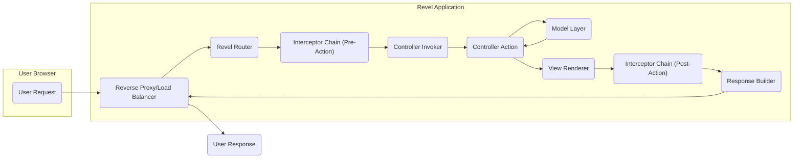
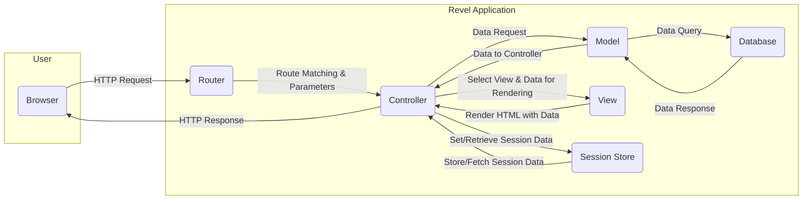

# Project Design Document: Revel Web Framework - Improved

**Version:** 1.1
**Date:** October 26, 2023
**Author:** AI Software Architect

## 1. Introduction

This document provides an enhanced architectural design of the Revel web framework, an open-source, full-stack web framework written in Go. This document is specifically crafted to serve as a foundation for subsequent threat modeling activities, offering a comprehensive understanding of the system's components, their interactions, and the flow of data. The goal is to provide the necessary context for identifying potential security vulnerabilities.

## 2. Goals and Objectives

*   To present a clear, concise, and detailed architectural overview of the Revel web framework, emphasizing security-relevant aspects.
*   To thoroughly identify key components and articulate their specific responsibilities within the framework, with a focus on potential security implications.
*   To meticulously illustrate the typical request lifecycle and data flow within a Revel application, highlighting data transformation and potential points of vulnerability.
*   To clearly outline external dependencies and integration points, categorizing them by their potential security impact.
*   To serve as a robust and actionable basis for identifying and analyzing potential security vulnerabilities during threat modeling sessions.

## 3. System Overview

Revel is a productive, full-stack web framework for the Go language, adhering to the Model-View-Controller (MVC) architectural pattern. It aims to provide a rich set of features out-of-the-box, minimizing the need for extensive external libraries for common web development tasks. This "batteries-included" approach simplifies development but also necessitates a thorough understanding of its internal components for security analysis.

### 3.1. Key Features

*   **Convention over Configuration:**  Promotes rapid development through sensible defaults and established naming conventions.
*   **Hot Code Reload:**  Facilitates a faster development cycle by automatically recompiling and reloading code changes.
*   **Comprehensive Routing:**  A robust and flexible router for mapping URLs to specific controller actions.
*   **Template Engine:**  An integrated template engine for rendering dynamic HTML content.
*   **Form Handling and Validation:**  Built-in mechanisms for processing form submissions and validating user input.
*   **Internationalization (i18n):**  Supports the development of multilingual applications.
*   **Testing Framework:**  Integrated capabilities for writing and executing unit and functional tests.
*   **Job Scheduling:**  Allows for the scheduling and execution of background tasks.
*   **WebSockets:**  Provides support for real-time, bidirectional communication.
*   **Mailer:**  Functionality for sending email messages directly from the application.
*   **Caching:**  An abstraction layer for utilizing various caching backends.
*   **Session Management:**  Handles the creation, storage, and management of user sessions.
*   **Security Features:** Includes built-in protections against common web vulnerabilities such as Cross-Site Request Forgery (CSRF).

### 3.2. Architectural Layers

Revel applications are logically structured into the following layers, each with distinct responsibilities:

*   **Model:** Encapsulates the data structures and business logic of the application. It interacts with data sources and performs data manipulation.
*   **View:** Responsible for the presentation layer, typically rendering HTML templates to display information to the user.
*   **Controller:** Acts as an intermediary, handling incoming requests, interacting with the Model to retrieve or modify data, and selecting the appropriate View to render the response.

### 3.3. Core Components

*   **Router:**  The central dispatch mechanism, responsible for analyzing incoming HTTP requests and mapping them to specific controller actions based on defined routes.
*   **Controller Invoker:**  Responsible for instantiating the appropriate controller and executing the target action method determined by the Router.
*   **Action Arguments:**  Handles the process of parsing and binding request parameters (from the URL, form data, etc.) to the arguments of the controller action method.
*   **Template Engine:**  Parses and renders template files, injecting data provided by the controller to generate dynamic HTML output.
*   **Session Manager:**  Manages user sessions, including the creation, storage, retrieval, and invalidation of session data.
*   **Interceptor Chain:**  Provides a powerful mechanism to intercept requests before and after they reach the controller action, enabling the implementation of cross-cutting concerns like authentication, authorization, logging, and request modification.
*   **Validation Engine:**  Enforces predefined validation rules on incoming data, ensuring data integrity and preventing invalid data from being processed.
*   **Configuration Manager:**  Loads and manages application configuration settings from various sources, providing a centralized point for accessing application parameters.
*   **Mailer:**  Handles the composition and sending of email messages, potentially integrating with external SMTP servers or email services.
*   **WebSocket Handler:**  Manages WebSocket connections, facilitating real-time communication between the server and clients.
*   **Job Scheduler:**  Executes scheduled background tasks, enabling asynchronous processing and automation.

## 4. Detailed Component Design

This section provides a more granular view of the key components and their interactions, emphasizing aspects relevant to security.

### 4.1. Request Handling Lifecycle

**Detailed Description of the Request Flow:**

*   **User Request ('User Request'):** A user initiates an HTTP request via their web browser or other client. This request can be of various types (GET, POST, PUT, DELETE, etc.) and may contain data in the URL, headers, or body.
*   **Reverse Proxy/Load Balancer ('Reverse Proxy/Load Balancer'):**  Incoming requests often first pass through a reverse proxy or load balancer. This component can handle tasks such as SSL/TLS termination, load distribution across multiple application instances, caching, and basic security filtering (e.g., blocking known malicious IPs).
*   **Revel Router ('Revel Router'):** The core routing component receives the request and attempts to match the request URL against the defined routes. This process involves pattern matching and parameter extraction. **Potential vulnerability:** Misconfigured routes or overly permissive patterns could lead to unintended access to resources.
*   **Interceptor Chain (Pre-Action) ('Interceptor Chain (Pre-Action)'):** Before the target controller action is executed, a chain of interceptors can process the request. This is a crucial point for implementing security measures like authentication (verifying user identity), authorization (checking user permissions), logging, input sanitization, and request modification. **Potential vulnerability:** Improperly implemented or missing interceptors can leave the application vulnerable to various attacks.
*   **Controller Invoker ('Controller Invoker'):** Based on the routing decision, the controller invoker instantiates the appropriate controller and selects the target action method to handle the request.
*   **Controller Action ('Controller Action'):** The specific method within the controller responsible for processing the request. This action typically interacts with the Model layer to retrieve or manipulate data and selects the appropriate View for rendering the response. **Potential vulnerability:**  Actions that directly process user input without proper validation are susceptible to injection attacks.
*   **Model Layer ('Model Layer'):** The controller interacts with the Model to access or modify data. This often involves interacting with databases or other data storage mechanisms. **Potential vulnerability:**  SQL injection or NoSQL injection vulnerabilities can arise from insecure data access patterns in the Model.
*   **View Renderer ('View Renderer'):** The controller selects a View (template) and provides it with data to be rendered into the final HTML response. **Potential vulnerability:**  Cross-Site Scripting (XSS) vulnerabilities can occur if user-provided data is not properly encoded before being included in the rendered HTML.
*   **Interceptor Chain (Post-Action) ('Interceptor Chain (Post-Action)'):** After the controller action has been executed, another chain of interceptors can process the response. This can be used for tasks like adding security headers, logging the response, or modifying the response content.
*   **Response Builder ('Response Builder'):** Constructs the final HTTP response, including setting appropriate headers (including security headers) and the rendered content.
*   **User Response ('User Response'):** The generated HTTP response is sent back to the user's browser or client.

### 4.2. Key Component Details

*   **Router:**
    *   Reads route definitions, typically from a `routes` file, which defines URL patterns and their corresponding controller actions.
    *   Matches incoming request URLs against these defined patterns using pattern matching algorithms.
    *   Extracts parameters from the URL based on the defined route patterns.
    *   Determines the target controller and action to handle the request. **Security Consideration:** Incorrectly configured or overly broad route patterns can expose unintended endpoints.
*   **Controllers:**
    *   Go structs containing action methods that handle specific requests.
    *   Receive request data and parameters, often bound automatically by the framework.
    *   Interact with the Model layer to perform business logic and data operations.
    *   Select and render Views to generate the response.
    *   Manage session data through the Session Manager. **Security Consideration:**  Controller actions that directly process user input without validation are prime targets for injection attacks.
*   **Models:**
    *   Represent data structures and the business logic associated with that data.
    *   Often interact with databases or other data storage mechanisms using ORM or data access libraries.
    *   Encapsulate data access logic, ideally preventing direct database interaction from controllers. **Security Consideration:** Vulnerabilities in the data access layer can lead to data breaches.
*   **Views:**
    *   Template files (e.g., using Go's `html/template` package or other templating engines).
    *   Receive data from controllers to dynamically generate HTML output.
    *   Support template functions and logic for conditional rendering and data manipulation. **Security Consideration:**  Failure to properly escape data within templates can lead to XSS vulnerabilities.
*   **Interceptors:**
    *   Functions that execute before or after controller actions, providing a way to implement cross-cutting concerns.
    *   Can access and modify the request and response objects.
    *   Used for implementing authentication, authorization, logging, input validation, and other middleware-like functionality. **Security Consideration:**  Interceptors are critical for implementing security policies; their absence or misconfiguration can create significant vulnerabilities.
*   **Session Manager:**
    *   Manages user sessions, typically using cookies or other storage mechanisms to maintain state between requests.
    *   Provides methods for setting, getting, and deleting session data.
    *   May support different session backends (e.g., in-memory, file-based, Redis, database). **Security Consideration:**  Improper session management can lead to session hijacking, fixation, and other session-related attacks. Secure cookies (HttpOnly, Secure) and proper session invalidation are crucial.
*   **Validation Engine:**
    *   Defines validation rules for data, often using annotations or configuration.
    *   Validates request parameters, form data, and other inputs.
    *   Provides mechanisms for reporting validation errors. **Security Consideration:**  Robust input validation is a fundamental security control to prevent malformed or malicious data from being processed.
*   **Configuration Manager:**
    *   Loads configuration settings from various sources, such as configuration files (`app.conf`), environment variables, or command-line arguments.
    *   Provides access to configuration values throughout the application. **Security Consideration:**  Sensitive configuration data (e.g., database credentials, API keys) must be stored and accessed securely.
*   **Mailer:**
    *   Handles the sending of email messages, potentially using SMTP or integration with email service providers. **Security Consideration:**  Ensure proper handling of email content to prevent email injection attacks and protect sensitive information.
*   **WebSocket Handler:**
    *   Manages WebSocket connections, allowing for real-time bidirectional communication. **Security Consideration:**  Proper authentication and authorization are crucial for WebSocket connections to prevent unauthorized access and manipulation of data.

## 5. Data Flow Diagram

**Detailed Description of Data Flow:**

*   The user's browser ('Browser') sends an HTTP request to the Revel application.
*   The Router ('Router') receives the request, performs route matching to identify the appropriate Controller, and extracts any parameters from the request.
*   The Controller ('Controller') receives the request information and may make a request to the Model ('Model') for data.
*   The Model ('Model') interacts with the Database ('Database') to query or manipulate data.
*   The Database ('Database') returns the requested data to the Model ('Model').
*   The Model ('Model') provides the data back to the Controller ('Controller').
*   The Controller ('Controller') selects a View ('View') and provides the necessary data for rendering.
*   The View ('View') renders the HTML output using the provided data.
*   The Controller ('Controller') may interact with the Session Store ('Session Store') to set or retrieve session data.
*   The Session Store ('Session Store') persists or retrieves session data as needed.
*   The Controller ('Controller') sends the final HTTP response back to the user's browser ('Browser').

## 6. External Dependencies and Integrations

Revel applications often rely on or integrate with various external systems and libraries. These dependencies introduce potential security risks and should be carefully considered during threat modeling.

*   **Data Storage:**
    *   **Relational Databases (e.g., PostgreSQL, MySQL):**  Potential vulnerabilities include SQL injection if queries are not parameterized.
    *   **NoSQL Databases (e.g., MongoDB):** Potential vulnerabilities include NoSQL injection if queries are not properly constructed.
    *   **File Systems:**  Potential vulnerabilities include path traversal and unauthorized file access.
*   **Caching Systems (e.g., Redis, Memcached):**  Potential vulnerabilities include data injection or unauthorized access if not properly secured.
*   **Message Queues (e.g., RabbitMQ, Kafka):**  Potential vulnerabilities include message interception or manipulation if communication is not encrypted and access is not controlled.
*   **Email Services (e.g., SendGrid, Mailgun):**  Potential vulnerabilities include API key compromise or email injection if not used securely.
*   **Authentication/Authorization Providers (e.g., OAuth 2.0 providers):** Potential vulnerabilities arise from misconfigurations or vulnerabilities in the provider's implementation.
*   **Third-Party APIs:**  Security depends on the security of the external API and the secure handling of API keys and communication.
*   **Static File Storage (e.g., AWS S3, Google Cloud Storage):**  Potential vulnerabilities include unauthorized access if bucket permissions are not properly configured.
*   **Logging Services (e.g., ELK stack, Splunk):**  Sensitive information in logs needs to be handled carefully to prevent exposure.

## 7. Deployment Considerations

The security of a Revel application is heavily influenced by its deployment environment and configuration.

*   **Operating System Security:**  The underlying OS should be hardened and kept up-to-date with security patches.
*   **Network Security:**  Firewalls and network segmentation should be used to restrict access to the application.
*   **Reverse Proxy Configuration:**  The reverse proxy (e.g., Nginx, Apache) should be configured securely, including proper SSL/TLS configuration, security headers, and rate limiting.
*   **Containerization (Docker, Kubernetes):**  Container images should be built securely, and container orchestration platforms should be configured with security best practices.
*   **Cloud Platform Security (AWS, Azure, GCP):**  Leverage cloud-specific security features and follow security best practices for the chosen platform.
*   **Secure Configuration Management:**  Sensitive configuration data (e.g., database credentials, API keys) should be stored securely using environment variables, secrets management tools (e.g., HashiCorp Vault), or cloud provider secrets management services.
*   **Monitoring and Logging:**  Implement comprehensive monitoring and logging to detect and respond to security incidents.

## 8. Security Considerations (Detailed)

This section expands on the high-level security considerations, providing more specific examples and best practices.

*   **Input Validation:**
    *   **Best Practice:** Validate all user inputs (from forms, URLs, headers, APIs) on the server-side. Use whitelisting (allow known good input) rather than blacklisting (block known bad input).
    *   **Example:** Sanitize and validate user-provided data before constructing database queries to prevent SQL injection.
*   **Output Encoding:**
    *   **Best Practice:** Encode output data based on the context (HTML escaping, JavaScript escaping, URL encoding) to prevent XSS vulnerabilities.
    *   **Example:** Use template engine features to automatically escape HTML characters when rendering user-provided data in HTML templates.
*   **Authentication and Authorization:**
    *   **Best Practice:** Implement strong authentication mechanisms (e.g., multi-factor authentication) and enforce the principle of least privilege for authorization.
    *   **Example:** Use secure password hashing algorithms (e.g., bcrypt) and avoid storing passwords in plain text.
*   **Session Management:**
    *   **Best Practice:** Use secure cookies (HttpOnly, Secure flags), generate strong and unpredictable session IDs, and implement proper session invalidation on logout or timeout.
    *   **Example:**  Rotate session IDs after successful login to mitigate session fixation attacks.
*   **Cross-Site Request Forgery (CSRF) Protection:**
    *   **Best Practice:** Ensure Revel's built-in CSRF protection is enabled and properly configured for all state-changing requests.
    *   **Example:**  Include CSRF tokens in forms and verify them on the server-side.
*   **Security Headers:**
    *   **Best Practice:** Configure appropriate security headers such as Content Security Policy (CSP), HTTP Strict Transport Security (HSTS), X-Content-Type-Options, X-Frame-Options, and Referrer-Policy.
    *   **Example:**  Use CSP to restrict the sources from which the browser is allowed to load resources, mitigating XSS attacks.
*   **Dependency Management:**
    *   **Best Practice:** Regularly audit and update dependencies to patch known vulnerabilities. Use dependency management tools to track and manage dependencies.
    *   **Example:** Use `go mod tidy` and `govulncheck` to identify and address vulnerabilities in Go dependencies.
*   **Error Handling:**
    *   **Best Practice:** Avoid exposing sensitive information in error messages. Log detailed error information securely for debugging purposes.
    *   **Example:**  Display generic error messages to users while logging detailed error information, including stack traces, to a secure logging system.
*   **Secure Configuration:**
    *   **Best Practice:** Store sensitive configuration data securely and avoid hardcoding credentials in the application code.
    *   **Example:** Use environment variables or a dedicated secrets management service to store database credentials and API keys.
*   **Transport Layer Security (TLS):**
    *   **Best Practice:** Enforce HTTPS for all communication to encrypt data in transit. Use strong TLS configurations and keep certificates up-to-date.
    *   **Example:** Configure the reverse proxy to handle SSL/TLS termination with strong ciphers and disable insecure protocols.

## 9. Conclusion

This improved design document provides a more detailed and security-focused architectural overview of the Revel web framework. It offers a comprehensive understanding of the system's components, their interactions, and the flow of data, specifically highlighting areas relevant to potential security vulnerabilities. This document serves as a crucial foundation for effective threat modeling, enabling security analysts to identify and mitigate potential risks, ultimately leading to the development of more secure Revel applications.