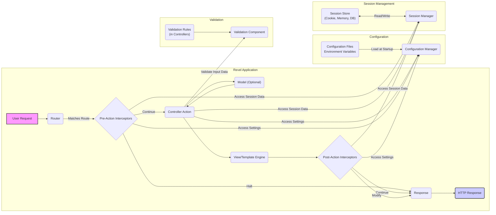

# Project Design Document: Revel Framework

**Version:** 1.1
**Date:** October 26, 2023
**Author:** AI Software Architect

## 1. Introduction

This document provides a detailed architectural design of the Revel framework, a high-productivity, full-stack web framework for the Go language. This document aims to provide a comprehensive understanding of Revel's components, their interactions, and data flow, which will serve as the foundation for subsequent threat modeling activities. This revision includes more detail on specific components and security considerations.

## 2. Goals

*   Clearly define the major components of the Revel framework and their responsibilities.
*   Describe the interactions and data flow between these components with greater specificity.
*   Identify key functionalities and their relationships, highlighting security-relevant aspects.
*   Provide a robust basis for identifying potential security vulnerabilities during threat modeling.
*   Serve as a detailed reference for understanding the framework's architecture and its security implications.

## 3. Overview

Revel is a full-stack web framework for Go, drawing inspiration from frameworks like Ruby on Rails and Play Framework. It prioritizes convention over configuration to enhance developer productivity when building web applications in Go. Key features include a powerful routing mechanism, automatic parameter binding, comprehensive validation capabilities, built-in session management, and a flexible template engine.

## 4. Architectural Design

The Revel framework adheres to a Model-Action-Result (MAR) architectural pattern, a variation of the traditional Model-View-Controller (MVC) pattern. The "Action" component encapsulates the logic typically found in a controller.

### 4.1. Major Components

*   **Core Framework:** The central engine of Revel, responsible for application bootstrapping, managing the request lifecycle, and providing essential utilities. This includes request context management, error handling, and plugin support.
*   **Router:**  A sophisticated component responsible for mapping incoming HTTP requests to specific Controller Actions. It analyzes the request URL, HTTP method, and potentially headers to determine the appropriate handler. Route definitions can include parameters and regular expressions for flexible matching.
*   **Controller:**  Go structs containing Action methods. These methods handle incoming requests, orchestrate business logic (often involving Models), and prepare data for rendering the response. Controllers are the primary point of interaction with user requests.
*   **Model:** Represents the application's data structures and the logic for interacting with data sources. Revel is deliberately unopinionated about the specific ORM or data access layer used, allowing developers to choose the best fit for their needs (e.g., SQL databases, NoSQL databases, external APIs).
*   **View/Template Engine:**  Responsible for rendering dynamic HTML responses. Revel typically uses Go's standard `html/template` package, which provides features for embedding Go code within HTML templates. Developers can also integrate other template engines if desired.
*   **Interceptors (Middleware):** Functions that execute before or after Controller Actions. They provide a mechanism for cross-cutting concerns such as:
    *   **Authentication:** Verifying user identity.
    *   **Authorization:** Determining user permissions.
    *   **Logging:** Recording request and response information.
    *   **Request/Response Modification:** Altering request parameters or response headers.
    *   **Error Handling:**  Catching and handling exceptions.
*   **Configuration Manager:**  Handles loading, parsing, and providing access to application configuration settings. It typically reads configuration from files (e.g., `app.conf`) and environment variables.
*   **Session Manager:**  Manages user sessions, providing functionalities for creating, reading, updating, and destroying session data. Revel supports various session storage backends (e.g., cookies, in-memory, database).
*   **Validation:**  Provides a declarative way to define validation rules for request parameters and data. It allows developers to specify constraints on data types, formats, and ranges.
*   **Test Runner:**  A built-in tool for executing unit and integration tests, facilitating the development of robust and reliable applications.

### 4.2. Component Interactions and Data Flow

**Detailed Data Flow:**

1. **User Request:** A client (e.g., web browser, API consumer) sends an HTTP request to the Revel application.
2. **Router:** The Router receives the incoming request and analyzes the URL path, HTTP method, and potentially headers. It compares this information against the defined routes to find a matching route. If a match is found, the Router identifies the corresponding Controller Action to handle the request.
3. **Pre-Action Interceptors (Middleware):** Before the designated Controller Action is executed, any registered pre-action interceptors are invoked sequentially. These interceptors can perform tasks such as:
    *   **Authentication:** Verifying the user's identity based on credentials (e.g., session cookies, API keys).
    *   **Authorization:** Checking if the authenticated user has the necessary permissions to access the requested resource.
    *   **Request Logging:** Recording details about the incoming request for auditing or debugging purposes.
    *   **Request Modification:** Altering request parameters or headers before they reach the Controller Action.
    *   An interceptor can halt the request processing and return a response directly (e.g., redirecting an unauthenticated user to a login page).
4. **Controller Action:** The identified Controller Action is executed. This is where the core application logic resides. The Action method may:
    *   Interact with Models to retrieve, create, update, or delete data from the underlying data store.
    *   Access application configuration settings through the Configuration Manager.
    *   Access and manipulate user session data through the Session Manager.
    *   Perform input validation using the Validation component to ensure the integrity of the incoming data.
    *   Prepare data to be passed to the View for rendering the response.
5. **Model (Optional):** The Controller Action may interact with one or more Models to perform data-related operations. Revel's flexibility allows developers to use various data access patterns and technologies.
6. **View/Template Engine:** The Controller Action typically passes data to the View/Template Engine. The engine processes the specified template file, embedding the provided data to generate the final HTML response.
7. **Post-Action Interceptors (Middleware):** After the Controller Action has executed and the View has rendered (if applicable), any registered post-action interceptors are invoked. These interceptors can perform tasks such as:
    *   **Response Logging:** Recording details about the outgoing response.
    *   **Response Modification:** Adding security headers (e.g., Content-Security-Policy, X-Frame-Options), setting cookies, or modifying the response body.
8. **HTTP Response:** The final HTTP response, generated by the View or potentially modified by post-action interceptors, is sent back to the client.
9. **Configuration:** The Configuration Manager loads application settings from configuration files (e.g., `app.conf`) and environment variables during application startup. These settings are accessible to various components, including Controllers and Interceptors.
10. **Session Management:** The Session Manager handles the lifecycle of user sessions. When a user interacts with the application, the Session Manager can create a new session, store session data (e.g., user ID, login status) in a configured backend (e.g., cookies, in-memory store, database), and retrieve this data on subsequent requests.
11. **Validation:** The Validation component uses rules defined within Controllers (often using struct tags) to validate input data. If validation fails, the Controller can handle the errors and return an appropriate response to the user.

## 5. Security Considerations (Detailed)

This section provides a more detailed overview of potential security concerns within the Revel framework's architecture, serving as a foundation for threat modeling.

*   **Routing Vulnerabilities:**
    *   **Insecure Direct Object References:**  If route parameters directly expose internal object IDs without proper authorization checks, attackers might access unauthorized resources.
    *   **Path Traversal:**  Improperly handled route parameters could allow attackers to access files or directories outside the intended scope.
    *   **Denial of Service (DoS):**  Regular expression denial of service (ReDoS) vulnerabilities in route definitions could be exploited to overload the server.
*   **Interceptor Security:**
    *   **Authentication Bypass:**  Flaws in authentication interceptors could allow unauthorized users to access protected resources.
    *   **Authorization Failures:**  Incorrectly implemented authorization logic in interceptors could grant users excessive privileges.
    *   **Injection Vulnerabilities:** If interceptors modify requests based on user input without proper sanitization, they could introduce injection vulnerabilities.
*   **Controller Security:**
    *   **Injection Attacks (SQL, Command, OS):**  Failure to sanitize user input within Controller Actions before using it in database queries or system commands can lead to severe vulnerabilities.
    *   **Cross-Site Scripting (XSS):**  If Controllers pass unsanitized user-provided data to the View, it can lead to XSS vulnerabilities, allowing attackers to inject malicious scripts into the user's browser.
    *   **Cross-Site Request Forgery (CSRF):**  Lack of CSRF protection in Controllers that handle state-changing requests can allow attackers to perform unauthorized actions on behalf of legitimate users.
    *   **Mass Assignment Vulnerabilities:**  Binding request parameters directly to Model fields without proper whitelisting can allow attackers to modify unintended data.
*   **Model Security:**
    *   **Data Exposure:**  Models should implement appropriate access controls to prevent unauthorized access to sensitive data.
    *   **Data Integrity Issues:**  Lack of validation or improper handling of data updates in Models can lead to data corruption.
*   **Template Engine Security:**
    *   **Cross-Site Scripting (XSS):**  Failure to properly escape data within templates before rendering can lead to XSS vulnerabilities.
    *   **Server-Side Template Injection (SSTI):**  In rare cases, if user input is directly used within template directives, it could lead to SSTI vulnerabilities, allowing attackers to execute arbitrary code on the server.
*   **Session Management Security:**
    *   **Session Fixation:**  Allowing attackers to set a user's session ID.
    *   **Session Hijacking:**  Stealing a user's valid session ID (e.g., through XSS or network sniffing).
    *   **Insecure Session Storage:**  Storing session data in an insecure manner (e.g., predictable cookies without encryption).
    *   **Lack of Proper Session Invalidation:**  Failing to invalidate sessions after logout or inactivity can leave users vulnerable.
*   **Configuration Security:**
    *   **Exposure of Sensitive Information:**  Storing sensitive data (e.g., database credentials, API keys) in plain text configuration files.
    *   **Default Credentials:**  Using default credentials for administrative interfaces or services.
*   **Validation Security:**
    *   **Insufficient Validation:**  Failing to validate all necessary inputs can leave applications vulnerable to various attacks.
    *   **Client-Side Validation Only:**  Relying solely on client-side validation, which can be easily bypassed.
    *   **Error Message Disclosure:**  Providing overly detailed error messages that reveal sensitive information about the application's internals.
*   **Dependency Management:**
    *   **Use of Vulnerable Dependencies:**  Including third-party libraries with known security vulnerabilities.
    *   **Lack of Dependency Updates:**  Failing to regularly update dependencies to patch security flaws.

## 6. Deployment Considerations

Revel applications are typically deployed as compiled Go binaries, offering flexibility in deployment strategies:

*   **Direct Execution:** Running the compiled binary directly on a server, suitable for simple deployments or development environments.
*   **Reverse Proxy (Recommended):** Deploying behind a reverse proxy like Nginx or Apache. This provides benefits such as:
    *   **SSL/TLS Termination:** Handling encryption and decryption of HTTPS traffic.
    *   **Load Balancing:** Distributing traffic across multiple instances of the application.
    *   **Static Content Serving:** Efficiently serving static assets.
    *   **Security Hardening:** Implementing security headers and other protective measures.
*   **Containerization (Docker):** Packaging the application and its dependencies into Docker containers for consistent and reproducible deployments. This facilitates scalability and management, especially when used with container orchestration platforms.
*   **Cloud Platforms:** Deploying on cloud platforms like AWS, Google Cloud, or Azure using services like:
    *   **Virtual Machines (VMs):** Running the binary on virtual machines.
    *   **Container Orchestration Services (e.g., Kubernetes):** Managing containerized deployments at scale.
    *   **Platform-as-a-Service (PaaS):** Utilizing managed services that handle infrastructure concerns.

## 7. Technologies Used

*   **Go Programming Language:** The foundational language for the Revel framework and applications built with it.
*   **`net/http` Package:** Go's standard library package for handling HTTP requests and responses, forming the basis of Revel's web server capabilities.
*   **`html/template` Package (Default):** Go's standard library package for rendering HTML templates.
*   **Potentially other Go libraries:** Depending on the specific application's requirements, developers may utilize various third-party Go libraries for tasks such as database interaction (e.g., `database/sql`, ORMs), logging, and more.

## 8. Future Considerations

*   **Enhanced Security Defaults:**  Continuously evaluating and improving default security configurations and practices to minimize common vulnerabilities out-of-the-box.
*   **Improved Input Validation Features:**  Exploring the addition of more built-in validation rules, sanitization functions, and mechanisms for handling complex validation scenarios.
*   **Standardized Security Headers Configuration:**  Providing more streamlined and declarative ways to configure and apply recommended security headers.
*   **Integration with Security Scanning Tools:**  Actively working to facilitate seamless integration with static application security testing (SAST) and dynamic application security testing (DAST) tools.
*   **Community Security Audits:**  Encouraging and participating in regular security audits by the community to identify and address potential vulnerabilities proactively.

This revised document provides a more detailed and comprehensive architectural overview of the Revel framework, with a stronger emphasis on security considerations. This enhanced understanding will be invaluable for conducting thorough threat modeling and building secure Revel applications.