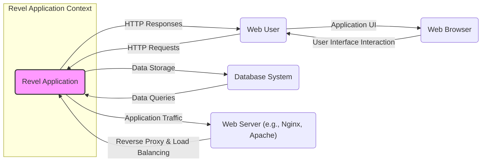
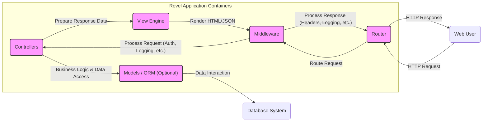
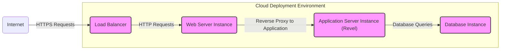
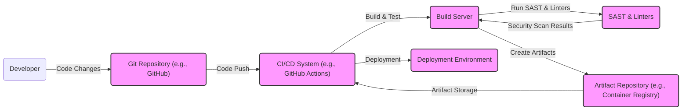

# BUSINESS POSTURE

Revel is a high-productivity, full-stack web framework for the Go language. It aims to simplify web application development by providing a comprehensive set of tools and features out of the box, inspired by frameworks like Ruby on Rails and Play Framework.

- Business Priorities:
  - Rapid web application development: Revel's primary goal is to accelerate the development process for web applications using Go.
  - Developer productivity: By providing a full-stack framework with built-in features, Revel aims to enhance developer efficiency and reduce boilerplate code.
  - Go language adoption: Revel promotes the use of the Go programming language for web development, leveraging its performance and concurrency capabilities.

- Business Goals:
  - Enable faster time-to-market for web applications.
  - Reduce development costs by increasing developer productivity.
  - Build scalable and performant web applications using Go.
  - Provide a robust and feature-rich framework for Go web development.

- Business Risks:
  - Security vulnerabilities in the framework itself could impact all applications built on it.
  - Community support and maintenance of the framework are crucial for long-term viability.
  - Compatibility issues with evolving Go language versions and libraries.
  - Adoption rate and ecosystem maturity compared to more established frameworks.
  - Potential performance bottlenecks if framework features are not efficiently implemented or used.

# SECURITY POSTURE

- Security Controls:
  - security control: Framework provides built-in support for CSRF protection. (Source: Revel documentation and framework features)
  - security control: Framework encourages input validation through Go's type system and custom validation logic. (Source: Go language best practices and framework's data binding features)
  - security control: Framework supports HTTPS for secure communication. (Source: Standard web server configuration practices applicable to Go applications)
  - security control: Framework allows for custom authentication and authorization implementations. (Source: Framework's middleware and controller functionalities)

- Accepted Risks:
  - accepted risk: Vulnerabilities in third-party Go libraries used by Revel could introduce security risks. Mitigation: Dependency scanning and updates.
  - accepted risk: Misconfiguration of the framework or applications built on it could lead to security weaknesses. Mitigation: Security best practices documentation and developer training.
  - accepted risk: Lack of built-in protection against all types of web application attacks (e.g., SQL injection, XSS) requires developers to implement secure coding practices. Mitigation: Secure coding guidelines and code reviews.

- Recommended Security Controls:
  - security control: Implement automated Static Application Security Testing (SAST) during the build process to identify potential vulnerabilities in the application code and framework usage.
  - security control: Implement Dependency Scanning to identify and manage vulnerabilities in third-party libraries used by the framework and applications.
  - security control: Integrate Dynamic Application Security Testing (DAST) in the CI/CD pipeline to test the running application for vulnerabilities.
  - security control: Establish a process for regular security audits and penetration testing of applications built with Revel.
  - security control: Provide security training for developers on secure coding practices for Go and Revel framework specifics.
  - security control: Implement centralized logging and monitoring for security events and anomalies in deployed applications.

- Security Requirements:
  - Authentication:
    - Requirement: The framework should provide mechanisms to implement secure user authentication.
    - Requirement: Support for various authentication methods (e.g., username/password, OAuth, API keys).
    - Requirement: Secure session management to protect user sessions from hijacking.
  - Authorization:
    - Requirement: The framework should enable fine-grained access control to resources and functionalities.
    - Requirement: Role-Based Access Control (RBAC) or Attribute-Based Access Control (ABAC) should be implementable.
    - Requirement: Protection against unauthorized access to sensitive data and operations.
  - Input Validation:
    - Requirement: The framework should facilitate robust input validation to prevent injection attacks (e.g., SQL injection, command injection, XSS).
    - Requirement: Validation should be applied to all input sources (e.g., HTTP requests, API calls).
    - Requirement: Clear error handling for invalid input without revealing sensitive information.
  - Cryptography:
    - Requirement: The framework should support secure cryptographic operations for data protection.
    - Requirement: Secure storage of sensitive data, including passwords and API keys (e.g., using hashing, encryption).
    - Requirement: Secure communication channels using HTTPS/TLS.
    - Requirement: Support for encryption of data at rest and in transit where necessary.

# DESIGN

## C4 CONTEXT

- Context Diagram Elements:
  - - Name: Revel Application
    - Type: Software System
    - Description: The web application built using the Revel framework. It handles user requests, interacts with the database, and serves web content.
    - Responsibilities:
      - Processing user requests.
      - Implementing business logic.
      - Managing data persistence.
      - Rendering web pages and APIs.
    - Security controls:
      - Input validation.
      - Output encoding.
      - Authentication and authorization.
      - Session management.
      - Application-level logging and monitoring.

  - - Name: Web User
    - Type: Person
    - Description: End-users who interact with the Revel application through a web browser.
    - Responsibilities:
      - Accessing application functionalities.
      - Providing input data.
      - Consuming application services.
    - Security controls:
      - User authentication (credentials management).
      - Authorization (access rights).

  - - Name: Database System
    - Type: External System
    - Description: A database system (e.g., PostgreSQL, MySQL) used by the Revel application to store and retrieve data.
    - Responsibilities:
      - Data persistence.
      - Data integrity.
      - Data retrieval and querying.
    - Security controls:
      - Database access controls (user permissions).
      - Data encryption at rest and in transit.
      - Database auditing and logging.
      - Regular database backups.

  - - Name: Web Server (e.g., Nginx, Apache)
    - Type: External System
    - Description: A web server acting as a reverse proxy and load balancer in front of the Revel application.
    - Responsibilities:
      - Handling incoming HTTP requests.
      - Load balancing across application instances.
      - SSL/TLS termination.
      - Serving static content.
    - Security controls:
      - Web server access controls.
      - SSL/TLS configuration.
      - DDoS protection.
      - Web application firewall (WAF) integration (optional).

  - - Name: Web Browser
    - Type: External System
    - Description: The web browser used by end-users to access and interact with the Revel application's user interface.
    - Responsibilities:
      - Rendering web pages.
      - Executing client-side scripts.
      - Sending HTTP requests to the application.
    - Security controls:
      - Browser security features (e.g., Content Security Policy, XSS protection).
      - User-side security practices (e.g., browser extensions, safe browsing habits).

## C4 CONTAINER

- Container Diagram Elements:
  - - Name: Router
    - Type: Container (Framework Component)
    - Description: The Revel router is responsible for mapping incoming HTTP requests to the appropriate controllers based on defined routes.
    - Responsibilities:
      - Request routing and URL mapping.
      - Handling HTTP methods (GET, POST, etc.).
      - URL parameter parsing.
    - Security controls:
      - Route definition security (preventing unintended access points).
      - Input sanitization at the routing level (basic URL validation).

  - - Name: Middleware
    - Type: Container (Framework Component)
    - Description: Revel middleware provides a mechanism to intercept and process HTTP requests and responses. It's used for cross-cutting concerns like authentication, authorization, logging, and request modification.
    - Responsibilities:
      - Request pre-processing (e.g., authentication checks).
      - Response post-processing (e.g., adding security headers).
      - Logging and monitoring.
      - Security policy enforcement.
    - Security controls:
      - Authentication middleware (verifying user identity).
      - Authorization middleware (enforcing access control).
      - Security header middleware (setting HTTP security headers).
      - Request/response logging for security auditing.

  - - Name: Controllers
    - Type: Container (Application Component)
    - Description: Controllers are responsible for handling specific application logic, processing user requests, interacting with models, and preparing data for views.
    - Responsibilities:
      - Implementing business logic.
      - Handling user input.
      - Interacting with data models.
      - Preparing data for rendering.
    - Security controls:
      - Input validation within controller actions.
      - Authorization checks before executing actions.
      - Secure data handling and processing.
      - Error handling and secure error responses.

  - - Name: Models / ORM (Optional)
    - Type: Container (Application Component)
    - Description: Models represent the data structure of the application and often include an Object-Relational Mapper (ORM) for database interaction. (Revel can be used with or without an ORM).
    - Responsibilities:
      - Data access and manipulation.
      - Data validation at the model level.
      - Database interaction and querying.
    - Security controls:
      - Data validation within models.
      - Secure database queries (preventing SQL injection if using raw queries).
      - Data access control within the model layer.

  - - Name: View Engine
    - Type: Container (Framework Component)
    - Description: The view engine is responsible for rendering the user interface, typically HTML pages or API responses (JSON, XML). Revel includes a built-in template engine.
    - Responsibilities:
      - Rendering dynamic web pages.
      - Generating API responses.
      - Templating and data presentation.
    - Security controls:
      - Output encoding to prevent XSS vulnerabilities.
      - Template injection prevention.
      - Secure handling of user-provided data in views.

## DEPLOYMENT

Deployment Solution: Cloud-based Deployment (AWS, GCP, Azure)

- Deployment Diagram Elements:
  - - Name: Load Balancer
    - Type: Infrastructure Component
    - Description: Distributes incoming traffic across multiple web server instances for scalability and high availability.
    - Responsibilities:
      - Traffic distribution.
      - Health checks for backend instances.
      - SSL/TLS termination.
    - Security controls:
      - DDoS protection.
      - Load balancer access policies.
      - SSL/TLS configuration.

  - - Name: Web Server Instance
    - Type: Infrastructure Component (VM/Container)
    - Description: Web server instances (e.g., Nginx, Apache) act as reverse proxies, serving static content and forwarding requests to application server instances.
    - Responsibilities:
      - Reverse proxying to application servers.
      - Serving static files.
      - Web server security configurations.
    - Security controls:
      - Web server hardening.
      - Access controls.
      - Security patching.

  - - Name: Application Server Instance (Revel)
    - Type: Infrastructure Component (VM/Container)
    - Description: Instances running the Revel application, processing requests and interacting with the database.
    - Responsibilities:
      - Running the Revel application.
      - Processing application logic.
      - Interacting with the database.
    - Security controls:
      - Application security configurations.
      - Operating system hardening.
      - Security patching.
      - Container security (if containerized).

  - - Name: Database Instance
    - Type: Infrastructure Component (Managed Database Service or VM)
    - Description: A managed database service or a database server instance storing application data.
    - Responsibilities:
      - Data persistence.
      - Data management.
      - Database security.
    - Security controls:
      - Database access controls.
      - Data encryption at rest and in transit.
      - Database backups and recovery.
      - Security patching and updates.
      - Network security (firewall rules).

## BUILD

- Build Process Elements:
  - - Name: Developer
    - Type: Person
    - Description: Software developers writing and modifying the Revel application code.
    - Responsibilities:
      - Writing secure code.
      - Committing code changes to the repository.
      - Following secure development practices.
    - Security controls:
      - Secure coding training.
      - Code review processes.
      - Local development environment security.

  - - Name: Git Repository (e.g., GitHub)
    - Type: Software System
    - Description: Version control system used to store and manage the application's source code.
    - Responsibilities:
      - Source code management.
      - Version history tracking.
      - Collaboration and code sharing.
    - Security controls:
      - Access control to the repository.
      - Branch protection rules.
      - Audit logging of repository activities.
      - Secure code storage.

  - - Name: CI/CD System (e.g., GitHub Actions)
    - Type: Software System
    - Description: Automation system for building, testing, and deploying the Revel application.
    - Responsibilities:
      - Automated build and test execution.
      - Security scanning integration.
      - Artifact creation and publishing.
      - Deployment automation.
    - Security controls:
      - Secure CI/CD pipeline configuration.
      - Access control to CI/CD system.
      - Secret management for credentials.
      - Audit logging of CI/CD activities.

  - - Name: Build Server
    - Type: Infrastructure Component
    - Description: Server responsible for executing build and test processes.
    - Responsibilities:
      - Compiling code.
      - Running unit and integration tests.
      - Executing security scans.
      - Creating build artifacts.
    - Security controls:
      - Build server hardening.
      - Access controls.
      - Secure build environment.
      - Security patching.

  - - Name: SAST & Linters
    - Type: Software System
    - Description: Static Application Security Testing tools and code linters used to identify potential vulnerabilities and code quality issues.
    - Responsibilities:
      - Static code analysis for security vulnerabilities.
      - Code style and quality checks.
      - Early detection of potential issues.
    - Security controls:
      - Regularly updated SAST tools and rulesets.
      - Integration into the CI/CD pipeline.
      - Configuration for relevant security checks.

  - - Name: Artifact Repository (e.g., Container Registry)
    - Type: Software System
    - Description: Repository for storing and managing build artifacts (e.g., container images, binaries).
    - Responsibilities:
      - Artifact storage and versioning.
      - Artifact access control.
      - Secure artifact distribution.
    - Security controls:
      - Access control to the artifact repository.
      - Vulnerability scanning of artifacts (e.g., container images).
      - Secure artifact storage and transfer.

  - - Name: Deployment Environment
    - Type: Infrastructure Component
    - Description: Target environment where the Revel application is deployed and run (e.g., cloud environment, on-premise servers).
    - Responsibilities:
      - Running the application.
      - Providing runtime environment.
      - Infrastructure security.
    - Security controls:
      - Deployment environment security controls (as described in Deployment section).
      - Secure deployment process.
      - Runtime environment monitoring.

# RISK ASSESSMENT

- Critical Business Processes:
  - User authentication and session management.
  - Data input and processing (handling user-provided data).
  - Access to application functionalities and resources.
  - Data storage and retrieval.
  - Application availability and performance.

- Data Sensitivity:
  - User credentials (passwords, API keys): Highly sensitive, require strong protection (encryption, hashing).
  - User personal data (PII): Sensitive, require protection according to privacy regulations (encryption, access control).
  - Application data: Sensitivity depends on the application domain, may include confidential business information, requiring appropriate protection.
  - Application logs: Can contain sensitive information, require secure storage and access control.

# QUESTIONS & ASSUMPTIONS

- Questions:
  - What are the specific security features built into the Revel framework beyond CSRF protection?
  - Are there recommended security best practices or guidelines specifically for developing Revel applications?
  - What is the community's response to security vulnerabilities reported in Revel, and how quickly are patches released?
  - What are the common deployment architectures used for Revel applications in production?
  - Are there any known security limitations or common pitfalls when using Revel?

- Assumptions:
  - It is assumed that applications built with Revel will handle user data and require standard web application security measures.
  - It is assumed that developers using Revel are expected to follow secure coding practices and implement necessary security controls at the application level.
  - It is assumed that the deployment environment will provide basic infrastructure security controls (e.g., firewalls, network security).
  - It is assumed that the build process will incorporate basic security checks like static analysis and dependency scanning.