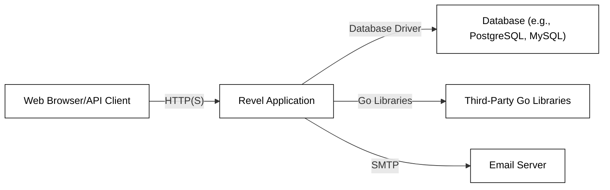
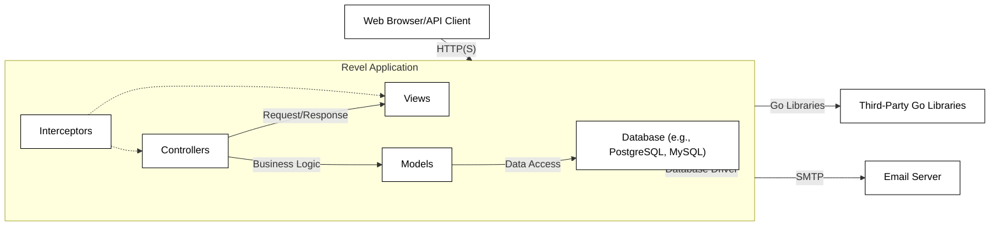

Okay, let's create a design document for the Revel framework, keeping in mind its purpose and potential security considerations.

# BUSINESS POSTURE

Revel is a high-productivity web framework for the Go language.  It aims to provide a comprehensive set of features for building modern web applications, emphasizing developer productivity and ease of use.

Business Priorities:

*   Enable rapid development of web applications.
*   Provide a stable and reliable framework for production deployments.
*   Offer a rich feature set to reduce the need for external libraries.
*   Maintain a vibrant and supportive community.
*   Attract and retain developers.

Business Goals:

*   Become a leading choice for Go web development.
*   Reduce time-to-market for web applications built with Revel.
*   Minimize the learning curve for new developers.
*   Ensure the framework remains maintainable and extensible.

Most Important Business Risks:

*   Security vulnerabilities in the framework could lead to data breaches or service disruptions for applications built with Revel. This is the highest risk, as it directly impacts the users of the framework and their customers.
*   Performance bottlenecks in the framework could limit the scalability of applications.
*   Lack of adoption or a decline in community activity could lead to the framework becoming obsolete.
*   Inability to keep up with evolving web development trends and security best practices.
*   Bugs or instability in the framework could damage its reputation and hinder adoption.

# SECURITY POSTURE

Existing Security Controls (based on the GitHub repository and general knowledge of web frameworks):

*   security control: Routing security: Revel's router handles URL parsing and dispatching, which is a critical security area.  Incorrect routing can lead to unauthorized access or information disclosure. (Implemented in `revel/revel/router.go` and related files).
*   security control: Template engine with auto-escaping: Revel uses Go's `html/template` package, which provides automatic HTML escaping to mitigate Cross-Site Scripting (XSS) vulnerabilities. (Implemented in `revel/revel/template.go` and related files).
*   security control: Session management: Revel provides built-in session management, which is crucial for maintaining user state and authentication.  (Implemented in `revel/revel/session.go` and related files).
*   security control: Parameter binding and validation: Revel offers mechanisms for binding request parameters to Go structs and validating their values. This helps prevent injection attacks and ensures data integrity. (Implemented in `revel/revel/params.go` and related files).
*   security control: Interceptors: Revel's interceptor system allows developers to implement cross-cutting concerns like authentication, authorization, and logging. (Implemented in `revel/revel/intercept.go` and related files).
*   security control: CSRF protection: Revel includes built-in protection against Cross-Site Request Forgery (CSRF) attacks. (Mentioned in documentation, likely implemented using interceptors and session management).
*   security control: Go's inherent memory safety: Go's built-in memory management and type safety help prevent common vulnerabilities like buffer overflows and null pointer dereferences. (Inherent to the Go language).

Accepted Risks:

*   accepted risk: Reliance on third-party Go packages: Like any Go project, Revel depends on external libraries. Vulnerabilities in these dependencies could impact Revel's security. This is a common risk in software development and is mitigated by regularly updating dependencies and monitoring for security advisories.
*   accepted risk: Developer misuse: While Revel provides security features, developers can still write insecure code.  For example, they might disable auto-escaping, bypass validation, or implement custom authentication incorrectly. This is mitigated through documentation, best practices, and code reviews.
*   accepted risk: Configuration errors: Incorrect configuration of Revel (e.g., weak session secrets, permissive CORS settings) can introduce vulnerabilities. This is mitigated through secure defaults and clear documentation.

Recommended Security Controls:

*   security control: Content Security Policy (CSP) integration: Provide helpers or middleware to easily configure CSP headers, which can mitigate XSS and other injection attacks.
*   security control: HTTP Strict Transport Security (HSTS) integration: Provide helpers or middleware to easily configure HSTS headers, which enforce HTTPS connections.
*   security control: Security audit and penetration testing: Regularly conduct security audits and penetration tests of the framework to identify and address vulnerabilities.
*   security control: Dependency vulnerability scanning: Integrate automated tools to scan for known vulnerabilities in Revel's dependencies.
*   security control: Input validation recommendations: Provide clear guidance and examples in the documentation on how to properly validate user input to prevent various injection attacks.

Security Requirements:

*   Authentication:
    *   The framework should provide mechanisms for implementing secure user authentication, including password hashing (e.g., using bcrypt, scrypt, or Argon2) and secure session management.
    *   Support for multi-factor authentication (MFA) should be considered.
    *   Integration with external authentication providers (e.g., OAuth 2.0, OpenID Connect) should be possible.

*   Authorization:
    *   The framework should provide mechanisms for implementing role-based access control (RBAC) or other authorization models.
    *   It should be easy to restrict access to specific controllers, actions, or resources based on user roles or permissions.

*   Input Validation:
    *   All user input should be validated to prevent injection attacks (e.g., SQL injection, command injection, XSS).
    *   Validation should be performed on both the client-side (for user experience) and the server-side (for security).
    *   The framework should provide convenient ways to define validation rules (e.g., using struct tags or a validation library).

*   Cryptography:
    *   The framework should use strong cryptographic algorithms and libraries for sensitive operations (e.g., password hashing, encryption of data at rest and in transit).
    *   Cryptographic keys should be managed securely.
    *   The framework should follow cryptographic best practices (e.g., using appropriate key lengths, initialization vectors, and modes of operation).

# DESIGN

## C4 CONTEXT

Element Descriptions:

*   Element:
    *   Name: User
    *   Type: Person
    *   Description: A user interacting with the Revel application through a web browser or API client.
    *   Responsibilities: Initiates requests to the application, views responses, and provides input.
    *   Security controls: Browser security features (e.g., same-origin policy, CSP), HTTPS.

*   Element:
    *   Name: Revel Application
    *   Type: Software System
    *   Description: The web application built using the Revel framework.
    *   Responsibilities: Handles user requests, processes data, interacts with the database and other systems, and generates responses.
    *   Security controls: Routing security, template engine with auto-escaping, session management, parameter binding and validation, interceptors, CSRF protection, Go's inherent memory safety.

*   Element:
    *   Name: Database
    *   Type: Software System
    *   Description: A database system (e.g., PostgreSQL, MySQL) used to store application data.
    *   Responsibilities: Stores and retrieves data, enforces data integrity.
    *   Security controls: Database access controls, encryption at rest, encryption in transit, auditing.

*   Element:
    *   Name: Third-Party Go Libraries
    *   Type: Software System
    *   Description: External Go libraries used by the Revel application.
    *   Responsibilities: Provide specific functionality not included in the Revel framework or the Go standard library.
    *   Security controls: Dependent on the specific library; regular updates and vulnerability scanning are crucial.

*   Element:
    *   Name: Email Server
    *   Type: Software System
    *   Description: An email server used to send emails from the Revel application.
    *   Responsibilities: Sends emails.
    *   Security controls: Authentication, encryption (TLS), spam filtering.

## C4 CONTAINER

Element Descriptions:

*   Element:
    *   Name: Controllers
    *   Type: Container
    *   Description: Handles incoming requests, interacts with models and views, and returns responses.
    *   Responsibilities: Request routing, parameter binding, input validation, calling business logic, rendering views.
    *   Security controls: Input validation, authorization checks, CSRF protection.

*   Element:
    *   Name: Views
    *   Type: Container
    *   Description: Generates the user interface (HTML, JSON, etc.) based on data provided by controllers.
    *   Responsibilities: Rendering templates, displaying data.
    *   Security controls: Output encoding (auto-escaping), CSP.

*   Element:
    *   Name: Models
    *   Type: Container
    *   Description: Represents the application's data and business logic.
    *   Responsibilities: Data access, data validation, business rules.
    *   Security controls: Data validation, secure data handling.

*   Element:
    *   Name: Interceptors
    *   Type: Container
    *   Description: Provides a mechanism for intercepting requests and responses to implement cross-cutting concerns.
    *   Responsibilities: Authentication, authorization, logging, error handling, CSRF protection.
    *   Security controls: Authentication, authorization, CSRF protection.

*   Element:
    *   Name: Database
    *   Type: Container
    *   Description: A database system (e.g., PostgreSQL, MySQL) used to store application data.
    *   Responsibilities: Stores and retrieves data, enforces data integrity.
    *   Security controls: Database access controls, encryption at rest, encryption in transit, auditing.

*   Element:
    *   Name: Third-Party Go Libraries
    *   Type: Container
    *   Description: External Go libraries used by the Revel application.
    *   Responsibilities: Provide specific functionality not included in the Revel framework or the Go standard library.
    *   Security controls: Dependent on the specific library; regular updates and vulnerability scanning are crucial.

*   Element:
    *   Name: Email Server
    *   Type: Container
    *   Description: An email server used to send emails from the Revel application.
    *   Responsibilities: Sends emails.
    *   Security controls: Authentication, encryption (TLS), spam filtering.

## DEPLOYMENT

Possible Deployment Solutions:

1.  Traditional Server Deployment: Deploying the Revel application to a virtual machine or physical server running a Linux distribution (e.g., Ubuntu, CentOS).
2.  Containerized Deployment (Docker): Packaging the Revel application and its dependencies into a Docker container and deploying it to a container orchestration platform (e.g., Kubernetes, Docker Swarm).
3.  Platform-as-a-Service (PaaS): Deploying the Revel application to a PaaS provider (e.g., Google App Engine, Heroku, AWS Elastic Beanstalk).
4.  Serverless Deployment: Using a serverless platform (e.g., AWS Lambda, Google Cloud Functions) to deploy individual Revel functions. This is less common for full Revel applications but could be used for specific parts.

Chosen Solution: Containerized Deployment (Docker) with Kubernetes

```mermaid
graph LR
    Developer["Developer"] -- "Code Commit" --> GitRepo["Git Repository (e.g., GitHub)"]
    GitRepo -- "Webhook" --> CI_CD["CI/CD Pipeline (e.g., Jenkins, GitLab CI)"]
    CI_CD -- "Build & Test" --> DockerRegistry["Docker Registry (e.g., Docker Hub, ECR)"]
    DockerRegistry -- "Pull Image" --> KubernetesCluster["Kubernetes Cluster"]
    KubernetesCluster -- "Expose Service" --> LoadBalancer["Load Balancer"]
    LoadBalancer -- "HTTP(S)" --> User["User"]

    subgraph KubernetesCluster
        Pod1["Pod (Revel App Instance 1)"]
        Pod2["Pod (Revel App Instance 2)"]
        PodN["Pod (Revel App Instance N)"]
        DatabasePod["Pod (Database)"]
    end
    classDef default fill:#fff,stroke:#000,stroke-width:1px,color:#000;
```

Element Descriptions:

*   Element:
    *   Name: Developer
    *   Type: Person
    *   Description: A developer working on the Revel application.
    *   Responsibilities: Writes code, commits changes to the Git repository.
    *   Security controls: Code reviews, secure coding practices.

*   Element:
    *   Name: Git Repository
    *   Type: System
    *   Description: A Git repository (e.g., GitHub, GitLab) hosting the application's source code.
    *   Responsibilities: Version control, code storage.
    *   Security controls: Access controls, branch protection rules.

*   Element:
    *   Name: CI/CD Pipeline
    *   Type: System
    *   Description: A CI/CD pipeline (e.g., Jenkins, GitLab CI) that automates the build, test, and deployment process.
    *   Responsibilities: Building the Docker image, running tests, pushing the image to the registry, deploying to Kubernetes.
    *   Security controls: Secure configuration, access controls, vulnerability scanning.

*   Element:
    *   Name: Docker Registry
    *   Type: System
    *   Description: A Docker registry (e.g., Docker Hub, Amazon ECR) storing the built Docker images.
    *   Responsibilities: Image storage, image distribution.
    *   Security controls: Access controls, image signing, vulnerability scanning.

*   Element:
    *   Name: Kubernetes Cluster
    *   Type: System
    *   Description: A Kubernetes cluster managing the deployment and scaling of the Revel application.
    *   Responsibilities: Container orchestration, resource management, service discovery.
    *   Security controls: Network policies, role-based access control (RBAC), pod security policies, secrets management.

*   Element:
    *   Name: Pod (Revel App Instance)
    *   Type: Node
    *   Description: A Kubernetes pod running an instance of the Revel application Docker container.
    *   Responsibilities: Handling user requests.
    *   Security controls: Container security context, resource limits.

*   Element:
    *   Name: Pod (Database)
    *   Type: Node
    *   Description: A Kubernetes pod running the database server.
    *   Responsibilities: Storing and retrieving application data.
    *   Security controls: Database access controls, encryption at rest, encryption in transit.

*   Element:
    *   Name: Load Balancer
    *   Type: System
    *   Description: A load balancer distributing traffic across multiple Revel application pods.
    *   Responsibilities: Traffic distribution, health checks.
    *   Security controls: TLS termination, DDoS protection.

*   Element:
    *   Name: User
    *   Type: Person
    *   Description: A user interacting with the Revel application.
    *   Responsibilities: Initiates requests to the application, views responses.
    *   Security controls: Browser security features, HTTPS.

## BUILD

```mermaid
graph LR
    Developer["Developer"] -- "Code Commit" --> GitRepo["Git Repository"]
    GitRepo -- "Webhook Trigger" --> CI_Server["CI Server (e.g., GitHub Actions, Jenkins)"]
    CI_Server -- "Checkout Code" --> Build_Environment["Build Environment"]
    Build_Environment -- "go build" --> Compile["Compile (go build)"]
    Compile -- "go test" --> Tests["Run Tests (go test)"]
    Tests -- "Static Analysis" --> SAST["SAST (e.g., gosec)"]
    SAST -- "Dependency Check" --> Dependency_Scanner["Dependency Scanner (e.g., Snyk)"]
    Dependency_Scanner -- "Create Dockerfile" --> Docker_Build["Docker Build"]
    Docker_Build -- "Push Image" --> Docker_Registry["Docker Registry"]
    classDef default fill:#fff,stroke:#000,stroke-width:1px,color:#000;
```

Build Process Description:

1.  Developer commits code to the Git repository.
2.  A webhook triggers the CI server (e.g., GitHub Actions, Jenkins).
3.  The CI server checks out the code into a build environment.
4.  The `go build` command compiles the Revel application.
5.  The `go test` command runs unit and integration tests.
6.  A Static Application Security Testing (SAST) tool (e.g., gosec) analyzes the code for potential vulnerabilities.
7.  A dependency scanner (e.g., Snyk, Dependabot) checks for known vulnerabilities in third-party dependencies.
8.  A Dockerfile is used to build a Docker image containing the compiled application and its dependencies.
9.  The Docker image is pushed to a Docker registry.

Security Controls:

*   security control: SAST (Static Application Security Testing): Using tools like `gosec` to identify potential vulnerabilities in the source code during the build process.
*   security control: Dependency Scanning: Using tools like Snyk or Dependabot to automatically scan for known vulnerabilities in project dependencies.
*   security control: Build Automation: Using a CI server (GitHub Actions, Jenkins, etc.) to ensure consistent and reproducible builds.
*   security control: Least Privilege: Running build processes with minimal necessary privileges to reduce the impact of potential compromises.
*   security control: Immutable Build Artifacts: Ensuring that build artifacts (e.g., Docker images) are immutable and cannot be modified after creation.

# RISK ASSESSMENT

Critical Business Processes to Protect:

*   User authentication and authorization: Ensuring that only authorized users can access sensitive data and functionality.
*   Data processing and storage: Protecting the integrity and confidentiality of user data stored in the database.
*   Service availability: Maintaining the uptime and responsiveness of the Revel application.
*   Secure communication: Protecting data in transit between the client, server, and other systems.

Data to Protect and Sensitivity:

*   User credentials (passwords, API keys): Highly sensitive; must be protected with strong hashing and encryption.
*   Personally Identifiable Information (PII): Sensitive; must be handled in compliance with privacy regulations (e.g., GDPR, CCPA).  Examples include names, email addresses, physical addresses, phone numbers, etc.
*   Financial data (if applicable): Highly sensitive; must be protected with strong encryption and access controls.  Examples include credit card numbers, bank account details, transaction history.
*   Application data (depending on the specific application): Sensitivity varies; may include business-critical data, intellectual property, or other confidential information.
*   Session data: Moderately sensitive; should be protected from hijacking and tampering.

# QUESTIONS & ASSUMPTIONS

Questions:

*   What specific database systems are most commonly used with Revel applications? This will help tailor the security recommendations for database interactions.
*   What are the typical deployment environments for Revel applications (cloud providers, on-premise, etc.)?
*   Are there any existing security policies or guidelines that should be considered?
*   What is the expected scale of Revel applications (number of users, requests per second)?
*   What level of security expertise is expected from developers using Revel?

Assumptions:

*   BUSINESS POSTURE: Developers prioritize rapid development and ease of use, but also recognize the importance of security.
*   SECURITY POSTURE: Developers will follow security best practices and keep their dependencies updated. The Revel framework itself will be actively maintained and security vulnerabilities will be addressed promptly.
*   DESIGN: The application will be deployed using a containerized approach (e.g., Docker and Kubernetes) for scalability and maintainability. A relational database will be used for data persistence.