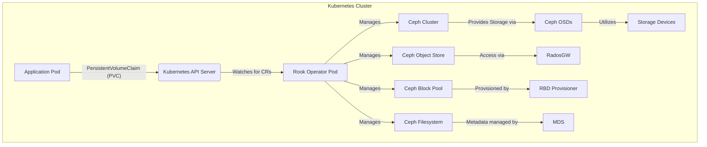
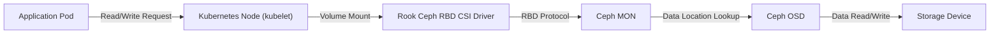

# Project Design Document: Rook - Cloud-Native Storage Orchestration

**Version:** 1.1
**Date:** October 26, 2023
**Author:** AI Cloud & Security Architect

## 1. Introduction

This document provides an enhanced design overview of the Rook project, an open-source, cloud-native storage orchestrator for Kubernetes. This document is specifically designed to facilitate threat modeling activities by providing a clear and detailed understanding of Rook's architecture, components, and data flow. Our primary focus will be on the Ceph operator within Rook due to its maturity and widespread adoption.

Rook simplifies the management of distributed storage systems like Ceph within Kubernetes, enabling self-managing, self-scaling, and self-healing storage services. This document aims to be a valuable resource for security professionals and developers involved in assessing and mitigating potential security risks associated with Rook deployments.

## 2. Goals and Objectives

The core objectives of Rook are to:

* **Simplify Kubernetes Storage Operations:** Automate the complexities of deploying, configuring, managing, and scaling distributed storage within Kubernetes environments.
* **Provide a Kubernetes-Native Storage Abstraction:** Offer a consistent and integrated storage management experience within Kubernetes, hiding the intricacies of the underlying storage system.
* **Enable Developer Self-Service for Storage:** Empower application developers to independently provision and manage their storage needs without requiring specialized storage administration knowledge.
* **Optimize Data Locality and Performance:** Deploy storage resources closer to consuming applications to enhance performance and reduce latency.
* **Maximize Resource Efficiency:** Dynamically provision and scale storage resources to optimize the utilization of underlying hardware.

## 3. High-Level Architecture

The following diagram illustrates the high-level architecture of Rook, focusing on the Ceph operator and its interactions within a Kubernetes cluster:

**Key Components:**

* **Kubernetes Cluster:** The foundational platform where Rook and the managed storage system operate.
* **Application Pod:** A containerized application within Kubernetes requiring persistent storage.
* **Kubernetes API Server:** The central control point of Kubernetes, managing all cluster resources.
* **PersistentVolumeClaim (PVC):** A request from an application for storage resources.
* **Rook Operator Pod:** A Kubernetes pod running the Rook operator, the control plane for managing the storage cluster.
* **Ceph Cluster:** The underlying distributed storage system (in this case, Ceph) being orchestrated by Rook.
* **Ceph OSDs (Object Storage Daemons):** The Ceph daemons responsible for storing data on physical storage.
* **Storage Devices:** The physical disks or volumes used by the Ceph OSDs for data persistence.
* **Ceph Object Store:** Provides object storage functionality, often accessed via the S3 or Swift protocols.
* **Ceph Block Pool:** Offers block storage volumes that can be attached to applications.
* **Ceph Filesystem:** Enables shared file system access across multiple pods.
* **RadosGW (RADOS Gateway):** The Ceph component providing object storage access via standard APIs.
* **RBD Provisioner (Rook Block Device Provisioner):** A Kubernetes provisioner that dynamically creates block storage volumes from Ceph.
* **MDS (Metadata Server):** The Ceph component responsible for managing metadata for the Ceph Filesystem.

## 4. Detailed Design

This section provides a deeper dive into the key components and their interactions within the Rook architecture.

### 4.1. Rook Operator

* **Core Functionality:** Acts as a Kubernetes controller, observing the state of custom resources and ensuring the desired state of the storage cluster.
* **Key Responsibilities:**
    * **Storage Cluster Lifecycle Management:**  Handles the deployment, configuration, scaling, and upgrading of the underlying storage cluster (e.g., Ceph).
    * **Custom Resource Management:**  Reacts to changes in Custom Resource Definitions (CRDs) related to storage resources, such as creating Ceph clusters, object stores, and block pools.
    * **Health Monitoring and Remediation:** Continuously monitors the health of the storage cluster and its components, taking corrective actions in case of failures.
    * **Resource Provisioning:**  Orchestrates the provisioning of storage resources based on user requests (PVCs).
    * **Secret and Configuration Management:** Manages sensitive information and configuration settings required by the storage cluster.
* **Deployment Details:** Typically deployed as a Kubernetes Deployment or StatefulSet within a dedicated namespace.
* **Required Permissions:** Requires extensive Kubernetes Role-Based Access Control (RBAC) permissions to manage various cluster resources, including pods, deployments, services, secrets, and custom resources.

### 4.2. Custom Resource Definitions (CRDs)

* **Purpose:** Extend the Kubernetes API to introduce new resource types specifically for managing storage.
* **Examples (for Ceph):**
    * `CephCluster`: Defines the desired state of the entire Ceph cluster.
    * `CephObjectStore`: Represents a Ceph object storage instance (e.g., for S3 access).
    * `CephBlockPool`: Defines a pool of storage for block devices.
    * `CephFilesystem`: Represents a shared Ceph filesystem.
    * `CephClient`: Defines a Ceph client user and their associated permissions.
* **Interaction with Operator:** The Rook operator watches for changes in these CRs and takes actions to reconcile the actual state with the desired state defined in the CR.

### 4.3. Ceph Cluster Components

* **MON (Monitor):**
    * **Function:** Maintains a consistent view of the cluster membership and state.
    * **Security Considerations:** Critical for cluster consensus and availability. Compromise can lead to cluster instability.
* **OSD (Object Storage Daemon):**
    * **Function:** Stores the actual data on physical storage devices.
    * **Security Considerations:** Contains sensitive data. Access should be strictly controlled. Data-at-rest encryption is crucial.
* **MGR (Manager):**
    * **Function:** Provides monitoring, orchestration, and an API for the Ceph cluster.
    * **Security Considerations:** Offers administrative access to the cluster. Access should be restricted.
* **MDS (Metadata Server):**
    * **Function:** Manages metadata for the Ceph Filesystem.
    * **Security Considerations:** Metadata integrity is vital for filesystem consistency.
* **RadosGW (RADOS Gateway):**
    * **Function:** Provides object storage access via S3 and Swift compatible APIs.
    * **Security Considerations:** Entry point for external access to object storage. Requires robust authentication and authorization.

### 4.4. Storage Provisioning Workflow

* **Block Storage (using RBD):**
    * **Process Initiation:** An application requests storage by creating a PersistentVolumeClaim (PVC).
    * **Kubernetes Interaction:** The Kubernetes API server identifies the appropriate StorageClass (configured to use the Rook RBD provisioner).
    * **Rook RBD Provisioner Action:** The Rook RBD provisioner receives the provisioning request.
    * **Ceph Resource Creation:** The provisioner interacts with the Ceph cluster (via the Rook operator) to create a new RBD image in the specified Ceph block pool.
    * **PersistentVolume Creation:** A PersistentVolume (PV) is created, representing the newly provisioned storage.
    * **Binding:** The PV is bound to the requesting PVC, making the storage available to the application.
* **Object Storage (using RadosGW):**
    * **Access Method:** Applications interact with the RadosGW using standard object storage APIs (S3, Swift).
    * **Rook Management:** Rook manages the deployment and configuration of the RadosGW.
    * **Authentication:** Access control is typically managed through Ceph user accounts and S3 access keys (managed as Kubernetes secrets).
* **Shared Filesystem (using CephFS):**
    * **Provisioning:** Similar to block storage, a PVC with the appropriate StorageClass triggers the provisioning process.
    * **Rook CSI Driver:** The Rook CSI (Container Storage Interface) driver for CephFS handles the interaction with the Ceph MDS to create and manage the filesystem.
    * **Mounting:** Multiple pods can mount the same CephFS volume for shared access.

### 4.5. Data Flow (Block Storage Read/Write)

**Data Flow Steps:**

1. **Application Initiates Request:** An application pod sends a read or write request to a mounted volume.
2. **Kubelet Intercepts:** The kubelet on the node hosting the pod intercepts the request.
3. **CSI Driver Interaction:** The request is handled by the Rook Ceph RBD CSI driver.
4. **Ceph Monitor Lookup:** The CSI driver communicates with a Ceph MON to determine the location of the requested data.
5. **OSD Interaction:** The request is forwarded to the appropriate Ceph OSD(s) responsible for storing the data.
6. **Storage Device Access:** The OSD performs the read or write operation on the underlying storage device.

## 5. Security Considerations for Threat Modeling

This section highlights key security considerations relevant for threat modeling Rook deployments.

* **Authentication and Authorization:**
    * **Threat:** Unauthorized access to storage resources.
    * **Considerations:**
        * Secure management and rotation of Ceph authentication keys.
        * Robust RBAC configuration for the Rook operator and Ceph clients.
        * Secure handling of RadosGW access keys (Kubernetes Secrets).
        * Proper configuration of Ceph capabilities to limit client privileges.
* **Data Protection:**
    * **Threat:** Data breaches due to unauthorized access or exposure.
    * **Considerations:**
        * Implementing data-at-rest encryption on Ceph OSDs.
        * Enabling data-in-transit encryption for communication between Ceph components and clients.
        * Secure erasure policies for decommissioning storage.
* **Network Security:**
    * **Threat:** Network-based attacks targeting Ceph components.
    * **Considerations:**
        * Implementing network policies to restrict communication between Ceph components.
        * Isolating the storage network.
        * Using secure protocols for communication.
* **Kubernetes Security:**
    * **Threat:** Compromise of the Kubernetes control plane or worker nodes affecting Rook.
    * **Considerations:**
        * Secure configuration of the Kubernetes API server.
        * Regular security audits of the Kubernetes cluster.
        * Implementing strong node security measures.
* **Supply Chain Security:**
    * **Threat:** Vulnerabilities introduced through compromised container images or dependencies.
    * **Considerations:**
        * Using trusted base images for Rook operator and Ceph daemon containers.
        * Regularly scanning container images for vulnerabilities.
        * Verifying the integrity of software components.
* **Secret Management:**
    * **Threat:** Exposure of sensitive information like Ceph keys.
    * **Considerations:**
        * Using Kubernetes Secrets for managing sensitive data.
        * Employing secrets management solutions (e.g., HashiCorp Vault, Sealed Secrets).
        * Limiting access to secrets.
* **Operator Security:**
    * **Threat:** Compromise of the Rook operator leading to widespread storage compromise.
    * **Considerations:**
        * Applying the principle of least privilege to the operator's RBAC permissions.
        * Regularly auditing operator logs and activities.
        * Implementing security best practices for operator deployment.
* **Monitoring and Auditing:**
    * **Threat:** Undetected security breaches or malicious activity.
    * **Considerations:**
        * Implementing comprehensive monitoring of Rook and Ceph components.
        * Enabling audit logging for storage access and administrative actions.
        * Setting up alerts for suspicious activity.

## 6. Deployment Model

Rook is typically deployed within a Kubernetes cluster using standard Kubernetes deployment mechanisms.

* **Namespace Isolation:** Rook components are generally deployed within a dedicated Kubernetes namespace (e.g., `rook-ceph`).
* **Operator Deployment:** The Rook operator is deployed as a Deployment or StatefulSet to ensure its availability and manage the storage cluster.
* **Ceph Cluster Deployment:** Ceph daemons (MON, OSD, MGR, etc.) are deployed as StatefulSets to maintain persistent identities and storage associations.
* **Service Exposure:** Kubernetes Services are used to provide stable network endpoints for accessing Ceph components and the RadosGW.
* **StorageClass Integration:** Rook creates Kubernetes StorageClasses that define how storage is provisioned, allowing applications to dynamically request storage.
* **Configuration via ConfigMaps and Secrets:** Configuration settings and sensitive information are managed using Kubernetes ConfigMaps and Secrets.

## 7. Assumptions and Constraints

* This design document primarily focuses on the Ceph operator within the Rook project.
* It assumes a foundational understanding of Kubernetes concepts and terminology.
* The security considerations outlined are intended to be high-level and will require further detailed analysis during specific threat modeling exercises.
* The specific implementation details and configurations may vary depending on the Rook version and deployment environment.

## 8. Future Considerations

* **Enhanced Multi-Tenancy Support:** Exploring more robust mechanisms for isolating storage resources and access across different tenants.
* **Disaster Recovery and Business Continuity:** Developing and implementing strategies for ensuring data availability and resilience in the face of failures.
* **Integration with Alternative Storage Backends:** Expanding Rook's capabilities to manage other distributed storage systems beyond Ceph.
* **Advanced Monitoring and Observability Tools:** Integrating with more sophisticated monitoring and logging platforms for improved insights into storage performance and health.
* **Automated Security Hardening:** Implementing automated processes for applying security best practices and configurations to Rook deployments.

This improved design document provides a more detailed and structured overview of the Rook project, specifically tailored for threat modeling activities. The enhanced descriptions of components, data flow, and dedicated security considerations offer a solid foundation for identifying and mitigating potential security risks.