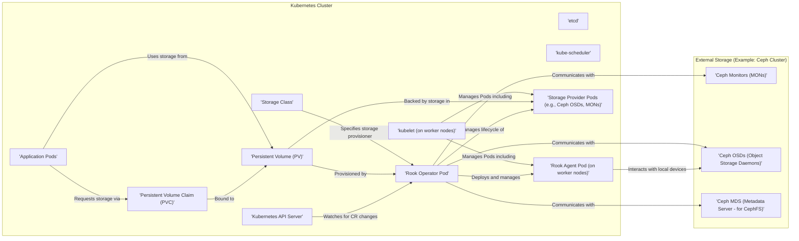

## Project Design Document: Rook - Cloud-Native Storage Orchestration

**1. Introduction**

This document provides a detailed design overview of the Rook project, a cloud-native storage orchestrator for Kubernetes. Its primary purpose is to facilitate thorough threat modeling by clearly outlining the system's architecture, key components, and data flow. This document will serve as a foundational resource for understanding Rook's security posture and identifying potential vulnerabilities.

**2. Goals and Objectives**

Rook's core objective is to abstract the complexities of distributed storage systems, presenting them as self-managing, self-scaling, and self-healing services within a Kubernetes environment. Key objectives include:

*   **Abstracting Storage Complexity:**  Shielding Kubernetes users from the intricate management details of underlying storage backends such as Ceph, Cassandra, and NFS.
*   **Automated Lifecycle Management:** Providing automated provisioning, scaling, upgrading, monitoring, and healing of storage clusters.
*   **Seamless Kubernetes Integration:**  Leveraging native Kubernetes primitives like Custom Resource Definitions (CRDs), Operators, Pods, and Services for management and orchestration.
*   **Ensuring Data Persistence and Availability:** Guaranteeing data durability and high availability by utilizing the underlying storage provider's built-in mechanisms for replication and fault tolerance.
*   **Simplifying Storage Consumption for Applications:** Enabling Kubernetes applications to easily consume storage resources through standard Kubernetes interfaces like Persistent Volume Claims (PVCs) and Storage Classes.

**3. High-Level Architecture**

Rook functions as a Kubernetes Operator, extending the Kubernetes API to manage and orchestrate storage resources. The following diagram illustrates the high-level architecture and interactions between key components:

**4. Key Components**

*   **Rook Operator:**
    *   Deployed as a Kubernetes Deployment, the Operator is the control plane of Rook.
    *   Its primary responsibility is to watch for changes in Custom Resource Definitions (CRDs) related to storage (e.g., `CephCluster`, `CephBlockPool`, `CephFilesystem`).
    *   Automates the deployment, configuration, management, scaling, and upgrading of the underlying storage provider based on the desired state defined in the CRDs.
    *   Interacts with the Kubernetes API server to create, update, and delete Kubernetes resources (Pods, Deployments, Services, StatefulSets, etc.) necessary for the storage cluster's operation.
    *   Implements reconciliation loops to continuously ensure the actual state of the storage cluster matches the desired state defined in the CRDs.
*   **Rook Agent:**
    *   Deployed as a DaemonSet, ensuring an instance runs on each Kubernetes worker node.
    *   Performs node-specific tasks related to storage provisioning and management.
    *   Discovers and prepares local storage devices (disks, partitions) on the worker nodes for use by the storage provider.
    *   May handle tasks like mounting filesystems or setting up logical volumes as required by the underlying storage provider.
    *   Facilitates communication and coordination between the Rook Operator and the storage provider daemons running on individual nodes.
*   **Custom Resource Definitions (CRDs):**
    *   Extend the Kubernetes API, allowing users to define custom storage resources specific to Rook and the chosen storage provider.
    *   Examples include `CephCluster` (defines the overall Ceph cluster configuration), `CephBlockPool` (defines a block storage pool), `CephFilesystem` (defines a shared filesystem), and `CephObjectStore` (defines an object storage instance).
    *   Users interact with these CRDs via `kubectl` to declare their desired storage configuration and requirements.
*   **Storage Provider Daemons:**
    *   These are the core components of the underlying storage system managed by Rook. The specific daemons vary depending on the chosen provider (e.g., Ceph, Cassandra, NFS).
    *   In the case of Ceph, examples include:
        *   **Ceph Monitors (MONs):** Maintain a map of the cluster state.
        *   **Ceph OSDs (Object Storage Daemons):** Store the actual data.
        *   **Ceph MDSs (Metadata Servers):** Manage metadata for CephFS.
    *   Deployed as Kubernetes Pods, often using StatefulSets to ensure persistent identities, ordered deployment, and stable network identities.
    *   Responsible for the actual storage, replication, and management of data.
*   **Kubernetes API Server:**
    *   The central control plane component of Kubernetes, exposing the Kubernetes API.
    *   The Rook Operator interacts with the API server to manage Kubernetes resources.
    *   Users interact with the API server (typically via `kubectl`) to create and manage Rook storage resources defined by the CRDs.
*   **etcd:**
    *   Kubernetes' distributed, consistent key-value store.
    *   Stores the state of the Kubernetes cluster, including the definitions of Rook's CRDs, the desired state of managed storage resources, and the current status of these resources.
*   **kube-scheduler:**
    *   Responsible for scheduling Pods onto appropriate worker nodes based on resource requirements, constraints, and policies.
    *   Plays a role in placing the Rook Agent and storage provider daemons onto the nodes.
*   **kubelet:**
    *   The agent running on each worker node that manages the lifecycle of Pods on that node.
    *   Receives instructions from the Kubernetes control plane and ensures that containers are running as intended.
    *   Manages the Rook Agent and the storage provider daemons on its respective node.
*   **Persistent Volume Claim (PVC):**
    *   A request for storage by a Kubernetes user or application.
    *   Represents a user's desire for a certain amount and type of storage.
    *   Rook provisions Persistent Volumes (PVs) to satisfy these claims based on the specified Storage Class.
*   **Persistent Volume (PV):**
    *   A provisioned piece of storage in the cluster.
    *   Has a lifecycle independent of any individual Pod that uses it.
    *   Managed by Kubernetes and bound to a PVC, making the storage available to the requesting application.
*   **Storage Class:**
    *   Defines the "class" of storage to be provisioned.
    *   Specifies the provisioner to be used (in this case, a Rook provisioner for a specific storage backend like Ceph).
    *   Allows administrators to define different tiers or types of storage (e.g., fast SSD-backed storage, slower HDD-backed storage).

**5. Data Flow (Example: Provisioning and Using a Ceph Block Storage Volume)**

This example illustrates the data flow involved in provisioning and utilizing a Ceph block storage volume managed by Rook:

1. **User Request:** A user creates a Persistent Volume Claim (PVC) specifying a Storage Class that is configured to use the Rook Ceph block storage provisioner.
2. **API Server Submission:** The PVC definition is submitted to the Kubernetes API Server via `kubectl` or other Kubernetes management tools.
3. **Rook Operator Observation:** The Rook Operator, constantly monitoring the Kubernetes API for PVC events, detects the new PVC.
4. **Storage Class Evaluation:** The Operator examines the Storage Class specified in the PVC and identifies it as a request for Rook-managed Ceph block storage.
5. **Ceph Resource Creation:** The Operator interacts with the Ceph cluster (typically through Ceph APIs or command-line tools executed within Ceph Pods) to create a new Ceph RBD (RADOS Block Device) image. This might involve interacting with Ceph MONs and OSDs.
6. **Persistent Volume Creation:** The Operator creates a corresponding Persistent Volume (PV) object in Kubernetes. This PV object contains details about the provisioned Ceph RBD image, such as its name and the Ceph cluster connection information.
7. **PV Binding:** The Kubernetes control plane (specifically the `kube-controller-manager`) binds the newly created PV to the requesting PVC, making the storage available for use.
8. **Application Pod Deployment:** An application Pod is deployed and configured to use the previously created PVC.
9. **Volume Attachment:** The `kubelet` on the node where the application Pod is scheduled attaches the Ceph RBD image to the node. This might involve using `rbd map`.
10. **Data I/O:** When the application writes data to the mounted volume, the data is written to the Ceph RBD image. This data is then distributed, replicated, and stored across the Ceph OSDs according to the Ceph cluster's configuration and policies. The communication between the application Pod and the Ceph OSDs might involve the kernel RBD client.

**6. Security Considerations (Detailed)**

This section expands on the initial security considerations, providing more specific examples and potential attack vectors:

*   **Authentication and Authorization:**
    *   **Kubernetes API Access:** Access to the Kubernetes API server, which controls Rook and its resources, is governed by Kubernetes RBAC (Role-Based Access Control). Misconfigured RBAC policies can lead to unauthorized users creating, modifying, or deleting storage resources or even the Rook Operator itself.
    *   **Rook Operator Permissions:** The Rook Operator requires specific Kubernetes permissions to manage resources. Overly permissive roles granted to the Operator could be exploited if the Operator itself is compromised. Principle of least privilege should be strictly enforced.
    *   **Storage Provider Authentication:** Access to the underlying storage provider (e.g., Ceph) is managed by its own authentication mechanisms (e.g., Cephx). Weak or default credentials, or insecure key management, can lead to unauthorized access to the storage backend.
    *   **Inter-Component Authentication:** Secure communication and authentication between Rook components (Operator, Agents, Storage Provider Daemons) is critical. Mutual TLS (mTLS) can be used to ensure only authorized components can communicate.
*   **Data Encryption:**
    *   **Data at Rest Encryption:**  Ensuring data is encrypted when stored on the underlying storage devices (e.g., Ceph encryption at rest). Lack of encryption exposes sensitive data if storage media is compromised.
    *   **Data in Transit Encryption:** Encrypting data as it moves between application Pods and the storage provider. This can be achieved through TLS encryption at the application level or by leveraging secure network configurations within the Kubernetes cluster (e.g., network policies enforcing TLS). Without this, data can be intercepted during transmission.
*   **Network Security:**
    *   **Network Policies:** Kubernetes Network Policies should be implemented to restrict network traffic between Pods, limiting communication between application Pods and storage provider daemons to only necessary ports and protocols. This mitigates lateral movement in case of a compromise.
    *   **Storage Network Segmentation:** Isolating the network used by the underlying storage cluster can prevent unauthorized access from other parts of the Kubernetes environment.
    *   **Service Exposure:**  Carefully consider which Rook services (if any) are exposed externally and implement appropriate security measures (e.g., authentication, authorization, rate limiting).
*   **Secrets Management:**
    *   **Secure Secret Storage:** Sensitive credentials (e.g., Ceph keyring, database passwords) must be stored securely, ideally using Kubernetes Secrets with encryption at rest (using a KMS provider). Avoid storing secrets in configuration files or environment variables.
    *   **Secret Rotation:** Implement a mechanism for regularly rotating secrets to reduce the impact of potential compromises.
    *   **Principle of Least Privilege for Secrets:** Only grant access to secrets to the components that absolutely need them.
*   **Supply Chain Security:**
    *   **Container Image Verification:** Verify the integrity and authenticity of container images used for Rook components and the storage provider daemons. Use trusted registries and implement image scanning for vulnerabilities.
    *   **Dependency Scanning:** Regularly scan the dependencies of Rook components for known vulnerabilities.
*   **Operator Security:**
    *   **Code Vulnerabilities:** Ensure the Rook Operator code is secure and free from vulnerabilities through regular security audits and testing.
    *   **Immutable Deployments:** Deploy the Rook Operator using immutable deployments to prevent unauthorized modifications.
*   **Node Security:**
    *   **Operating System Hardening:** Secure the underlying operating systems of the Kubernetes worker nodes where storage provider daemons run.
    *   **Storage Device Access Control:** Implement appropriate access controls to prevent unauthorized access to the physical storage devices.
*   **Auditing and Logging:**
    *   **API Auditing:** Enable Kubernetes API auditing to track all API calls related to Rook and storage management.
    *   **Rook Component Logging:** Ensure Rook components log relevant events, including errors, warnings, and security-related actions.
    *   **Storage Provider Logging:** Configure the underlying storage provider to log security-relevant events.
    *   **Centralized Logging:** Aggregate logs from all components into a centralized logging system for analysis and monitoring.

**7. Assumptions and Constraints**

*   A properly configured and secured Kubernetes cluster is a fundamental prerequisite for deploying and operating Rook.
*   The underlying infrastructure (hardware, network) supporting the Kubernetes cluster is assumed to have a reasonable level of security.
*   This document provides a general overview and may not cover all specific configurations or nuances of every supported storage provider.
*   It is assumed that users deploying and managing Rook have a working understanding of Kubernetes security best practices.

**8. Future Considerations**

*   Enhanced integration with Kubernetes security features like admission controllers for policy enforcement.
*   Automated secret rotation and management capabilities.
*   Advanced monitoring and observability features with security-focused dashboards and alerts.
*   Support for more granular access control policies within the storage provider managed by Rook.
*   Integration with security scanning tools for proactive vulnerability detection.

This improved design document provides a more detailed and comprehensive overview of the Rook project, specifically tailored for threat modeling. The enhanced descriptions of components, data flows, and security considerations will enable a more thorough and effective security analysis of the system.