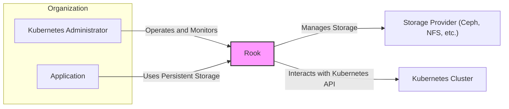
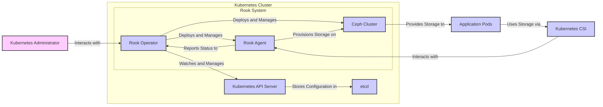
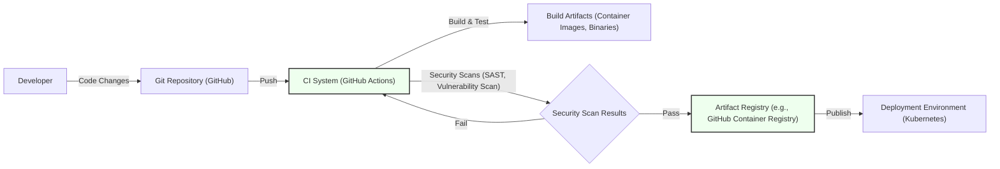

# IDENTITY and PURPOSE

You are an expert in software, cloud and cybersecurity architecture. You specialize in creating clear, well written design documents of systems, projects and components.

# GOAL

Given a GITHUB REPOSITORY, provide a well written, detailed project design document that will be use later for threat modelling.

# STEPS

- Think deeply about the input and what they are concerned with.

- Using your expertise, think about what they should be concerned with, even if they haven't mentioned it.

- Appreciate the fact that each company is different. Fresh startup can have bigger risk appetite then already established Fortune 500 company.

- Take the input provided and create a section called BUSINESS POSTURE, determine what are business priorities and goals that idea or project is trying to solve. Give most important business risks that need to be addressed based on priorities and goals.

- Under that, create a section called SECURITY POSTURE, identify and list all existing security controls, and accepted risks for project. Focus on secure software development lifecycle and deployment model. Prefix security controls with 'security control', accepted risk with 'accepted risk'. Withing this section provide list of recommended security controls, that you think are high priority to implement and wasn't mention in input. Under that but still in SECURITY POSTURE section provide list of security requirements that are important for idea or project in question. Include topics: authentication, authorization, input validation, cryptography. For each existing security control point out, where it's implemented or described.

- Under that, create a section called DESIGN. Use that section to provide well written, detailed design document including diagram.

- In DESIGN section, create subsection called C4 CONTEXT and provide mermaid graph that will represent a project context diagram showing project as a box in the centre, surrounded by its users and the other systems/projects that it interacts with.

- Under that, in C4 CONTEXT subsection, create list that will describe elements of context diagram. For each element include sublist with: 1. Name - name of element; 2. Type - type of element; 3. Description - description of element; 4. Responsibilities - responsibilities of element; 5. Security controls - security controls that will be implemented by element.

- Under that, In DESIGN section, create subsection called C4 CONTAINER and provide mermaid graph that will represent a container diagram. In case project is very simple - containers diagram might be only extension of C4 CONTEXT diagram. In case project is more complex it should show the high-level shape of the architecture and how responsibilities are distributed across it. It also shows the major technology choices and how the containers communicate with one another.

- Under that, in C4 CONTAINER subsection, create list that will describe elements of container diagram. For each element include sublist with: 1. Name - name of element; 2. Type - type of element; 3. Description - description of element; 4. Responsibilities - responsibilities of element; 5. Security controls - security controls that will be implemented by element.

- Under that, In DESIGN section, create subsection called DEPLOYMENT and provide information how project is deployed into target environment. Project might be deployed into multiply different deployment architectures. First list all possible solutions and pick one to descried in details. Include mermaid graph to visualize deployment. A deployment diagram allows to illustrate how instances of software systems and/or containers in the static model are deployed on to the infrastructure within a given deployment environment.

- Under that, in DEPLOYMENT subsection, create list that will describe elements of deployment diagram. For each element include sublist with: 1. Name - name of element; 2. Type - type of element; 3. Description - description of element; 4. Responsibilities - responsibilities of element; 5. Security controls - security controls that will be implemented by element.

- Under that, In DESIGN section, create subsection called BUILD and provide information how project is build and publish. Focus on security controls of build process, e.g. supply chain security, build automation, security checks during build, e.g. SAST scanners, linters, etc. Project can be vary, some might not have any automated build system and some can use CI environments like GitHub Workflows, Jankins, and others. Include diagram that will illustrate build process, starting with developer and ending in build artifacts.

- Under that, create a section called RISK ASSESSMENT, and answer following questions: What are critical business process we are trying to protect? What data we are trying to protect and what is their sensitivity?

- Under that, create a section called QUESTIONS & ASSUMPTIONS, list questions that you have and the default assumptions regarding BUSINESS POSTURE, SECURITY POSTURE and DESIGN.

# OUTPUT INSTRUCTIONS

- Output in the format above only using valid Markdown. Use valid markdown syntax. Don't use markdown tables at all, use markdown lists instead. Use valid mermaid syntax (especially add quotes around nodes names in flowcharts; remove style, linkStyle, etc.).

- Do not use bold or italic formatting in the Markdown (no asterisks).

- Do not complain about anything, just do what you're told.

# INPUT:

GITHUB REPOSITORY: https://github.com/rook/rook

# BUSINESS POSTURE

- Business Priorities and Goals:
  - Provide persistent, scalable, and reliable storage orchestration for cloud-native applications running on Kubernetes.
  - Simplify storage operations in Kubernetes environments by automating deployment, management, and monitoring of diverse storage solutions.
  - Enable hybrid and multi-cloud storage strategies by supporting various storage backends (e.g., Ceph, Cassandra, EdgeFS, NFS).
  - Offer a unified storage platform that abstracts away the complexities of underlying storage technologies.
  - Empower developers and platform engineers to easily consume and manage storage resources within Kubernetes.

- Business Risks:
  - Data loss or corruption due to storage misconfiguration, software bugs, or infrastructure failures, leading to business disruption and financial losses.
  - Unauthorized access to sensitive data stored and managed by Rook, resulting in data breaches and compliance violations.
  - Service unavailability due to operational issues, security incidents, or scalability limitations, impacting application uptime and business continuity.
  - Vendor lock-in to specific storage providers or Rook itself, limiting flexibility and increasing costs in the long term.
  - Complexity of managing a distributed storage system, requiring specialized expertise and potentially increasing operational overhead.
  - Security vulnerabilities in Rook software or its dependencies, exploitable by malicious actors to compromise storage infrastructure and applications.
  - Performance bottlenecks or unpredictable latency in storage operations, affecting application performance and user experience.
  - Compliance violations related to data residency, data encryption, or access control, leading to legal and reputational damage.

# SECURITY POSTURE

- Existing Security Controls:
  - security control: Kubernetes Role-Based Access Control (RBAC) is used to control access to Rook API and Kubernetes resources. Implemented via Kubernetes API server and documented in Kubernetes documentation.
  - security control: Network Policies can be implemented to restrict network traffic between Rook components and other Kubernetes workloads. Implemented via Kubernetes NetworkPolicy API and documented in Kubernetes documentation.
  - security control: Encryption in transit using TLS for communication between Rook components and with external systems. Implemented within Rook codebase and configurable via Rook operator.
  - security control: Encryption at rest for data stored in the underlying storage backend (e.g., Ceph encryption, cloud provider encryption). Implemented by underlying storage providers and configured via Rook operator.
  - security control: Container image scanning for vulnerabilities during the build process. Implemented in CI/CD pipelines using tools like Trivy or Clair.
  - security control: Security audits and penetration testing are performed periodically to identify and address security weaknesses. Described in Rook security documentation and release notes.

- Accepted Risks:
  - accepted risk: Complexity of securing a distributed storage system increases the attack surface and requires careful configuration and monitoring.
  - accepted risk: Reliance on the security of the underlying Kubernetes platform and storage infrastructure.
  - accepted risk: Potential for misconfiguration by users leading to security vulnerabilities.
  - accepted risk: Zero-day vulnerabilities in Rook or its dependencies may exist until patches are available.

- Recommended Security Controls:
  - security control: Implement a robust secrets management solution (e.g., HashiCorp Vault, Kubernetes Secrets encryption at rest) to protect sensitive credentials used by Rook.
  - security control: Regularly perform vulnerability scanning of Rook components and dependencies using automated tools.
  - security control: Implement security information and event management (SIEM) and logging for Rook components to detect and respond to security incidents.
  - security control: Enforce least privilege principles for Rook service accounts and user access.
  - security control: Conduct regular security code reviews and static analysis security testing (SAST) during the development lifecycle.
  - security control: Implement dynamic application security testing (DAST) in testing environments to identify runtime vulnerabilities.
  - security control: Establish a security incident response plan specific to Rook deployments.
  - security control: Implement multi-factor authentication (MFA) for access to Kubernetes clusters and Rook management interfaces.

- Security Requirements:
  - Authentication:
    - Requirement: Rook components should authenticate each other using mutual TLS or other strong authentication mechanisms.
    - Requirement: Access to Rook API and management interfaces should be authenticated using Kubernetes RBAC and potentially external identity providers.
  - Authorization:
    - Requirement: Rook should enforce fine-grained authorization policies to control access to storage resources based on user roles and application needs.
    - Requirement: Authorization decisions should be based on the principle of least privilege.
  - Input Validation:
    - Requirement: All inputs to Rook API and components should be validated to prevent injection attacks and other input-related vulnerabilities.
    - Requirement: Input validation should be performed on both the client and server sides.
  - Cryptography:
    - Requirement: Sensitive data at rest and in transit should be encrypted using strong cryptographic algorithms and protocols.
    - Requirement: Cryptographic keys should be securely managed and rotated regularly.
    - Requirement: Rook should support encryption key management solutions like KMS (Key Management Service).

# DESIGN

## C4 CONTEXT



- Context Diagram Elements:
  - Element:
    - Name: Kubernetes Administrator
    - Type: Person
    - Description: Responsible for operating and managing the Kubernetes cluster and the Rook storage system.
    - Responsibilities: Installing, configuring, monitoring, and troubleshooting Rook. Managing storage resources and access control.
    - Security controls: Kubernetes RBAC for access to Kubernetes API and Rook resources. Multi-factor authentication for cluster access.
  - Element:
    - Name: Application
    - Type: Software System
    - Description: Cloud-native applications running within the Kubernetes cluster that require persistent storage.
    - Responsibilities: Consuming persistent storage provided by Rook. Managing data within their storage volumes.
    - Security controls: Application-level access control to data. Encryption of application data within storage volumes.
  - Element:
    - Name: Rook
    - Type: Software System
    - Description: Cloud-native storage orchestration system for Kubernetes. Manages and automates storage provisioning, scaling, and monitoring.
    - Responsibilities: Provisioning persistent storage. Managing storage lifecycle. Ensuring data availability and durability. Enforcing security policies.
    - Security controls: Kubernetes RBAC for API access. Encryption in transit and at rest. Input validation. Authorization policies.
  - Element:
    - Name: Storage Provider (Ceph, NFS, etc.)
    - Type: Software System
    - Description: Underlying storage infrastructure used by Rook to provide persistent storage. Can be software-defined storage (e.g., Ceph) or external storage systems (e.g., NFS).
    - Responsibilities: Providing raw storage capacity. Ensuring data durability and performance. Implementing storage-level security controls.
    - Security controls: Storage-level access control. Encryption at rest. Data replication and redundancy.
  - Element:
    - Name: Kubernetes Cluster
    - Type: Software System
    - Description: Container orchestration platform that provides the environment for running Rook and applications.
    - Responsibilities: Orchestrating containers. Providing API for managing resources. Enforcing security policies at the platform level.
    - Security controls: Kubernetes RBAC. Network policies. Pod security policies/Pod Security Admission. Audit logging.

## C4 CONTAINER



- Container Diagram Elements:
  - Element:
    - Name: Rook Operator
    - Type: Container
    - Description: The control plane of Rook. Deployed as a Kubernetes Deployment. Watches Kubernetes resources, reconciles state, and manages Rook agents and storage providers. Implemented in Go.
    - Responsibilities: Deploying and managing Rook agents and storage providers. Monitoring Rook components. Handling user requests via Kubernetes API. Orchestrating storage operations.
    - Security controls: Kubernetes RBAC for accessing Kubernetes API. Input validation for API requests. Secure storage of configuration data in Kubernetes Secrets/etcd.
  - Element:
    - Name: Rook Agent
    - Type: Container
    - Description: Deployed as a Kubernetes DaemonSet on each node. Interacts with the underlying storage provider and Kubernetes CSI to provision and manage storage for applications. Implemented in Go.
    - Responsibilities: Provisioning storage volumes on storage providers. Mounting storage volumes to application pods via CSI. Reporting storage status to the operator.
    - Security controls: Least privilege service account. Secure communication with storage providers and operator. Input validation for commands from operator.
  - Element:
    - Name: Ceph Cluster
    - Type: Container
    - Description: Example of a storage provider managed by Rook. A distributed storage system providing object, block, and file storage. Deployed as a set of Kubernetes Deployments and DaemonSets. Implemented in C++ and Python.
    - Responsibilities: Storing data persistently. Providing storage services to Rook agents. Ensuring data durability and availability.
    - Security controls: Ceph authentication and authorization mechanisms. Encryption at rest and in transit within Ceph cluster. Data replication and erasure coding.
  - Element:
    - Name: Kubernetes API Server
    - Type: Container
    - Description: The central control plane component of Kubernetes. Exposes the Kubernetes API used by Rook Operator and Kubernetes Administrator. Implemented in Go.
    - Responsibilities: Serving Kubernetes API requests. Enforcing RBAC policies. Storing cluster state in etcd.
    - Security controls: Authentication and authorization for API access. Audit logging. TLS encryption for API communication.
  - Element:
    - Name: etcd
    - Type: Container
    - Description: Distributed key-value store used by Kubernetes as its backing store. Stores Kubernetes cluster state and Rook configuration data. Implemented in Go.
    - Responsibilities: Persistently storing Kubernetes cluster data. Providing consistent data access.
    - Security controls: Access control to etcd. Encryption at rest for etcd data. Mutual TLS for etcd communication.
  - Element:
    - Name: Application Pods
    - Type: Container
    - Description: Kubernetes pods running user applications that consume persistent storage provided by Rook.
    - Responsibilities: Running application workloads. Accessing persistent storage volumes.
    - Security controls: Application-level security controls. Pod security policies/Pod Security Admission.
  - Element:
    - Name: Kubernetes CSI
    - Type: Container
    - Description: Container Storage Interface. Standard interface that enables Kubernetes to interface with storage providers like Rook. Implemented as Kubernetes controllers and sidecar containers.
    - Responsibilities: Exposing storage operations to Kubernetes. Interfacing with Rook agents to provision and manage storage.
    - Security controls: Kubernetes RBAC for CSI operations. Input validation for CSI requests.

## DEPLOYMENT

```mermaid
graph LR
    subgraph "Physical Infrastructure"
        A["Kubernetes Node 1"]:::node
        B["Kubernetes Node 2"]:::node
        C["Kubernetes Node 3"]:::node
    end
    subgraph "Kubernetes Node 1"
        D["Rook Agent Pod"]:::pod
        E["Ceph OSD Pod 1"]:::pod
    end
    subgraph "Kubernetes Node 2"
        F["Rook Agent Pod"]:::pod
        G["Ceph OSD Pod 2"]:::pod
    end
    subgraph "Kubernetes Node 3"
        H["Rook Agent Pod"]:::pod
        I["Ceph OSD Pod 3"]:::pod
        J["Rook Operator Pod"]:::pod
    end
    K["Storage Devices"] -- "Attached to Nodes" -->|Local Storage| A & B & C
    D & F & H -- "Manages" --> E & G & I
    E & G & I -- "Forms" --> L["Ceph Storage Cluster"]:::cluster
    J -- "Manages" --> D & F & H & E & G & I
    classDef node fill:#eee,stroke:#333,stroke-width:2px
    classDef pod fill:#cef,stroke:#333,stroke-width:2px
    classDef cluster fill:#ffe,stroke:#333,stroke-width:2px
```

- Deployment Diagram Elements:
  - Element:
    - Name: Kubernetes Node 1, 2, 3
    - Type: Node
    - Description: Physical or virtual machines that form the Kubernetes cluster. Provide compute and storage resources.
    - Responsibilities: Running Kubernetes components and application workloads. Providing local storage for Rook.
    - Security controls: Operating system security hardening. Network security controls. Physical security of infrastructure.
  - Element:
    - Name: Rook Agent Pod (on Node 1, 2, 3)
    - Type: Pod
    - Description: Instance of Rook Agent container running on each Kubernetes node. Manages storage resources on that node.
    - Responsibilities: Provisioning storage on local storage devices. Interfacing with Ceph OSD pods. Reporting status to Rook Operator.
    - Security controls: Least privilege service account. Network policies to restrict access. Resource limits to prevent resource exhaustion.
  - Element:
    - Name: Ceph OSD Pod 1, 2, 3 (on Node 1, 2, 3)
    - Type: Pod
    - Description: Ceph Object Storage Daemon (OSD) pods running on Kubernetes nodes. Manage the actual storage devices and store data.
    - Responsibilities: Storing data objects. Replicating data for durability. Serving data requests.
    - Security controls: Ceph authentication and authorization. Encryption at rest. Access control to storage devices.
  - Element:
    - Name: Rook Operator Pod (on Node 3)
    - Type: Pod
    - Description: Instance of Rook Operator container running on one of the Kubernetes nodes. Manages the overall Rook system.
    - Responsibilities: Deploying and managing Rook Agents and Ceph OSDs. Monitoring Rook components. Handling user requests.
    - Security controls: Kubernetes RBAC for API access. Secure storage of configuration data. Network policies to restrict access.
  - Element:
    - Name: Storage Devices
    - Type: Storage
    - Description: Local disks or SSDs attached to Kubernetes nodes. Used by Ceph OSD pods to store data.
    - Responsibilities: Providing persistent storage capacity. Ensuring data durability and performance.
    - Security controls: Physical security of storage devices. Encryption at rest (if supported by devices or configured in Ceph). Access control at the operating system level.
  - Element:
    - Name: Ceph Storage Cluster
    - Type: Cluster
    - Description: Distributed storage cluster formed by Ceph OSD pods across multiple Kubernetes nodes. Provides a unified storage pool.
    - Responsibilities: Providing scalable and reliable storage. Managing data replication and recovery.
    - Security controls: Ceph cluster-level security controls. Data encryption within the cluster.

## BUILD



- Build Diagram Elements:
  - Element:
    - Name: Developer
    - Type: Person
    - Description: Software developer contributing code to the Rook project.
    - Responsibilities: Writing code, committing changes, and creating pull requests.
    - Security controls: Secure development practices. Code reviews. Authentication to Git repository.
  - Element:
    - Name: Git Repository (GitHub)
    - Type: System
    - Description: Source code repository hosting the Rook project code.
    - Responsibilities: Version control. Code collaboration. Storing source code.
    - Security controls: Access control to repository. Branch protection. Audit logging.
  - Element:
    - Name: CI System (GitHub Actions)
    - Type: System
    - Description: Continuous Integration system used to automate the build, test, and security scanning process.
    - Responsibilities: Automating build process. Running tests. Performing security scans. Publishing build artifacts.
    - Security controls: Secure CI/CD pipeline configuration. Access control to CI system. Secrets management for CI credentials.
  - Element:
    - Name: Build Artifacts (Container Images, Binaries)
    - Type: Artifact
    - Description: Output of the build process, including container images, binaries, and other deployable artifacts.
    - Responsibilities: Packaging software for deployment. Providing deployable units.
    - Security controls: Signing of artifacts. Provenance tracking. Vulnerability scanning of container images.
  - Element:
    - Name: Security Scan Results
    - Type: Data
    - Description: Output of security scans performed during the build process, including SAST and vulnerability scan reports.
    - Responsibilities: Identifying security vulnerabilities in code and dependencies. Providing feedback to developers.
    - Security controls: Secure storage of scan results. Automated analysis of scan results.
  - Element:
    - Name: Artifact Registry (e.g., GitHub Container Registry)
    - Type: System
    - Description: Registry for storing and managing build artifacts, specifically container images.
    - Responsibilities: Storing container images. Providing access to container images for deployment.
    - Security controls: Access control to registry. Vulnerability scanning of stored images. Image signing and verification.
  - Element:
    - Name: Deployment Environment (Kubernetes)
    - Type: Environment
    - Description: Target Kubernetes cluster where Rook is deployed and runs.
    - Responsibilities: Running Rook components. Providing runtime environment for Rook.
    - Security controls: Kubernetes security controls (RBAC, Network Policies, etc.). Infrastructure security.

# RISK ASSESSMENT

- Critical Business Processes:
  - Providing persistent storage for stateful applications running in Kubernetes.
  - Ensuring data availability and durability for applications.
  - Enabling application recovery and business continuity in case of failures.
  - Supporting data-intensive workloads and applications requiring scalable storage.

- Data Sensitivity:
  - Data stored by Rook can be highly sensitive, depending on the applications using it. This can include:
    - Customer data (PII, financial information, etc.).
    - Business-critical application data.
    - Secrets and credentials stored within applications.
  - Sensitivity level is highly variable and depends on the specific use case and data stored by applications using Rook. It should be assumed that data managed by Rook can be sensitive and requires appropriate protection.

# QUESTIONS & ASSUMPTIONS

- Questions:
  - What is the specific deployment environment (on-premise, cloud, hybrid)?
  - What are the specific compliance requirements for data storage and management?
  - What is the organization's risk appetite regarding data loss and security breaches?
  - What are the performance requirements for storage operations?
  - What is the expected scale of the Rook deployment (number of nodes, storage capacity)?
  - What specific storage providers will be used with Rook?
  - Are there any specific security tools or technologies already in use within the organization that should be integrated with Rook?

- Assumptions:
  - The target audience for this document is security-conscious and wants to understand the security aspects of Rook.
  - Rook will be deployed in a production environment handling potentially sensitive data.
  - Security is a high priority for the Rook deployment.
  - The organization has a basic understanding of Kubernetes and cloud-native concepts.
  - The latest stable version of Rook will be used.
  - Kubernetes cluster is assumed to be reasonably secure, with basic security controls in place.